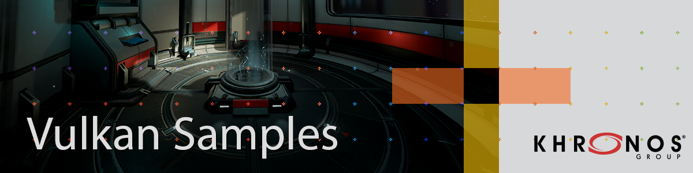

<!--
- Copyright (c) 2019, Arm Limited and Contributors
-
- SPDX-License-Identifier: Apache-2.0
-
- Licensed under the Apache License, Version 2.0 the "License";
- you may not use this file except in compliance with the License.
- You may obtain a copy of the License at
-
-     http://www.apache.org/licenses/LICENSE-2.0
-
- Unless required by applicable law or agreed to in writing, software
- distributed under the License is distributed on an "AS IS" BASIS,
- WITHOUT WARRANTIES OR CONDITIONS OF ANY KIND, either express or implied.
- See the License for the specific language governing permissions and
- limitations under the License.
-
-->

# Vulkan Samples <!-- omit in toc -->



## Contents <!-- omit in toc -->

- [Introduction](#introduction)
  - [Goals](#goals)
- [Tutorials](#tutorials)
- [Setup](#setup)
- [Build](#build)
  - [Supported Platforms](#supported-platforms)
- [Usage](#usage)
- [Testing](#testing)
- [License](#license)
  - [Trademarks](#trademarks)
- [Contributions](#contributions)
- [Related resources](#related-resources)

## Introduction

The Vulkan Samples is collection of resources to help you develop optimized Vulkan applications.

If you are new to Vulkan the [API samples](samples/api) are the right place to start.
Additionally you may find the following links useful:
 - [Vulkan Guide](https://github.com/KhronosGroup/Vulkan-Guide)
 - [Get Started in Vulkan](https://vulkan-tutorial.com/)

 [Performance samples](samples/performance) show the recommended best practice together with real-time profiling information.
 They are more advanced but also contain a detailed [tutorial](#tutorials) with more in-detail explanations.

### Goals
- Create a collection of resources that demonstrate best-practice recommendations in Vulkan
- Create tutorials that explain the implementation of best-practices and include performance analysis guides
- Create a framework that can be used as reference material and also as a sandbox for advanced experimentation with Vulkan

## Tutorials
- **General**
  - [Controls](./docs/controls.md)
  - [Create a Sample](./docs/create_sample.md)
- **Vulkan Essentials**  
  - [How does Vulkan compare to OpenGL ES? What should you expect when targeting Vulkan?](./samples/vulkan_basics.md)
- **Vulkan Swapchains**  
  - [Appropriate use of N-buffering](./samples/performance/swapchain_images/swapchain_images_tutorial.md)
  - [Appropriate use of surface rotation](./samples/performance/surface_rotation/surface_rotation_tutorial.md)
- **Pipelines**
  - [Use of pipeline caches to avoid startup latency](./samples/performance/pipeline_cache/pipeline_cache_tutorial.md)
- **Render Passes**
  - [Appropriate use of load/store operations, and use of transient attachments](./samples/performance/render_passes/render_passes_tutorial.md)
- **Render Subpasses**
  - [Benefits of subpasses over multiple render passes, use of transient attachments, and G-buffer recommended size](./samples/performance/render_subpasses/render_subpasses_tutorial.md)
- **Command Buffers**
  - [Allocation and management of command buffers](./samples/performance/command_buffer_usage/command_buffer_usage_tutorial.md)
- **AFBC**
  - [Appropriate use of AFBC](./samples/performance/afbc/afbc_tutorial.md)

## Setup

Clone the repo with submodules using the following command:

```
git clone --recurse-submodules https://github.com/KhronosGroup/Vulkan-Samples.git
cd Vulkan-Samples
```

Follow build instructions for your platform below.

## Build

### Supported Platforms
- Windows - [Build Guide](./docs/build.md#windows "Windows Build Guide")
- Linux - [Build Guide](./docs/build.md#linux "Linux Build Guide")
- macOS - [Build Guide](./docs/build.md#macos "macOS Build Guide")
- Android - [Build Guide](./docs/build.md#android "Android Build Guide")

## Usage

The following shows some example command line usage on how to configure and run the Vulkan Samples.

```
# Run Swapchain Images sample
vulkan_samples swapchain_images

# Run AFBC sample in benchmark mode for 5000 frames
vulkan_samples --sample afbc --benchmark 5000

# Run bonza test offscreen
vulkan_samples --test bonza --hide

# Run all the performance samples
vulkan_samples --batch performance
```


## Tests

- System Test - [Usage Guide](docs/testing.md#system-test "System Test Guide")
- Generate Sample - [Usage Guide](docs/testing.md#generate-sample-test "Generate Sample Test Guide")


## License

See [LICENSE](LICENSE).

This project has some third-party dependencies, each of which may have independent licensing:

- [astc-encoder](https://github.com/ARM-software/astc-encoder): ASTC Evaluation Codec
- [CTPL](https://github.com/vit-vit/CTPL): Thread Pool Library
- [docopt](https://github.com/docopt/docopt.cpp): A C++11 port of the Python argument parsing library
- [glfw](https://github.com/glfw/glfw): A multi-platform library for OpenGL, OpenGL ES, Vulkan, window and input
- [glm](https://github.com/g-truc/glm): OpenGL Mathematics
- [glslang](https://github.com/KhronosGroup/glslang): Shader front end and validator
- [dear imgui](https://github.com/ocornut/imgui): Immediate Mode Graphical User Interface
  - [dear imgui shaders](https://github.com/SaschaWillems/Vulkan/tree/master/data/shaders/imgui): GLSL shaders for dear imgui
- [HWCPipe](https://github.com/ARM-software/HWCPipe): Interface to mobile Hardware Counters
- [KTX-Software](https://github.com/KhronosGroup/KTX-Software): Khronos Texture Library and Tools
- [spdlog](https://github.com/gabime/spdlog): Fast C++ logging library
- [SPIRV-Cross](https://github.com/KhronosGroup/SPIRV-Cross): Parses and converts SPIR-V to other shader languages
- [stb](https://github.com/nothings/stb): Single-file public domain (or MIT licensed) libraries
- [tinygltf](https://github.com/syoyo/tinygltf): Header only C++11 glTF 2.0 file parser
- [vma](https://github.com/GPUOpen-LibrariesAndSDKs/VulkanMemoryAllocator): Vulkan Memory Allocator
- [volk](https://github.com/zeux/volk): Meta loader for Vulkan API
- [vulkan](https://github.com/KhronosGroup/Vulkan-Docs): Sources for the formal documentation of the Vulkan API

This project uses assets from [vulkan-samples-assets](https://github.com/KhronosGroup/Vulkan-Samples-Assets). Each one has its own licence.

### Trademarks

Vulkan is a registered trademark of the Khronos Group Inc.

## Contributions

Donated to Khronos by Arm, with further contributions by Sascha Willems and Adam Sawicki.

See [CONTRIBUTING](CONTRIBUTING.md).

## Related resources

- [Mali GPU Best Practices](https://developer.arm.com/solutions/graphics/developer-guides/mali-gpu-best-practices): A document with recommendations for efficient API usage
- [PerfDoc](https://github.com/ARM-software/perfdoc): A Vulkan layer which aims to validate applications against Mali GPU Best Practices
