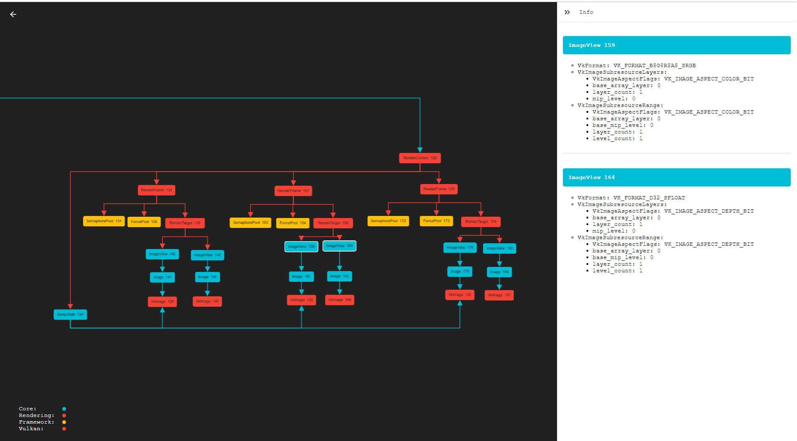

<!--
- Copyright (c) 2019, Arm Limited and Contributors
-
- SPDX-License-Identifier: Apache-2.0
-
- Licensed under the Apache License, Version 2.0 the "License";
- you may not use this file except in compliance with the License.
- You may obtain a copy of the License at
-
-     http://www.apache.org/licenses/LICENSE-2.0
-
- Unless required by applicable law or agreed to in writing, software
- distributed under the License is distributed on an "AS IS" BASIS,
- WITHOUT WARRANTIES OR CONDITIONS OF ANY KIND, either express or implied.
- See the License for the specific language governing permissions and
- limitations under the License.
-
-->



# Debug Graphs

You can view the debug graphs by clicking on "Save Debug Graphs" in the debug menu. This will then output graphs at:

```
desktop: output/graphs/
android: Android/data/com.arm.vulkan_best_practice/files/output/graphs
```

These graphs can be opened in the visualiser which you can find in the assets section of the release.

## Debug Graph Info Bar

The info bar allows you to inspect the data saved for a selected node.

## Debug Graphs Controls

| Action                       |                 Desktop                  |                  Android                  |
| :--------------------------- | :--------------------------------------: | :---------------------------------------: |
| Select Node                  |             <kbd>click</kbd>             |              <kbd>tap</kbd>               |
| Drag node                    | <kbd>click</kbd> + <kbd>drag</kbd> node  |  <kbd>hold</kbd> + <kbd>drag</kbd> node   |
| Drag graph                   | <kbd>click</kbd> + <kbd>drag</kbd> graph |  <kbd>tap</kbd> + <kbd>drag</kbd> graph   |
| Multi-select                 |   <kbd>shift</kbd> + <kbd>click</kbd>    | <kbd>tap</kbd> + <kbd>hold</kbd> multiple |
| Area-select                  |    <kbd>shift</kbd> + <kbd>drag</kbd>    |                     -                     |
| Select direct decendant tree |     double <kbd>click</kbd> on node      |       double <kbd>tap</kbd> on node       |
| Open/Close info bar          |       <kbd>click</kbd> on info bar       |        <kbd>tap</kbd> on info bar         |
| Zoom                         |            <kbd>scroll</kbd>             |             <kbd>pinch</kbd>              |
