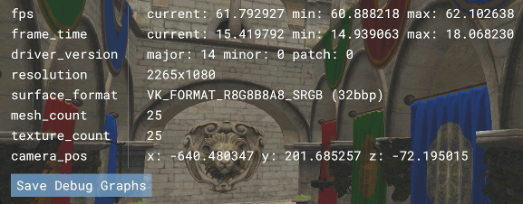

<!--
- Copyright (c) 2019, Arm Limited and Contributors
-
- SPDX-License-Identifier: Apache-2.0
-
- Licensed under the Apache License, Version 2.0 the "License";
- you may not use this file except in compliance with the License.
- You may obtain a copy of the License at
-
-     http://www.apache.org/licenses/LICENSE-2.0
-
- Unless required by applicable law or agreed to in writing, software
- distributed under the License is distributed on an "AS IS" BASIS,
- WITHOUT WARRANTIES OR CONDITIONS OF ANY KIND, either express or implied.
- See the License for the specific language governing permissions and
- limitations under the License.
-
-->

# Miscellaneous

## Controls

| Action                   |                     Desktop                     |               Mobile               |
| :----------------------- | :---------------------------------------------: | :--------------------------------: |
| Move around the scene    |                 <kbd>WASD</kbd>                 | <kbd>press</kbd> + <kbd>hold</kbd> |
| Rotate camera            | <kbd>right mouse button</kbd> + <kbd>drag</kbd> | <kbd>press</kbd> + <kbd>move</kbd> |
| Pan                      | <kbd>left mouse button</kbd> + <kbd>drag</kbd>  |                 -                  |
| Movement speed reduced   |                <kbd>shift</kbd>                 |                 -                  |
| Movement speed increased |                 <kbd>ctrl</kbd>                 |                 -                  |
| toggle GUI               |              <kbd>left click</kbd>              |           <kbd>tap</kbd>           |
| toggle Debug Window      |             <kbd>right click</kbd>              |      2 finger <kbd>tap</kbd>       |

## Debug Window

The Debug Window shows information about the current application.



## Driver version

The debug window shows the driver version of the GPU, which follows the [Vulkan semantics](https://registry.khronos.org/vulkan/specs/1.3-extensions/html/chap44.html#extendingvulkan-coreversions-versionnumbers), with a major, minor, and patch number. New versions of the driver will increment these numbers.

The framework is able to get these values by calling `vkGetPhysicalDeviceProperties(physical_device, &properties)`. This will set all attributes of properties, which type is `struct VkPhysicalDeviceProperties`. Then it extracts the relevant bits from `properties.driverVersion` using the following Vulkan macros:

```c
VK_VERSION_MAJOR(properties.driverVersion);
VK_VERSION_MINOR(properties.driverVersion);
VK_VERSION_PATCH(properties.driverVersion);
```

It is important to note that old Arm Mali drivers (before Bifrost r14 and Midgard r26) may not implement this feature, therefore the values returned will be undefined.
