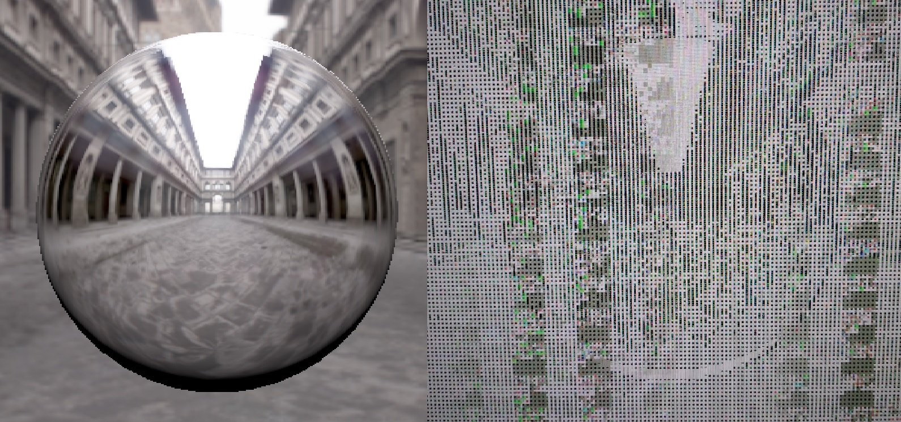

<!--
- Copyright (c) 2023, Mobica Limited
-
- SPDX-License-Identifier: Apache-2.0
-
- Licensed under the Apache License, Version 2.0 the "License";
- you may not use this file except in compliance with the License.
- You may obtain a copy of the License at
-
-     http://www.apache.org/licenses/LICENSE-2.0
-
- Unless required by applicable law or agreed to in writing, software
- distributed under the License is distributed on an "AS IS" BASIS,
- WITHOUT WARRANTIES OR CONDITIONS OF ANY KIND, either express or implied.
- See the License for the specific language governing permissions and
- limitations under the License.
-
-->
### Barriers 
Demonstrates usage of barriers with ability to dynamically disable them.
Used barriers can be disabled or have cleared stage mask or access mask.

This sample uses VK_KHR_dynamic_rendering extension to explicitly show each synchronization operation or layout transition.
Effect of improper synchronization can differ based on used driver, used GPU and system load. Quite often no difference can be seen in final output especially on desktop class GPUs.
In this sample significant artifacts were seen after disabling barriers after switching from and to fullscreen mode (Linux, AMD).

