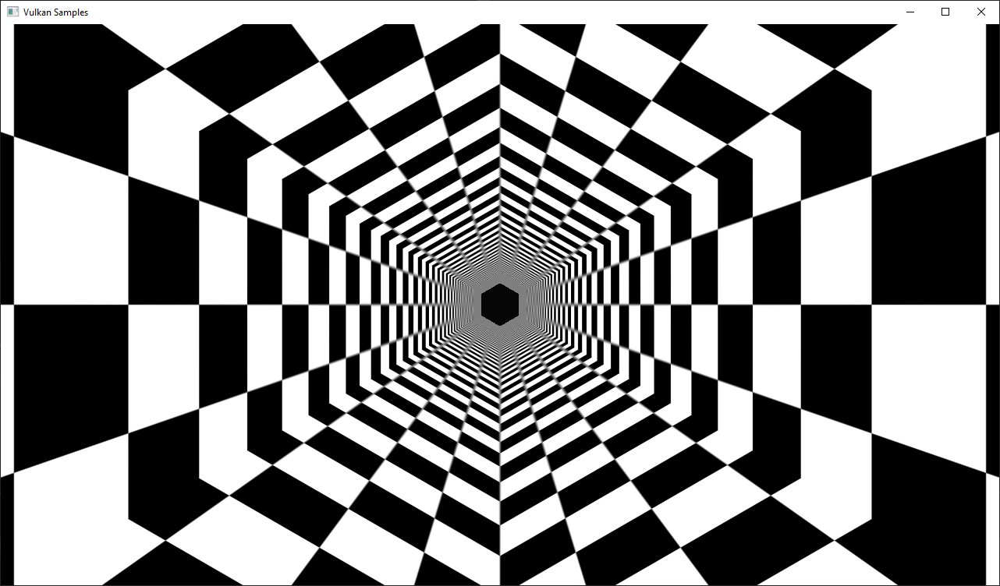
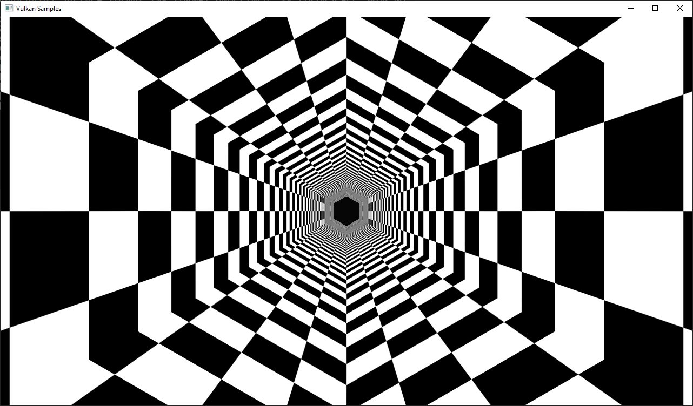

<!--
- Copyright (c) 2022-2023, The Khronos Group
-
- SPDX-License-Identifier: Apache-2.0
-
- Licensed under the Apache License, Version 2.0 the "License";
- you may not use this file except in compliance with the License.
- You may obtain a copy of the License at
-
-     http://www.apache.org/licenses/LICENSE-2.0
-
- Unless required by applicable law or agreed to in writing, software
- distributed under the License is distributed on an "AS IS" BASIS,
- WITHOUT WARRANTIES OR CONDITIONS OF ANY KIND, either express or implied.
- See the License for the specific language governing permissions and
- limitations under the License.
-
-->

### HPP Texture mipmap generation
A transcoded version of the API sample [Texture mipmap generation](https://github.com/KhronosGroup/Vulkan-Samples/tree/master/samples/api/texture_mipmap_generation) that illustrates the usage of the C++ bindings of vulkan provided by vulkan.hpp.

# Run-time mip-map generation

## Overview

This is the readme as written in [Texture mipmap generation](https://github.com/KhronosGroup/Vulkan-Samples/tree/master/samples/api/texture_mipmap_generation), with code transcoded to functions and classes from vulkan.hpp.

Generates a complete texture mip-chain at runtime from a base image using image blits and proper image barriers.

This examples demonstrates how to generate a complete texture mip-chain at runtime instead of loading offline generated mip-maps from a texture file.

While usually not applied for textures stored on the disk (that usually have the mips generated offline and stored in the file) this technique is often used for dynamic textures like cubemaps for reflections or other render-to-texture effects.

Having mip-maps for runtime generated textures offers lots of benefits, both in terms of image stability and performance. Without mip mapping the image will become noisy, especially with high frequency textures (and texture components like specular) and using mip mapping will result in higher performance due to caching.

Though this example only generates one mip-chain for a single texture at the beginning this technique can also be used during normal frame rendering to generate mip-chains for dynamic textures. 

Some GPUs also offer ```asynchronous transfer queues``` that may be used for doing such operations in the background. To detect this, check for queue families with only the  ```vk::QueueFlagBits::eTransfer``` set.

## Comparison

(Click to enlarge images)

Without mip mapping:

<a href="../texture_mipmap_generation/images/mip_mapping_off.jpg"></a>

Using mip mapping with a bilinear filter:

<a href="../texture_mipmap_generation/images/mip_mapping_bilinear.jpg"></a>

Using mip mapping with an anisotropic filter:

<a href="../texture_mipmap_generation/images/mip_mapping_anisotropic.jpg"></a>

## Requirements
To downsample from one mip level to the next, we will be using [```vk::CommandBuffer::blitImage```](https://www.khronos.org/registry/vulkan/specs/1.0/man/html/vkCmdBlitImage.html). This requires the format used to support the ```vk::FormatFeatureFlagBits::eBlitSrc``` and the  ```vk::FormatFeatureFlagBits::eBlitDst``` flags. If these are not supported, the image format can't be used to blit and you'd either have to choose a different format or use a custom shader to generate mip levels. The example uses the ```vk::Format::eR8G8B8A8Srgb``` that should support these flags on most implementations.

***Note:*** Use [```vk::PhysicalDevice::getFormatProperties```](https://www.khronos.org/registry/vulkan/specs/1.0/man/html/vkGetPhysicalDeviceFormatProperties.html) to check if the format supports the blit flags first. 

## Points of interest

### Image setup
Even though we'll only upload the first mip level initially, we create the image with number of desired mip levels. The following formula is used to calculate the number of mip levels based on the max. image extent:

```cpp
texture.mip_levels = static_cast<uint32_t>(floor(log2(std::max(texture.width, texture.height))) + 1);
```

This is then passed to the image create info:

```cpp
vk::ImageCreateInfo image_create_info({},
                                      vk::ImageType::e2D,
                                      format,
                                      vk::Extent3D(texture.extent, 1),
                                      texture.mip_levels,
...
```

Setting the number of desired mip levels is necessary as this is used for allocating the correct amount of memory required by the image (```vk::Device::allocateMemory```). 

### Upload base mip level

Before generating the mip-chain we need to copy the image data loaded from disk into the newly generated image. This image will be the base for our mip-chain:

```cpp
vk::BufferImageCopy buffer_copy_region({}, {}, {}, {vk::ImageAspectFlagBits::eColor, 0, 0, 1}, {}, vk::Extent3D(texture.extent, 1));
copy_command.copyBufferToImage(staging_buffer, texture.image, vk::ImageLayout::eTransferDstOptimal, buffer_copy_region);
```

### Prepare base mip level
As we are going to blit ***from*** the base mip-level just uploaded we also need to insert an image memory barrier that transitions the image layout to ```vk::ImageLayout::eTransferSrcOptimal``` for the base mip level:

```cpp
image_memory_barrier = vk::ImageMemoryBarrier(vk::AccessFlagBits::eTransferWrite,
                                              vk::AccessFlagBits::eTransferRead,
                                              vk::ImageLayout::eTransferDstOptimal,
                                              vk::ImageLayout::eTransferSrcOptimal,
                                              VK_QUEUE_FAMILY_IGNORED,
                                              VK_QUEUE_FAMILY_IGNORED,
                                              texture.image,
                                              {vk::ImageAspectFlagBits::eColor, 0, 1, 0, 1});
copy_command.pipelineBarrier(vk::PipelineStageFlagBits::eTransfer, vk::PipelineStageFlagBits::eTransfer, {}, {}, {}, image_memory_barrier);
```

### Generating the mip-chain
There are two different ways of generating the mip-chain. The first one is to blit down the whole mip-chain from level n-1 to n, the other way would be to always use the base image and blit down from that to all levels. This example uses the first one.

***Note:*** Blitting (same for copying) images is done inside of a command buffer that has to be submitted and as such has to be synchronized before using the new image with e.g. a ```vk::Fence```. 

We simply loop over all remaining mip levels (level 0 was loaded from disk) and prepare a ```vk::ImageBlit``` structure for each blit from mip level i-1 to level i.

First the source for our blit. This is the previous mip level:
<!--  -->
```cpp
for (int32_t i = 1; i < texture.mipLevels; i++)
{
  vk::ImageBlit image_blit(// Source
                           {vk::ImageAspectFlagBits::eColor, i - 1, 0, 1},
                           {{{}, {int32_t(texture.extent.width >> (i - 1)), int32_t(texture.extent.height >> (i - 1)), int32_t(1)}}},
                           // Destination
                           {vk::ImageAspectFlagBits::eColor, i, 0, 1},
                           {{{}, {int32_t(texture.extent.width >> i), int32_t(texture.extent.height >> i), int32_t(1)}}});
}
```
<!--  -->

Before we can blit to this mip level, we need to transition it's image layout to ```vk::ImageLayout::eTransferDstOptimal```:
```cpp
// Prepare current mip level as image blit destination
  image_memory_barrier = vk::ImageMemoryBarrier({},
                                                vk::AccessFlagBits::eTransferWrite,
                                                vk::ImageLayout::eUndefined,
                                                vk::ImageLayout::eTransferDstOptimal,
                                                VK_QUEUE_FAMILY_IGNORED,
                                                VK_QUEUE_FAMILY_IGNORED,
                                                texture.image,
                                                {vk::ImageAspectFlagBits::eColor, i, 1, 0, 1});
  copy_command.pipelineBarrier(vk::PipelineStageFlagBits::eTransfer, vk::PipelineStageFlagBits::eTransfer, {}, {}, {}, image_memory_barrier);
``` 

Note that we set the ```baseMipLevel``` of the subresource range to ```i```, so the image memory barrier will only affect the one mip level we want to copy to.

Now that the mip level we want to copy from and the one we'll copy to are in the proper layout (transfer source and destination) we can issue the [```vk::CommandBuffer::blitImage```](https://www.khronos.org/registry/vulkan/specs/1.0/man/html/vkCmdBlitImage.html) to copy from mip level (i-1) to mip level (i):

```cpp
  blit_command.blitImage(texture.image, vk::ImageLayout::eTransferSrcOptimal, texture.image, vk::ImageLayout::eTransferDstOptimal, image_blit, vk::Filter::eLinear);
```

```vk::CommandBuffer::blitImage``` does the down sampling from mip level (i-1) to mip level (i) using a linear filter, if you need better or more advanced filtering for this you need to resort to using custom shaders for generating the mip chain instead of blitting.

After the blit is done we can use this mip level as a base for the next level, so we transition the layout from ```vk::ImageLayout::eTransferDstOptimal``` to ```vk::ImageLayout::eTransferSrcOptimal``` so we can use this level as transfer source for the next level:

```cpp
  image_memory_barrier = vk::ImageMemoryBarrier(vk::AccessFlagBits::eTransferWrite,
                                                vk::AccessFlagBits::eTransferRead,
                                                vk::ImageLayout::eTransferDstOptimal,
                                                vk::ImageLayout::eTransferSrcOptimal,
                                                VK_QUEUE_FAMILY_IGNORED,
                                                VK_QUEUE_FAMILY_IGNORED,
                                                texture.image,
                                                {vk::ImageAspectFlagBits::eColor, i, 1, 0, 1});
  copy_command.pipelineBarrier(vk::PipelineStageFlagBits::eTransfer, vk::PipelineStageFlagBits::eTransfer, {}, {}, {}, image_memory_barrier);
}
```

### Final image layout transitions
Once the loop is done we need to transition all mip levels of the image to their actual usage layout, which is ```vk::ImageLayout::eShaderReadOnlyOptimal``` for this example. 

Note that after the loop above all levels will be in the ```vk::ImageLayout::eTransferSrcOptimal``` layout allowing us to transfer the whole image with a single barrier:

```cpp
image_memory_barrier = vk::ImageMemoryBarrier(vk::AccessFlagBits::eTransferRead,
                                              vk::AccessFlagBits::eShaderRead,
                                              vk::ImageLayout::eTransferSrcOptimal,
                                              vk::ImageLayout::eShaderReadOnlyOptimal,
                                              VK_QUEUE_FAMILY_IGNORED,
                                              VK_QUEUE_FAMILY_IGNORED,
                                              texture.image,
                                              {vk::ImageAspectFlagBits::eColor, 0, texture.mip_levels, 0, 1});
copy_command.pipelineBarrier(vk::PipelineStageFlagBits::eTransfer, vk::PipelineStageFlagBits::eFragmentShader, {}, {}, {}, image_memory_barrier);
```  

Submitting that command buffer will result in an image with a complete mip-chain and all mip levels being transitioned to the proper image layout for shader reads.

### Image View creation
The Image View also requires information about how many Mip Levels are used. This is specified in the ```vk::ImageViewCreateInfo.subresourceRange.levelCount``` field.

```cpp
vk::ImageViewCreateInfo image_view_create_info({},
                                               texture.image,
                                               vk::ImageViewType::e2D,
                                               format,
                                               {vk::ComponentSwizzle::eR, vk::ComponentSwizzle::eG, vk::ComponentSwizzle::eB, vk::ComponentSwizzle::eA},
                                               {vk::ImageAspectFlagBits::eColor, 0, texture.mip_levels, 0, 1});
texture.view = get_device()->get_handle().createImageView(image_view_create_info);
```  
