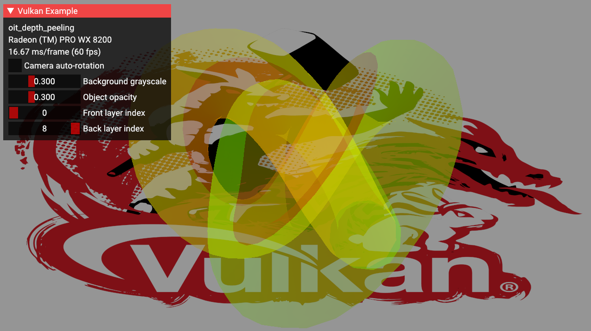

////
- Copyright (c) 2024, Google
-
- SPDX-License-Identifier: Apache-2.0
-
- Licensed under the Apache License, Version 2.0 the "License";
- you may not use this file except in compliance with the License.
- You may obtain a copy of the License at
-
-     http://www.apache.org/licenses/LICENSE-2.0
-
- Unless required by applicable law or agreed to in writing, software
- distributed under the License is distributed on an "AS IS" BASIS,
- WITHOUT WARRANTIES OR CONDITIONS OF ANY KIND, either express or implied.
- See the License for the specific language governing permissions and
- limitations under the License.
-
////

= Order-independent transparency with depth peeling

ifdef::site-gen-antora[]
TIP: The source for this sample can be found in the https://github.com/KhronosGroup/Vulkan-Samples/tree/main/samples/api/oit_depth_peeling[Khronos Vulkan samples github repository].
endif::[]

:pp: {plus}{plus}

== Overview

This sample implements an order-independent transparency (OIT) algorithm using depth peeling.
It renders a single torus whose opacity can be controller via the UI.
It produces pixel-perfect results.
It is based on the https://developer.download.nvidia.com/assets/gamedev/docs/OrderIndependentTransparency.pdf[original paper] from Cass Everitt.

== Algorithm

The OIT algorithm consists of several _gather_ passes followed by one _combine_ pass.

Each _gather_ pass renders one layer of transparent geometry.
The first pass renders the first layer, the second pass the second layer, etc.
The N^th^ layer consists of all the N^th^ fragments of each pixel when the fragments are ordered from front to back.

The _combine_ pass is a screen-space operation.
It merges the layer images from back to front to produce the final result.

The algorithm can produce pixel-perfect results, even with intersecting geometry.
When there are more geometry layers than gather passes, the backmost layers get skipped, but the visual results stay stable (i.e. no flickering pixels).

== Options

[cols="2,4,4"]
|===
| Option | Description | Comments

| Camera auto-rotation
| Enable the automatic rotation of the camera
| 

| Background grayscale
| Specify the grayscale value by which the background color is multiplied (0.0 to 1.0)
| 

| Object alpha
| Specify the opacity of the transparent object (0.0 to 1.0)
| 

| Front layer index
| The first layer to be rendered (0 to 7).
| 

| Back layer index
| The last layer to be rendered (0 to 7).
| This cannot be less that the front layer index.

|===

== Tests

This sample was tested on Windows.
The validation layers were enabled and all reported issues were fixed.
The system featured an AMD GPU.

