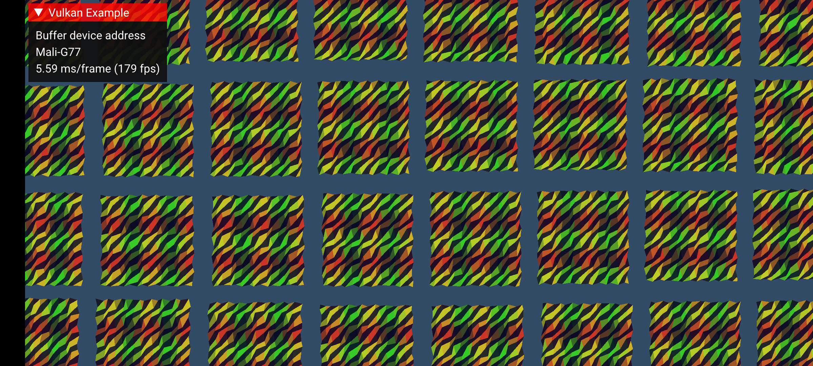

<!--
- Copyright (c) 2020, Arm Limited and Contributors
-
- SPDX-License-Identifier: Apache-2.0
-
- Licensed under the Apache License, Version 2.0 the "License";
- you may not use this file except in compliance with the License.
- You may obtain a copy of the License at
-
-     http://www.apache.org/licenses/LICENSE-2.0
-
- Unless required by applicable law or agreed to in writing, software
- distributed under the License is distributed on an "AS IS" BASIS,
- WITHOUT WARRANTIES OR CONDITIONS OF ANY KIND, either express or implied.
- See the License for the specific language governing permissions and
- limitations under the License.
-
-->

# Buffer device address

## Overview

Buffer device address is a very powerful and unique feature to Vulkan which is not present in any other modern graphics API.
The main gist of it is that it exposes GPU virtual addresses directly to the application, and the application can then
use said address to access buffer data freely through pointers rather than descriptors.
What makes this feature unique is that we can place these addresses in buffers and load and store to them inside shaders,
with full capability to perform pointer arithmetic and other fun tricks.

## Creating a buffer

To be able to grab a device address from a `VkBuffer`, we just need to modify our buffer creation slightly.

First, the buffer must be created with `SHADER_DEVICE_ADDRESS_BIT` usage.
```
VkBufferCreateInfo create_info = vkb::initializers::buffer_create_info(
    VK_BUFFER_USAGE_STORAGE_BUFFER_BIT | VK_BUFFER_USAGE_SHADER_DEVICE_ADDRESS_BIT_KHR, mesh_size);
```

After that, the memory we bind said buffer to must be allocated with a similar flag.
This time, it is a `pNext` struct instead.
This struct is core in Vulkan 1.1, but otherwise requires the `VK_KHR_device_group` extension.
Vulkan 1.1 should be considered a given if buffer device address is supported, so this is more of a technicality than anything else.
```
VkMemoryAllocateFlagsInfoKHR flags_info{VK_STRUCTURE_TYPE_MEMORY_ALLOCATE_FLAGS_INFO_KHR};
flags_info.flags             = VK_MEMORY_ALLOCATE_DEVICE_ADDRESS_BIT_KHR;
memory_allocation_info.pNext = &flags_info;
```

Finally, once we have allocated and bound the buffer to the memory, we can query the address.
```
VkBufferDeviceAddressInfoKHR address_info{VK_STRUCTURE_TYPE_BUFFER_DEVICE_ADDRESS_INFO_KHR};
address_info.buffer = buffer.buffer;
buffer.gpu_address  = vkGetBufferDeviceAddressKHR(device, &address_info);
```

This address works similarly to a normal addresses, and you can freely offset the `VkDeviceAddress` value as you see fit,
as it is really just a `uint64_t`.
There is no alignment requirement on the host. When using this pointer, you need to specify the alignment yourself,
since unlike descriptors, the shader compiler won't be able to infer anything about a raw pointer that you load from somewhere.

You can now place this pointer inside another buffer and have fun.

## Vulkan GLSL

In Vulkan GLSL, we get the `GL_EXT_buffer_reference` extension which allows us to declare buffer blocks not as SSBOs, but
faux pointer types instead.
GLSL does not have true pointer types,
but this is a way to introduce pointers without completely changing the language. E.g.:

```
#extension GL_EXT_buffer_reference : require
```

We can forward-declare types, which is nice for data structures like linked lists.
```
layout(buffer_reference) buffer Position;
```

We can declare a buffer type as well. This is not an SSBO declaration, but it basically declares a pointer to struct.
```
layout(std430, buffer_reference, buffer_reference_align = 8) writeonly buffer Position
{
    vec2 positions[];
};
```
`buffer_reference` tags the type accordingly, and `buffer_reference_align` is used to mark that any pointer
which is of this type is at least 8 byte aligned. This is required since the compiler has no idea what alignment a random pointer has.
It is possible to use scalar alignments here if you need it.

We can now place the `Position` type inside another buffer, or another buffer reference type, e.g.:
```
layout(std430, buffer_reference, buffer_reference_align = 8) readonly buffer PositionReferences
{
    Position buffers[];
};
```
Now we have a pointer to array of pointers ... spicy!

Finally, we could place a buffer reference inside push constants, an SSBO or a UBO.

```
layout(std430, set = 0, binding = 0) readonly buffer Pointers
{
    Positions positions[];
};

layout(std430, push_constant) uniform Registers
{
    PositionReferences references;
} registers;
```

The size and alignment of a buffer reference is 8 bytes (64-bit).
Placing pointers in push constants is an attractive way of getting direct access to buffer data since we do not require
a descriptor set to access buffer data.

### Lack of robustness

A critical thing to note is that a raw pointer has no idea of how much memory is safe to access.
Unlike SSBOs when robustness feature is enabled,
you must either do range checks yourself or just not write code that relies on out-of-bounds access :)

## SPIR-V

In SPIR-V we get a new storage class `PhysicalStorageBuffer` which represents a raw pointer to storage buffer memory.
The use of physical pointers in SPIR-V can be quite useful for use cases which emit SPIR-V directly,
so it is useful to know how to use this feature in the IR.

### Addressing mode

Rather than the `Logical` addressing model, we now use the `PhysicalStorageBuffer64` model,
where we allow physical pointers only for the `PhysicalStorageBuffer` storage class.
Otherwise, everything stays `Logical` where pointers are completely abstract.
```
OpCapability PhysicalStorageBufferAddresses
OpExtension "SPV_KHR_physical_storage_buffer"
OpMemoryModel PhysicalStorageBuffer64 GLSL450
```

### Alignment tags

Explicit alignment is generally not a thing in SPIR-V, but physical storage buffer is an exception.
Since the compiler has no idea what alignment a random pointer has, all uses of `OpLoad` or `OpStore` must
be tagged with `Aligned`, e.g.:

```
%57 = OpLoad %_ptr_PhysicalStorageBuffer_Position %56 Aligned 8
OpStore %164 %162 Aligned 8
```

When using Vulkan GLSL, these `Aligned` values are inferred from `buffer_reference_align` and the `Offset` decorations.

## Casting pointers

A key aspect of buffer device address is that we gain the capability to cast pointers freely.

While it is technically possible (and useful in some cases!) to "cast pointers" with SSBOs with clever use of aliased declarations like so:
```
layout(set = 0, binding = 0) buffer SSBO { float v1[]; };
layout(set = 0, binding = 0) buffer SSBO2 { vec4 v4[]; };
```
it gets kind of hairy quickly, and not as flexible when dealing with composite types.

### Casting to and from integers, pointer arithmetic

When we have casts between integers and pointers, we get the full madness that is pointer arithmetic.
Nothing stops us from doing:

```
#extension GL_EXT_buffer_reference : require
layout(buffer_reference) buffer PointerToFloat { float v; };

PointerToFloat pointer = load_pointer();
uint64_t int_pointer = uint64_t(pointer);
int_pointer += offset;
pointer = PointerToFloat(int_pointer);
pointer.v = 42.0;
```

In SPIR-V, this is a simple `OpBitcast`.

Not all GPUs support 64-bit integers, so it is also possible to use `uvec2` to represent pointers.
This way, we can do raw pointer arithmetic in 32-bit, which might be more optimal anyways.

```
#extension GL_EXT_buffer_reference_uvec2 : require
layout(buffer_reference) buffer PointerToFloat { float v; };
PointerToFloat pointer = load_pointer();
uvec2 int_pointer = uvec2(pointer);
uint carry;
uint lo = uaddCarry(int_pointer.x, offset, carry);
uint hi = int_pointer.y + carry;
pointer = PointerToFloat(uvec2(lo, hi));
pointer.v = 42.0;
```

## The sample



The sample is a distilled demonstration of how buffer device addressing
could be used to enable a more flexible vertex attribute fetch scheme.
Rather than using fixed function VBOs which cannot be rebound on GPU, we could make use of buffer device address
to enable a "meshlet" style of rendering, which is characterized by a rendering style where we chop up meshes into smaller chunks
which can be culled and rendered individually. This is an attractive way of doing GPU-driven rendering.

Essentially, we create a bunch of VkBuffers, where each buffer represents a separate mesh
(not the most optimal approach, but a useful demonstration).
A mesh has a device address (`VkDeviceAddress`) which we place in a separate array,
which serves as a nifty way of stitching together unrelated buffers.
The mesh buffers are updated in a compute shader, and subsequently read in the vertex shader.

This kind of flexibility could be awkward to achieve with normal SSBOs unless everything is backed by a single
`VkBuffer`.

Of course, this is just one of many use cases for buffer device address, and was deemed to be the simplest
meaningful way to demonstrate this feature.

In compute, we pass down a pointer in push constants, which is a very fast way of providing shaders
with a buffer as there is no descriptor set required!

```
layout(std430, buffer_reference, buffer_reference_align = 8) writeonly buffer Position
{
    vec2 positions[];
};

layout(std430, buffer_reference, buffer_reference_align = 8) readonly buffer PositionReferences
{
    Position buffers[];
};

layout(push_constant) uniform Registers
{
    PositionReferences references;
    float fract_time;
} registers;
```

As we can see, push constants contain a pointer which points to an array of pointers, which then point to a "VBO" block.
We perform one large dispatch to update N different "VBOs" here, where
each 16x16 group works with its own base pointer.

The position that is computed forms a simple procedural wave pattern.
The actual implementation details are not very interesting.

In the vertex shader, we do our faux "meshlet" rendering by assigning one VBO block per `gl_InstanceIndex`.
For multi-draw-indirect use cases, it would be natural to use `gl_DrawID` perhaps.

```
layout(std430, buffer_reference, buffer_reference_align = 8) readonly buffer Position
{
    vec2 positions[];
};

layout(std430, buffer_reference, buffer_reference_align = 8) readonly buffer PositionReferences
{
    Position buffers[];
};

layout(push_constant) uniform Registers
{
    mat4 view_projection;
    PositionReferences references;
} registers;

void main()
{
    int slice = gl_InstanceIndex;
    // Load pointer to VBO
    restrict Position ptr_positions = registers.references.buffers[slice];
    // Load attribute based on gl_VertexIndex.
    // No fixed function here!
    vec2 pos = ptr_positions.positions[gl_VertexIndex];
}
```

## Debugging notes

When debugging or capturing an application that uses buffer device addresses, there are some special driver requirements
that are not universally supported. Essentially, to be able to capture application buffers which contain raw pointers,
we must ensure that the device address for a given buffer remains stable when the capture is replayed in a new process.
Applications do not have to do anything here, since tools like RenderDoc will enable the `bufferDeviceAddressCaptureReplay`
feature for you, and deal with all the magic associated with address capture behind the scenes.
If the `bufferDeviceAddressCaptureReplay` is not present however, tools like RenderDoc will mask out the `bufferDeviceAddress` feature, so beware.

## Conclusion

Buffer device address is an extremely powerful feature which
enables various use cases which were either impossible or very impractical before.
