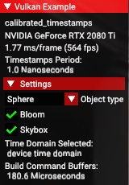

<!--
- Copyright (c) 2023, Holochip Corporation
-
- SPDX-License-Identifier: Apache-2.0
-
- Licensed under the Apache License, Version 2.0 the "License";
- you may not use this file except in compliance with the License.
- You may obtain a copy of the License at
-
-     http://www.apache.org/licenses/LICENSE-2.0
-
- Unless required by applicable law or agreed to in writing, software
- distributed under the License is distributed on an "AS IS" BASIS,
- WITHOUT WARRANTIES OR CONDITIONS OF ANY KIND, either express or implied.
- See the License for the specific language governing permissions and
- limitations under the License.
-
-->

# Calibrated Timestamps

This code sample demonstrates how to incorporate Vulkan ```calibrated timestamps``` extension. Different from
the ```timestamps queries```, where the ```timestamps queries``` help to profiling an entire graphic queue, however,
the ```calibrated timestamps``` allows users to mark their custom ```timestamps``` at specific whereabouts for a desired
code blocks. Therefore, ```calibrated timestamps``` potentially offers a very powerful tool for code profiling.

## Overview

To enable ```calibrated timestamps``` extension, ```VK_KHR_get_physical_device_properties2``` must be added as an
```instance extension```, and ```VK_EXT_calibrated_timestamps``` must be added as a ```device extension```. Where,
```VK_KHR_get_physical_device_properties2``` enables users to access the ```timestamps period``` data, which is one of
the most important factors related to ```timestamps``` operations in general. ```VK_EXT_calibrated_timestamps```
further introduces ```vkGetCalibratedTimestampsEXT``` and ```vkGetPhysicalDeviceCalibrateableTimeDomainsEXT```
functions, which allow users to extract the ```time domain```, ```timestamps```, and the ```max deviation``` at any
given point per function call.

In this sample, all extension names were introduced in the constructor of the ```CalibratedTimestamps``` class, where:

```cpp
CalibratedTimestamps ::CalibratedTimestamps()
{
	title = "Calibrated Timestamps";

	// Add instance extensions required for calibrated timestamps
	add_instance_extension(VK_KHR_GET_PHYSICAL_DEVICE_PROPERTIES_2_EXTENSION_NAME);
	// NOTICE THAT: calibrated timestamps is a DEVICE extension!
	add_device_extension(VK_EXT_CALIBRATED_TIMESTAMPS_EXTENSION_NAME);
}
```

## Introduction

This sample is built around the framework of the Vulkan Sample "HDR". Where users may choose the ```model``` staged,
activate or deactivate the ```bloom``` effects, and turn on or off the ```skybox```. These changes will apply to the
```command buffer``` building process, where, ```calibrated timestamps``` extension functions were introduced, thus, to
help users to profile the processing time per configuration, in realtime.

## * Time domain, timestamp, timestamp period, and max deviation

This is an optional section.

It is commonly confusing for new users attempt to understand the concepts of ```timestamps``` and ```time domains```.
And this section helps to provide an overview of their concepts and applications in practise.

One shall notice that, a ```timestamp``` **DOES NOT** return an actual time reading, on the contrary, a ```timestamp```
indicates "how many units of ```timestamp periods``` have passed" with respect to a **fixed** reference point on the
timeline. Where, the ```timestamp period``` is measured in realtime, and usually is in unit of ```nanoseconds```. On
shall also notice that, such "fixed reference point" varies with ```time domain``` and ```host```, therefore, it is not
very practical to consider such data in our concern. However, since that "reference point" is fixed, one may take
advantage of that feature to measure the time elapsed between two different ```timestamps```. For instance:

```cpp
uint64_t myFirstTimestamp = getMyTimestamps(); // marks the 1st timestamp
{
    /* A block of code */
}
uint64_t mySecondTimestamp = getMytimestamps(); // marks the 2nd timestamp

float timestamps_period = getMyTimestampsPeriod(); // gets the timestamps period from the host

// Total time elapsed from the block of code
float timeElapsed = static_cast<float>(mySecondTimestamp - myFirstTimestamp) * timestamps_period;
```

And of course, the above example merely showcases the fundamental concept of how to apply a typical ```timestamps```,
the actual case may vary.

On shall also notice that, ```timestamps``` come along with its uncertainty, where it was measured by the
```max deviation```. And each different ```time domain``` has different ```max deviation```. Roughly speaking, one may
think of a ```time domain``` like a stopwatch, and a low-end stopwatch may suffer more uncertainties than that of a
high-end one. Hence, per precision concerns, one should always attend to use whichever ```time domain``` that minimizes
its ```max deviation```. In addition, different ```time domains``` have different fixed reference points for their
```timestamps```, however, as was mentioned before, that "reference point" is not of our practical concern.

## Update time domain

All ```time domains``` can be extracted by using ```vkGetPhysicalDeviceCalibrateableTimeDomainsEXT``` call. Where, in
the Vulkan, ```time domain``` data is in format of ```VkTimeDomainEXT```. And generally, there are four enum values,
which are listed as follows:

1. ```VK_TIME_DOMAIN_DEVICE_EXT```, enum value: 0
2. ```VK_TIME_DOMAIN_CLOCK_MONOTONIC_EXT```, enum value: 1
3. ```VK_TIME_DOMAIN_CLOCK_MONOTONIC_RAW_EXT```, enum value: 2
4. ```VK_TIME_DOMAIN_QUERY_PERFORMANCE_COUNTER_EXT```, enum value: 3

And to interoperate them, a ```read_time_domain()``` function is introduced in this sample, where:

```cpp
std::string CalibratedTimestamps::read_time_domain(VkTimeDomainEXT inputTimeDomain)
{
    switch (inputTimeDomain)
	{
		case VK_TIME_DOMAIN_DEVICE_EXT:
			return "device time domain";
		case VK_TIME_DOMAIN_CLOCK_MONOTONIC_EXT:
			return "clock monotonic time domain";
		case VK_TIME_DOMAIN_CLOCK_MONOTONIC_RAW_EXT:
			return "clock monotonic raw time domain";
		case VK_TIME_DOMAIN_QUERY_PERFORMANCE_COUNTER_EXT:
			return "query performance time domain";
		default:
			return "unknown time domain";
	}
}
```

Furthermore, ```vkGetPhysicalDeviceCalibrateableTimeDomainsEXT``` returns all ```time domains``` being used in the
application's runtime. Therefore, a vector is introduced to store the ```time domain``` data, and a ```uint32_t``` is
declared to store the ```time domain``` count, where:

```cpp
uint32_t                     time_domain_count = 0;
std::vector<VkTimeDomainEXT> time_domains{};          // this holds all time domains extracted from the current Instance
```

With the above preparation, the function ```update_time_domains()``` is declared and defined as follows:

```cpp
void CalibratedTimestamps::update_time_domains()
{
	// Initialize time domain count:
	time_domain_count = 0;
	// Update time domain count:
	VkResult result = vkGetPhysicalDeviceCalibrateableTimeDomainsEXT(get_device().get_gpu().get_handle(), &time_domain_count, nullptr);

	if (result == VK_SUCCESS)
	{
		// Initialize time domain vector
		time_domains.clear();
		// Resize time domains vector:
		time_domains.resize(static_cast<int>(time_domain_count));        // this needs static cast to int
		// Update time_domain vector:
		result = vkGetPhysicalDeviceCalibrateableTimeDomainsEXT(get_device().get_gpu().get_handle(), &time_domain_count, time_domains.data());
	}
	// Time domain is successfully updated:
	isTimeDomainUpdated = (result == VK_SUCCESS);
}
```

Where, it syncs up all ```time domains``` in the application runtime, and marks
the ```boolean``` ```isTimeDomainUpdated``` to report its success. This step of extracting all ```time domains``` is
critical to execute the
```vkGetCalibratedTimestampsEXT``` call, since the vector ```time_domains``` and the ```uint32_t```
```time_domain_count``` are both required.

## Update timestamps

The function ```vkGetCalibratedTimestampsEXT``` extracts all ```timestamps``` and ```max deviations``` within all
available ```time domains``` in application runtime. Therefore, one shall first apply ```update_time_domains()```
before attempts to mark any ```timestamps```. In this sample, the function ```update_timestamps()``` is declared and
defined as follows:

```cpp
void CalibratedTimestamps::update_timestamps()
{
	// Ensures that time domain exists
	if (isTimeDomainUpdated)
	{
		// Create LOCAL calibrate time stamps info:
		std::vector<VkCalibratedTimestampInfoEXT> timestamps_info{};

		for (VkTimeDomainEXT time_domain : time_domains)
		{
			// Initialize in-scope time stamp info variable:
			VkCalibratedTimestampInfoEXT timestamp_info{};

			// Configure timestamp info variable:
			timestamp_info.sType      = VK_STRUCTURE_TYPE_CALIBRATED_TIMESTAMP_INFO_EXT;
			timestamp_info.pNext      = nullptr;
			timestamp_info.timeDomain = time_domain;

			// Push-back timestamp info to timestamps info vector:
			timestamps_info.push_back(timestamp_info);
		}

		// Resize time stamps vector
		timestamps.resize(static_cast<int>(time_domain_count));
		// Resize max deviations vector
		max_deviations.resize(static_cast<int>(time_domain_count));

		// Get calibrated timestamps:
		VkResult result = vkGetCalibratedTimestampsEXT(get_device().get_handle(), time_domain_count, timestamps_info.data(), timestamps.data(), max_deviations.data());

		// Timestamps is successfully updated:
		isTimestampUpdated = (result == VK_SUCCESS);
	}
}
```

Before the ```vkGetCalibratedTimestampsEXT``` call, ```timestamp_info``` must be specified, using
```VkCalibratedTimestampInfoEXT```. Where, its ```sType``` is ```VK_STRUCTURE_TYPE_CALIBRATED_TIMESTAMP_INFO_EXT```, and
its ```pNext``` is usually connected to a ```nullptr```. More importantly, its ```timeDomain``` must be pointed at the
reference of a ```time_domain```, in format of ```VkTimeDomainEXT```. And in our case, it merely indicates each
corresponding element of the vector ```time_domains```.

Per execution of ```vkGetCalibratedTimestampsEXT```, it syncs all ```timestamps``` and ```max deviations``` for all
```time domains```, where, two vectors were declared and initialized in from the ```CalibratedTimestamps``` header:

```cpp
std::vector<uint64_t>        timestamps{};            // timestamps vector
std::vector<uint64_t>        max_deviations{};        // max deviations vector
```

Meanwhile, a ```boolean``` variable ```isTimestampUpdated``` declared in the header will be updated to report its
success.

##     * Optimal time domain

This is an optional section.

As was mentioned in the previous section, ```max deviations``` vary with ```time domains```. Since
```calibrated timestamps``` extracts all ```time domains``` and their ```timestamps``` related data, it is a good
practice to put such feature in use. Hence, the function ```get_optimal_time_domain()``` is introduced to select the
optimal ```time domain``` which minimizes its ```max deviation```, where:

```cpp
void CalibratedTimestamps::get_optimal_time_domain()
{
	init_timeDomains_and_timestamps();
	update_time_domains();
	update_timestamps();

	isOptimalTimeDomain = false;

	if (isTimeDomainUpdated && isTimestampUpdated)
	{
		uint64_t optimal_maxDeviation = *std::min_element(max_deviations.begin(), max_deviations.end());

		auto iterator_optimal = std::find(max_deviations.begin(), max_deviations.end(), optimal_maxDeviation);

		if (iterator_optimal != max_deviations.end())
		{
			int optimal_index = static_cast<int>(iterator_optimal - max_deviations.begin());

			optimal_time_domain.index         = optimal_index;
			optimal_time_domain.timeDomainEXT = time_domains[optimal_index];

			isOptimalTimeDomain = true;
		}
	}
}
```

In the above function, ```init_timeDomains_and_timestamps()``` is a simple ```initializer``` which resets all
```calibrated timestamps``` extension related variables, such that:

```cpp
void CalibratedTimestamps::init_timeDomains_and_timestamps()
{
	isTimeDomainUpdated = false;
	isTimestampUpdated  = false;

	time_domain_count = 0;

	time_domains.clear();
	timestamps.clear();
	max_deviations.clear();
}
```

The function ```get_optimal_time_domain()``` extracts all ```time domains``` and iterates though the vector
```max_deviations```, seeking the minimal ```max deviation```, then returns its corresponding ```time domain``` and
index. Where, those data are stored in the structure ```optimal_time_domain``` declared in the header:

```cpp
struct
{
    int             index = 0;
    VkTimeDomainEXT timeDomainEXT{};
} optimal_time_domain{};
```

## Tic-toc

To further elaborate usage of ```calibarted timestamps``` extension, a ```tic()``` and a ```toc()``` function are
introduced. In addition, a structure ```DeltaTimestamp``` is declared to store the beginning, end, and the difference of
the ```timestamps``` marked by ```tic()``` and ```toc()```, where:

```cpp
struct DeltaTimestamp
{
    uint64_t    begin = 0;
    uint64_t    end   = 0;
    uint64_t    delta = 0;
    std::string tag   = "Untagged";

    void get_delta()
    {
        this->delta = this->end - this->begin;
    }
};
```

Furthermore, a function call ```get_delta()``` is defined locally inside the structure to easily evaluate the difference
between the beginning and the end of pair of ```timestamps```.

The ```tic()``` function marks the ```timestamp``` begin, and stores its ```timestamp``` tag in a structure
```DeltaTimestamp``` declared in the header, where:

```cpp
void CalibratedTimestamps::tic(const std::string &input_tag)
{
	// Initialize, then update time domains and timestamps
	init_timeDomains_and_timestamps();
	update_time_domains();
	update_timestamps();

	// Create a local delta_timestamp to push back to the vector delta_timestamps
	DeltaTimestamp delta_timestamp{};

	// Naming the tic-toc tags and begin timestamp for this particular mark
	if (!input_tag.empty())
	{
		delta_timestamp.tag = input_tag;
	}
	delta_timestamp.begin = timestamps[optimal_time_domain.index];

	// Push back this partially filled element to the vector, which will be filled in its corresponding toc
	delta_timestamps.push_back(delta_timestamp);
}
```

The ```toc()``` function marks the ```timestamp``` end, compares their ```timestamp``` tags, evaluates the
```delta timestamp``` and store them in the same ```DeltaTimestamp``` structure, where:

```cpp
void CalibratedTimestamps::toc(const std::string &input_tag)
{
	if (delta_timestamps.empty() || (input_tag != delta_timestamps.back().tag))
	{
		LOGI("Tic-toc Fatal Error: toc is not tagged the same as its tic!\n")
		return;        // exits the function here, further calculation is meaningless
	}

	// Initialize, then update time domains and timestamps
	init_timeDomains_and_timestamps();
	update_time_domains();
	update_timestamps();

	delta_timestamps.back().end = timestamps[optimal_time_domain.index];
	delta_timestamps.back().get_delta();
}
```

## UI overlay

The ```UI overlay``` in this sample showcases several options and information, listed as follows:



Where, the ```models``` staged in the ```scene``` can be chosen from a ```sphere```, a ```teapot```, and a
```torus knot```. The ```bloom``` and the ```skybox``` can be activated and deactivated. Since the optimal
```time domain``` selected, therefore, its ```flag``` is displayed. In addition, the ```timestamp period``` is displayed
in realtime, along with the processing time of the ```command buffer``` ```creation```, and ```draw```, where:

```cpp
void CalibratedTimestamps::build_command_buffers()
{
    // Reset the delta timestamps vector
    delta_timestamps.clear();
    
    tic("Creating Command Buffer");
    {/* ... command buffer create info ... */}
    toc("Creating Command Buffer");
    
    tic("Draw Command Buffer");
    {/* ... command buffer draw ... */}
    toc("Draw Command Buffer");
}
```

Profiling information will be displayed whenever the vector ```delta_timestamps``` is not empty, where:

```cpp
if (!delta_timestamps.empty())
{
    drawer.text("Optimal Time Domain Selected:\n %s", read_time_domain(optimal_time_domain.timeDomainEXT).c_str());

    for (const auto &delta_timestamp : delta_timestamps)
    {
        drawer.text("%s: %.1f ns", delta_timestamp.tag.c_str(), static_cast<float>(delta_timestamp.delta) * timestamp_period);
    }
}
```
