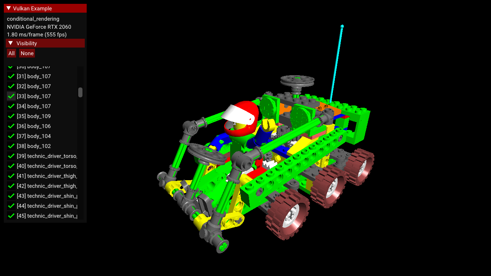
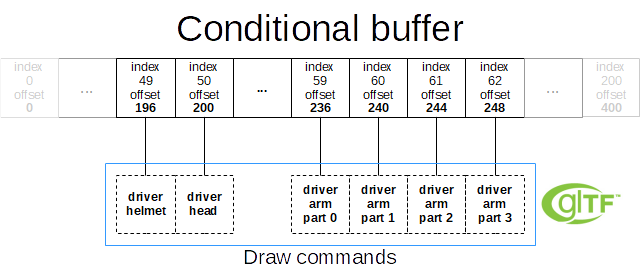

<!--
- Copyright (c) 2022-2023, Sascha Willems
-
- SPDX-License-Identifier: Apache-2.0
-
- Licensed under the Apache License, Version 2.0 the "License";
- you may not use this file except in compliance with the License.
- You may obtain a copy of the License at
-
-     http://www.apache.org/licenses/LICENSE-2.0
-
- Unless required by applicable law or agreed to in writing, software
- distributed under the License is distributed on an "AS IS" BASIS,
- WITHOUT WARRANTIES OR CONDITIONS OF ANY KIND, either express or implied.
- See the License for the specific language governing permissions and
- limitations under the License.
-
-->

# Conditional rendering



## Overview

The [VK_EXT_conditional_rendering](https://www.khronos.org/registry/vulkan/specs/1.3-extensions/man/html/VK_EXT_conditional_rendering.html) extension allows the execution of rendering commands to be conditional based on a value taken from a dedicated conditional buffer. This may help an application reduce the latency by conditionally discarding rendering commands without application intervention.

This sample demonstrates usage of this extension for conditionally toggling the visibility of sub-meshes of a complex glTF model. Instead of having to update command buffers, this is done by updating the aforementioned buffer.

## Conditional buffer

As mentioned in the introduction a buffer is used to conditionally execute rendering and dispatch commands (for compute, which is not done in this sample). The first step is setting up this buffer. 

Important notes on setting up a conditional buffer:

* A **dedicated buffer type** named `VK_BUFFER_USAGE_CONDITIONAL_RENDERING_BIT_EXT`
* The buffer format is fixed to consecutive **32-bit values**
* Offset is also aligned at 32-bits

The fixed alignment makes it easy to map this to C/C++ host structures:

```cpp
std::vector<int32_t> conditional_visibility_list;
```

Setting up the buffer is no different from other buffers:

```cpp
conditional_visibility_buffer = 
    std::make_unique<vkb::core::Buffer>(get_device(),
	                    sizeof(int32_t) * conditional_visibility_list.size(),
	                    VK_BUFFER_USAGE_CONDITIONAL_RENDERING_BIT_EXT,
	                    VMA_MEMORY_USAGE_CPU_TO_GPU);
```

 With this we get a buffer that matches the size and layout of the host application. For simplicity we create a host visible buffer in this sample. Depending on the use-case a device local buffer would yield better performance but would also require a different update strategy
 
## Conditional execution

The extension introduces two new functions that allow you to mark regions of a command buffer for conditional execution:

```cpp    
// Begins a new conditional rendering block
void vkCmdBeginConditionalRenderingEXT(VkCommandBuffer commandBuffer, const VkConditionalRenderingBeginInfoEXT* pConditionalRenderingBegin)
// Ends the current conditional rendering block
void vkCmdEndConditionalRenderingEXT(VkCommandBuffer commandBuffer)
```

Wrapping drawing and/or dispatch commands in such regions will result in them only being executed if our conditional buffer contains a non-zero value at the given offset.

A basic example of this could look like this:

```cpp    
VkConditionalRenderingBeginInfoEXT conditional_rendering_info{};
conditional_rendering_info.sType = VK_STRUCTURE_TYPE_CONDITIONAL_RENDERING_BEGIN_INFO_EXT;
conditional_rendering_info.buffer = conditional_buffer.buffer;
conditional_rendering_info.offset = current_mesh_index * sizeof(int32_t);

vkCmdBeginConditionalRenderingEXT(command_buffer, &conditional_rendering_info);
vkCmdDrawIndexed(...);
vkCmdEndConditionalRenderingEXT(command_buffer);
```

The conditional_rendering_info structure contains the parameters used by the ```vkCmdBeginConditionalRenderingEXT``` function to determine if the commands in that region are to be executed.

So for this basic example if the 32-bit conditional buffer value at the selected offset is zero, the ```vkCmdDrawIndexed``` will not be executed.

Changing the buffer value at the select offset 0 to 1 and synchronizing the buffer will have the draw command executed for the next draw.

Moving to the actual example we create a conditional buffer with one 32-bit value per node in the glTF scene:

```cpp    
// Setup the host visilibty list
conditional_visibility_list.resize(linear_scene_nodes.size());
std::fill(conditional_visibility_list.begin(), conditional_visibility_list.end(), 1);

// Create a buffer to hold the visibility list
conditional_visibility_buffer = 
    std::make_unique<vkb::core::Buffer>(get_device(),
	                    sizeof(int32_t) * conditional_visibility_list.size(),
	                    VK_BUFFER_USAGE_CONDITIONAL_RENDERING_BIT_EXT,
	                    VMA_MEMORY_USAGE_CPU_TO_GPU);

// Copy the current visibility list to the dedicated buffer
conditional_visibility_buffer->update(conditional_visibility_list.data(), sizeof(int32_t) * conditional_visibility_list.size());              
```

Using this setup, each visible glTF node maps to an entry in the conditional visibility buffer by it's unique node index, calculated as `node_index * sizeof(int32_t)`:



So we can now control draws using values stored in the conditional buffer. To do so, the command buffer iterates over all nodes of the gltF scene (put into a linear vector for convenience) and wraps the draw command for each node in a conditional rendering block, so a node is only drawn when the visibility buffer value at it's offset equals 1:

```cpp    
uint32_t node_index = 0;
for (auto &node : linear_scene_nodes)
{
    glm::mat4 node_transform = node.node->get_transform().get_world_matrix();

    VkDeviceSize offsets[1] = {0};

    const auto &vertex_buffer_pos    = node.sub_mesh->vertex_buffers.at("position");
    const auto &vertex_buffer_normal = node.sub_mesh->vertex_buffers.at("normal");
    auto &      index_buffer         = node.sub_mesh->index_buffer;

    auto mat = dynamic_cast<const vkb::sg::PBRMaterial *>(node.sub_mesh->get_material());

    // Start a conditional rendering block, commands in this block are only executed if the buffer at the current position is 1 at command buffer submission time
    VkConditionalRenderingBeginInfoEXT conditional_rendering_info{};
    conditional_rendering_info.sType  = VK_STRUCTURE_TYPE_CONDITIONAL_RENDERING_BEGIN_INFO_EXT;
    conditional_rendering_info.buffer = conditional_visibility_buffer->get_handle();
    // We offset into the visibility buffer based on the index of the node to be drawn
    conditional_rendering_info.offset = sizeof(int32_t) * node_index;
    vkCmdBeginConditionalRenderingEXT(draw_cmd_buffers[i], &conditional_rendering_info);

    // Pass data for the current node via push commands
    push_const_block.model_matrix = node_transform;
    push_const_block.color        = glm::vec4(mat->base_color_factor.rgb, 1.0f);
    vkCmdPushConstants(draw_cmd_buffers[i], pipeline_layout, VK_SHADER_STAGE_VERTEX_BIT, 0, sizeof(push_const_block), &push_const_block);

    vkCmdBindVertexBuffers(draw_cmd_buffers[i], 0, 1, vertex_buffer_pos.get(), offsets);
    vkCmdBindVertexBuffers(draw_cmd_buffers[i], 1, 1, vertex_buffer_normal.get(), offsets);
    vkCmdBindIndexBuffer(draw_cmd_buffers[i], index_buffer->get_handle(), 0, node.sub_mesh->index_type);

    vkCmdDrawIndexed(draw_cmd_buffers[i], node.sub_mesh->vertex_indices, 1, 0, 0, 0);

    // End the conditional rendering block
    vkCmdEndConditionalRenderingEXT(draw_cmd_buffers[i]);

    node_index++;
}
```

With the above command buffer setup, we can toggle visibility of each node in the glTF scene by just changing the conditional buffer value at the node's offsets.