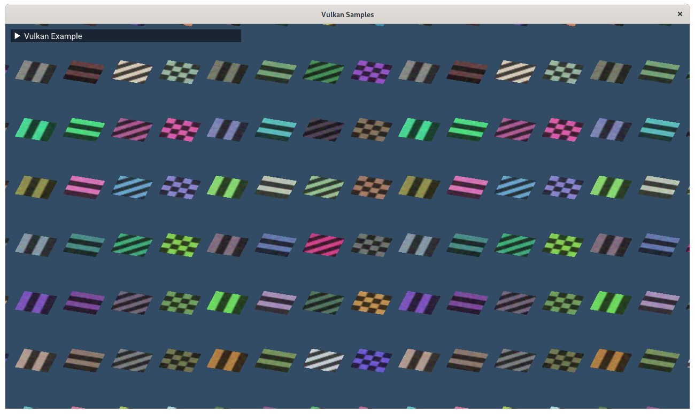
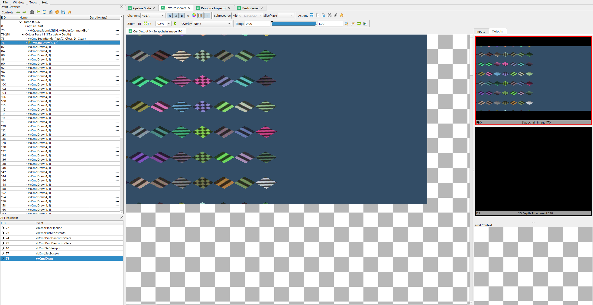
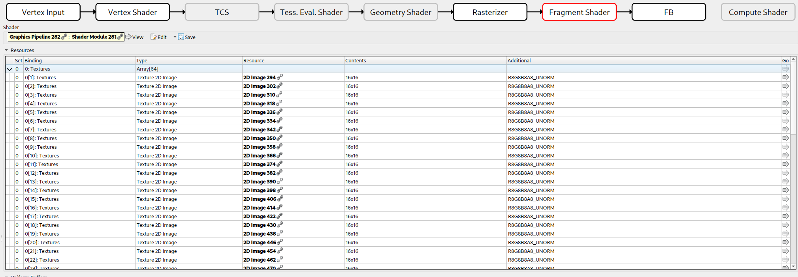
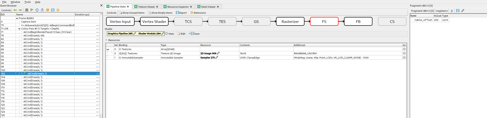

////
- Copyright (c) 2021-2024, Arm Limited and Contributors
-
- SPDX-License-Identifier: Apache-2.0
-
- Licensed under the Apache License, Version 2.0 the "License";
- you may not use this file except in compliance with the License.
- You may obtain a copy of the License at
-
-     http://www.apache.org/licenses/LICENSE-2.0
-
- Unless required by applicable law or agreed to in writing, software
- distributed under the License is distributed on an "AS IS" BASIS,
- WITHOUT WARRANTIES OR CONDITIONS OF ANY KIND, either express or implied.
- See the License for the specific language governing permissions and
- limitations under the License.
-
////
= Descriptor indexing

ifdef::site-gen-antora[]
TIP: The source for this sample can be found in the https://github.com/KhronosGroup/Vulkan-Samples/tree/main/samples/extensions/descriptor_indexing[Khronos Vulkan samples github repository].
endif::[]

== Overview

Descriptor indexing is an extension which adds a *lot* of flexibility to how resources are accessed.
The core functionality of this extension is that we can treat descriptor memory as one massive array, and we can freely access any resource we want at any time, by indexing.
The main insight is that if an array is large enough, an index into that array is indistinguishable from a pointer.
By allowing free access to any resource at any time, we can efficiently implement some advanced algorithms which rely on this functionality.

Descriptor indexing is also known by the term "bindless", which refers to the fact that binding individual descriptor sets and descriptors is no longer the primary way we keep shader pipelines fed.
Instead, we can bind a huge descriptor set once and just index into a large number of descriptors.
"Bindless algorithms" are generally built around this flexibility where we either index freely into a lot of descriptors at once, or update descriptors where we please.
In this model, "binding" descriptors is not a concern anymore.
At most, we need to write/copy descriptors to where we need them and we can now consider descriptors more like memory blobs rather than highly structured API objects.

== Use cases

=== Update-After-Bind, streaming descriptors concurrently

The first major feature is update-after-bind.
In Vulkan, you generally have to create a `VkDescriptorSet` and update it with all descriptors before you call `vkCmdBindDescriptorSets`.
After a set is bound, the descriptor set cannot be updated again until the GPU is done using it.
This gives drivers a lot of flexibility in how they access the descriptors.
They are free to copy the descriptors and pack them somewhere else, promote them to hardware registers, the list goes on.

Update-After-Bind gives flexibility to applications instead.
Descriptors can be updated at any time as long as they are not actually accessed by the GPU.
Descriptors can also be updated while the descriptor set is bound to a command buffer, which enables a "streaming" use case.

The link:../../performance/constant_data[Constant Data performance sample] also demonstrates update-after-bind descriptors.

==== Concurrent updates

Another "hidden" feature of update-after-bind is that it is possible to update the descriptor set from multiple threads.
This is very useful for true "bindless" since unrelated tasks might want to update descriptors in different parts of the streamed/bindless descriptor set.

==== Descriptor flags

To enable UPDATE_AFTER_BIND_BIT features for a descriptor binding, there is a little song and dance that must be performed.

In `VkDescriptorSetLayoutCreateInfo` we must pass down binding flags in a separate struct with `pNext`.

[,cpp]
----
VkDescriptorSetLayoutCreateInfo set_layout_create_info{VK_STRUCTURE_TYPE_DESCRIPTOR_SET_LAYOUT_CREATE_INFO};
set_layout_create_info.flags = VK_DESCRIPTOR_SET_LAYOUT_CREATE_UPDATE_AFTER_BIND_POOL_BIT_EXT;
const VkDescriptorBindingFlagsEXT flags =
    VK_DESCRIPTOR_BINDING_VARIABLE_DESCRIPTOR_COUNT_BIT_EXT |
    VK_DESCRIPTOR_BINDING_PARTIALLY_BOUND_BIT_EXT |
    VK_DESCRIPTOR_BINDING_UPDATE_AFTER_BIND_BIT_EXT |
    VK_DESCRIPTOR_BINDING_UPDATE_UNUSED_WHILE_PENDING_BIT_EXT;

VkDescriptorSetLayoutBindingFlagsCreateInfoEXT binding_flags{};
binding_flags.sType          = VK_STRUCTURE_TYPE_DESCRIPTOR_SET_LAYOUT_BINDING_FLAGS_CREATE_INFO_EXT;
binding_flags.bindingCount   = 1;
binding_flags.pBindingFlags  = &flags;
set_layout_create_info.pNext = &binding_flags;

VK_CHECK(vkCreateDescriptorSetLayout(get_device().get_handle(), &set_layout_create_info, nullptr, &descriptors.set_layout));
----

The `VkDescriptorPool` must also be created with UPDATE_AFTER_BIND_BIT.
Note that there is global limit to how many UPDATE_AFTER_BIND_BIT descriptors can be allocated at any point.
The min-spec here is 500k, which should be good enough.

See code for more detailed comments.

=== Non-uniform indexing, enabling advanced algorithms

While update-after-bind adds flexibility to descriptor management, non-uniform indexing adds great flexibility for shaders.

==== The different levels of indexing resources

How we access resources has changed a lot over the years.
Mostly this is due to hardware considerations, but modern hardware is generally quite flexible in how resources are accessed.

===== Constant indexing

In the beginning there was constant indexing.

[,glsl]
----
layout(set = 0, binding = 0) uniform sampler2D Tex[4];

texture(Tex[0], ...);
texture(Tex[2], ...);

// We can trivially flatten a constant-indexed array into individual resources,
// so, constant indexing requires no fancy hardware indexing support.
layout(set = 0, binding = 0) uniform sampler2D Tex0;
layout(set = 0, binding = 1) uniform sampler2D Tex1;
layout(set = 0, binding = 2) uniform sampler2D Tex2;
layout(set = 0, binding = 3) uniform sampler2D Tex3;
----

===== Dynamic indexing

After constant indexing we have dynamic indexing.
This has been supported since Vulkan 1.0.
The dynamic indexing features allow us to use a non-constant expression to index an array.
The restriction is that the index must be *dynamically uniform*, which will be explained later ...

[,glsl]
----
layout(set = 0, binding = 0) uniform sampler2D Tex[4];

texture(Tex[dynamically_uniform_expression], ...);
----

===== Non-uniform indexing

Non-uniform indexing completely removes all restrictions on how we index into arrays, but we must notify our intent to the compiler.
Normally, drivers and hardware can assume that the dynamically uniform guarantee holds, and optimize for that case.
If we use the `nonuniformEXT` decoration in `GL_EXT_nonuniform_qualifier` we can let the compiler know that the guarantee does not necessarily hold, and the compiler will deal with it in the most efficient way possible for the target hardware.

The rationale for having to annotate like this is that driver compiler backends would be forced to be more conservative than necessary if applications were not required to use `nonuniformEXT`.

[,glsl]
----
// Unsized arrays, nice!
layout(set = 0, binding = 0) uniform sampler2D Tex[];
texture(Tex[nonuniformEXT(arbitrary_expression)], ...);
----

==== Non-uniform indexing vs. texture atlas vs. texture array

Accessing arbitrary textures in a draw call is not a new problem, and graphics programmers have found ways over the years to workaround restrictions in older APIs.
Rather than having multiple textures, it is technically possible to pack multiple textures into one texture resource, and sample from the correct part of the texture.
This kind of technique is typically referred to as "texture atlas".
Texture arrays (e.g.
sampler2DArray) is another feature which can be used for similar purposes.

Problems with atlas:

* Mip-mapping is hard to implement, and must likely be done manually with derivatives and math
* Anisotropic filtering is basically impossible
* Any other sampler addressing than `CLAMP_TO_EDGE` is very awkward to implement
* Cannot use different texture formats

Problems with texture array:

* All resolutions must match
* Number of array layers is limited (just 256 in min-spec)
* Cannot use different texture formats

Non-uniform indexing solves these issues since we can freely use multiple sampled image descriptors instead.
Atlases and texture arrays still have their place.
There are many use cases where these restrictions do not cause problems.

==== Not just textures

Non-uniform indexing is not just limited to textures (although that is the most relevant use case).
Any descriptor type can be used as long as the device supports it.

==== When to use non-uniform indexing qualifier

*Dynamically uniform* is a somewhat difficult concept to understand.
There is some terminology we must introduce here.

===== The invocation group

The invocation group is a set of threads (invocations) which work together to perform a task.

In graphics pipelines, the invocation group is all threads which are spawned as part of a single draw command.
This includes multiple instances, and for multi-draw-indirect it is limited to a single `gl_DrawID`.

In compute pipelines, the invocation group is a single workgroup, so it's very easy to know when it is safe to avoid nonuniformEXT.

An expression is considered dynamically uniform if all invocations in an invocation group have the same value.

===== How do subgroups interact here?

It is very easy to think that dynamically uniform just means "as long as the index is uniform in the subgroup, it's fine!".
This is certainly true for most (desktop) architectures, but not all.

It is technically possible that a value can be subgroup uniform, but still not dynamically uniform.
Consider a case where we a have a workgroup size of 128 threads, with a subgroup size of 32.
Even if each subgroup does `subgroupBroadcastFirst()` on the index, each subgroup might have different values, and thus, we still technically need `nonuniformEXT` here.
If you know that you have only one subgroup per workgroup however, `subgroupBroadcastFirst()` is good enough.

The safe thing to do is to just add `nonuniformEXT` if you cannot prove the dynamically uniform property.
If the compiler knows that it only really cares about subgroup uniformity, it could trivially optimize away `nonuniformEXT(subgroupBroadcastFirst())` anyways.

The common reason to use subgroups in the first place, is that it was an old workaround for lack of true non-uniform indexing, especially for desktop GPUs.
A common pattern would be something like:

[,glsl]
----
bool needs_work = true;
uint index = something_non_uniform();
do
{
    if (subgroupBroadcastFirst(index) == index)
    {
        // index is subgroup uniform, which is good enough for most (all?) desktop GPU architectures.
        // It is not technically correct, just use nonuniformEXT().
        // This style of code can still be worthwhile if we're loading uniform data based on index,
        // since we can greatly improve memory access patterns,
        // but that's another topic and is very IHV dependent ...
        texture(Tex[index], ...);
        needs_work = false;
    }
} while (needs_work);
----

===== Vulkan GLSL examples

[,glsl]
----
#version 450
#extension GL_EXT_nonuniform_qualifier : require
layout(local_size_x = 64) in;

layout(set = 0, binding = 0) uniform sampler2D Combined[];
layout(set = 1, binding = 0) uniform texture2D Tex[];
layout(set = 2, binding = 0) uniform sampler Samp[];
layout(set = 3, binding = 0) uniform U { vec4 v; } UBO[];
layout(set = 4, binding = 0) buffer S { vec4 v; } SSBO[];
layout(set = 5, binding = 0, r32ui) uniform uimage2D Img[];

void main()
{
	uint index = gl_GlobalInvocationID.x;
	vec2 uv = vec2(gl_GlobalInvocationID.yz) / 1024.0;

	vec4 a = textureLod(Combined[nonuniformEXT(index)], uv, 0.0);
	vec4 b = textureLod(nonuniformEXT(sampler2D(Tex[index], Samp[index])), uv, 0.0);
	vec4 c = UBO[nonuniformEXT(index)].v;
	vec4 d = SSBO[nonuniformEXT(index)].v;

	imageAtomicAdd(Img[nonuniformEXT(index)], ivec2(0), floatBitsToUint(a.x + b.y + c.z + d.w));
}
----

===== HLSL examples

With DXC:

[,hlsl]
----
Texture2D<float4> Tex[] : register(t0, space0);
SamplerState Samp[] : register(s0, space1);

struct Float4 { float4 v; };
ConstantBuffer<Float4> CBV[] : register(b0, space2);
RWStructuredBuffer<float4> SSBO[] : register(u0, space3);
RWTexture2D<uint> Img[] : register(u0, space4);

[numthreads(64, 1, 1)]
void main(uint3 thr : SV_DispatchThreadID)
{
	uint index = thr.x;
	float2 uv = float2(thr.yz) / 1024.0;
	float4 a = Tex[NonUniformResourceIndex(index)].SampleLevel(Samp[NonUniformResourceIndex(index)], uv, 0.0);
	float4 b = CBV[NonUniformResourceIndex(index)].v;
	float4 c = SSBO[NonUniformResourceIndex(index)][0];

	uint out_value;
	InterlockedAdd(Img[NonUniformResourceIndex(index)][int2(0, 0)], asuint(a.x + b.y + c.z), out_value);
}
----

===== What to look for in SPIR-V

In SPIR-V, it might be a bit unclear where to place the `NonUniform` decoration, but it is defined such that it is the final argument which is used in a load/store/sample/atomic command that must be decorated.
It is meaningless to decorate the index expression itself (although it would be natural!).
Some older buggy drivers did rely on the index itself being decorated though, so if you're emitting SPIR-V yourself, it does not hurt to place NonUniform index redundantly, although it is an ugly caveat ...

E.g.
for the `nonuniform-quads.frag` shader, we get:

----
OpDecorate %27 NonUniform ; By spec, this is the only NonUniform we need
%26 = OpSampledImage %25 %20 %24
%27 = OpCopyObject %25 %26 ; This is a glslangValidator quirk
%32 = OpImageSampleImplicitLod %v4float %27 %31 ; It is %27 here which is significant
----

Similarly for `OpLoad` and `OpStore` from and to UBO/SSBO it would be the pointer argument, and for `OpAtomic*` we would use NonUniform on the pointer argument.

== The sample

The goal of this sample is to demonstrate how to use the two main use cases enabled by descriptor indexing.

On the left side, we bind 64 unique textures and render them all in one draw call.
This makes use of non-uniform indexing of descriptors and assigns `gl_InstanceIndex` to an index into the descriptor array.

[,glsl]
----
#extension GL_EXT_nonuniform_qualifier : require
layout(set = 0, binding = 0) uniform texture2D Textures[];
layout(set = 1, binding = 0) uniform sampler ImmutableSampler;
out_frag_color = texture(nonuniformEXT(sampler2D(Textures[in_texture_index], ImmutableSampler)), in_uv);
----

The critical aspect here is `nonuniformEXT`, which lets us index into an array of resources where the index is *not* dynamically uniform.
For graphics, dynamically uniform means that the index is the same across all threads spawned by a draw commands.

On the right side, we render the same textures, but in this case we use the "update-after-bind" model, where we simply stream descriptors to a single descriptor set.
This is a style where we eliminate most of the complication with descriptor set management, and treat descriptor memory as a ring buffer.
We can place an offset into this ring in push constant memory, e.g.:

[,glsl]
----
layout(push_constant) uniform Registers
{
    layout(offset = 4) uint table_offset;
} registers;

void main()
{
    out_frag_color = texture(sampler2D(Textures[registers.table_offset], ImmutableSampler), in_uv);
}
----

We could go up to as much as 500k textures in the minimum spec for Vulkan, but it would be impractical to use that many for purposes of visualization.

== Debugging descriptor indexing

Descriptor indexing is very powerful, but it also means debugging and validating such shaders becomes more difficult.
There is more room for errors, e.g.
it is possible for application to index into descriptors that were never initialized, or you can access stale descriptors which resource was destroyed earlier.
There are means to debug and validate this in Vulkan.

=== RenderDoc

For example, here we look at the non-uniform draw call which renders the left half of the screen.

RenderDoc supports debugging of descriptor indexing.
When inspecting the state panel, we can see all the descriptors which were accessed in the draw call.
It is important to note that RenderDoc must instrument your shaders with extra code which tags the resources which are _actually_ accessed.

Here we can see that all array entries were used, except index 0, which was never accessed since that particular quad was fully clipped away.
This is a quirk to keep in mind.

In the update-after-bind case, we draw one texture at a time, and these cases are much more straight forward to debug.

Here we see that we accessed index 202, which corresponds to the push constant `table_offset` we passed to the shader, neat!

=== GPU assisted validation

With descriptor indexing, it is impossible for a validation layer to validate at draw time, since it cannot know which resources a shader intends to access, and with update-after-bind, the descriptor might be filled in right before `vkQueueSubmit`.
Similar to RenderDoc, the validation layers must instrument your shaders which slows runtime down significantly.
For this reason, GPU-assisted validation is opt-in.

In `instance.cpp` we make use of `VK_EXT_validation_features` to enable GPU-assisted validation if `VKB_VALIDATION_LAYERS_GPU_ASSISTED` is set in the CMake build.

The key thing to know is that this is an extension exposed by the validation layer itself, so we need to query instance extensions directly on the layer.
E.g.:

[,cpp]
----
bool validation_features = false;
uint32_t layer_instance_extension_count;
VK_CHECK(vkEnumerateInstanceExtensionProperties("VK_LAYER_KHRONOS_validation", &layer_instance_extension_count, nullptr));
std::vector<VkExtensionProperties> available_layer_instance_extensions(layer_instance_extension_count);
VK_CHECK(vkEnumerateInstanceExtensionProperties("VK_LAYER_KHRONOS_validation", &layer_instance_extension_count, available_layer_instance_extensions.data()));

for (auto &available_extension : available_layer_instance_extensions)
{
    if (strcmp(available_extension.extensionName, VK_EXT_VALIDATION_FEATURES_EXTENSION_NAME) == 0)
    {
        validation_features = true;
        LOGI("{} is available, enabling it", VK_EXT_VALIDATION_FEATURES_EXTENSION_NAME);
        enabled_extensions.push_back(VK_EXT_VALIDATION_FEATURES_EXTENSION_NAME);
    }
}
----

If present, we can pass down information to `vkCreateInstance` about the features we need to enable:

[,cpp]
----
VkValidationFeaturesEXT validation_features_info = {VK_STRUCTURE_TYPE_VALIDATION_FEATURES_EXT};
if (validation_features)
{
    static const VkValidationFeatureEnableEXT enable_features[2] = {
        VK_VALIDATION_FEATURE_ENABLE_GPU_ASSISTED_RESERVE_BINDING_SLOT_EXT,
        VK_VALIDATION_FEATURE_ENABLE_GPU_ASSISTED_EXT,
    };
    validation_features_info.enabledValidationFeatureCount = 2;
    validation_features_info.pEnabledValidationFeatures    = enable_features;
    validation_features_info.pNext                         = instance_info.pNext;
    instance_info.pNext                                    = &validation_features_info;
}
----

The features to enable is `GPU_ASSISTED_EXT` and `RESERVE_BINDING_SLOT_EXT`.
The extra descriptor set slot is reserved by validation layers so it can bind metadata buffers.
Instrumented shaders will write here as they execute.

If we enable this, and say pretend that we forgot to update descriptor #3:

[,cpp]
----
for (unsigned i = 0; i < NumDescriptorsNonUniform; i++)
{
    ...
    if (i != 3)
        vkUpdateDescriptorSets(get_device().get_handle(), 1, &write, 0, nullptr);
    ...
}
----

We end up with:

----
[error] [framework/core/instance.cpp:41] -1993010233 - UNASSIGNED-Descriptor uninitialized: Validation Error: [ UNASSIGNED-Descriptor uninitialized ] Object 0: handle = 0x55625acf5600, type = VK_OBJECT_TYPE_QUEUE; | MessageID = 0x893513c7 | Descriptor index 3 is uninitialized.  Command buffer (0x55625b187090). Draw Index 0x4. Pipeline (0x520000000052). Shader Module (0x510000000051). Shader Instruction Index = 59.  Stage = Fragment.  Fragment coord (x,y) = (930.5, 0.5).  Unable to find SPIR-V OpLine for source information.  Build shader with debug info to get source information.
[error] [framework/core/instance.cpp:41] -1993010233 - UNASSIGNED-Descriptor uninitialized: Validation Error: [ UNASSIGNED-Descriptor uninitialized ] Object 0: handle = 0x55625acf5600, type = VK_OBJECT_TYPE_QUEUE; | MessageID = 0x893513c7 | Descriptor index 67 is uninitialized.  Command buffer (0x55625b184d60). Draw Index 0x4. Pipeline (0x520000000052). Shader Module (0x510000000051). Shader Instruction Index = 59.  Stage = Fragment.  Fragment coord (x,y) = (944.5, 0.5).  Unable to find SPIR-V OpLine for source information.  Build shader with debug info to get source information.
[error] [framework/core/instance.cpp:41] -1993010233 - UNASSIGNED-Descriptor uninitialized: Validation Error: [ UNASSIGNED-Descriptor uninitialized ] Object 0: handle = 0x55625acf5600, type = VK_OBJECT_TYPE_QUEUE; | MessageID = 0x893513c7 | Descriptor index 131 is uninitialized.  Command buffer (0x55625b1893c0). Draw Index 0x4. Pipeline (0x520000000052). Shader Module (0x510000000051). Shader Instruction Index = 59.  Stage = Fragment.  Fragment coord (x,y) = (944.5, 0.5).  Unable to find SPIR-V OpLine for source information.  Build shader with debug info to get source information.
----

Adding debug symbols to the SPIR-V helps here, but that's another topic.

== Conclusion

Descriptor indexing is a highly potent extension, but with great power comes great responsibility to use all debug tools available to you.
