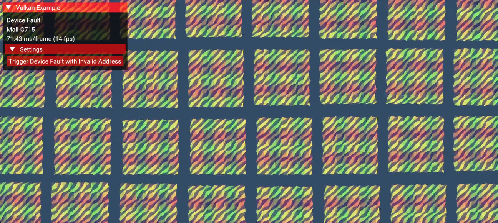
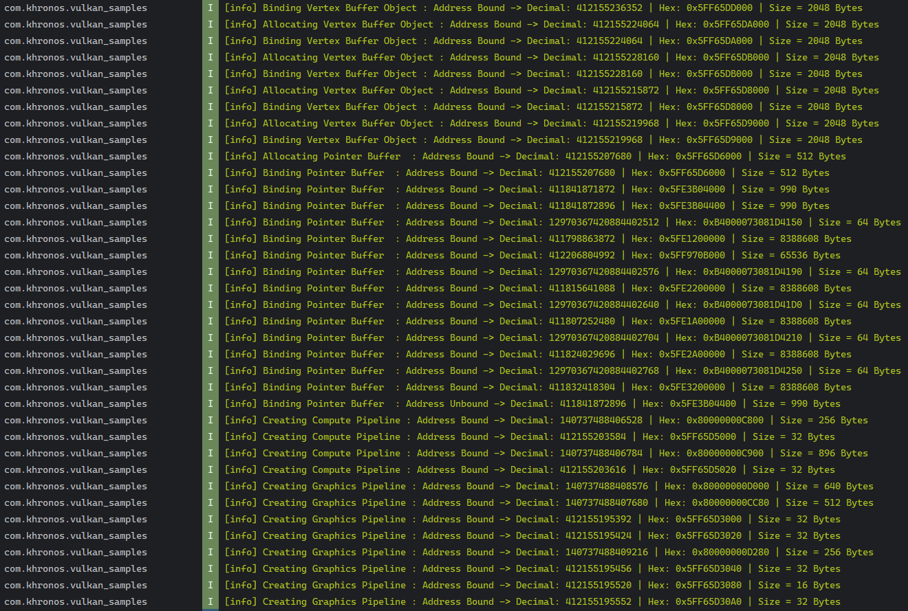
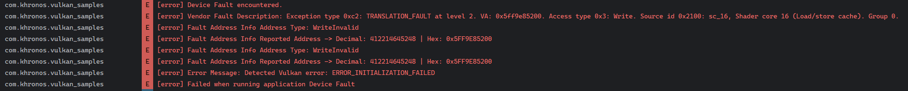

////
- Copyright (c) 2026, Arm Limited and Contributors
-
- SPDX-License-Identifier: Apache-2.0
-
- Licensed under the Apache License, Version 2.0 the "License";
- you may not use this file except in compliance with the License.
- You may obtain a copy of the License at
-
-     http://www.apache.org/licenses/LICENSE-2.0
-
- Unless required by applicable law or agreed to in writing, software
- distributed under the License is distributed on an "AS IS" BASIS,
- WITHOUT WARRANTIES OR CONDITIONS OF ANY KIND, either express or implied.
- See the License for the specific language governing permissions and
- limitations under the License.
-
////
= Device Fault

ifdef::site-gen-antora[]
TIP: The source for this sample can be found in the https://github.com/KhronosGroup/Vulkan-Samples/tree/main/samples/extensions/device_fault[Khronos Vulkan samples github repository].
endif::[]

== Overview

When developing Vulkan applications, understanding and handling GPU errors is crucial. Currently, traditional graphics debugging methods do not give detailed information about GPU faults.
The VK_EXT_device_fault extension provides detailed information when ERROR_DEVICE_LOST occur, while the VK_EXT_device_address_binding_report extension helps monitor GPU memory usage by reporting
allocated and bound/unbound addresses in Vulkan application.

=== VK_EXT_device_fault Extension Setup

[,cpp]
----
REQUEST_OPTIONAL_FEATURE(gpu,
                         VkPhysicalDeviceFaultFeaturesEXT,
                         deviceFault);
----

This code enables the device fault feature, which allows us to query detailed information about device lost errors.
The feature must be enabled before creating the logical device.

=== Address Binding Report Extension Setup

[,cpp]
----
REQUEST_OPTIONAL_FEATURE(gpu,
                         VkPhysicalDeviceAddressBindingReportFeaturesEXT,
                         reportAddressBinding);
----

This feature enables monitoring of GPU memory address bindings, providing insights into memory allocation.

=== Vulkan Validation Layer Configuration

[,cpp]
----
add_instance_extension(VK_EXT_LAYER_SETTINGS_EXTENSION_NAME, true);

VkLayerSettingEXT layerSetting;
layerSetting.pLayerName = "VK_LAYER_KHRONOS_validation";
layerSetting.pSettingName = "enables";
layerSetting.type = VK_LAYER_SETTING_TYPE_STRING_EXT;
layerSetting.valueCount = 1;
static const char *layerEnables = "VK_VALIDATION_FEATURE_ENABLE_DEBUG_PRINTF_EXT";
layerSetting.pValues = &layerEnables;
----

=== VK_EXT_device_fault Implementation

The core of device fault handling is implemented in the `check_device_fault` function.
Let's break it down:

[,cpp]
----
void DeviceFault::check_device_fault(VkResult result)
{
    VkDevice vk_device = get_device().get_handle();
    if (result != VK_ERROR_DEVICE_LOST) {
        return;
    }

    VkDeviceFaultCountsEXT faultCount = { VK_STRUCTURE_TYPE_DEVICE_FAULT_COUNTS_EXT };
    VkResult countResult = vkGetDeviceFaultInfoEXT(vk_device, &faultCount, nullptr);
----

This initial part checks if we have a VK_ERROR_DEVICE_LOST and queries the number of faults. The `VkDeviceFaultCountsEXT` structure will be filled with counts of different types of fault information.

[,cpp]
----
if (faultCount.addressInfoCount > 0 || faultCount.vendorInfoCount > 0) {
        std::vector<VkDeviceFaultAddressInfoEXT> addressInfos(faultCount.addressInfoCount);
        std::vector<VkDeviceFaultVendorInfoEXT> vendorInfos(faultCount.vendorInfoCount);
        std::vector<char> vendorBinaryData(faultCount.vendorBinarySize);

        VkDeviceFaultInfoEXT faultInfo = { VK_STRUCTURE_TYPE_DEVICE_FAULT_INFO_EXT };
        faultInfo.pAddressInfos = addressInfos.data();
        faultInfo.pVendorInfos = vendorInfos.data();
        faultInfo.pVendorBinaryData = vendorBinaryData.data();
----

This section allocates storage for the fault information. We create vectors to store address information, vendor-specific information, and any binary data provided by the vendor.

[, cpp]
----
VkResult faultResult = vkGetDeviceFaultInfoEXT(vk_device, &faultCount, &faultInfo);

    // Log the description and address info if it was able to catch the fault.
    if (faultResult == VK_SUCCESS) {

        // Some vendors may provide additional information
        LOGE("Vendor Fault Description: {}", faultInfo.pVendorInfos ? faultInfo.pVendorInfos->description : "No Vendor Information available.")
        // Log each address info with decimal and hexadecimal representations
        for (uint32_t i = 0; i < faultCount.addressInfoCount; i++) {
            LOGE("Fault Address Info Address Type: {}", vk::to_string(static_cast<vk::DeviceFaultAddressTypeEXT>(addressInfos[i].addressType)));
            LOGE("Fault Address Info Reported Address -> Decimal: {} | Hex: 0x{:X}", addressInfos[i].reportedAddress, static_cast<uint64_t>(addressInfos[i].reportedAddress));
        }
    }
}
----

Finally, we query the detailed fault information and log it. This includes vendor-provided descriptions and information about any memory addresses involved in the fault.

=== VK_EXT_device_address_binding_report Implementation
The address binding report functionality is implemented through a callback system.
Here's the handler function:

[,cpp]
----
void DeviceFault::handle_address_binding(const VkDeviceAddressBindingCallbackDataEXT& callbackData)
{
    if (!deviceBindingReportEnabled) {
        return;
    }

    // Report current memory operations with a label, an address and size of the memory
    switch (callbackData.bindingType) {
        case VK_DEVICE_ADDRESS_BINDING_TYPE_BIND_EXT:
            LOGI("{} : Address Bound -> Decimal: {} | Hex: 0x{:X} | Size = {} Bytes", current_memory_label, std::to_string(callbackData.baseAddress), static_cast<uint64_t>(callbackData.baseAddress), callbackData.size);
            break;

        case VK_DEVICE_ADDRESS_BINDING_TYPE_UNBIND_EXT:
            LOGI("{} : Address Unbound -> Decimal: {} | Hex: 0x{:X} | Size = {} Bytes", current_memory_label, std::to_string(callbackData.baseAddress), static_cast<uint64_t>(callbackData.baseAddress), callbackData.size);
            break;

        default:
            LOGE("No address binding/unbinding information!");
            break;
    }
}
----
This handler processes memory binding events. It logs when memory is bound or unbound, including a label, the address and size of the memory region.
This information is invaluable when debugging memory-related issues.

=== Debug Utils Integration
The debug utils messenger needs to be configured to receive binding reports:

[,cpp]
----
VkDebugUtilsMessengerCreateInfoEXT debug_utils_create_info{
    VK_STRUCTURE_TYPE_DEBUG_UTILS_MESSENGER_CREATE_INFO_EXT
};

debug_utils_create_info.messageSeverity =
    VK_DEBUG_UTILS_MESSAGE_SEVERITY_WARNING_BIT_EXT |
    VK_DEBUG_UTILS_MESSAGE_SEVERITY_INFO_BIT_EXT |
    VK_DEBUG_UTILS_MESSAGE_SEVERITY_VERBOSE_BIT_EXT;

debug_utils_create_info.messageType =
    VK_DEBUG_UTILS_MESSAGE_TYPE_GENERAL_BIT_EXT |
    VK_DEBUG_UTILS_MESSAGE_TYPE_VALIDATION_BIT_EXT |
    VK_DEBUG_UTILS_MESSAGE_TYPE_DEVICE_ADDRESS_BINDING_BIT_EXT;

debug_utils_create_info.pfnUserCallback = debug_callback;
debug_utils_create_info.pUserData = this;
----

The debug messenger is configured to receive various types of debug messages, including address binding reports.
The callback function will be called whenever relevant events occur.

== Testing the Implementation
The implementation includes mechanisms to trigger VK_ERROR_DEVICE_LOST error in a basic way of triggering with invalid address access.

=== Triggering VK_ERROR_DEVICE_LOST in Shader

One of the many ways of triggering VK_ERROR_DEVICE_LOST is to access an invalid memory access in shaders.
Since this sample is based on buffer_device_address, we'll only add the extra code needed for the sake of this tutorial.

https://github.com/KhronosGroup/Vulkan-Samples/tree/main/samples/extensions/buffer_device_address

In update_vbo.comp shader, we add below section.

[,glsl]
----
// 1. Accessing an invalid address.
if (registers.trigger_device_fault_invalid_address)
{
    positions.positions[1000000] = pos / (vec2(gl_WorkGroupSize.xy) * vec2(gl_NumWorkGroups.xy) - 1.0) - 0.5;
}
----

By using UI elements, we can manually trigger VK_ERROR_DEVICE_LOST by accessing an invalid address that will trigger an MMU page fault.

[,cpp]
----
void DeviceFault::on_update_ui_overlay(vkb::Drawer &drawer)
{
    if (drawer.header("Settings"))
    {
        if (drawer.button("Trigger Device Fault with Invalid Address")) {
            triggerDeviceFaultInvalidAddress = true;
        }
    }
}
----

=== Debugging Details

Concrete out-of-bounds example:
In our setup, a compute shader writes directly into a Shader Storage Buffer Object (SSBO) via buffer device addresses.
We are using VK_EXT_device_binding_report extension in this sample to report our memory allocation and binding addresses as shown below:

One of the SSBO's was bound at `0x5FF96E4000 (decimal 412,206,645,248)` with a size of `2048 bytes`.
We deliberately issued a store to `positions.positions[1,000,000]`, where `Position` is a `std430` array of `vec2` so each element is `8 bytes`.
The shader therefore targets `base + index * 8 = base + 8,000,000 bytes (hex 0x007A1200)`.

The device fault report shows `0x5ff9e85200 (decimal 412,214,645,248)`, and the difference from the bound base is exactly `8,000,000 bytes`.
There is no rounding in this report. Just straightforward pointer arithmetic making it trivial to correlate the fault with the offending SSBO and confirm the write was ``~7.63 MiB` past a `2 KiB` allocation.

Keep that in mind that there are no guarantees around the granularity of the fault addresses (and no guarantee that an out of bounds access generates a fault at all!), so this will vary across vendors.

== Conclusion
VK_EXT_device_fault and VK_EXT_device_address_binding_report are two important extensions that help developers debugging VK_ERROR_DEVICE_LOST crashes.
While the fault reports generated by VK_EXT_device_fault on GPUs may initially seem abstract containing GPU virtual addresses and faulting instruction offsets, this information still holds meaningful clues for developers.
In cases like out-of-bounds memory access or infinite shader loops, the extension identifies the affected shader stage and provides the memory address involved in the violation.
Although it's currently not possible to map these addresses directly back to SPIR-V lines or high-level shader code, developers can still use patterns in fault addresses and resource usage history (implemented via VK_EXT_device_binding_report) to narrow down the root cause.
In this way, the extension doesn't just flag that something went wrong, it also helps developers start asking the right questions about where and why it happened.

