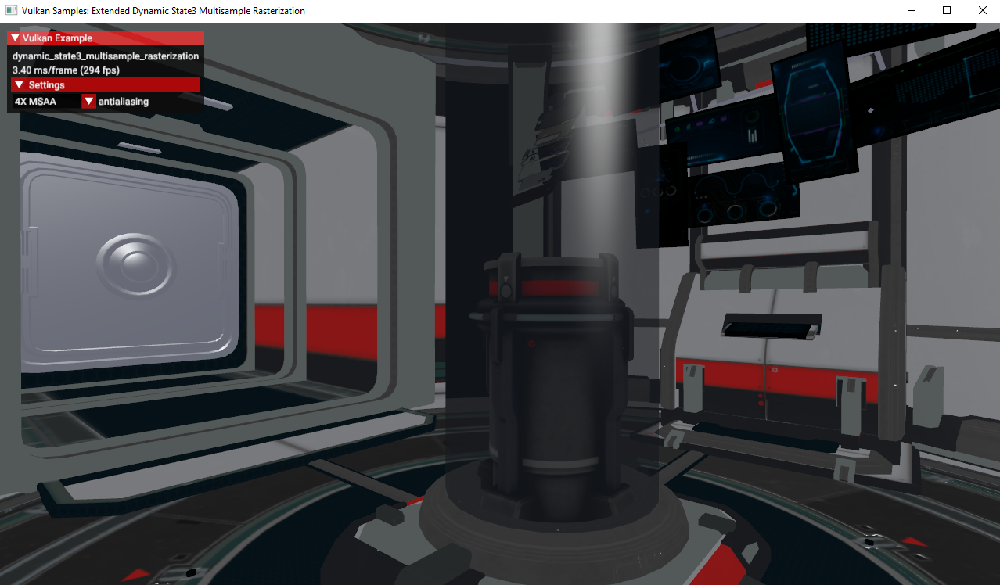

////
- Copyright (c) 2024, Mobica Limited
-
- SPDX-License-Identifier: Apache-2.0
-
- Licensed under the Apache License, Version 2.0 the "License";
- you may not use this file except in compliance with the License.
- You may obtain a copy of the License at
-
-     http://www.apache.org/licenses/LICENSE-2.0
-
- Unless required by applicable law or agreed to in writing, software
- distributed under the License is distributed on an "AS IS" BASIS,
- WITHOUT WARRANTIES OR CONDITIONS OF ANY KIND, either express or implied.
- See the License for the specific language governing permissions and
- limitations under the License.
-
////

// Extended dynamic_state3: Rasterization samples

== Overview

This sample demonstrates one of the functionalities of VK_EXT_extended_dynamic_state3 related to rasterization samples.
The extension can be used to dynamically change sampling without need to swap pipelines.

== Enabling the extension

To be able to use this extension in Vulkan API:
`VK_EXT_extended_dynamic_state3` depends on `VK_KHR_get_physical_device_properties2`, which is promoted to Vulkan 1.1. That is, to use this extension, `VK_EXT_extended_dynamic_state3` and either `VK_KHR_get_physical_device_properties2` or Vulkan 1.1 are required.

== Using the extension

To use the extension:
1) `VK_DYNAMIC_STATE_RASTERIZATION_SAMPLES_EXT` must be added to `VkPipelineDynamicStateCreateInfo`.
2) Method `void vkCmdSetRasterizationSamplesEXT(VkCommandBuffer commandBuffer, VkSampleCountFlagBits rasterizationSamples)` should be called between `vkCmdBeginRenderPass` and `vkCmdEndRenderPass`.

== Known issues

The extension always reports the following validation errors when enabled:
....
VUID-vkCmdDraw-rasterizationSamples-07474(ERROR / SPEC): msgNum: -2007336333 - Validation Error: [ VUID-vkCmdDraw-rasterizationSamples-07474 ] Object 0: handle = 0x1ab5b866f50, type = VK_OBJECT_TYPE_COMMAND_BUFFER; | MessageID = 0x885a7a73 | vkCmdDraw():  Render pass attachment 1 samples VK_SAMPLE_COUNT_1_BIT does not match samples VK_SAMPLE_COUNT_4_BIT set with vkCmdSetRasterizationSamplesEXT(). The Vulkan spec states: If the bound graphics pipeline state was created with the VK_DYNAMIC_STATE_RASTERIZATION_SAMPLES_EXT state enabled, and neither the VK_AMD_mixed_attachment_samples nor the VK_NV_framebuffer_mixed_samples extensions are enabled, then the rasterizationSamples in the last call to vkCmdSetRasterizationSamplesEXT must be the same as the current subpass color and/or depth/stencil attachments (https://www.khronos.org/registry/vulkan/specs/1.3-extensions/html/vkspec.html#VUID-vkCmdDraw-rasterizationSamples-07474)
VUID-vkCmdDraw-renderPass-02684: Validation Error: [ VUID-vkCmdDraw-renderPass-02684 ] Object 0: handle = 0x7533b600000006c9, type = VK_OBJECT_TYPE_RENDER_PASS; Object 1: handle = 0x30f5a50000000020, type = VK_OBJECT_TYPE_RENDER_PASS; | MessageID = 0x50685725 | vkCmdDraw():  RenderPasses incompatible between active render pass w/ VkRenderPass 0x7533b600000006c9[] and pipeline state object w/ VkRenderPass 0x30f5a50000000020[] Attachment 0 is not compatible with 0: They have different samples.. The Vulkan spec states: The current render pass must be compatible with the renderPass member of the VkGraphicsPipelineCreateInfo structure specified when creating the VkPipeline bound to VK_PIPELINE_BIND_POINT_GRAPHICS (https://www.khronos.org/registry/vulkan/specs/1.3-extensions/html/vkspec.html#VUID-vkCmdDraw-renderPass-02684)
....

The root cause for the validation errors is currently unknown and under analysis by Vulkan Validation Layers team:

https://github.com/KhronosGroup/Vulkan-ValidationLayers/issues/7327

== Resources

https://registry.khronos.org/vulkan/specs/1.3-extensions/man/html/VK_EXT_extended_dynamic_state3.html
https://registry.khronos.org/vulkan/specs/1.3-extensions/man/html/vkCmdSetRasterizationSamplesEXT.html
