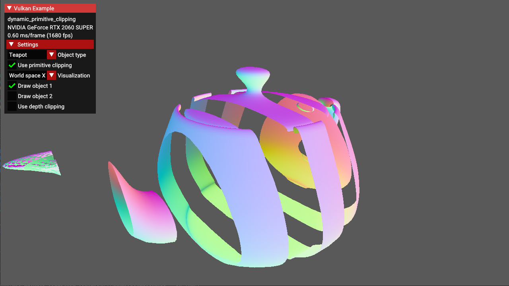

////
- Copyright (c) 2024, Mobica Limited
-
- SPDX-License-Identifier: Apache-2.0
-
- Licensed under the Apache License, Version 2.0 the "License";
- you may not use this file except in compliance with the License.
- You may obtain a copy of the License at
-
-     http://www.apache.org/licenses/LICENSE-2.0
-
- Unless required by applicable law or agreed to in writing, software
- distributed under the License is distributed on an "AS IS" BASIS,
- WITHOUT WARRANTIES OR CONDITIONS OF ANY KIND, either express or implied.
- See the License for the specific language governing permissions and
- limitations under the License.
-
////

= Dynamic primitive clipping

ifdef::site-gen-antora[]
TIP: The source for this sample can be found in the https://github.com/KhronosGroup/Vulkan-Samples/tree/main/samples/extensions/dynamic_primitive_clipping[Khronos Vulkan samples github repository].
endif::[]

== Overview

This sample demonstrates how to apply *depth clipping* using `vkCmdSetDepthClipEnableEXT()` command which is a part of `VK_EXT_extended_dynamic_state3` extension.

Additionally it also shows how to apply *primitive clipping* using `gl_ClipDistance[]` builtin shader variable.

It is worth noting that *primitive clipping* and *depth clipping* are two separate features of the fixed-function vertex post-processing stage.
They're both described in the same chapter of Vulkan specification ( chapter 27.4, "Primitive clipping" ).

== What is primitive clipping

Primitives produced by vertex/geometry/tesellation shaders are sent to fixed-function vertex post-processing.
Primitive clipping is a part of post-processing pipeline in which primitives such as points/lines/triangles are culled against cull volume and then clipped to clip volume.
And then they might be further clipped by results stored in `gl_ClipDistance[]` array - values in this array must be calculated in a vertex/geometry/tesellation shader.

In the past, fixed-function version of OpenGL API provided a method to specify parameters for up to 6 clipping planes ( half-spaces ) that could perform additional primitive clipping. Fixed-function hardware calculated proper distances to these planes and made a decision - should the primitive be clipped against these planes or not ( for historical study - search for the `glClipPlane()` description ).

Vulkan inherited the idea of primitive clipping, but with one important difference: user has to calculate the distance to the clip planes on its own in the vertex shader.
And - because user does it in a shader - he does not have to use clip planes at all. It can be any kind of calculation, as long as the results are put in `gl_ClipDistance[]` array.

Values that are less than 0.0 cause the vertex to be be clipped. In case of triangle primitive the whole triangle is clipped if all of its vertices have values stored in `gl_ClipDistance[]` below 0.0. When some of these values are above 0.0 - triangle is split into new triangles as described in Vulkan specification.

== What is depth clipping

When depth clipping is disabled then effectively, there is no near or far plane clipping. 

- depth values of primitives that are behind far plane are clamped to far plane depth value ( usually 1.0 )

- depth values of primitives that are in front of near plane are clamped to near plane depth value ( by default it's 0.0, but may be set to -1.0 if we use settings defined in `VkPipelineViewportDepthClipControlCreateInfoEXT` structure. This requires a presence of `VK_EXT_depth_clip_control` extension which is not part of this tutorial )

In this sample the result of depth clipping ( or lack of it ) is not clearly visible at first. Try to move viewer position closer to the object and see how "use depth clipping" checkbox changes object appearance.

== How to apply primitive clipping in Vulkan

Primitive clipping is relatively easy to configure in Vulkan API:

- `VkPhysicalDeviceFeatures::shaderClipDistance` must be set to VK_TRUE - in order to use `gl_ClipDistance[]` builtin variable in shaders

- `gl_ClipDistance[]` must be added to a definition of `gl_PerVertex` structure in a vertex shader. Simplest form with one value per vertex will look like this:

[,glsl]
----
out gl_PerVertex 
{
    vec4  gl_Position;
    float gl_ClipDistance[1];
};
----

The size of `gl_ClipDistance[]` array may not be larger than `VkPhysicalDeviceLimits::maxClipDistances`.

There is no external function that turns the primitive clipping off. If you want to have such feature - you have to implement it yourself by providing some additional variable to the vertex shader ( see shaders/dynamic_primitive_clipping/primitive_clipping.vert on how it can be implemented ).

== How to apply depth clipping in Vulkan

There are few ways of applying primitive clipping in Vulkan API:

- statically: when `VkPipelineRasterizationDepthClipStateCreateInfoEXT` IS NOT present and `VkPipelineRasterizationStateCreateInfo::depthClampEnable` is equal to VK_FALSE

- statically: when `VkPipelineRasterizationDepthClipStateCreateInfoEXT` is present in `VkGraphicsPipelineCreateInfo::pNext` chain and `VkPipelineRasterizationDepthClipStateCreateInfoEXT::depthClipEnable` is set to `VK_TRUE` ( requires extension `VK_EXT_depth_clip_enable` )

- using shader objects with `vkCmdSetDepthClipEnableEXT()` called before `vkCmdDraw*(cmd, ... )` command ( requires extensions: `VK_EXT_shader_object`, `VK_EXT_depth_clip_enable` )

- dynamically: when `VK_DYNAMIC_STATE_DEPTH_CLAMP_ENABLE_EXT` is present in `VkPipelineDynamicStateCreateInfo::pDynamicStates` and command `vkCmdSetDepthClipEnableEXT()` is called before `vkCmdDraw*(cmd, ... )` command ( requires extensions: `VK_EXT_extended_dynamic_state3`, `VK_EXT_depth_clip_enable` )

This sample focuses on the last, dynamic case.

In order to use the dynamic primitive clipping we need to:

- create `VkInstance` with extension `VK_KHR_get_physical_device_properties2`

- create `VkDevice` with extensions `VK_EXT_extended_dynamic_state3` and `VK_EXT_depth_clip_enable`

- `VkPhysicalDeviceDepthClipEnableFeaturesEXT::depthClipEnable` must be set to VK_TRUE

- `VkPhysicalDeviceExtendedDynamicState3FeaturesEXT::extendedDynamicState3DepthClipEnable` must be set to VK_TRUE - in order to use `vkCmdSetDepthClipEnableEXT()` command

- during graphics pipeline creation `VkPipelineDynamicStateCreateInfo::pDynamicStates` must contain `VK_DYNAMIC_STATE_DEPTH_CLAMP_ENABLE_EXT`

- command `vkCmdSetDepthClipEnableEXT()` is called before `vkCmdDraw*(cmd, ... )` command

== Potential applications

In the past primitive clipping was used in various CAD applications to make cross-sections of different objects.
We still can use it in similar fashion, but other applications also come to mind:

- we can hide parts of the 3D model

- we can make holes in a terrain ( e.g. for tunnels )

- we can use it in some special effects

Advantage of using primitive clipping over using `discard` keyword in a fragment shader is obvious: we are doing it earlier in a pipeline which may result in better performance ( or may not, you have to measure it ). But beware of vertex density: because this technique is vertex based it may have some nasty results when vertices are too sparse. See "Torusknot" object type with "Clip space Y" visualization in a sample to see where the problem may arise.

Depth clipping ( or rather lack of it ) is widely used in different shadow mapping algorithms, where only rendering to depth buffer is performed. In other use cases, which include rendering to color buffer you must be aware that when a lot of primitives are clamped to near/far plane we will see the ones that were rendered first rather that the ones that are closer to the viewer. Example of such behavior is visible on the left part of Utah teapot on a screenshot above.
