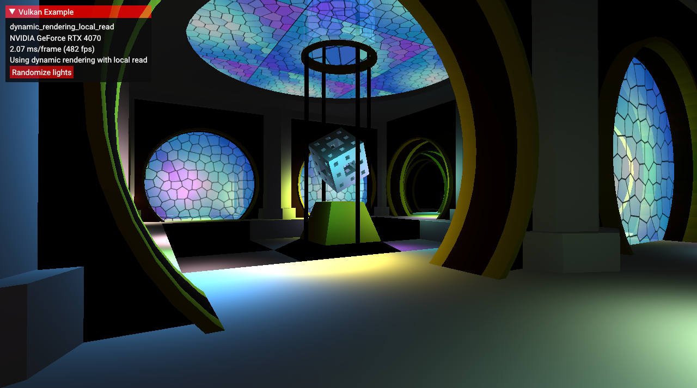
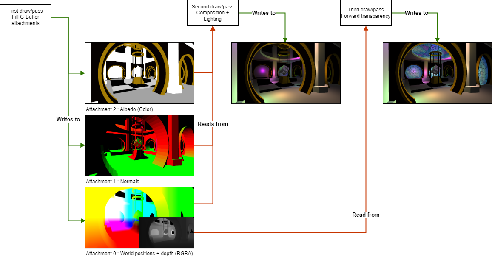

////
- Copyright (c) 2024, Sascha Willems
-
- SPDX-License-Identifier: Apache-2.0
-
- Licensed under the Apache License, Version 2.0 the "License";
- you may not use this file except in compliance with the License.
- You may obtain a copy of the License at
-
-     http://www.apache.org/licenses/LICENSE-2.0
-
- Unless required by applicable law or agreed to in writing, software
- distributed under the License is distributed on an "AS IS" BASIS,
- WITHOUT WARRANTIES OR CONDITIONS OF ANY KIND, either express or implied.
- See the License for the specific language governing permissions and
- limitations under the License.
-
////
= Dynamic Rendering local read

ifdef::site-gen-antora[]
TIP: The source for this sample can be found in the https://github.com/KhronosGroup/Vulkan-Samples/tree/main/samples/extensions/dynamic_rendering_local_read[Khronos Vulkan samples github repository].
endif::[]

== Overview

This sample demonstrates how to use the `VK_KHR_dynamic_rendering_local_read` extension in conjunction with the `VK_KHR_dynamic_rendering` extension. This combination can replace core render and subpasses, making it possible to do local reads via input attachments with dynamic rendering.

== Toggling between dynamic rendering and renderpasses

To make it easy to compare the two different approaches of using either dynamic rendering + local reads or renderpasses + subpasses, this sample has code for both rendering paths.

A define in `dynamic_rendering_local_read.h` can be used to toggle between the two techniques:

[,cpp]
----
#define USE_DYNAMIC_RENDERING
----

This is enabled by default, making the sample use dynamic rendering with local reads. If you want to use renderpass + subpasses instead, comment this define out and compile the sample.

== Comparison

For a primer on the differences between renderpasses and dynamic rendering, see the readme of the xref:../dynamic_rendering/README.adoc[dynamic rendering sample].

Here is the comparison table from that example extended with the newly added features from `VK_KHR_dynamic_rendering_local_read` in *bold*:

|===
| Vulkan 1.0 | Dynamic Rendering

| Rendering begins with `vkCmdBeginRenderPass`
| Rendering begins with `vkCmdBeginRenderingKHR`

| Rendering struct is `VkRenderPassBeginInfo`
| Rendering struct is `VkRenderingInfoKHR`

| Attachments are referenced by `VkFramebuffer`
| Attachments are referenced by `VkRenderingAttachmentInfoKHR`

| `VkFramebuffer` objects are heap-allocated and opaque
| `VkRenderingAttachmentInfoKHR` objects are stack-allocated

| Graphics pipeline creation references a `VkRenderPass`
| Graphics pipeline creation references a `VkPipelineRenderingCreateInfoKHR`

| *Subpasses are advanced with `vkCmdNextSubpass`*
| *`VkImageMemoryBarrier` to `VK_IMAGE_LAYOUT_RENDERING_LOCAL_READ_KHR` image layout*

| *Local reads in shaders use `subpassLoad`*
| *Local reads in shaders use `subpassLoad`*
|===

== The sample

With subpasses it's possible to do pixel local reads within a single renderpass. Local read means that you can't freely sample (like with a texture + sampler) but are instead limited to reading the pixel value from the previous subpass at the exact same position. This is based on how esp. tile based GPU architectures work. On such architectures workloads that don't need to sample arbitrarily can improve performance using subpasses and pixel local reads using input attachments. One such example  is a deferred renderer with a composition pass. First multiple attachments are filled with different information (albedo, normals, world space position) and then at a later point those attachments are combined into a single image. This composition step reads those attachments at the exact same position that the current pass is operating on, so instead of sampling from these we can use them as input attachments instead and do only pixel local reads.

The rendering setup for this sample looks like this:

A big criticism with renderpasses was how involved esp. the setup is. Getting renderpasses and subpasses incl. dependencies correct can be tricky and renderpasses are kinda hard to integrate into a dynamically changing setup, making them a hard fit for complex Vulkan projects like game engines. With dynamic rendering, setup is far less involved and moves mostly to command buffer creation. If you look at the sample you can easily spot how much code required by looking at the parts that are deactivated via the `dynamic_rendering_local_read` C++ define. More on this can be found in the xref:../dynamic_rendering/README.adoc[dynamic rendering sample] readme. For this sample we'll only look at draw time.

== Replacing subpasses for local reads

=== Input attachments

Just like local reads in subpasses, dynamic rendering local read also makes use of input attachments. That should make it easy to convert existing code to this new extension. So unless you do advanced things like input attachment reordering, the changes required to add pixel local reads to dynamic rendering are minimal and only affect the application side. There are no changes to the shader interface, so shaders that have been used with renderpasses + subpasses can be used without any changes. Even with dynamic rendering and local reads you use `subpassInput` and `subpassLoad`.

=== Self-Dependencies

With the `dynamicRenderingLocalReads` feature enabled, it#s now possible to use pipeline barriers within dynamic rendering if they include the `VK_DEPENDENCY_BY_REGION_BIT`. Such a barrier makes attachments before the barrier readable as input attachments afterwards. The extension also introduces the new image layout `VK_IMAGE_LAYOUT_RENDERING_LOCAL_READ_KHR` that can be used for storage images and attachments to make writes to those visible via input attachments.

=== Renderpasses with subpasses

. Start a new renderpass with `vkCmdBeginRenderPass` (this also starts the first subpass)
. Fill G-Buffer attachments
. Start the second subpass with `vkCmdNextSubpass`
. Combine G-Buffer attachments using input attachments (and draw to screen using a full-screen quad)
. Start the third subpass with `vkCmdNextSubpass`
. Draw transparent geometry with a forward pass reading depth from an attachment
. End renderpass with `vkCmdEndRenderPass`

=== Dynamic render with local read

. Start dynamic rendering with `vkCmdBeginRenderingKHR`
. Fill G-Buffer attachments
. Insert a memory barrier with the "by region" bit set to make attachment writes visible for input attachment reads for the next draw call
. Combine G-Buffer attachments using input attachments (and draw to screen using a full-screen quad)
. Draw transparent geometry with a forward pass reading depth from an attachment
. End dynamic rendering with `vkCmdEndRenderingKHR`

== Conclusion

With the addition of `VK_KHR_dynamic_rendering_local_read` it's now finally possible to fully replace renderpasses, including those that have multiple subpasses. This makes dynamic rendering a fully fledged replacement for renderpasses on all implementations, including tile based architectures.

== Additional information

* https://docs.vulkan.org/spec/latest/proposals/proposals/VK_KHR_dynamic_rendering_local_read.html[Extension proposal]
* https://www.khronos.org/blog/streamlining-subpasses[Extension blog post]