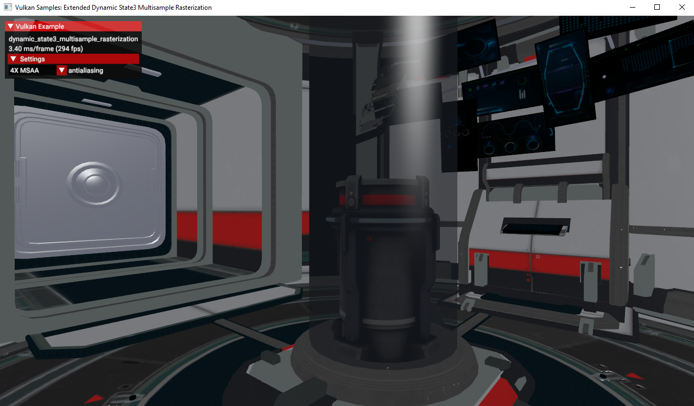

////
- Copyright (c) 2023, Mobica Limited
-
- SPDX-License-Identifier: Apache-2.0
-
- Licensed under the Apache License, Version 2.0 the "License";
- you may not use this file except in compliance with the License.
- You may obtain a copy of the License at
-
-     http://www.apache.org/licenses/LICENSE-2.0
-
- Unless required by applicable law or agreed to in writing, software
- distributed under the License is distributed on an "AS IS" BASIS,
- WITHOUT WARRANTIES OR CONDITIONS OF ANY KIND, either express or implied.
- See the License for the specific language governing permissions and
- limitations under the License.
-
////

// Extended dynamic_state3: Rasterization samples

== Overview

This sample demonstrates one of the functionalities of VK_EXT_extended_dynamic_state3 related to rasterization samples.
The extension can be used to dynamically change sampling without any need to restart the application.

== Enabling the extension

To be able to use this extension in Vulkan API:
1) At least Vulkan API version 1.1 must be supported.
2) Set of `VkPhysicalDeviceExtendedDynamicStateFeaturesEXT`, `VkPhysicalDeviceExtendedDynamicState2FeaturesEXT`, `VkPhysicalDeviceExtendedDynamicState3FeaturesEXT`
must be added to the feature chain of `VkPhysicalDeviceProperties2` and `VkPhysicalDeviceExtendedDynamicState3PropertiesEXT` must be added to `VkPhysicalDeviceProperties2`.

== Using the extension

To use the extension:
1) `VK_DYNAMIC_STATE_RASTERIZATION_SAMPLES_EXT` must be added to `VkPipelineDynamicStateCreateInfo`.
2) Method `void vkCmdSetRasterizationSamplesEXT(VkCommandBuffer commandBuffer, VkSampleCountFlagBits rasterizationSamples)` should be called between
`vkCmdBeginRenderPass` and `vkCmdEndRenderPass`.

== Known issues

The extension always reports the following validation error when enabled:
....
[error] [framework\core\instance.cpp:50] -1100021871 - UNASSIGNED-GeneralParameterError-UnrecognizedValue: Validation Error: [ UNASSIGNED-GeneralParameterError-UnrecognizedValue ] Object 0: handle = 0x15d301ca4e0, type = VK_OBJECT_TYPE_DEVICE; | MessageID = 0xbe6eff91 | vkCreateGraphicsPipelines: value of pCreateInfos[0].pDynamicState->pDynamicStates[2] (1000455005) does not fall within the begin..end range of the core VkDynamicState enumeration tokens and is not an extension added token
....

This implies several other validation errors during runtime:
....
[error] [framework\core\instance.cpp:50] -1052047544 - VUID-vkCmdDraw-rasterizationSamples-04740: Validation Error: [ VUID-vkCmdDraw-rasterizationSamples-04740 ] Object 0: handle = 0xf6d9250000000139, type = VK_OBJECT_TYPE_PIPELINE; Object 1: handle = 0xfc06e9000000013d, type = VK_OBJECT_TYPE_RENDER_PASS; | MessageID = 0xc14b0748 | vkCmdDraw: In VkPipeline 0xf6d9250000000139[] the sample count is VK_SAMPLE_COUNT_1_BIT while the current VkRenderPass 0xfc06e9000000013d[] has VK_SAMPLE_COUNT_4_BIT and they need to be the same. The Vulkan spec states: If rasterization is not disabled in the bound graphics pipeline, and neither the VK_AMD_mixed_attachment_samples nor the VK_NV_framebuffer_mixed_samples extensions are enabled, then VkPipelineMultisampleStateCreateInfo::rasterizationSamples must be the same as the current subpass color and/or depth/stencil attachments (https://vulkan.lunarg.com/doc/view/1.3.216.0/windows/1.3-extensions/vkspec.html#VUID-vkCmdDraw-rasterizationSamples-04740)
[error] [framework\core\instance.cpp:50] 1349015333 - VUID-vkCmdDraw-renderPass-02684: Validation Error: [ VUID-vkCmdDraw-renderPass-02684 ] Object 0: handle = 0xfc06e9000000013d, type = VK_OBJECT_TYPE_RENDER_PASS; Object 1: handle = 0xab64de0000000020, type = VK_OBJECT_TYPE_RENDER_PASS; | MessageID = 0x50685725 | vkCmdDraw: RenderPasses incompatible between active render pass w/ VkRenderPass 0xfc06e9000000013d[] and pipeline state object w/ VkRenderPass 0xab64de0000000020[] Attachment 0 is not compatible with 0: They have different samples.. The Vulkan spec states: The current render pass must be compatible with the renderPass member of the VkGraphicsPipelineCreateInfo structure specified when creating the VkPipeline bound to VK_PIPELINE_BIND_POINT_GRAPHICS (https://vulkan.lunarg.com/doc/view/1.3.216.0/windows/1.3-extensions/vkspec.html#VUID-vkCmdDraw-renderPass-02684)
[error] [framework\core\instance.cpp:50] -329854293 - VUID-vkCmdDrawIndexed-rasterizationSamples-04740: Validation Error: [ VUID-vkCmdDrawIndexed-rasterizationSamples-04740 ] Object 0: handle = 0x9f9b41000000003c, type = VK_OBJECT_TYPE_PIPELINE; Object 1: handle = 0xfc06e9000000013d, type = VK_OBJECT_TYPE_RENDER_PASS; | MessageID = 0xec56d2ab | vkCmdDrawIndexed: In VkPipeline 0x9f9b41000000003c[] the sample count is VK_SAMPLE_COUNT_1_BIT while the current VkRenderPass 0xfc06e9000000013d[] has VK_SAMPLE_COUNT_4_BIT and they need to be the same. The Vulkan spec states: If rasterization is not disabled in the bound graphics pipeline, and neither the VK_AMD_mixed_attachment_samples nor the VK_NV_framebuffer_mixed_samples extensions are enabled, then VkPipelineMultisampleStateCreateInfo::rasterizationSamples must be the same as the current subpass color and/or depth/stencil attachments (https://vulkan.lunarg.com/doc/view/1.3.216.0/windows/1.3-extensions/vkspec.html#VUID-vkCmdDrawIndexed-rasterizationSamples-04740)
[error] [framework\core\instance.cpp:50] -1934215230 - VUID-vkCmdDrawIndexed-renderPass-02684: Validation Error: [ VUID-vkCmdDrawIndexed-renderPass-02684 ] Object 0: handle = 0xfc06e9000000013d, type = VK_OBJECT_TYPE_RENDER_PASS; Object 1: handle = 0xab64de0000000020, type = VK_OBJECT_TYPE_RENDER_PASS; | MessageID = 0x8cb637c2 | vkCmdDrawIndexed: RenderPasses incompatible between active render pass w/ VkRenderPass 0xfc06e9000000013d[] and pipeline state object w/ VkRenderPass 0xab64de0000000020[] Attachment 0 is not compatible with 0: They have different samples.. The Vulkan spec states: The current render pass must be compatible with the renderPass member of the VkGraphicsPipelineCreateInfo structure specified when creating the VkPipeline bound to VK_PIPELINE_BIND_POINT_GRAPHICS (https://vulkan.lunarg.com/doc/view/1.3.216.0/windows/1.3-extensions/vkspec.html#VUID-vkCmdDrawIndexed-renderPass-02684)
....

== Resources

https://registry.khronos.org/vulkan/specs/1.3-extensions/man/html/VK_EXT_extended_dynamic_state3.html
https://registry.khronos.org/vulkan/specs/1.3-extensions/man/html/vkCmdSetRasterizationSamplesEXT.html
