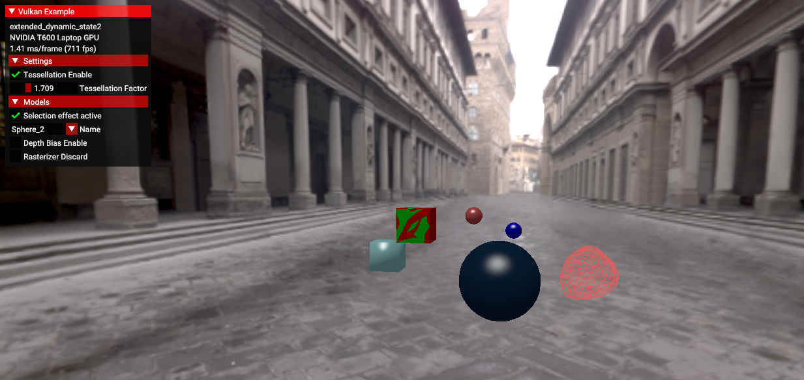

////
- Copyright (c) 2023, Mobica Limited
-
- SPDX-License-Identifier: Apache-2.0
-
- Licensed under the Apache License, Version 2.0 the "License";
- you may not use this file except in compliance with the License.
- You may obtain a copy of the License at
-
-     http://www.apache.org/licenses/LICENSE-2.0
-
- Unless required by applicable law or agreed to in writing, software
- distributed under the License is distributed on an "AS IS" BASIS,
- WITHOUT WARRANTIES OR CONDITIONS OF ANY KIND, either express or implied.
- See the License for the specific language governing permissions and
- limitations under the License.
-
////
= Extended dynamic state 2

== Overview

This sample demonstrates how to use `VK_EXT_extended_dynamic_state2` extension, which eliminates the need to create multiple pipelines in case of specific different parameters.

This extension changes how *Depth Bias*, *Primitive Restart*, *Rasterizer Discard* and *Patch Control Points* are managed.
Instead of static description during pipeline creation, this extension allows developers to change those parameters by using a function before every draw.

Below is a comparison of common Vulkan static and dynamic implementation of those extensions with additional usage of `vkCmdSetPrimitiveTopologyEXT` extension from dynamic state .

|===
| Static/Non-dynamic | Dynamic State 2

| dynamic_state = {}
| dynamic_state = {VK_DYNAMIC_STATE_VIEWPORT, + VK_DYNAMIC_STATE_SCISSOR, + VK_DYNAMIC_STATE_DEPTH_BIAS_ENABLE_EXT, + VK_DYNAMIC_STATE_PRIMITIVE_TOPOLOGY_EXT, + VK_DYNAMIC_STATE_RASTERIZER_DISCARD_ENABLE_EXT, + VK_DYNAMIC_STATE_PRIMITIVE_TOPOLOGY_EXT, + VK_DYNAMIC_STATE_PRIMITIVE_RESTART_ENABLE_EXT}

| vkCreateGraphicsPipelines(pipeline1) + vkCreateGraphicsPipelines(pipeline2) + vkCreateGraphicsPipelines(pipeline3) + vkCreateGraphicsPipelines(pipeline4)
| vkCreateGraphicsPipelines(pipeline1) + vkCreateGraphicsPipelines(pipeline2)

| draw(model1, pipeline1) + draw(model2, pipeline2) + draw(model3, pipeline3) + draw(model4, pipeline4)
| vkCmdSetPrimitiveRestartEnableEXT(commandBuffer1, primitiveBoolParam) + vkCmdSetDepthBiasEnableEXT(commandBuffer1, depthBiasBoolParam) + vkCmdSetRasterizerDiscardEnableEXT(commandBuffer1,rasterizerBoolParam) + vkCmdSetPrimitiveTopologyEXT(commandBuffer1, VK_PRIMITIVE_TOPOLOGY_TRIANGLE_LIST) + draw(model1, pipeline1) + vkCmdSetPrimitiveTopologyEXT(commandBuffer2, VK_PRIMITIVE_TOPOLOGY_TRIANGLE_STRIP) + vkCmdSetPrimitiveRestartEnableEXT(commandBuffer2, primitiveBoolParam) + draw(model2, pipeline1) + vkCmdSetDepthBiasEnableEXT(commandBuffer3, depthBiasBoolParam) + vkCmdSetPrimitiveRestartEnableEXT(commandBuffer3, primitiveBoolParam) + draw(model3, pipeline1) + vkCmdSetPatchControlPointsEXT(commandBuffer4, patchControlPoints) + draw(model4, pipeline2)
|===

More details are provided in the sections that follow.

== Pipelines

Previously developers had to create multiple pipelines for different parameters in Depth Bias, Primitive Restart, Rasterizer Discard and Patch Control Points.
This is illustrated in a static/non-dynamic pipeline creation.

[,C++]
----
...
/* First pipeline creation */
VkPipelineInputAssemblyStateCreateInfo input_assembly_state =
	vkb::initializers::pipeline_input_assembly_state_create_info(
	    VK_PRIMITIVE_TOPOLOGY_TRIANGLE_LIST, /* value used in 1st and 2nd pipeline */
	    0,
	    VK_FALSE); /* primitiveRestartEnable */

VkPipelineRasterizationStateCreateInfo rasterization_state =
	vkb::initializers::pipeline_rasterization_state_create_info(
	    VK_POLYGON_MODE_FILL, /* value used in 1st, 2nd and 3rd pipeline */
	    VK_CULL_MODE_BACK_BIT,
	    VK_FRONT_FACE_CLOCKWISE,
	    0);
rasterization_state.depthBiasConstantFactor = 1.0f;
rasterization_state.depthBiasSlopeFactor    = 1.0f;
rasterization_state.depthBiasClamp          = 0.0f;

/* Note: Using reversed depth-buffer for increased precision, so greater depth values are kept */
VkPipelineDepthStencilStateCreateInfo depth_stencil_state =
	vkb::initializers::pipeline_depth_stencil_state_create_info(
	    VK_TRUE, /* depthTestEnable */
	    VK_TRUE, /* depthWriteEnable */
	    VK_COMPARE_OP_GREATER);
...

/* VkGraphicsPipelineCreateInfo for all pipelines, parameters are modified before each pipeline creation */
VkGraphicsPipelineCreateInfo graphics_create{VK_STRUCTURE_TYPE_GRAPHICS_PIPELINE_CREATE_INFO};
graphics_create.pInputAssemblyState = &input_assembly_state;
graphics_create.pRasterizationState = &rasterization_state;
graphics_create.pDepthStencilState  = &depth_stencil_state;
graphics_create.pTessellationState  = VK_NULL_HANDLE;
...

VK_CHECK(vkCreateGraphicsPipelines(get_device().get_handle(), pipeline_cache, 1, &graphics_create, VK_NULL_HANDLE, &pipeline1));

/* Second pipeline creation */
rasterization_state.rasterizerDiscardEnable = VK_TRUE;

VK_CHECK(vkCreateGraphicsPipelines(get_device().get_handle(), pipeline_cache, 1, &graphics_create, VK_NULL_HANDLE, &pipeline2));

/* Third pipeline creation */
rasterization_state.rasterizerDiscardEnable = VK_FALSE;
input_assembly_state.topology = VK_PRIMITIVE_TOPOLOGY_TRIANGLE_LIST;
input_assembly_state.primitiveRestartEnable = VK_TRUE;

VK_CHECK(vkCreateGraphicsPipelines(get_device().get_handle(), pipeline_cache, 1, &graphics_create, VK_NULL_HANDLE, &pipeline3));

/* Fourth pipeline creation */
VkPipelineTessellationStateCreateInfo tessellation_state = 	vkb::initializers::pipeline_tessellation_state_create_info(3);
graphics_create.layout = pipeline_layouts.tesselation;
graphics_create.pTessellationState  = &tessellation_state;
input_assembly_state.topology = VK_PRIMITIVE_TOPOLOGY_PATCH_LIST;
input_assembly_state.primitiveRestartEnable = VK_FALSE;
rasterization_state.depthBiasEnable = VK_TRUE;
if (get_device().get_gpu().get_features().fillModeNonSolid)
{
	rasterization_state.polygonMode = VK_POLYGON_MODE_LINE; /* Wireframe mode */
}

VK_CHECK(vkCreateGraphicsPipelines(get_device().get_handle(), pipeline_cache, 1, &graphics_create, VK_NULL_HANDLE, &pipeline4));
----

In the above approach if developer would like to change the patch control points number, then for each different number a new pipeline would be required.

However, with `VK_EXT_extended_dynamic_state2` the number of pipelines can be reduced by the possibility to change parameters of Depth Bias, Primitive Restart, Rasterizer Discard and Patch Control Points by calling `vkCmdSetDepthBiasEnableEXT`, `vkCmdSetPrimitiveRestartEnableEXT`, `vkCmdSetRasterizerDiscardEnableEXT` and `vkCmdSetPatchControlPointsEXT` respectively before calling the `draw_model` method.

With the usage of above functions we can reduce the number of pipelines.
Required dynamic states must be enabled and passed to the `VkGraphicsPipelineCreateInfo` structure.

`VK_DYNAMIC_STATE_PRIMITIVE_TOPOLOGY_EXT` specifies that the topology state in the `VkPipelineInputAssemblyStateCreateInfo` struct only specifies the topology class.
The specific topology order and adjacency must be set dynamically with `vkCmdSetPrimitiveTopology` before any drawing commands.

[,C+]
----
VkPipelineInputAssemblyStateCreateInfo input_assembly_state =
	vkb::initializers::pipeline_input_assembly_state_create_info(
	    VK_PRIMITIVE_TOPOLOGY_TRIANGLE_LIST,
	    0,
	    VK_FALSE);

std::vector<VkDynamicState> dynamic_state_enables = {
	VK_DYNAMIC_STATE_VIEWPORT,
	VK_DYNAMIC_STATE_SCISSOR,
	VK_DYNAMIC_STATE_PRIMITIVE_TOPOLOGY_EXT,
	VK_DYNAMIC_STATE_DEPTH_BIAS_ENABLE_EXT,
	VK_DYNAMIC_STATE_RASTERIZER_DISCARD_ENABLE_EXT,
	VK_DYNAMIC_STATE_PRIMITIVE_RESTART_ENABLE_EXT,
};

VkPipelineDynamicStateCreateInfo dynamic_state =
	vkb::initializers::pipeline_dynamic_state_create_info(
	    dynamic_state_enables.data(),
	    static_cast<uint32_t>(dynamic_state_enables.size()),
	    0);

VkGraphicsPipelineCreateInfo graphics_create{VK_STRUCTURE_TYPE_GRAPHICS_PIPELINE_CREATE_INFO};
graphics_create.pInputAssemblyState = &input_assembly_state;
graphics_create.pDynamicState       = &dynamic_state;
...

VK_CHECK(vkCreateGraphicsPipelines(get_device().get_handle(), pipeline_cache, 1, &graphics_create, VK_NULL_HANDLE, &pipeline.baseline));
----

And now, thanks to `VK_EXT_extended_dynamic_state2`, we can change parameters before each corresponding draw call.

[,C++]
----
VK_CHECK(vkBeginCommandBuffer(draw_cmd_buffer, &command_begin));

...
/* Binding baseline pipeline and descriptor sets */
vkCmdBindDescriptorSets(draw_cmd_buffer,
		                VK_PIPELINE_BIND_POINT_GRAPHICS,
		                pipeline_layouts.baseline,
		                0,
		                1,
		                &descriptor_sets.baseline,
		                0,
		                nullptr);
vkCmdBindPipeline(draw_cmd_buffer, VK_PIPELINE_BIND_POINT_GRAPHICS, pipeline.baseline);

/* Setting topology to triangle list and disabling primitive restart functionality */
vkCmdSetPrimitiveTopologyEXT(draw_cmd_buffer, VK_PRIMITIVE_TOPOLOGY_TRIANGLE_LIST);
vkCmdSetPrimitiveRestartEnableEXT(draw_cmd_buffer, VK_FALSE);

/* Drawing objects from baseline scene (with rasterizer discard and depth bias functionality) */
draw_from_scene(draw_cmd_buffer, scene_elements_baseline);

/* Changing topology to triangle strip with using primitive restart feature */
vkCmdSetPrimitiveTopologyEXT(draw_cmd_buffer, VK_PRIMITIVE_TOPOLOGY_TRIANGLE_STRIP);
vkCmdSetPrimitiveRestartEnableEXT(draw_cmd_buffer, VK_TRUE);

/* Draw model with primitive restart functionality */
draw_created_model(draw_cmd_buffer);

/* Changing bindings to tessellation pipeline */
vkCmdBindDescriptorSets(draw_cmd_buffer,
		                VK_PIPELINE_BIND_POINT_GRAPHICS,
		                pipeline_layouts.tesselation,
		                0,
		                1,
		                &descriptor_sets.tesselation,
		                0,
		                nullptr);
vkCmdBindPipeline(draw_cmd_buffer, VK_PIPELINE_BIND_POINT_GRAPHICS, pipeline.tesselation);

/* Change topology to patch list and setting patch control points value */
vkCmdSetPrimitiveTopologyEXT(draw_cmd_buffer, VK_PRIMITIVE_TOPOLOGY_PATCH_LIST);
vkCmdSetPatchControlPointsEXT(draw_cmd_buffer, patch_control_points_triangle);

/* Drawing scene with objects using tessellation feature */
draw_from_scene(draw_cmd_buffer, scene_elements_tess);

/* Changing bindings to background pipeline */
vkCmdBindDescriptorSets(draw_cmd_buffer,
		                VK_PIPELINE_BIND_POINT_GRAPHICS,
		                pipeline_layouts.background,
		                0,
		                1,
		                &descriptor_sets.background,
		                0,
		                nullptr);
vkCmdBindPipeline(draw_cmd_buffer, VK_PIPELINE_BIND_POINT_GRAPHICS, pipeline.background);

/* Setting topology to triangle list */
vkCmdSetPrimitiveTopologyEXT(draw_cmd_buffer, VK_PRIMITIVE_TOPOLOGY_TRIANGLE_LIST);

/* Drawing background */
draw_model(background_model, draw_cmd_buffer);
...

VK_CHECK(vkEndCommandBuffer(draw_cmd_buffer));
----

The usage of depth bias dynamic state is implemented in the `draw_from_scene` function.
For each scene element (except Geosphere) the depth bias or the rasterizer discard options are enabled depending on GUI settings.
At the end of the function settings are reseted (set to VK_FALSE).

[,C++]
----
void ExtendedDynamicState2::draw_from_scene(VkCommandBuffer command_buffer, std::vector<SceneNode> const &scene_node)
{
	for (int i = 0; i < scene_node.size(); ++i)
	{
		if (scene_node[i].name != "Geosphere")
		{
			vkCmdSetDepthBiasEnableEXT(command_buffer, gui_settings.objects[i].depth_bias);
			vkCmdSetRasterizerDiscardEnableEXT(command_buffer, gui_settings.objects[i].rasterizer_discard);
		}

		...

		vkCmdDrawIndexed(command_buffer, scene_node[i].sub_mesh->vertex_indices, 1, 0, 0, 0);
	}
	
	vkCmdSetDepthBiasEnableEXT(command_buffer, VK_FALSE);
	vkCmdSetRasterizerDiscardEnableEXT(command_buffer, VK_FALSE);
}
----

== Enabling the Extension

The extended dynamic state 2 api requires Vulkan 1.0 and the appropriate headers / SDK is required.
This extension has been https://registry.khronos.org/vulkan/specs/1.3-extensions/man/html/VK_EXT_extended_dynamic_state2.html#_promotion_to_vulkan_1_3[partially] promoted to Vulkan 1.3.

The device extension is provided by `VK_EXT_EXTENDED_DYNAMIC_STATE_2_EXTENSION_NAME`.
It also requires  `VK_KHR_GET_PHYSICAL_DEVICE_PROPERTIES_2_EXTENSION_NAME` instance extension to be enabled.

[,C++]
----
add_instance_extension(VK_KHR_GET_PHYSICAL_DEVICE_PROPERTIES_2_EXTENSION_NAME);
add_device_extension(VK_EXT_EXTENDED_DYNAMIC_STATE_2_EXTENSION_NAME);
----

If the https://registry.khronos.org/vulkan/specs/1.3-extensions/man/html/VkPhysicalDeviceExtendedDynamicState2FeaturesEXT.html[`VkPhysicalDeviceExtendedDynamicState2FeaturesEXT`] structure is included in the pNext chain of the `VkPhysicalDeviceFeatures2` structure passed to vkGetPhysicalDeviceFeatures2, it is filled in to indicate whether each corresponding feature is supported.
`VkPhysicalDeviceExtendedDynamicState2FeaturesEXT` can also be used in the pNext chain of `VkDeviceCreateInfo` to selectively enable these features.
