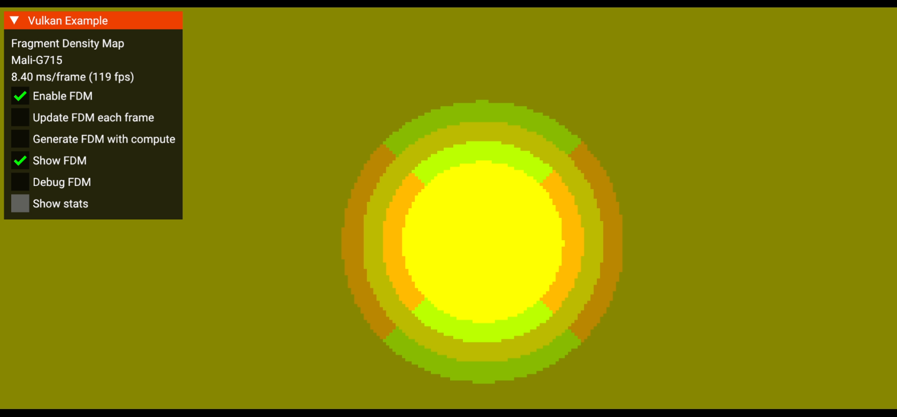

////
- Copyright (c) 2025 Arm Limited and Contributors
-
- SPDX-License-Identifier: Apache-2.0
-
- Licensed under the Apache License, Version 2.0 the "License";
- you may not use this file except in compliance with the License.
- You may obtain a copy of the License at
-
-     http://www.apache.org/licenses/LICENSE-2.0
-
- Unless required by applicable law or agreed to in writing, software
- distributed under the License is distributed on an "AS IS" BASIS,
- WITHOUT WARRANTIES OR CONDITIONS OF ANY KIND, either express or implied.
- See the License for the specific language governing permissions and
- limitations under the License.
-
////

= Fragment Density Map

ifdef::site-gen-antora[]
TIP: The source for this sample can be found in the https://github.com/KhronosGroup/Vulkan-Samples/tree/main/samples/extensions/fragment_density_map[Khronos Vulkan Samples GitHub repository].
endif::[]

== Overview

This sample demonstrates the `VK_EXT_fragment_density_map` extension. The extension allows different regions of a render target to be shaded at different rates, broadcasting a single fragment invocation to multiple texels and then compositing the results for presentation. Control is provided through a dedicated attachment in the render pass that defines the approximate shading density of regions of the target image.

=== Potential uses of Fragment Density Map

By lowering the shading rate in parts of the image that are less important perceptually, applications can reclaim performance. A common use case is foveated rendering in Virtual Reality (VR): with eye tracking, you render the gaze region at full resolution and peripheral regions at lower resolution. When done correctly (with sufficiently low latency), this can significantly reduce fragment invocations without perceptually sacrificing image quality.

NOTE: VR is not a requirement for fragment density map, but foveated rendering in VR is its main use case.

== Enabling Fragment Density Map
=== Enabling extensions

The key extension used in this sample is `VK_EXT_fragment_density_map`, along with its dependencies `VK_KHR_create_renderpass2` and `VK_KHR_get_physical_device_properties2`. While `VK_EXT_fragment_density_map2` exists and can reduce host-to-device latency, it is not used in this sample.

Developers who want to use `VK_EXT_fragment_density_map` should also consider reviewing xref:samples/extensions/fragment_shading_rate/README.adoc[Fragment Shading Rate] (`VK_KHR_fragment_shading_rate`). The KHR extension offers applications more precise control over the shading rate and provides additional options to developers, allowing them to select a rate per draw call, per primitive, or similar to `VK_EXT_fragment_density_map`—per region of the framebuffer.

=== Feature description

[,C++]
----
VkPhysicalDeviceFragmentDensityMapFeaturesEXT fdm_features{
    VK_STRUCTURE_TYPE_PHYSICAL_DEVICE_FRAGMENT_DENSITY_MAP_FEATURES_EXT
};

fdm_features.fragmentDensityMap                    = VK_TRUE;
fdm_features.fragmentDensityMapDynamic             = VK_TRUE;
fdm_features.fragmentDensityMapNonSubsampledImages = VK_FALSE;
----

Fragment density map exposes optional features that must be enabled at device creation via `vkGetPhysicalDeviceFeatures2` (or `vkGetPhysicalDeviceFeatures2KHR`).

* `fragmentDensityMap` should always be enabled; without it the extension has no effect.
* `fragmentDensityMapDynamic` reduces latency between command-buffer recording and draw execution by removing the requirement that the density map be ready at record time. This is not supported on all devices. On devices that do not support it, `VK_EXT_fragment_density_map2` can help reduce latency.
* `fragmentDensityMapNonSubsampledImages` (not universally supported) allows render passes to use non-subsampled attachments, potentially enabling direct rendering to the swapchain.

=== Density map image

The density map must:

* Use a format with support for `VK_FORMAT_FEATURE_FRAGMENT_DENSITY_MAP_BIT_EXT` (for example, `VK_FORMAT_R8G8_UNORM`).
* Store values in the range `(0.0, 1.0]`, where `1.0` represents full density on the respective X/Y axis. Specific fragment sizes are implementation-defined.
* Use image layout `VK_IMAGE_LAYOUT_FRAGMENT_DENSITY_MAP_OPTIMAL_EXT` whenever it is ready for use.
* Be created with usage flag `VK_IMAGE_USAGE_FRAGMENT_DENSITY_MAP_BIT_EXT`.

CAUTION: Some devices report fragment density map support only for the trivial density `(1,1)`, which is the default shading rate for conventional rasterization.

The density map image extent must be a factor of the render-target extent. Query `VkPhysicalDeviceFragmentDensityMapPropertiesEXT` via `vkGetPhysicalDeviceProperties2` to determine supported factors. The fields `minFragmentDensityTexelSize` and `maxFragmentDensityTexelSize` define how many render-target texels each fragment density map texel can influence. A simple approach is to divide the render-target extent by `maxFragmentDensityTexelSize` (rounding up) to compute the density-map extent.

If `fragmentDensityMapDynamic` is used, create the image view with the `VK_IMAGE_VIEW_CREATE_FRAGMENT_DENSITY_MAP_DYNAMIC_BIT_EXT` flag.

NOTE: When using fragment density map without `fragmentDensityMapNonSubsampledImages`, all images used within the affected render pass must be created with `VK_IMAGE_CREATE_SUBSAMPLED_BIT_EXT`.

=== Read time of the density map

The density map is read at different times depending on the `fragmentDensityMapDynamic` setting and the `VK_EXT_fragment_density_map2` configuration:

- If `fragmentDensityMapDynamic = false`, the density map must be available at command-buffer record time but the map cannot be modified after calling `vkCmdBeginRenderPass(...)` The map is still used after submision, which can introduce noticeable lag between density-map updates and the displayed frame.
- If `fragmentDensityMapDynamic = true`, the density map is read during `VK_PIPELINE_STAGE_FRAGMENT_DENSITY_PROCESS_BIT_EXT`, eliminating the need to produce the map before recording the command buffer. This yields the lowest latency but requires driver support.
+- `VK_EXT_fragment_density_map2` improves performance on devices without `fragmentDensityMapDynamic` by allowing modifications to the density map between `vkCmdBeginRenderPass(...)` and `vkEndCommandBuffer(...)`. See https://registry.khronos.org/vulkan/specs/latest/man/html/VK_EXT_fragment_density_map2.html[VK_EXT_fragment_density_map2] for more details.

=== Render pass setup

Fragment density map operates at the render-pass level. Provide a `VkRenderPassFragmentDensityMapCreateInfoEXT` in the `pNext` chain of `VkRenderPassCreateInfo`. This structure specifies the attachment and its layout. Regardless of subpass count, it is recommended to add a subpass dependency with `.srcSubpass = VK_SUBPASS_EXTERNAL` and `.dstStageMask = VK_PIPELINE_STAGE_FRAGMENT_DENSITY_PROCESS_BIT_EXT` to ensure the density map is ready before use. You may omit this if readiness is otherwise guaranteed (e.g., a static density map created at startup).

Fragment density map requires a specific attachment configuration:

[,C++]
----
VkAttachmentDescription2KHR fdm_attachment{
    .sType         = VK_STRUCTURE_TYPE_ATTACHMENT_DESCRIPTION_2_KHR,
    .format        = VK_FORMAT_R8G8_UNORM,
    .samples       = VK_SAMPLE_COUNT_1_BIT,
    .loadOp        = VK_ATTACHMENT_LOAD_OP_LOAD,
    .storeOp       = VK_ATTACHMENT_STORE_OP_DONT_CARE,
    .initialLayout = VK_IMAGE_LAYOUT_FRAGMENT_DENSITY_MAP_OPTIMAL_EXT,
    .finalLayout   = VK_IMAGE_LAYOUT_FRAGMENT_DENSITY_MAP_OPTIMAL_EXT,
    // ...
};
----

Unless `fragmentDensityMapNonSubsampledImages` is enabled, fragment density map render passes cannot render directly to a swapchain image because the result is subsampled/sparse. Use an intermediate pass to sample the subsampled color and write to the swapchain. This pass requires a specific sampler configuration (see below). It is also recommended to render the UI and perform other composition at full resolution in this pass.

IMPORTANT: If `fragmentDensityMapNonSubsampledImages` is enabled, fragment density map render passes may render directly to the swapchain image. However, if your application does additional composition (e.g., UI), an intermediate pass is still recommended.

TIP: The intermediate pass typically also draws/composites the UI at full surface resolution.

Below is a simple pipeline arrangement used on this sample.

1. The density map is computed once outside the render loop and reused each frame. This is done in a separate command-buffer, all the other commands will go to the same command buffer. The sample also includes a UI option to update the fragment density map attachment every frame using `fragmentDensityMapDynamic`. If this option is selected, an additional pass at the beginning of the main command-buffer produces the fragment density map attachment.

2. The sample renders a simple scene using forward rendering. The main pass uses the fragment density map as an attachment. Typically, this pass is rendered at a lower resolution, but in our sample it is rendered at a higher resolution to make the performance difference more noticeable.

3. A final pass samples the main pass and renders the UI. Note that this present/composition pass is rendered at full resolution.

NOTE: To make the performance benefit of fragment density map more noticeable, we render the main pass at an increased resolution.

To help visualize and better understand the extension, the sample provides the following options:

- *Enable FDM:* Enables or disables the fragment density map. This option can be used to evaluate the performance benefits of the extension.
- *Update FDM each frame:* Uses `fragmentDensityMapDynamic` to update the fragment density map every frame.
- *Generate FDM with compute:* If enabled, the fragment density map is generated using a compute shader; otherwise, it is generated using a fragment shader.
- *Show FDM:* Displays the image used as the fragment density map attachment.
- *Debug FDM:* Uses `gl_FragSizeEXT` to display the fragment size used when rendering the image.
- *Show stats:* Displays a graph with useful statistics such as frame time and GPU activity.

To help visualize the current fragment size, the sample has an option to draw the selected fragment size. This is done using different shaders that employ `gl_FragSizeEXT` and `GL_EXT_fragment_invocation_density`.

These images show the configured density map and the resulting image. Actual results may differ from expectations. Implementations may clamp the requested fragment area to a supported one. The clamped area must be less than or equal in size to the requested area, and the supported set may vary across framebuffer regions.

NOTE: Implementations may choose areas with lower size in one dimension. For example, if the requested fragment area is `(1,4)`, an implementation may clamp to `(2,2)` because it has the same area. The selected density must be higher, but this allows an implementation to render a dimension at a lower resolution.

NOTE: Implementations may fetch additional density map texels around a window, selecting a fragment size for an entire region. This might result in different results than one would expect. For example, link:fdm_comparison.png[this image, window=_blank] shows how the same fragment density map sample is interpreted by two GPUs.

This first image shows the fragment density map attachment specified in the sample:

This second image shows the result on a Mali G715 GPU:

As observed, the attachment is composited of a series of inner circles of different values:

* The innermost circle has a density of `(1.0, 1.0)`, corresponding to `1×1`.
* The second circle has densities of `(1.0, 0.5)` and `(0.5, 1.0)`. This corresponds to desired sizes of `1×2` and `2×1`, but the current implementation selects a higher density (smaller fragment size) of `1×1`.
* The third circle has a density of `(0.5, 0.5)`, corresponding to `2×2`.
* The fourth circle has densities of `(0.5, 0.25)` and `(0.25, 0.5)`, corresponding to `2×4` and `4×2`. The implementation is selecting a higher density of `2×2`.
* The periphery has a density of `(0.25, 0.25)`, corresponding to a fragment size of `4×4`.

This attachment emulates foveated rendering: the gaze-centered region (eye center) is in focus and rendered at higher resolution, while the periphery is out of focus and rendered with less detail.

=== Sampler

Images that interact with fragment density map must be sampled with a specially configured sampler:

[,C++]
----
VkSamplerCreateInfo sampler_create_info{
    .sType                   = VK_STRUCTURE_TYPE_SAMPLER_CREATE_INFO,
    .pNext                   = nullptr,
    .flags                   = VK_SAMPLER_CREATE_SUBSAMPLED_BIT_EXT,
    .minFilter               = VK_FILTER_NEAREST,
    .magFilter               = VK_FILTER_NEAREST,
    .mipmapMode              = VK_SAMPLER_MIPMAP_MODE_NEAREST,
    .addressModeU            = VK_SAMPLER_ADDRESS_MODE_CLAMP_TO_EDGE,
    .addressModeV            = VK_SAMPLER_ADDRESS_MODE_CLAMP_TO_EDGE,
    .addressModeW            = VK_SAMPLER_ADDRESS_MODE_CLAMP_TO_EDGE,
    .mipLodBias              = 0.0f,
    .anisotropyEnable        = VK_FALSE,
    .maxAnisotropy           = 0.0f,
    .compareEnable           = VK_FALSE,
    .compareOp               = VK_COMPARE_OP_ALWAYS,
    .unnormalizedCoordinates = VK_FALSE,
    // ...
};
----

The most important fields are `.flags`, `.minFilter`, `.magFilter`, and `.mipmapMode`. The sampler used to read subsampled images must match these settings exactly. Use this sampler for any image influenced by fragment density map.

== Conclusion

////
This is necessary to have the sample show up on the build for the docs site under https://docs.vulkan.org
////

`VK_EXT_fragment_density_map` is particularly effective with VR and `VK_KHR_multiview`, enabling techniques like foveated rendering that reduce peripheral shading work while preserving perceived quality.

However, we suggest that developers also consider xref:samples/extensions/fragment_shading_rate/README.adoc[Fragment Shading Rate] (`VK_KHR_fragment_shading_rate`),  which generally offers broader device support, simpler setup, more options, and greater control when specifying where lower shading rates apply.
