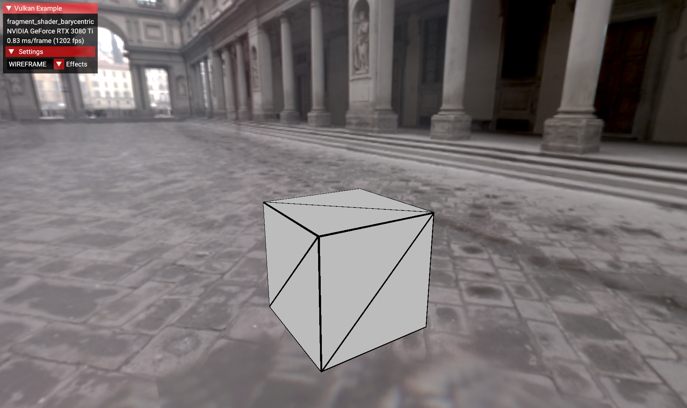

<!--
- Copyright (c) 2023, Mobica Limited
-
- SPDX-License-Identifier: Apache-2.0
-
- Licensed under the Apache License, Version 2.0 the "License";
- you may not use this file except in compliance with the License.
- You may obtain a copy of the License at
-
-     http://www.apache.org/licenses/LICENSE-2.0
-
- Unless required by applicable law or agreed to in writing, software
- distributed under the License is distributed on an "AS IS" BASIS,
- WITHOUT WARRANTIES OR CONDITIONS OF ANY KIND, either express or implied.
- See the License for the specific language governing permissions and
- limitations under the License.
-
-->

# Fragment shader barycentric



Fragment shader barycentric feature provides support for accessing the barycentric coordinates (linear and perspective) in the fragment shader and vertex attribute with the `pervertexEXT` decoration.

## Overview

The [VK_KHR_fragment_shader_barycentric](https://registry.khronos.org/vulkan/specs/1.3-extensions/man/html/VK_KHR_fragment_shader_barycentric.html) extension is based on [VK_NV_fragment_shader_barycentric](https://registry.khronos.org/vulkan/specs/1.3-extensions/man/html/VK_NV_fragment_shader_barycentric.html).

The extension provides access to additional built-in variables and decorations:

| Type              | GLSL                            | SPIR-V              |
|-------------------|---------------------------------|---------------------|
| built-in variable | in vec3 gl_BaryCoordEXT;        | BaryCoordKHR        |
| built-in variable | in vec3 gl_BaryCoordNoPerspEXT; | BaryCoordNoPerspKHR |
| decoration        | pervertexEXT                    | perVertexKHR        |

The built-in fragment shader input variables `gl_BaryCoordEXT` and `gl_BaryCoordNoPerspEXT` are three-component floating-point vectors that provide the barycentric coordinates for the fragment. The values for these built-ins are derived as described in [the Vulkan API Specifications](https://registry.khronos.org/vulkan/specs/1.3-extensions/html/vkspec.html#interfaces-builtin-variables).
The built-in variables hold barycentric weights for the fragment produced using:
- perspective interpolation: `gl_BaryCoordEXT`
- linear interpolation: `gl_BaryCoordNoPerspEXT`

The fragment shader inputs declared with the `pervertexEXT` decoration get the per-vertex values of the outputs from the previous shader stage declared with the same name. Such inputs must be declared as an array, because they have values for each vertex in the input primitive, e.g.

```
layout(location = 0) pervertexEXT in vec4 perVertexAttr[];
```

Each array element corresponds to one of the  vertices of the primitive that produced the fragment. The order of the vertices is defined in [the Vulkan API Specifications](https://registry.khronos.org/vulkan/specs/1.3-extensions/html/vkspec.html#primsrast-barycentric). Interpolated values are not available for inputs declared with the [`pervertexEXT`](https://registry.khronos.org/vulkan/specs/1.3-extensions/html/vkspec.html#shaders-interpolation-decorations-pervertexkhr).


The fragment shader barycentric sample demonstrates feature usage by applying different effects on a cube. The effects are implemented using the `pervertexEXT` decoration and built-in variables `gl_BaryCoordEXT` and `gl_BaryCoordNoPerspEXT`.

The following effects are available from the GUI:

- COLOR_INTERP - Demonstrates color interpolation using barycentric coordinates and information about color in vertices of the triangle (passed as `pervertexEXT` variable from the vertex shader).
- DIFF_PERSP_NOPERSP - Demonstrates the difference between barycentric perspective and non-perspective coordinates.
- WIREFRAME - Demonstrates rendering a wireframe using barycentric coordinates.
- INTERP_TO_MASS_CENTER - Demonstrates color interpolation to the triangle's center of mass using barycentric coordinates.
- BARYCOORD_TEXTURE - Demonstrates the modification of a texture using barycentric coordinates.

## Enabling the Extension

Enabling the fragment shader barycentric feature is done using the [`VkPhysicalDeviceFragmentShaderBarycentricFeaturesKHR`](https://registry.khronos.org/vulkan/specs/1.3-extensions/man/html/VkPhysicalDeviceFragmentShaderBarycentricFeaturesKHR.html) structure, where `fragmentShaderBarycentric` indicates barycentric support in fragment shaders. 
The structure should be passed to `vkGetPhysicalDeviceFeatures2` in the pNext member of the [`VkPhysicalDeviceFeatures2`](https://registry.khronos.org/vulkan/specs/1.3-extensions/man/html/VkPhysicalDeviceFeatures2.html) structure.


```C++
VkPhysicalDeviceFragmentShaderBarycentricFeaturesKHR requested_fragment_shader_barycentric_features
requested_fragment_shader_barycentric_features.sType = VK_STRUCTURE_TYPE_PHYSICAL_DEVICE_FRAGMENT_SHADER_BARYCENTRIC_FEATURES_KHR;
requested_fragment_shader_barycentric_features.fragmentShaderBarycentric = VK_TRUE;
```

In the sample it is done in the `FragmentShaderBarycentric::request_gpu_features` method using the template function `vkb::PhysicalDevice::request_extension_features` provided by the Vulkan-Samples framework.

## Shaders

### Vertex shader

In the vertex shader a variable `outColor` is declared. It is used in the fragment shader with the `pervertexEXT` decoration:

```GLSL
layout (location = 0) out vec3 outColor;
```

### Fragment shader

In the fragment shader the required feature is defined:

```GLSL
#extension GL_EXT_fragment_shader_barycentric : require
```

The color input variable is declared with the `pervertexEXT` decoration and as a matrix (it contains color for three vertices of the triangle for each processed fragment):

```GLSL
layout (location = 0) in pervertexEXT vec3 inColor[];
```

Depending on the effect chosen in the GUI `outColor` is calculated differently in the switch-case statement, e.g. for color interpolation using barycentric perspective coordinates:

```GLSL
outColor.rgb = inColor[0].rgb * gl_BaryCoordEXT.x +
	inColor[1].rgb * gl_BaryCoordEXT.y +
	inColor[2].rgb * gl_BaryCoordEXT.z;
```
