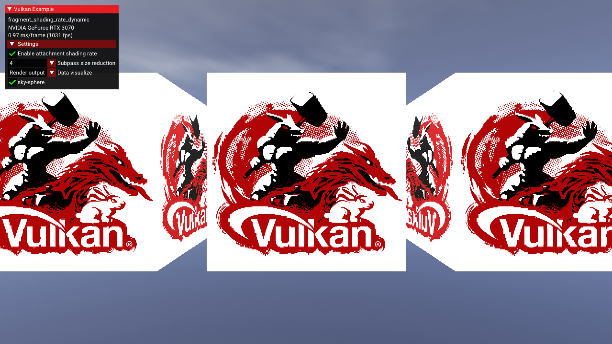
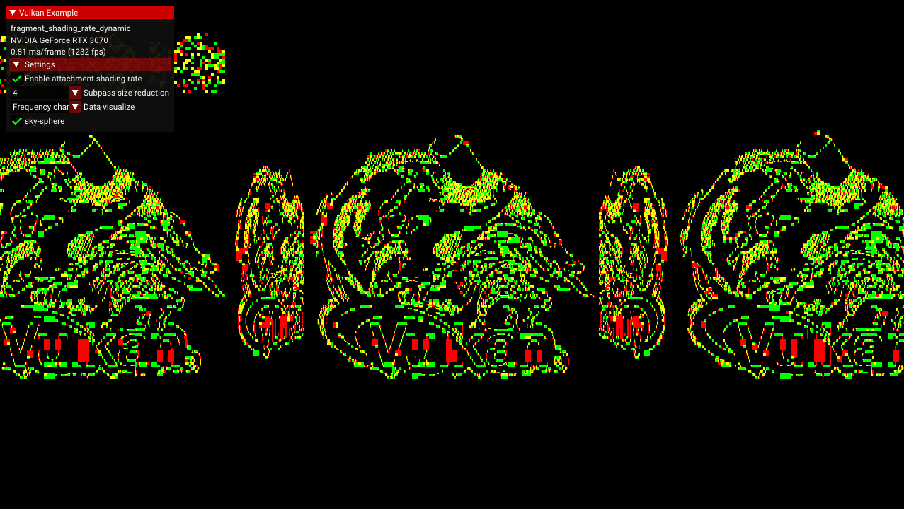
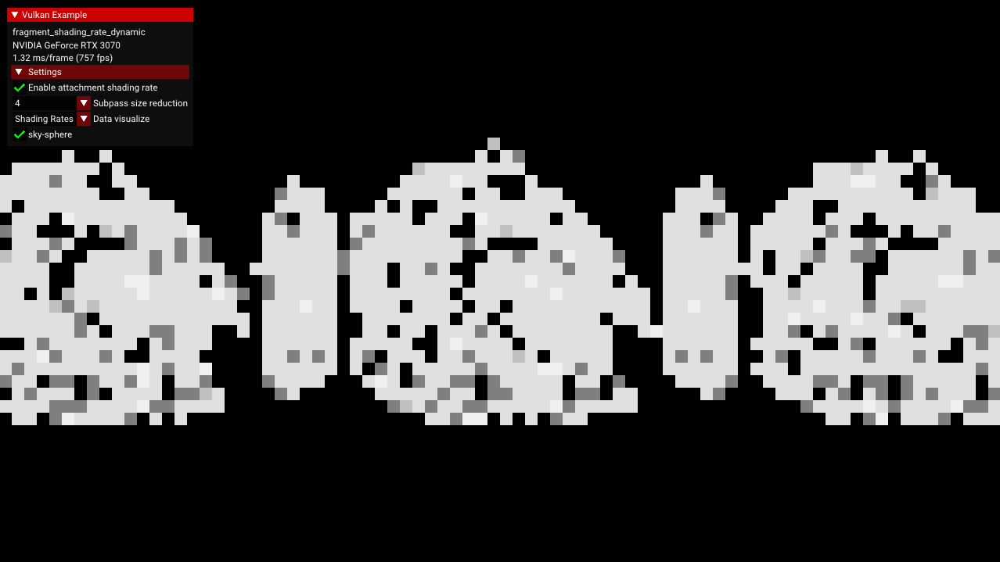
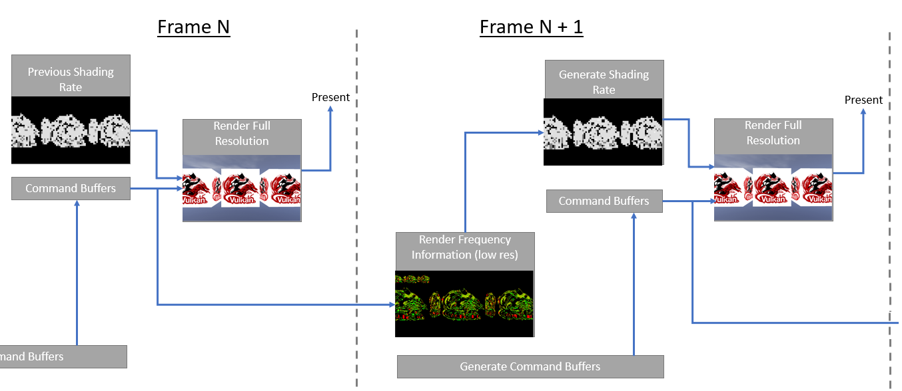

<!--
- Copyright (c) 2022, Holochip
-
- SPDX-License-Identifier: Apache-2.0
-
- Licensed under the Apache License, Version 2.0 the "License";
- you may not use this file except in compliance with the License.
- You may obtain a copy of the License at
-
-     http://www.apache.org/licenses/LICENSE-2.0
-
- Unless required by applicable law or agreed to in writing, software
- distributed under the License is distributed on an "AS IS" BASIS,
- WITHOUT WARRANTIES OR CONDITIONS OF ANY KIND, either express or implied.
- See the License for the specific language governing permissions and
- limitations under the License.
-
-->

## Fragment Shading Rate

The KHR fragment shading rate extension introduces the ability to selectively render at different sample rates within
the same rendered image. This can be useful when rendering at very high resolutions or when the frequency content is not
evenly spread through the rendered image. This tutorial demonstrates one way of controlling that sample rate by
estimating the frequency content of each pixel of the rendered image.

The fragment shading rate extension can be enabled through
the [`VK_KHR_fragment_shading_rate`](https://www.khronos.org/registry/vulkan/specs/1.2-extensions/man/html/VK_KHR_fragment_shading_rate.html)
device extension and
the [`VkPhysicalDeviceFragmentShadingRateFeaturesKHR`](https://www.khronos.org/registry/vulkan/specs/1.2-extensions/man/html/VkPhysicalDeviceFragmentShadingRateFeaturesKHR.html)
device features. This sample demonstrates the attachment capability, in which the render pass directly references the
shading rate image through
a [`VkFragmentShadingRateAttachmentInfoKHR`](https://www.khronos.org/registry/vulkan/specs/1.2-extensions/man/html/VkFragmentShadingRateAttachmentInfoKHR.html)
struct attached to the `.pNext` of a sub-pass.

The image below shows the scene from this sample. Note the areas of high image variation in the center of each cube face, and the areas of low image variation in the sky and plain corners of each cube face.



## Shading Rate Image

When used as an attachment, each pixel within the shading rate image controls a "texel", or fixed region within the
output image, specified by `shadingRateAttachmentTexelSize`. For example, each pixel in the shading rate image might
control the shading rate of a 4x4 texel within the rendered image, since all output pixels of the texel are shaded at
the same rate, the shading rate image has a lower resolution. The number and type of possible shading rates is
controlled by the device and can be queried through
the [`vkGetPhysicalDeviceFragmentShadingRatesKHR`](https://www.khronos.org/registry/vulkan/specs/1.2-extensions/man/html/vkGetPhysicalDeviceFragmentShadingRatesKHR.html)
function, and may include shading rates that vary in both the x- and y-directions, for instance 1x2 or 4x2 pixel texels.
These supported shading rate values are provided to the "compute shader" when determining the optimal shading rate.

This sample demonstrates how to use a dynamic shading rate that responds to the frequency content of the image. To
achieve this, an attachment is added to the fragment shader at `location=1`, where the x- and y- derivatives are
estimated using the `dFdx` and `dFdy` functions. A separate compute shader then processes all the pixels within the
texel of the derivative image to determine the new fragment shading rate for the next image: texels with higher squared
derivatives calculated using `dFdx` and `dFdy` will be afforded a higher shading rate during the next frame compared to
texels with lower derivatives.

The frequency information is visualized below and can be accessed by selecting "Frequency" in the data visualization dropdown in the sample GUI.



## Encoding the Shading Rate

Shading rates are encoded using 8-bit unsigned integers. For instance, the lowest shading rate of a 4x4 texel is given
by: `(4>>1) | (4<<1)`, and the general case of a `rate_x` x `rate_y` texel is `(rate_x>>1)|(rate_y<<1)`. Although
devices vary in their supported texel sizes, the maximum texel size is guaranteed to be no larger than 4x4.

The image below shows the shading rate image, where lighter colors indicate areas that will have a high sample density. This visualization can be selected by choosing the "Shading Rates" dropdown selection in the sample GUI.



## Implementation Details

This sample introduces a separate compute pipeline and several images to achieve dynamic shading rate:

1. `shading_rate_image`, the input image to the fragment shader to control shading rate,
2. `frequency_content_image`, the output attachment from the fragment shader to record the derivatives at each pixel,
3. `shading_rate_image_compute`, the output image from the "compute shader"

The `frequency_content_image` has type `vec2` to store the squared x- and y-derivatives, which are used by the "compute
shader" to estimate the desired shading rate. Once the desired shading rate is estimated, the "compute shader" iterates
through the supported shading rates to find the one closest to the desired. This is converted to the 8-bit
representation of the format of the shading rate image:

```
uint rate_code = uint(optimal_rate_x >> 1) | (optimal_rate_y << 1);
```

This rate code is placed into `shading_rate_image_compute`.

Because of the device format requirements of the fragment shading rate extension (and the incompatibility of usage
flags), the `shading_rate_image` and `shading_rate_image_compute` images are separate and have different usage
flags: `VK_IMAGE_USAGE_FRAGMENT_SHADING_RATE_ATTACHMENT_BIT_KHR` for the shading rate attachment image
and `VK_IMAGE_USAGE_STORAGE_BIT` for the "compute" image (in addition to transfer bits). However, their content is
identical, and after the "compute shader" has completed, the contents from `shading_rate_image_compute` are copied
to `shading_rate_image`.

## Calculating Frequency Information in a Separate Renderpass



One problem with calculating the frequency information during the render pass is that each frame is using the previous
frame's shading rate, which results in a feedback loop that lead to unstable or "stutter" in the calculated frequency information.
To prevent this problem, this sample introduces a separate renderpass that calculates the frequency information without using the shading
rate attachment. To maintain performance, this renderpass is performed at a lower resolution controllable by the "Subpass size reduction"
option in the sample GUI. In production systems, MSAA can also be disabled.

For instance, at a 4x4 reduction with MSAA disabled, the frequency information calculation is performed over only 1/128 as many samples
as the full resolution with 8 MSAA samples. If the resulting shading rate image is used to reduce the full-resolution samples by half, then 
the total sample reduction is still greater than 40%.
