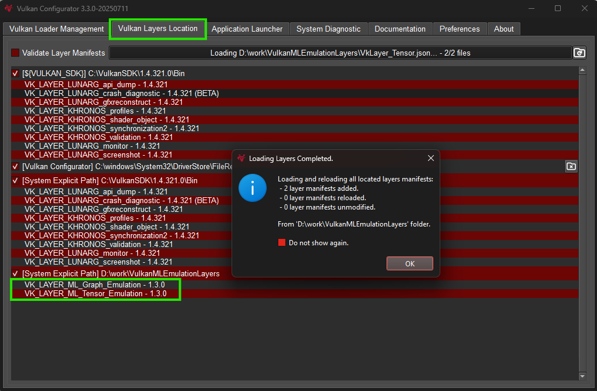
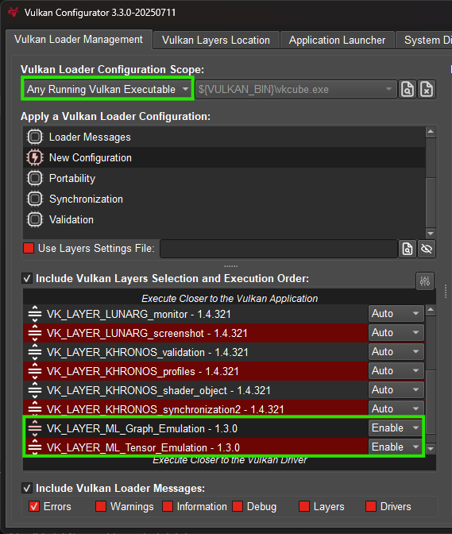

////
- Copyright (c) 2024-2025, Arm Limited and Contributors
-
- SPDX-License-Identifier: Apache-2.0
-
- Licensed under the Apache License, Version 2.0 the "License";
- you may not use this file except in compliance with the License.
- You may obtain a copy of the License at
-
-     http://www.apache.org/licenses/LICENSE-2.0
-
- Unless required by applicable law or agreed to in writing, software
- distributed under the License is distributed on an "AS IS" BASIS,
- WITHOUT WARRANTIES OR CONDITIONS OF ANY KIND, either express or implied.
- See the License for the specific language governing permissions and
- limitations under the License.
-
////

= Graph Pipelines

== Overview

These samples demonstrate the use of the *VK_ARM_tensors* and *VK_ARM_data_graph* extensions. The *VK_ARM_data_graph* extension introduces graph pipelines, which are used in all samples. A graph pipeline is a new Vulkan pipeline type designed to execute dataflow graphs described using SPIR-V modules. Similar to compute pipelines, they use descriptor sets to access external resources, are compiled at creation time, and support pipeline caching and offline binaries.

Graph pipelines integrate naturally into the existing Vulkan ecosystem, leveraging familiar SPIR-V tooling and workflows, and are especially well-suited for machine learning workloads as a drop-in replacement for sequences of compute pipelines.

To demonstrate their use, we’ve added graph pipeline-based samples that walk through setting up a graph pipeline and executing simple neural networks. These examples cover key features such as using graph constants, writing SPIR-V code, creating tensors, feeding in compute shaders as inputs, and aliasing memory to avoid unnecessary copying.

See:

* link:hello_graph_pipeline/README.adoc[Hello graph pipeline]

== Setup

Some setup steps are needed before you can build and run these samples.

[tab#tab1, title="1. Enable the emulation layers (Graph & Tensor)"]
--

Install and enable link:https://github.com/arm/ai-ml-emulation-layer-for-vulkan[ML Emulation Layer for Vulkan] from GitHub. The installation guide explains how to build and enable the emulation layers on various platforms.

Alternatively, on Windows, the Vulkan Configurator tool — which is part of Vulkan SDK — can also be used, as described below. If it is not already installed, it can be obtained from the link:https://vulkan.lunarg.com/[Vulkan SDK] website. The installation is straightforward.

Open Vulkan Configurator and navigate to the Vulkan Layers Location tab. Click the plus (+) symbol to append a user-defined layers path,
and navigate to the VulkanMLEmulationLayer folder. Click Select Folder. A green bar should appear, indicating that the layers have been successfully added.

This should add the layers to the Vulkan Loader Management tab. The Graph layer needs to sit on top of the Tensor layers for things to work.

IMPORTANT: Make sure you keep the Vulkan Configurator running while developing with these Vulkan layers.

NOTE: It is advised to use the latest Vulkan SDK version. The samples have been tested and confirmed to work with SDK version 1.4.321.
--

[tab#tab2, title="2. Finally, the user needs to build the ML extensions for Vulkan Examples from the root of the project and execute the sample"]

See xref:./../../../docs/build.adoc#windows[Build with CMake for Windows] and xref:./../../../docs/build.adoc#linux,[Build with CMake for Linux] for how to build with CMake.
