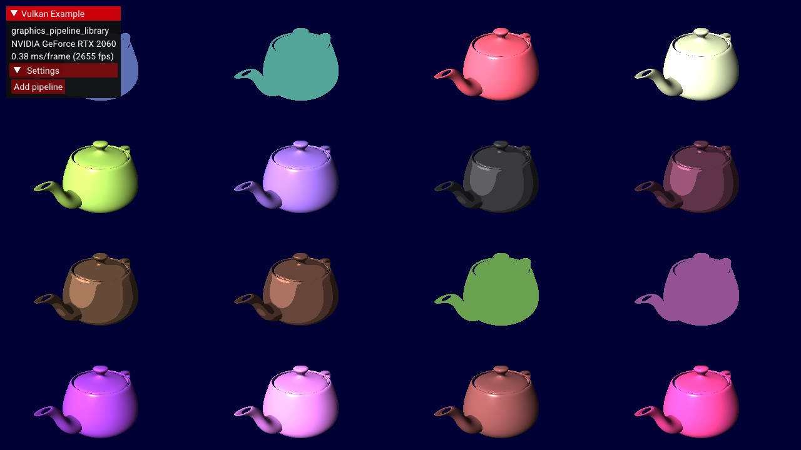

////
- Copyright (c) 2022-2023, Sascha Willems
-
- SPDX-License-Identifier: Apache-2.0
-
- Licensed under the Apache License, Version 2.0 the "License";
- you may not use this file except in compliance with the License.
- You may obtain a copy of the License at
-
-     http://www.apache.org/licenses/LICENSE-2.0
-
- Unless required by applicable law or agreed to in writing, software
- distributed under the License is distributed on an "AS IS" BASIS,
- WITHOUT WARRANTIES OR CONDITIONS OF ANY KIND, either express or implied.
- See the License for the specific language governing permissions and
- limitations under the License.
-
////
= Graphics pipeline libraries

ifdef::site-gen-antora[]
TIP: The source for this sample can be found in the https://github.com/KhronosGroup/Vulkan-Samples/tree/main/samples/extensions/graphics_pipeline_library[Khronos Vulkan samples github repository].
endif::[]

== Overview

The https://www.khronos.org/registry/vulkan/specs/1.3-extensions/man/html/VK_EXT_graphics_pipeline_library.html[`VK_EXT_graphics_pipeline_library`] extensions allows separate compilation of different parts of the graphics pipeline.
With this it's now possible to split up the monolithic pipeline creation into different steps and re-use common parts shared across different pipelines.

Compared to monolithic pipeline state, this results in faster pipeline creation times, making this extension a good fit for applications and games that do a lot of pipeline creation at runtime.

== Individual pipeline states

As noted above, the monolithic pipeline state has been split into distinct parts that can be compiled independently:

* https://www.khronos.org/registry/vulkan/specs/1.3-extensions/html/vkspec.html#pipeline-graphics-subsets-vertex-input[Vertex Input Interface]
* https://www.khronos.org/registry/vulkan/specs/1.3-extensions/html/vkspec.html#pipeline-graphics-subsets-pre-rasterization[Pre-Rasterization Shaders]
* https://www.khronos.org/registry/vulkan/specs/1.3-extensions/html/vkspec.html#pipeline-graphics-subsets-fragment-shader[Fragment Shader]
* https://www.khronos.org/registry/vulkan/specs/1.3-extensions/html/vkspec.html#pipeline-graphics-subsets-fragment-output[Fragment Output Interface]

== Creating pipeline libraries

Creating a pipeline library (part) is similar to creating a pipeline, with the difference that you only need to specify the properties required for that specific pipeline state (see above).
E.g.
for the vertex input interface you only specify input assembly and vertex input state, which is all required to define the interfaces to a vertex shader.

[,cpp]
----
VkGraphicsPipelineLibraryCreateInfoEXT library_info{};
library_info.sType = VK_STRUCTURE_TYPE_GRAPHICS_PIPELINE_LIBRARY_CREATE_INFO_EXT;
library_info.flags = VK_GRAPHICS_PIPELINE_LIBRARY_VERTEX_INPUT_INTERFACE_BIT_EXT;

VkPipelineInputAssemblyStateCreateInfo       input_assembly_state  = vkb::initializers::pipeline_input_assembly_state_create_info(VK_PRIMITIVE_TOPOLOGY_TRIANGLE_LIST, 0, VK_FALSE);
VkPipelineVertexInputStateCreateInfo         vertex_input_state    = vkb::initializers::pipeline_vertex_input_state_create_info();
std::vector<VkVertexInputBindingDescription> vertex_input_bindings = {
    vkb::initializers::vertex_input_binding_description(0, sizeof(Vertex), VK_VERTEX_INPUT_RATE_VERTEX),
};
std::vector<VkVertexInputAttributeDescription> vertex_input_attributes = {
    vkb::initializers::vertex_input_attribute_description(0, 0, VK_FORMAT_R32G32B32_SFLOAT, 0),
    vkb::initializers::vertex_input_attribute_description(0, 1, VK_FORMAT_R32G32B32_SFLOAT, sizeof(float) * 3),
    vkb::initializers::vertex_input_attribute_description(0, 2, VK_FORMAT_R32G32_SFLOAT, sizeof(float) * 6),
};
vertex_input_state.vertexBindingDescriptionCount   = static_cast<uint32_t>(vertex_input_bindings.size());
vertex_input_state.pVertexBindingDescriptions      = vertex_input_bindings.data();
vertex_input_state.vertexAttributeDescriptionCount = static_cast<uint32_t>(vertex_input_attributes.size());
vertex_input_state.pVertexAttributeDescriptions    = vertex_input_attributes.data();

VkGraphicsPipelineCreateInfo pipeline_library_create_info{};
pipeline_library_create_info.sType               = VK_STRUCTURE_TYPE_GRAPHICS_PIPELINE_CREATE_INFO;
pipeline_library_create_info.flags               = VK_PIPELINE_CREATE_LIBRARY_BIT_KHR | VK_PIPELINE_CREATE_RETAIN_LINK_TIME_OPTIMIZATION_INFO_BIT_EXT;
pipeline_library_create_info.sType               = VK_STRUCTURE_TYPE_GRAPHICS_PIPELINE_CREATE_INFO;
pipeline_library_create_info.pNext               = &library_info;
pipeline_library_create_info.pInputAssemblyState = &input_assembly_state;
pipeline_library_create_info.pVertexInputState   = &vertex_input_state;

vkCreateGraphicsPipelines(get_device().get_handle(), pipeline_cache, 1, &pipeline_library_create_info, nullptr, &pipeline_library.vertex_input_interface);
----

== Deprecating shader modules

With this extension, creating shader modules with `vkCreateShaderModule` has been deprecated and you can instead just pass the shader module create info via `pNext` into your pipeline shader stage create info.
This change bypasses a useless copy and is recommended:

[,cpp]
----
VkShaderModuleCreateInfo shader_module_create_info{};
shader_module_create_info.sType    = VK_STRUCTURE_TYPE_SHADER_MODULE_CREATE_INFO;
shader_module_create_info.codeSize = static_cast<uint32_t>(spirv.size()) * sizeof(uint32_t);
shader_module_create_info.pCode    = spirv.data();

VkPipelineShaderStageCreateInfo shader_Stage_create_info{};
shader_Stage_create_info.sType = VK_STRUCTURE_TYPE_PIPELINE_SHADER_STAGE_CREATE_INFO;
// Chain the shader module create info
shader_Stage_create_info.pNext = &shader_module_create_info;
shader_Stage_create_info.stage = VK_SHADER_STAGE_VERTEX_BIT;
shader_Stage_create_info.pName = "main";

VkGraphicsPipelineCreateInfo pipeline_library_create_info{};
pipeline_library_create_info.stageCount = 1;
pipeline_library_create_info.pStages    = &shader_Stage_create_info;
----

You can see this in the pre-rasterization and fragment shader library setup parts of the sample.

== Linking executables

Once all pipeline (library) parts have been created, the pipeline executable can be linked together from them:

[,cpp]
----
std::vector<VkPipeline> libraries = {
    pipeline_library.vertex_input_interface,
    pipeline_library.pre_rasterization_shaders,
    fragment_shader,
    pipeline_library.fragment_output_interface
};

// Link the library parts into a graphics pipeline
VkPipelineLibraryCreateInfoKHR linking_info{};
linking_info.sType        = VK_STRUCTURE_TYPE_PIPELINE_LIBRARY_CREATE_INFO_KHR;
linking_info.libraryCount = static_cast<uint32_t>(libraries.size());
linking_info.pLibraries   = libraries.data();

VkGraphicsPipelineCreateInfo executable_pipeline_create_info{};
executable_pipeline_create_info.sType = VK_STRUCTURE_TYPE_GRAPHICS_PIPELINE_CREATE_INFO;
executable_pipeline_create_info.pNext = &linking_info;
executable_pipeline_create_info.flags = VK_PIPELINE_CREATE_LINK_TIME_OPTIMIZATION_BIT_EXT;

VkPipeline executable = VK_NULL_HANDLE;
vkCreateGraphicsPipelines(get_device().get_handle(), thread_pipeline_cache, 1, &executable_pipeline_create_info, nullptr, &executable);
----

This will result in the pipeline state object to be used at draw time.

A note on `VK_PIPELINE_CREATE_LINK_TIME_OPTIMIZATION_BIT_EXT`: This is an optimization flag.
If specified, implementations are allowed to do additional optimization passes.
This may increase build times but can in turn result in lower runtime costs.

== The sample

This sample demonstrates that functionality by creating the shared vertex input interface, pre-rasterization shader state and fragment output interface parts only once up-front, and then re-uses them to create pipelines with customized fragment shaders using random lighting models at runtime.
Pipelines are created in a background thread and once they're created, command buffers are updated to display a mesh using the new pipeline.

== Additional resources

* https://www.khronos.org/blog/reducing-draw-time-hitching-with-vk-ext-graphics-pipeline-library[Reducing Draw Time Hitching with VK_EXT_graphics_pipeline_library]
* https://github.com/KhronosGroup/Vulkan-Docs/blob/main/proposals/VK_EXT_graphics_pipeline_library.adoc[Extension proposal]

== Conclusion

With the new extension it's now possible to separate the monolithic pipeline state into multiple parts that can be reused  and built independently.
This opens up new possibilities for optimizing pipeline creation and reducing hitches at runtime.
