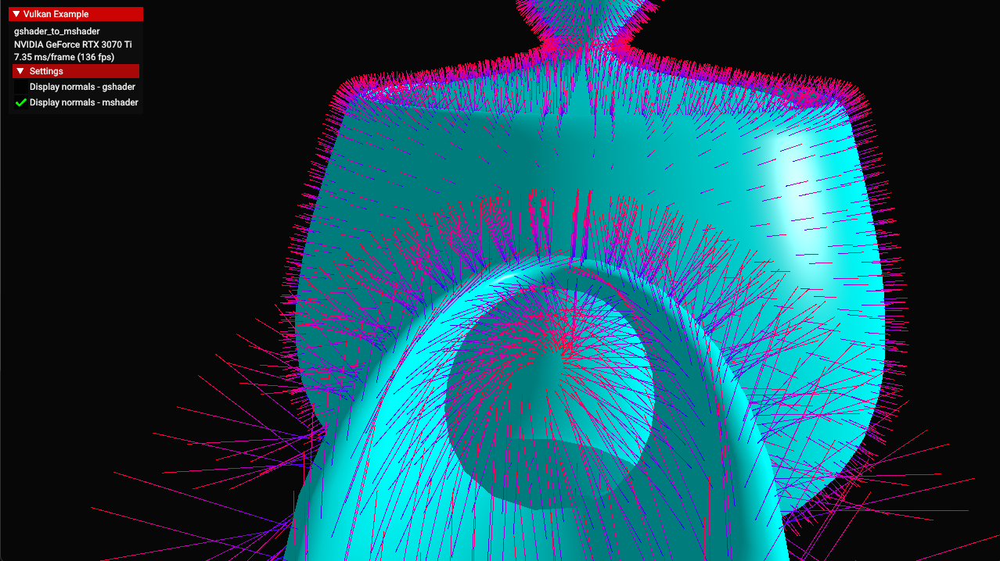

////
- Copyright (c) 2023, Mobica Limited
-
- SPDX-License-Identifier: Apache-2.0
-
- Licensed under the Apache License, Version 2.0 the "License";
- you may not use this file except in compliance with the License.
- You may obtain a copy of the License at
-
-     http://www.apache.org/licenses/LICENSE-2.0
-
- Unless required by applicable law or agreed to in writing, software
- distributed under the License is distributed on an "AS IS" BASIS,
- WITHOUT WARRANTIES OR CONDITIONS OF ANY KIND, either express or implied.
- See the License for the specific language governing permissions and
- limitations under the License.
-
////
= Geometry shader to mesh shader

== Overview

This sample demonstrates how a mesh shader can be used to achieve the same results as with geometry shader.
It contains geometry and mesh shader pipelines visualizing normals in the teapot model.

== Meshlets

To access model vertices from within mesh shader it needs to be stored within an **S**hader **S**torage **B**uffer **O**bject (SSBO).
Indices need to be divided into meshlets and also stored within an SSBO so each work item can work on a single meshlet.
Meshlets are created by spliting source geometry.
Exemplary meshlet structure used in this sample:

[,C++]
----
struct Meshlet
{
	uint32_t vertices[64];
	uint32_t indices[126];
	uint32_t vertex_count;
	uint32_t index_count;
};
----

By linearly scanning the indices of the model, Meshlet-structures are created with up to 126 indices or 64 unique vertex indices, whatever is reached first.
See prepare_meshlets() for an exemplary implementation.

This sample expands function `load_model()` by adding a bool storage_buffer parameter, set to false by default.
In that function model data is read from the file teapot.gltf.
By setting storage_buffer to true, vertex position and normals are stored in an SSBO using the `AlignedVertex` structure (because of std430 memory layout).
After that, indices are divided into meshlets using the `Meshlet` structure and also stored in SSBOs.

== Enabling the Extension

The device extension is provided by `VK_EXT_MESH_SHADER_EXTENSION_NAME`.
It requires `VK_KHR_SPIRV_1_4_EXTENSION_NAME`, which in turn require VulkanAPI 1.1 and `VK_KHR_SHADER_FLOAT_CONTROLS_EXTENSION_NAME`.
SPIRV needs to be set to 1.4.

[,C++]
----
set_api_version(VK_API_VERSION_1_1);
add_device_extension(VK_EXT_MESH_SHADER_EXTENSION_NAME);
add_device_extension(VK_KHR_SPIRV_1_4_EXTENSION_NAME);
add_device_extension(VK_KHR_SHADER_FLOAT_CONTROLS_EXTENSION_NAME);
vkb::GLSLCompiler::set_target_environment(glslang::EShTargetSpv, glslang::EShTargetSpv_1_4);
----

The `VkPhysicalDeviceMeshShaderFeaturesEXT` structure needs to be included in the pNext chain of the `VkPhysicalDeviceFeatures2` structure passed to vkGetPhysicalDeviceFeatures2

[,C++]
----
auto &requested_vertex_input_features      = gpu.request_extension_features<VkPhysicalDeviceMeshShaderFeaturesEXT>(VK_STRUCTURE_TYPE_PHYSICAL_DEVICE_MESH_SHADER_FEATURES_EXT);
requested_vertex_input_features.meshShader = VK_TRUE;
----

== Pros and cons

Usage of geometry shader is usually not advised for real-time rendering purposes as it leads to high memory bandwith and reduced performance.
On the other hand it is part of traditional pipeline and doesn't require additional pre-procesing of source geometry opposite to mesh shader.

Mesh shader offers better performance and is more flexible in it potential usage but in case of working with a source geometry pre-processing is needed (meshlets).
