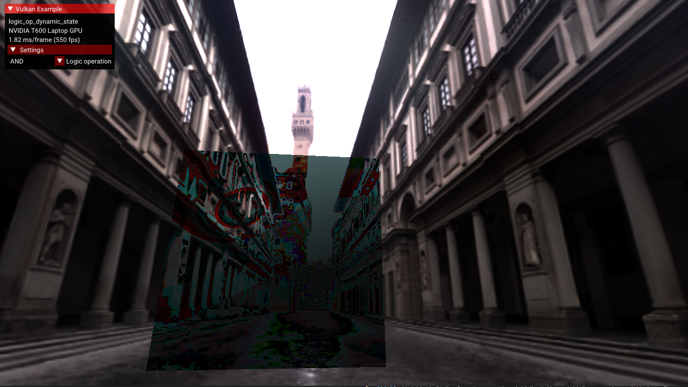

////
- Copyright (c) 2023, Mobica Limited
-
- SPDX-License-Identifier: Apache-2.0
-
- Licensed under the Apache License, Version 2.0 the "License";
- you may not use this file except in compliance with the License.
- You may obtain a copy of the License at
-
-     http://www.apache.org/licenses/LICENSE-2.0
-
- Unless required by applicable law or agreed to in writing, software
- distributed under the License is distributed on an "AS IS" BASIS,
- WITHOUT WARRANTIES OR CONDITIONS OF ANY KIND, either express or implied.
- See the License for the specific language governing permissions and
- limitations under the License.
-
////
= Logic operations dynamic state

== Overview

The https://registry.khronos.org/vulkan/specs/1.3-extensions/man/html/VK_EXT_extended_dynamic_state2.html[VK_EXT_extended_dynamic_state2] extension allows to use dynamic states e.g.
the VK_DYNAMIC_STATE_LOGIC_OP_EXT.
This may help an application to change a logical operation used without creating a new pipeline.

The sample demonstrates usage of this extension with dynamically changed logical operations applied to blending.

== Surface format setting

Logical operations are applied only for https://registry.khronos.org/vulkan/specs/1.3-extensions/html/vkspec.html#framebuffer-logicop[signed and unsigned integer and normalized integer framebuffers].

In the sample the surface format is changed to `VK_FORMAT_B8G8R8A8_UNORM` by overriding the virtual method `create_render_context` (derived from `ApiVulkanSample` class).

[,C++]
----
auto surface_priority_list = std::vector<VkSurfaceFormatKHR>{
    {VK_FORMAT_B8G8R8A8_UNORM, VK_COLORSPACE_SRGB_NONLINEAR_KHR},
};
render_context = platform.create_render_context(*device.get(), surface, surface_priority_list);
----

== Enabling logical operations in pipeline creation

In the sample two pipelines are created:

* a pipeline for a background model (the background pipeline);
* a pipeline for a cube model (the baseline pipeline).

The cube model is used to present blending effect achieved using the dynamic logical operations.

The `logicOpEnable` member of the `VkPipelineColorBlendStateCreateInfo` structure https://registry.khronos.org/vulkan/specs/1.3-extensions/man/html/VkPipelineColorBlendStateCreateInfo.html[controls if logical operations should be applied].

The `logicOpEnable` member is set to `VK_TRUE` during creation of the baseline pipeline in the `create_pipeline` method.

[,C++]
----
VkPipelineColorBlendStateCreateInfo color_blend_state =
    vkb::initializers::pipeline_color_blend_state_create_info(1, &blend_attachment_state);

/* Enable logic operations */
color_blend_state.logicOpEnable = VK_TRUE;
----

In the same method `VK_DYNAMIC_STATE_LOGIC_OP_EXT` is added to the vector of `VkDynamicState` (used to define pipeline dynamic state in https://registry.khronos.org/vulkan/specs/1.3-extensions/man/html/VkPipelineDynamicStateCreateInfo.html[`VkPipelineDynamicStateCreateInfo`]).

[,C++]
----
std::vector<VkDynamicState> dynamic_state_enables = {
	VK_DYNAMIC_STATE_VIEWPORT,
	VK_DYNAMIC_STATE_SCISSOR,
	VK_DYNAMIC_STATE_LOGIC_OP_EXT,
};
VkPipelineDynamicStateCreateInfo dynamic_state =
	vkb::initializers::pipeline_dynamic_state_create_info(
	    dynamic_state_enables.data(),
	    static_cast<uint32_t>(dynamic_state_enables.size()),
	    0);
----

Both structures: `color_blend_state` and `dynamic_state` are used to define https://registry.khronos.org/vulkan/specs/1.3-extensions/man/html/VkGraphicsPipelineCreateInfo.html[`VkGraphicsPipelineCreateInfo`] needed to create the graphics pipeline.

[,C++]
----
VkGraphicsPipelineCreateInfo graphics_create{VK_STRUCTURE_TYPE_GRAPHICS_PIPELINE_CREATE_INFO};
graphics_create.pColorBlendState    = &color_blend_state;
graphics_create.pDynamicState       = &dynamic_state;
...

VK_CHECK(vkCreateGraphicsPipelines(get_device().get_handle(), pipeline_cache, 1, &graphics_create, VK_NULL_HANDLE, &pipeline.baseline));
----

Logical operations are not enabled in the background pipeline.

[,C++]
----
std::vector<VkDynamicState> dynamic_state_enables_background = {
    VK_DYNAMIC_STATE_VIEWPORT,
    VK_DYNAMIC_STATE_SCISSOR,
};

/* Disable logic operations in background pipeline */
color_blend_state.logicOpEnable = VK_FALSE;
----

== Logical operation dynamic setting in command buffer creation

Calling https://registry.khronos.org/vulkan/specs/1.3-extensions/man/html/vkCmdSetLogicOpEXT.html[`vkCmdSetLogicOpEXT`] allows to set the logic operation dynamically.
In the sample it is called before drawing the model in the `build_command_buffers` method using a value provided by the GUI.
Available logical operations are defined by the `VkLogicOp` enumeration (check the Vulkan specification for details of https://registry.khronos.org/vulkan/specs/1.3-extensions/html/vkspec.html#VkLogicOp[the logical operations]).
The background model is drawn before the cube model (with logical operations enabled) to observe blending results on the cube model.

[,C++]
----
VK_CHECK(vkBeginCommandBuffer(draw_cmd_buffer, &command_begin));
...

/* Drawing background */
draw_model(background_model, draw_cmd_buffer);
...

/* Set logic operation chosen in GUI for the cube model */
vkCmdSetLogicOpEXT(draw_cmd_buffer, static_cast<VkLogicOp>(gui_settings.selected_operation));

/* Draw model */
draw_created_model(draw_cmd_buffer);
...

VK_CHECK(vkEndCommandBuffer(draw_cmd_buffer));
----

== Enabling the required extensions

The extended dynamic state 2 API requires Vulkan 1.0 and the appropriate headers / SDK is required.
This extension has been https://registry.khronos.org/vulkan/specs/1.3-extensions/man/html/VK_EXT_extended_dynamic_state2.html#_promotion_to_vulkan_1_3[partially] promoted to Vulkan 1.3.

The device extension `VK_EXT_EXTENDED_DYNAMIC_STATE_2_EXTENSION_NAME` requires  `VK_KHR_GET_PHYSICAL_DEVICE_PROPERTIES_2_EXTENSION_NAME` instance extension to be enabled.

[,C++]
----
add_instance_extension(VK_KHR_GET_PHYSICAL_DEVICE_PROPERTIES_2_EXTENSION_NAME);
add_device_extension(VK_EXT_EXTENDED_DYNAMIC_STATE_2_EXTENSION_NAME);
----

Enabling extension features is done using `VkPhysicalDeviceExtendedDynamicState2FeaturesEXT` and `VkPhysicalDeviceExtendedDynamicStateFeaturesEXT` structures.

[,C++]
----
typedef struct VkPhysicalDeviceExtendedDynamicState2FeaturesEXT {
    VkStructureType    sType;
    void*              pNext;
    VkBool32           extendedDynamicState2;
    VkBool32           extendedDynamicState2LogicOp;
    VkBool32           extendedDynamicState2PatchControlPoints;
} VkPhysicalD

typedef struct VkPhysicalDeviceExtendedDynamicStateFeaturesEXT {
    VkStructureType    sType;
    void*              pNext;
    VkBool32           extendedDynamicState;
} VkPhysicalDeviceExtendedDynamicStateFeaturesEXT;
----

In the sample it is implemented in the `request_gpu_features` method.

[,C++]
----
auto &requested_extended_dynamic_state2_features =
	gpu.request_extension_features<VkPhysicalDeviceExtendedDynamicState2FeaturesEXT>(VK_STRUCTURE_TYPE_PHYSICAL_DEVICE_EXTENDED_DYNAMIC_STATE_2_FEATURES_EXT);
requested_extended_dynamic_state2_features.extendedDynamicState2        = VK_TRUE;
requested_extended_dynamic_state2_features.extendedDynamicState2LogicOp = VK_TRUE;

auto &requested_extended_dynamic_state_feature =
	gpu.request_extension_features<VkPhysicalDeviceExtendedDynamicStateFeaturesEXT>(VK_STRUCTURE_TYPE_PHYSICAL_DEVICE_EXTENDED_DYNAMIC_STATE_FEATURES_EXT);
requested_extended_dynamic_state_feature.extendedDynamicState = VK_TRUE;
----
