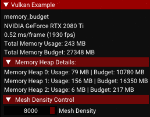

<!--
- Copyright (c) 2022, Holochip Corporation
-
- SPDX-License-Identifier: Apache-2.0
-
- Licensed under the Apache License, Version 2.0 the "License";
- you may not use this file except in compliance with the License.
- You may obtain a copy of the License at
-
-     http://www.apache.org/licenses/LICENSE-2.0
-
- Unless required by applicable law or agreed to in writing, software
- distributed under the License is distributed on an "AS IS" BASIS,
- WITHOUT WARRANTIES OR CONDITIONS OF ANY KIND, either express or implied.
- See the License for the specific language governing permissions and
- limitations under the License.
-
-->

# Memory Budget: Extended features

This sample demonstrates how to incorporate Vulkan memory budget extension.

## Memory budget extension

In order to enable usage of memory budget extension features, an instance extension and a device extension were
introduced in the constructor of the ```MemoryBudget``` class, where:

````cpp
add_instance_extension(VK_KHR_GET_PHYSICAL_DEVICE_PROPERTIES_2_EXTENSION_NAME);
add_device_extension(VK_EXT_MEMORY_BUDGET_EXTENSION_NAME);
````

Memory properties related structure instances were defined and initialized in the header of ```MemoryBudget``` class,
listed as follows:

````cpp
VkPhysicalDeviceMemoryBudgetPropertiesEXT physical_device_memory_budget_properties{};
VkPhysicalDeviceMemoryProperties2 device_memory_properties{};
````

Where, the ```sType``` and ```pNext``` variables were defined inside the ```initialize_device_memory_properties()```
function, such that:

````cpp
void MemoryBudget::initialize_device_memory_properties()
{
	// Initialize physical device memory budget properties structures variables
	physical_device_memory_budget_properties.sType = VK_STRUCTURE_TYPE_PHYSICAL_DEVICE_MEMORY_BUDGET_PROPERTIES_EXT;
	physical_device_memory_budget_properties.pNext = nullptr;
	// Initialize physical device memory properties structure variables
	device_memory_properties.sType = VK_STRUCTURE_TYPE_PHYSICAL_DEVICE_MEMORY_PROPERTIES_2;
	device_memory_properties.pNext = &physical_device_memory_budget_properties;
}
````

The ```sType``` of ```device_memory_properties``` is defined
as ```VK_STRUCTURE_TYPE_PHYSICAL_DEVICE_MEMORY_PROPERTIES_2```, and its ```pNext``` chained in a pointer of the
structure instance ```physical_device_memory_budget_properties```. Where, the ```sType```
of ```physical_device_memory_budget_properties``` is defined
as ```VK_STRUCTURE_TYPE_PHYSICAL_DEVICE_MEMORY_BUDGET_PROPERTIES_EXT``` and its ```pNext``` is defined as
a ```nullptr```.

Each of the mentioned extension structure instances were defined in the header and initialized in
function ```initialize_device_memory_properties()```.

## UI Overlay: Memory properties

In application’s UI overlay, total memory usage and total memory budget will be displayed. In addition, by pressing down
the arrow next to the “Memory Heap Details” tab, it expands a list of all memory usages and budgets from the heap count.
And all memory properties were converted and displayed in units of Megabytes (MB).

Application UI overlay:



In addition, total number of instanced meshes can be adjusted under UI overlay. Under ```Mesh Density Control``` tab. By
pressing down the arrow next to the text, ```Mesh Density``` slider feature will be displayed. The ```int```
variable ```mesh_density``` controls the total number of instanced meshes in the scene, ranged from ```50```
to ```8192```, where:

````cpp
if (drawer.header(“Mesh Density Control”))
drawer.slider_int(“Mesh Density”, &mesh_density, 50, 8192);
````

The application mesh density is set to default at 8000.

The function ```update_device_memory_properties()``` measures and updates all memory properties related variables, by
calling the ```vkGetPhysicalDeviceMemoryProperties2()``` and evaluating the ```device_memory_total_usage```
and ```device_memory_total_budget```, where:

````cpp
void MemoryBudget::update_device_memory_properties()
{
	vkGetPhysicalDeviceMemoryProperties2(get_device().get_gpu().get_handle(), &device_memory_properties);
	device_memory_heap_count = device_memory_properties.memoryProperties.memoryHeapCount;

	device_memory_total_usage = 0;
	device_memory_total_budget = 0;

	for (uint32_t i = 0; i < device_memory_heap_count; i++)
	{
		device_memory_total_usage += physical_device_memory_budget_properties.heapUsage[i];
		device_memory_total_budget += physical_device_memory_budget_properties.heapBudget[i];
	}
}
````

And the function ```update_device_memory_properties()``` is assigned to the ```prepare_instance_data()```. Which, it
will be called after the  ```mesh_density``` was either changed, or assigned to prepare the total number of the
instanced meshes.
