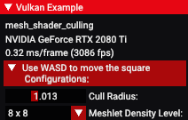

<!--
- Copyright (c) 2023, Holochip Corporation
-
- SPDX-License-Identifier: Apache-2.0
-
- Licensed under the Apache License, Version 2.0 the "License";
- you may not use this file except in compliance with the License.
- You may obtain a copy of the License at
-
-     http://www.apache.org/licenses/LICENSE-2.0
-
- Unless required by applicable law or agreed to in writing, software
- distributed under the License is distributed on an "AS IS" BASIS,
- WITHOUT WARRANTIES OR CONDITIONS OF ANY KIND, either express or implied.
- See the License for the specific language governing permissions and
- limitations under the License.
-
-->

# Mesh Shader Culling 

## Overview

This code sample demonstrates how to incorporate the Vulkan extension ```VK_EXT_mesh_shader_exclusive ```, and 
introduces the concept of mesh shader culling using meshlets.

## Introduction

This sample provides a detailed procedure to 1) enable the mesh shader extension, 2) create a mesh shading graphic 
pipeline, 3) generate a simple mesh using meshlets, and 4) establish a basic cull logic for the meshlets.

## Enabling mesh shading

To enable the mesh shading feature, the following procedure is required: 

1) the instance extension ```VK_KHR_GET_PHYSICAL_DEVICE_PROPERTIES_2``` must be added. 
2) the device extension ```VK_KHR_SPIRV_1_4``` must be added. 
3) the device extension ```VK_EXT_MESH_SHADER``` must be added, and the device must support this extension. 
4) the application version ```VK_API_VERSION_1_3``` is required.
5) SPIR-V version 1.4 is required. 
6) ```taskShader``` from ```VkPhysicalDeviceMeshShaderFeaturesEXT``` must be enabled.
7) ```meshShader``` from ```VkPhysicalDeviceMeshShaderFeaturesEXT``` must be enabled.

One may refer to the following examples of how to accomplish the above procedure for more details: 
```cpp
MeshShaderCulling::MeshShaderCulling()
{
	title = "Mesh shader culling";

	// Configure application version
	set_api_version(VK_API_VERSION_1_3);

	// Adding instance extension
	add_instance_extension(VK_KHR_GET_PHYSICAL_DEVICE_PROPERTIES_2_EXTENSION_NAME);
	// Adding device extensions
	add_device_extension(VK_KHR_SPIRV_1_4_EXTENSION_NAME);
	add_device_extension(VK_EXT_MESH_SHADER_EXTENSION_NAME);
	add_device_extension(VK_KHR_SHADER_FLOAT_CONTROLS_EXTENSION_NAME);
	// Targeting SPIR-V version
	vkb::GLSLCompiler::set_target_environment(glslang::EShTargetSpv, glslang::EShTargetSpv_1_4);
}
```
```cpp
void MeshShaderCulling::request_gpu_features(vkb::PhysicalDevice &gpu)
{
	// Enable extension features required by this sample
	// These are passed to device creation via a pNext structure chain
	auto &meshFeatures = gpu.request_extension_features<VkPhysicalDeviceMeshShaderFeaturesEXT>(
	    VK_STRUCTURE_TYPE_PHYSICAL_DEVICE_MESH_SHADER_FEATURES_EXT);

	meshFeatures.taskShader = VK_TRUE;
	meshFeatures.meshShader = VK_TRUE;
}
```

## Creating pipeline
In this sample, a very simple pipeline is created. However, one shall pay attention to the 
```VkGraphicsPipelineCreateInfo```, where bot its ```pVertexInputState``` and ```pInputAssemblyState``` must be 
connected to a ```nullptr```. More details can be found in the ```prepare_pipelines()``` function, shown as follows:
```cpp
void MeshShaderCulling::prepare_pipelines()
{
	// Pipeline creation information
	VkGraphicsPipelineCreateInfo pipeline_create_info = vkb::initializers::pipeline_create_info(pipeline_layout, render_pass, 0);
	// Rasterization state
	VkPipelineRasterizationStateCreateInfo rasterization_state = vkb::initializers::pipeline_rasterization_state_create_info(VK_POLYGON_MODE_FILL, VK_CULL_MODE_NONE, VK_FRONT_FACE_COUNTER_CLOCKWISE, 0);
	// Color blend state
	VkPipelineColorBlendAttachmentState blend_attachment = vkb::initializers::pipeline_color_blend_attachment_state(0xf, VK_FALSE);
	VkPipelineColorBlendStateCreateInfo color_blend_state = vkb::initializers::pipeline_color_blend_state_create_info(1, &blend_attachment);
	// Multisample state
	VkPipelineMultisampleStateCreateInfo multisample_state = vkb::initializers::pipeline_multisample_state_create_info(VK_SAMPLE_COUNT_1_BIT, 0);
	// Viewport state
	VkPipelineViewportStateCreateInfo viewport_state = vkb::initializers::pipeline_viewport_state_create_info(1, 1, 0);
	// Depth stencil state
	VkPipelineDepthStencilStateCreateInfo depth_stencil_state = vkb::initializers::pipeline_depth_stencil_state_create_info(VK_FALSE, VK_TRUE, VK_COMPARE_OP_GREATER);        // Depth test should be disabled;
	// Dynamic state
	std::vector<VkDynamicState> dynamic_state_enables = {VK_DYNAMIC_STATE_VIEWPORT, VK_DYNAMIC_STATE_SCISSOR};
	VkPipelineDynamicStateCreateInfo dynamic_state = vkb::initializers::pipeline_dynamic_state_create_info(dynamic_state_enables.data(),static_cast<uint32_t>(dynamic_state_enables.size()),0);
	// Shader state
	std::vector<VkPipelineShaderStageCreateInfo> shader_stages{};
	shader_stages.push_back(load_shader("mesh_shader_culling/mesh_shader_culling.task", VK_SHADER_STAGE_TASK_BIT_EXT));
	shader_stages.push_back(load_shader("mesh_shader_culling/mesh_shader_culling.mesh", VK_SHADER_STAGE_MESH_BIT_EXT));
	shader_stages.push_back(load_shader("mesh_shader_culling/mesh_shader_culling.frag", VK_SHADER_STAGE_FRAGMENT_BIT));

	pipeline_create_info.pVertexInputState   = nullptr;
	pipeline_create_info.pInputAssemblyState = nullptr;
	pipeline_create_info.pRasterizationState = &rasterization_state;
	pipeline_create_info.pColorBlendState    = &color_blend_state;
	pipeline_create_info.pMultisampleState   = &multisample_state;
	pipeline_create_info.pViewportState      = &viewport_state;
	pipeline_create_info.pDepthStencilState  = &depth_stencil_state;
	pipeline_create_info.pDynamicState       = &dynamic_state;
	pipeline_create_info.stageCount          = static_cast<uint32_t>(shader_stages.size());
	pipeline_create_info.pStages             = shader_stages.data();

	VK_CHECK(vkCreateGraphicsPipelines(get_device().get_handle(), pipeline_cache, 1, &pipeline_create_info, nullptr, &pipeline));
}
```

## Linking resources
In this sample, a very light-wighted resource is linked to the shader. Therefore, a uniform buffer is declared for 
such purpose. Where, the creation of its descriptor set, pool and layout can be referred in functions 
```setup_descriptor_sets()```, ```setup_descriptor_pool()```, and ```setup_descriptor_set_layout()```. The uniform
buffer only stores necessary information for the sampling purpose, and is defined as follows: 
```cpp
	struct UBO
	{
		float cull_center_x   = 0.0f;
		float cull_center_y   = 0.0f;
		float cull_radius     = 1.75f;
		float meshlet_density = 2.0f;
	} ubo_cull{};
```
Where, ```cull_center_x``` and ```cull_center_y``` determines the translation of the cull mask, and ```cull_radius```
defines the size of the cull mask. ```meshlet_density``` defines the total number of meshlets used for the sample. 


## Task Shader

A simple task shader is created to process the data from the uniform buffer, and then send it to its associated mesh 
shader. Where: 
```glsl
// Example of how to read a binding input from cpp:

layout (binding = 0) uniform UBO
{
    float cull_center_x;
    float cull_center_y;
    float cull_radius;
    float meshlet_density;
} ubo;
```
One should notice that, mesh shading allows data sharing from the task shader to its associated mesh shader, where, an 
example can be found in the following codes: 
```glsl
// Example of the data shared with its associated mesh shader:
// 1) define some structure if more than one variable data sharing is desired:
struct SharedData
{
    vec4  positionTransformation;
    int   N;
    int   meshletsNumber;
    float subDimension;
    float cullRadius;
};
// 2) use the following command to "establish the connection" to its associated mesh shader:
taskPayloadSharedEXT SharedData sharedData;
```
The ```sharedData``` declared in the task shader can be directly accessed from the mesh shader, if the same data 
structure is defined in the mesh shader as well. Where, in its associated mesh shader: 
```glsl
// Example of how to read shared data from its associated task shader:
// 1) the same structure must be defined (name can vary however):
struct SharedData
{
    vec4  positionTransformation;
    int   N;
    int   meshletsNumber;
    float subDimension;
    float cullRadius;
};
// 2) using the following command to "establish the connection" (variable name can vary):
taskPayloadSharedEXT SharedData sharedData;
```
In this simple task shader, it merely processes the uniform data, sharing them to its associated mesh shader, and then 
emits a simple mesh task. 

More details about emitting a mesh task can be found in the attached article:

[Introduction to Turing Mesh Shaders](https://developer.nvidia.com/blog/introduction-turing-mesh-shaders/)

## Mesh Shader

A simple mesh shader is created to generate vertices and indices based on the number of meshlets determined by its 
task shader. Where, its vertices and indices generation process can be found in the following code: 
```glsl
// Vertices:
gl_MeshVerticesEXT[ k * 4 + 0 ].gl_Position = vec4(2.0 * sharedData.subDimension * unitVertex_0, 0.0f, 1.0f) + sharedData.positionTransformation + displacement;
gl_MeshVerticesEXT[ k * 4 + 1 ].gl_Position = vec4(2.0 * sharedData.subDimension * unitVertex_1, 0.0f, 1.0f) + sharedData.positionTransformation + displacement;
gl_MeshVerticesEXT[ k * 4 + 2 ].gl_Position = vec4(2.0 * sharedData.subDimension * unitVertex_2, 0.0f, 1.0f) + sharedData.positionTransformation + displacement;
gl_MeshVerticesEXT[ k * 4 + 3 ].gl_Position = vec4(2.0 * sharedData.subDimension * unitVertex_3, 0.0f, 1.0f) + sharedData.positionTransformation + displacement;
// Indices
gl_PrimitiveTriangleIndicesEXT[ k * 2 + 0 ] = unitPrimitive_0 + k * uvec3(4);
gl_PrimitiveTriangleIndicesEXT[ k * 2 + 1 ] = unitPrimitive_1 + k * uvec3(4);
// Assigning the color output:
vec3 color = vec3( 1.0f, 0.0f, 0.0f ) * ( k + 1 ) / sharedData.meshletsNumber;
outColor[ k * 4 + 0] = color;
outColor[ k * 4 + 1] = color;
outColor[ k * 4 + 2] = color;
outColor[ k * 4 + 3] = color;
```
Where, a set of ```const``` data is declared to simply the above process: 
```glsl
// Define some constants in order to create an identical meshlet square, using two triangles:
// 1) a simplified vertex data, using vec2 format
const vec2 unitVertex_0 = vec2(-0.5f,  0.5f);
const vec2 unitVertex_1 = vec2( 0.5f,  0.5f);
const vec2 unitVertex_2 = vec2( 0.5f, -0.5f);
const vec2 unitVertex_3 = vec2(-0.5f, -0.5f);
// 2) index data associated with the vertex data, triangle defined using right-hand rule
const uvec3 unitPrimitive_0 = uvec3(0, 1, 2);
const uvec3 unitPrimitive_1 = uvec3(2, 0, 3);
```
More details of meshlets generation can be found in the attached article: 

[Using Mesh Shaders for Professional Graphics](https://developer.nvidia.com/blog/using-mesh-shaders-for-professional-graphics/)


## Meshlets culling
A simple cull logic is introduced in this sample from the mesh shader. One shall notice that, in mesh shading, there
is no command, or automated functions that helps to "cull" a geometry. The cull logic simply determines the condition, 
whether a meshlet may be generated or not. That says, after processing the cull logic, and a meshlet is determined to
be visible, it will then be generated normally; otherwise, its generation will be skipped. Hence, in principle, when a
meshlet is culled, it simply indicates that all its vertex and index information are not being created at all.

In this sample, a circular visual zone is centered at the origin, with an adjustable radius, controlled by the gui. 
Whenever a meshlet moves out of the visual zone, its generation process will be skipped. Where: 
```glsl
// the actual position of each meshlet:
vec4 position = displacement + sharedData.positionTransformation;
float squareRadius = position.x * position.x + position.y * position.y;
// Cull Logic: only is the meshlet center position is within the view circle defined by the cull radius,
// then this very meshlet will be generated. Otherwise, meshlet will NOT be generated.
if (squareRadius < sharedData.cullRadius * sharedData.cullRadius)
{
   // Generating meshlets
}
```
There are, indeed, more adaptive theories developed for such purpose, and a commonly used cull logic can be found in 
the following video: 

[Culling with NVIDIA Mesh Shaders](https://www.youtube.com/watch?v=n3cnUHYGbpw)


## UI overlay



A simple UI overlay is created to help showcase the mesh shader cull feature. Where, the radius of the circular cull
mask can be adjusted using the "Cull Radius" slider, which ranges from ```0.5f``` to ```2.0f```. And the meshlet density
level can be controlled using the combo-box. Where, a selection of 4-by-4, 6-by-6, and 8-by-8 of density opinions is 
provided. Where, users may use keyboard input ```W``` ```A``` ```S``` ```D``` to move the square mesh around the scene.
Code reference of the UI overlay can be found as follows: 
```cpp
void MeshShaderCulling::on_update_ui_overlay(vkb::Drawer &drawer)
{
	if (drawer.header("Use WASD to move the square\n Configurations:\n"))
	{
		if (drawer.slider_float("Cull Radius: ", &ubo_cull.cull_radius, 0.5f, 2.0f))
		{
			update_uniform_buffers();
		}
		if (drawer.combo_box("Meshlet Density Level: ", &density_level, {"4 x 4", "6 x 6", "8 x 8"}))
		{
			ubo_cull.meshlet_density = static_cast<float>(density_level);
			update_uniform_buffers();
		}
	}
}
```