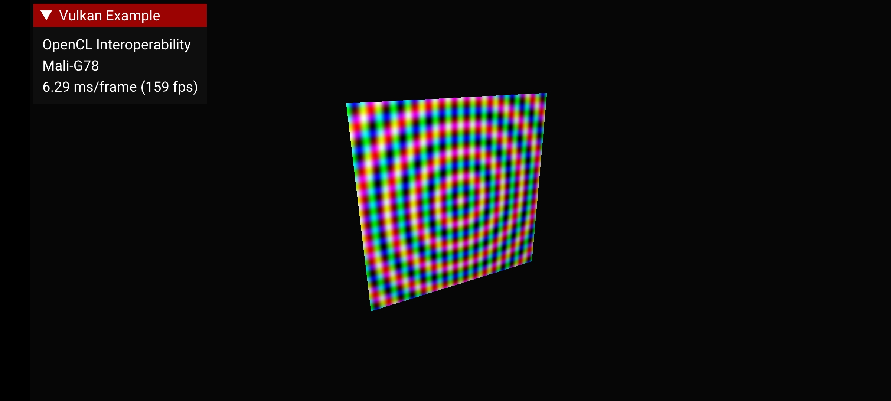

<!--
- Copyright (c) 2021-2023, Arm Limited and Contributors
-
- SPDX-License-Identifier: Apache-2.0
-
- Licensed under the Apache License, Version 2.0 the "License";
- you may not use this file except in compliance with the License.
- You may obtain a copy of the License at
-
-     http://www.apache.org/licenses/LICENSE-2.0
-
- Unless required by applicable law or agreed to in writing, software
- distributed under the License is distributed on an "AS IS" BASIS,
- WITHOUT WARRANTIES OR CONDITIONS OF ANY KIND, either express or implied.
- See the License for the specific language governing permissions and
- limitations under the License.
-
-->

# OpenCL interoperability

## Overview

In certain scenarios OpenCL is used for compute, while another API is used for graphics, and interoperability between two APIs becomes important in this case. For example, in AR applications graphics rendering is often combined with machine learning workloads, which can be executed using OpenCL. In such cases we need zero-copy data sharing and efficient workload synchronization to achieve the best performance. 

While there are no dedicated extensions for direct Vulkan - OpenCL interoperability at the moment, both APIs provide generic sharing mechanism that can be used to achieve it. This sample demonstrates an approach for zero-copy data sharing using Android Hardware Buffers and corresponding extensions for Vulkan and OpenCL.

## Data sharing

Zero-copy assumes that both APIs use the same region of memory for an image or a buffer. In case of OpenCL and Vulkan we can use extensions to share data using:

- Android Hardware Buffers
- dma_buf
- Host memory

This sample covers one of these options, which is more relevant to mobile developers working with Vulkan: Android Hardware Buffers.

## Android Hardware Buffers

Native hardware buffers on Android represent a region of memory which can be bound to Vulkan, OpenGL ES or OpenCL primitives. This allows us to reuse it with two different APIs:


### Support by Vulkan API

In Vulkan hardware buffers can be imported or exported using [VK_ANDROID_external_memory_android_hardware_buffer](https://www.khronos.org/registry/vulkan/specs/1.2-extensions/man/html/VK_ANDROID_external_memory_android_hardware_buffer.html) extension. AHardwareBuffer can be bound to a `VkDeviceMemory` object, which serves as an allocation for objects of type `VkImage` or `VkBuffer`.

If we need to use an image backed by an AHardwareBuffer, we must specify while creating the image. It is done by assigning a pointer to the following structure to `pNext` field of `VkImageCreateInfo`:
```
VkExternalMemoryImageCreateInfo external_memory_image_create_info;
external_memory_image_create_info.sType = VK_STRUCTURE_TYPE_EXTERNAL_MEMORY_IMAGE_CREATE_INFO;
external_memory_image_create_info.pNext = nullptr;
external_memory_image_create_info.handleTypes = VK_EXTERNAL_MEMORY_HANDLE_TYPE_ANDROID_HARDWARE_BUFFER_BIT_ANDROID;
```

This image (or buffer) must be specified as target during memory allocation. Below you can see, how the image object which is supposed to be shared with OpenCL is assigned to the `image` field of `VkMemoryDedicatedAllocateInfo`, while `buffer` field is assigned with `VK_NULL_HANDLE`:

```
VkMemoryDedicatedAllocateInfo dedicated_allocate_info;
dedicated_allocate_info.sType = VK_STRUCTURE_TYPE_MEMORY_DEDICATED_ALLOCATE_INFO;
dedicated_allocate_info.pNext = nullptr;
dedicated_allocate_info.buffer = VK_NULL_HANDLE;
dedicated_allocate_info.image = shared_image;
```
#### Export from Vulkan API
 A pointer to `dedicated_allocate_info` is provided as `pNext` of `VkExportMemoryAllocateInfo`.

```
VkExportMemoryAllocateInfo export_memory_allocate_Info;
export_memory_allocate_Info.sType = VK_STRUCTURE_TYPE_EXPORT_MEMORY_ALLOCATE_INFO;
export_memory_allocate_Info.pNext = &dedicated_allocate_info;
export_memory_allocate_Info.handleTypes = VK_EXTERNAL_MEMORY_HANDLE_TYPE_ANDROID_HARDWARE_BUFFER_BIT_ANDROID;
```
This is specified as `pNext` of `VkMemoryAllocateInfo`, while `allocationSize` is set to 0. You can find more info on this in the [specification](https://www.khronos.org/registry/vulkan/specs/1.2-extensions/html/vkspec.html#VkMemoryRequirements).

Once the memory is allocated **and** bound to the image (or buffer), we can export a handle of type `AHardwareBuffer`:

```
VkMemoryGetAndroidHardwareBufferInfoANDROID info;
info.sType = VK_STRUCTURE_TYPE_MEMORY_GET_ANDROID_HARDWARE_BUFFER_INFO_ANDROID;
info.pNext = nullptr;
info.memory = shared_memory;
vkGetMemoryAndroidHardwareBufferANDROID(device, &info, &hardware_buffer);
```

#### Import to Vulkan API

In this case AHardwareBuffer is created first and then used for `VkDeviceMemory` allocation.

**Note**: there are certain restrictions on image or buffer format and usage. You can find the list of Android Hardware Buffer formats and their Vulkan counterparts in this [table](https://developer.android.com/ndk/reference/group/a-hardware-buffer#ahardwarebuffer_format).

A pointer to `dedicated_allocate_info` is provided as `pNext` of `VkImportAndroidHardwareBufferInfoANDROID`. Also the hardware buffer we want to import must be provided during this stage:

```
VkImportAndroidHardwareBufferInfoANDROID import_info;
import_info.sType = VK_STRUCTURE_TYPE_IMPORT_ANDROID_HARDWARE_BUFFER_INFO_ANDROID;
import_info.pNext = &dedicated_allocate_info;
import_info.buffer = hardware_buffer;
```

We need to specify this data as `pNext` in `VkMemoryAllocateInfo`. In case of import, `allocationSize` and `memoryTypeIndex` should be based on the results of `vkGetAndroidHardwareBufferPropertiesANDROID`:

```
VkAndroidHardwareBufferPropertiesANDROID buffer_properties;
buffer_properties.sType = VK_STRUCTURE_TYPE_ANDROID_HARDWARE_BUFFER_PROPERTIES_ANDROID;
buffer_properties.pNext = nullptr;
vkGetAndroidHardwareBufferPropertiesANDROID(device, hardware_buffer, &buffer_properties);
```

Then the memory is allocated and bound to the image as usual.

### Support by OpenCL

On Arm devices Android hardware buffers (as well as dma_buf and host memory) can be imported to OpenCL using [cl_arm_import_memory](https://www.khronos.org/registry/OpenCL/extensions/arm/cl_arm_import_memory.txt) extension.

`cl_mem` object is retrieved in the following way:

```
const cl_import_properties_arm import_properties[3] = {
	    CL_IMPORT_TYPE_ARM, CL_IMPORT_TYPE_ANDROID_HARDWARE_BUFFER_ARM,
	    0};

cl_int result = CL_SUCCESS;
cl_mem shared_cl_mem = clImportMemoryARM(context,
                                                    CL_MEM_READ_WRITE,
                                                    import_properties,
                                                    hardware_buffer,
                                                    CL_IMPORT_MEMORY_WHOLE_ALLOCATION_ARM,
                                                    &result);
```


In `cl_import_properties_arm` array the types and values of the properties are listed one by one with a 0 as a terminator in the end.

We need to specify the type of the imported object in this list (in our case it's `CL_IMPORT_TYPE_ANDROID_HARDWARE_BUFFER_ARM`).


## The sample

In this sample a simple OpenCL kernel is executed in the beginning of each frame to fill a `cl_mem` object backed by an `AHardwareBuffer` with a simple pattern (this pattern changes over time). This `AHardwareBuffer` is exported from a `VkDeviceMemory` object which is bound to a texture. After the OpenCL kernel is executed, the filled texture is displayed.

The texture is displayed as a quad using the approach and shaders from [Texture Loading](../../api/texture_loading) sample.

The sample uses only one shared texture for simplicity, but in real applications it's worth having as many shared textures as there are framebuffers. This way the OpenCL kernel would be executed for the current frame, while the previous frame is being rendered and displayed (double buffering).

Synchronization between APIs is performed on host:
- OpenCL queue is flushed before rendering
- A `VkFence` object is used to make sure the rendering is finished



## Conclusion

Both OpenCL and Vulkan extensions allow us to import or export certain handle types, which represent a region of memory. These memory regions can be used to achieve zero-copy data sharing. In this sample one of such handle types is demonstrated: Android Hardware Buffers. 

The extensions used in this case are:
- [VK_ANDROID_external_memory_android_hardware_buffer](https://www.khronos.org/registry/vulkan/specs/1.2-extensions/man/html/VK_ANDROID_external_memory_android_hardware_buffer.html)
- [cl_arm_import_memory](https://www.khronos.org/registry/OpenCL/extensions/arm/cl_arm_import_memory.txt)
