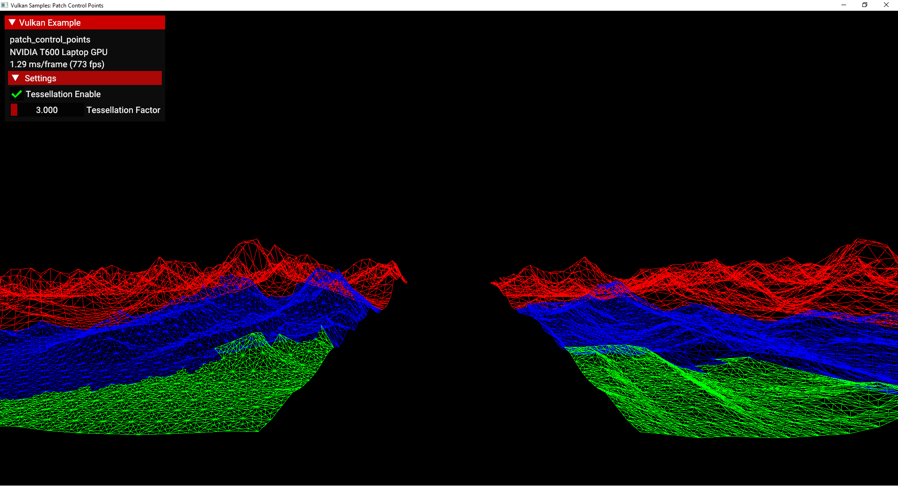

////
- Copyright (c) 2023, Mobica Limited
-
- SPDX-License-Identifier: Apache-2.0
-
- Licensed under the Apache License, Version 2.0 the "License";
- you may not use this file except in compliance with the License.
- You may obtain a copy of the License at
-
-     http://www.apache.org/licenses/LICENSE-2.0
-
- Unless required by applicable law or agreed to in writing, software
- distributed under the License is distributed on an "AS IS" BASIS,
- WITHOUT WARRANTIES OR CONDITIONS OF ANY KIND, either express or implied.
- See the License for the specific language governing permissions and
- limitations under the License.
-
////
= Patch control point

== Overview

This sample demonstrates how to use `VK_EXT_extended_dynamic_state2` extension, which eliminates the need to create multiple pipelines in case of specific different parameters.

This extension changes how *Patch Control Points* are managed.
Instead of static description during pipeline creation, this extension allows developers to change the parameter by using a function before every draw.

Below is a comparison of common Vulkan static and dynamic setting of patch control points in the  tessellation.

|===
| Static/Non-dynamic | Dynamic State 2

| dynamic_state = {VK_DYNAMIC_STATE_VIEWPORT, + VK_DYNAMIC_STATE_SCISSOR}
| dynamic_state = {VK_DYNAMIC_STATE_VIEWPORT, + VK_DYNAMIC_STATE_SCISSOR, + *VK_DYNAMIC_STATE_PATCH_CONTROL_POINTS_EXT*}

| VkPipelineTessellationStateCreateInfo tessellation_state{} + tessellation_state.sType = VK_STRUCTURE_TYPE_PIPELINE_TESSELLATION_STATE_CREATE_INFO + *tessellation_state.patchControlPoints = patchControlPoints* + ...
+ vkCreateGraphicsPipelines(pipeline)
| vkCreateGraphicsPipelines(pipeline)

| draw(model, pipeline)
| *vkCmdSetPatchControlPointsEXT(commandBuffer, patchControlPoints)* + draw(model, pipeline)
|===

More details are provided in the sections that follow.

== Pipelines

In the static approach to pipeline creation patch control points have to be defined while creating the pipeline.
This is illustrated in a static/non-dynamic pipeline creation.

[,C++]
----
VkPipelineInputAssemblyStateCreateInfo input_assembly_state =
    vkb::initializers::pipeline_input_assembly_state_create_info(
        VK_PRIMITIVE_TOPOLOGY_PATCH_LIST,
        0,
        VK_FALSE);

VkPipelineTessellationStateCreateInfo tessellation_state =
    vkb::initializers::pipeline_tessellation_state_create_info(3);

std::vector<VkDynamicState> dynamic_state_enables = {
    VK_DYNAMIC_STATE_VIEWPORT,
    VK_DYNAMIC_STATE_SCISSOR
};
VkPipelineDynamicStateCreateInfo dynamic_state =
    vkb::initializers::pipeline_dynamic_state_create_info(
        dynamic_state_enables.data(),
        static_cast<uint32_t>(dynamic_state_enables.size()),
        0);

VkGraphicsPipelineCreateInfo graphics_create{VK_STRUCTURE_TYPE_GRAPHICS_PIPELINE_CREATE_INFO};
graphics_create.pInputAssemblyState = &input_assembly_state;
graphics_create.pDynamicState       = &dynamic_state;
graphics_create.pTessellationState = &tessellation_state;
graphics_create.layout              = pipeline_layouts.statically_tessellation;
...

VK_CHECK(vkCreateGraphicsPipelines(get_device().get_handle(), pipeline_cache, 1, &graphics_create, VK_NULL_HANDLE, &pipeline.statically_tessellation));
----

In the approach if developer would like to change the patch control points number, then for each different number a new pipeline would be required.

However, with `VK_EXT_extended_dynamic_state2` the number of pipelines can be reduced by the possibility to change parameter Patch Control Points by calling `vkCmdSetPatchControlPointsEXT` before calling the `draw_model` method.

With the usage of above function we can reduce the number of pipelines.
Required dynamic states must be enabled and passed to the `VkGraphicsPipelineCreateInfo` structure.

By setting `VK_PRIMITIVE_TOPOLOGY_PATCH_LIST` in the `VkPipelineInputAssemblyStateCreateInfo` structure, the pipeline can use the `patch control points` functionality.

[,C+]
----
VkPipelineInputAssemblyStateCreateInfo input_assembly_state =
	vkb::initializers::pipeline_input_assembly_state_create_info(
	    VK_PRIMITIVE_TOPOLOGY_PATCH_LIST,
	    0,
	    VK_FALSE);

std::vector<VkDynamicState> dynamic_state_enables = {
	VK_DYNAMIC_STATE_VIEWPORT,
	VK_DYNAMIC_STATE_SCISSOR,
	VK_DYNAMIC_STATE_PATCH_CONTROL_POINTS_EXT,
};

VkPipelineDynamicStateCreateInfo dynamic_state =
	vkb::initializers::pipeline_dynamic_state_create_info(
	    dynamic_state_enables.data(),
	    static_cast<uint32_t>(dynamic_state_enables.size()),
	    0);

VkGraphicsPipelineCreateInfo graphics_create{VK_STRUCTURE_TYPE_GRAPHICS_PIPELINE_CREATE_INFO};
graphics_create.pInputAssemblyState = &input_assembly_state;
graphics_create.pDynamicState       = &dynamic_state;
graphics_create.layout              = pipeline_layouts.dynamically_tessellation;
...

VK_CHECK(vkCreateGraphicsPipelines(get_device().get_handle(), pipeline_cache, 1, &graphics_create, VK_NULL_HANDLE, &pipeline.dynamically_tessellation));
----

And now, thanks to `VK_EXT_extended_dynamic_state2`, we can change parameters before each corresponding draw call.

[,C++]
----
VK_CHECK(vkBeginCommandBuffer(draw_cmd_buffer, &command_begin));

...
/* Binding dynamically_tessellation pipeline and descriptor sets */
vkCmdBindDescriptorSets(draw_cmd_buffer,
		                VK_PIPELINE_BIND_POINT_GRAPHICS,
		                pipeline_layouts.dynamically_tessellation,
		                0,
		                1,
		                &descriptor_sets.dynamically_tessellation,
		                0,
		                nullptr);
vkCmdBindPipeline(draw_cmd_buffer, VK_PIPELINE_BIND_POINT_GRAPHICS, pipeline.dynamically_tessellation);

/* Set patch control points value */
vkCmdSetPatchControlPointsEXT(draw_cmd_buffer, patch_control_points_triangle);

/* Drawing scene with objects using tessellation feature */
draw_model(model, draw_cmd_buffer);
...

VK_CHECK(vkEndCommandBuffer(draw_cmd_buffer));
----

== Enabling the Extension

The extended dynamic state 2 API requires Vulkan 1.0 and the appropriate headers / SDK is required.
This extension has been https://registry.khronos.org/vulkan/specs/1.3-extensions/man/html/VK_EXT_extended_dynamic_state2.html#_promotion_to_vulkan_1_3[partially] promoted to Vulkan 1.3.

The device extension is provided by `VK_EXT_EXTENDED_DYNAMIC_STATE_2_EXTENSION_NAME`.
It also requires  `VK_KHR_GET_PHYSICAL_DEVICE_PROPERTIES_2_EXTENSION_NAME` instance extension to be enabled.

[,C++]
----
add_instance_extension(VK_KHR_GET_PHYSICAL_DEVICE_PROPERTIES_2_EXTENSION_NAME);
add_device_extension(VK_EXT_EXTENDED_DYNAMIC_STATE_2_EXTENSION_NAME);
----

If the https://registry.khronos.org/vulkan/specs/1.3-extensions/man/html/VkPhysicalDeviceExtendedDynamicState2FeaturesEXT.html[`VkPhysicalDeviceExtendedDynamicState2FeaturesEXT`] structure is included in the pNext chain of the `VkPhysicalDeviceFeatures2` structure passed to vkGetPhysicalDeviceFeatures2, it is filled in to indicate whether each corresponding feature is supported.
`VkPhysicalDeviceExtendedDynamicState2FeaturesEXT` can also be used in the pNext chain of `VkDeviceCreateInfo` to selectively enable these features.
