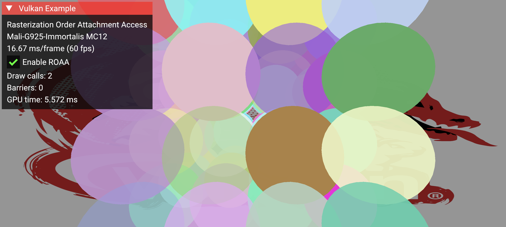

////
- Copyright (c) 2026, Arm Limited and Contributors
- 
- SPDX-License-Identifier: Apache-2.0
-
- Licensed under the Apache License, Version 2.0 the "License";
- you may not use this file except in compliance with the License.
- You may obtain a copy of the License at
-
-     http://www.apache.org/licenses/LICENSE-2.0
-
- Unless required by applicable law or agreed to in writing, software
- distributed under the License is distributed on an "AS IS" BASIS,
- WITHOUT WARRANTIES OR CONDITIONS OF ANY KIND, either express or implied.
- See the License for the specific language governing permissions and
- limitations under the License.
////
= Rasterization Order Attachment Access Sample

ifdef::site-gen-antora[]
TIP: The source for this sample can be found in the https://github.com/KhronosGroup/Vulkan-Samples/tree/main/samples/extensions/rasterization_order_attachment_access[Khronos Vulkan samples github repository].
endif::[]

== Overview
This sample demonstrates how to use the https://docs.vulkan.org/spec/latest/appendices/extensions.html#VK_EXT_rasterization_order_attachment_access[`VK_EXT_rasterization_order_attachment_access`] extension in conjunction with https://docs.vulkan.org/spec/latest/appendices/extensions.html#VK_KHR_dynamic_rendering[`VK_KHR_dynamic_rendering`] and https://docs.vulkan.org/spec/latest/appendices/extensions.html#VK_KHR_dynamic_rendering_local_read[`VK_KHR_dynamic_rendering_local_read`] to implement framebuffer fetch with guaranteed fragment ordering for rendering transparent geometry.

The key use case shown is multiple overlapping fragments within a single draw call, where fragment B can read what fragment A previously wrote at the same pixel. This enables deterministic transparency where later primitives always see what earlier primitives wrote at the same pixel.

== Extensions Used
|===
| Extension | Purpose

| `VK_KHR_dynamic_rendering`
| Eliminates render pass objects, simplifying rendering setup

| `VK_KHR_dynamic_rendering_local_read`
| Enables framebuffer fetch (reading color attachments) within dynamic rendering

| `VK_EXT_rasterization_order_attachment_access`
| Guarantees correct per-pixel ordering of memory accesses in overlapping fragments
|===

== Extension Concepts
=== Dynamic Rendering
Dynamic rendering eliminates the need to create `VkRenderPass` and `VkFramebuffer` objects ahead of time. Instead, rendering attachments are specified at runtime using `VkRenderingInfoKHR`. This simplifies integration into modern render graphs and pipelines.

See the xref:/samples/extensions/dynamic_rendering/README.adoc[dynamic rendering sample] for more context.

=== Dynamic Rendering Local Read
The `VK_KHR_dynamic_rendering_local_read` extension enables framebuffer fetch (shader reads of color attachments) in dynamic rendering, similar to traditional subpass input attachments. Shaders can read the current value of the color attachment at the fragment's location using `subpassLoad()`-like access. Per-attachment indices are provided via `vkCmdSetRenderingInputAttachmentIndicesKHR`. On tile-based GPUs, these reads happen from on-chip tile memory rather than main memory, avoiding costly tile flushes and reducing bandwidth and power consumption.

See the xref:/samples/extensions/dynamic_rendering_local_read/README.adoc[dynamic rendering local read sample] and the https://docs.vulkan.org/tutorial/latest/Building_a_Simple_Engine/Mobile_Development/05_vulkan_extensions.html#_vk_khr_dynamic_rendering_local_read[Vulkan tutorial on mobile extensions] for more context.

=== Rasterization Order Attachment Access (ROAA)
To understand what ROAA provides, it helps to first clarify two related concepts. Primitive order is the order in which primitives appear in your index/vertex buffer (triangle 0, then 1, then 2, etc.). Rasterization order extends this to fragments on a per-pixel basis: at any given pixel, fragments from overlapping primitives are ordered according to their primitive order. There is no ordering between fragments at different pixels.

[source]
----
Triangle 0 covers pixels: A, B, C
Triangle 1 covers pixels:    B, C, D
Triangle 2 covers pixels: A,       D

At pixel A: Triangle 0 then Triangle 2 (ordered by primitive order)
At pixel B: Triangle 0 then Triangle 1
At pixel C: Triangle 0 then Triangle 1
At pixel D: Triangle 1 then Triangle 2
----

Fixed-function operations (blending, depth/stencil tests) are always performed in rasterization order, even without ROAA. Fragment shaders may run in parallel and out of order, but the GPU ensures that fixed-function outputs are committed in the correct order.

The problem arises with framebuffer fetch (input attachment reads). Without ROAA, there is no synchronization between one fragment's color attachment write and a later fragment's input attachment read at the same pixel.

Without ROAA:

- At a given pixel, fragment B may read the input attachment before fragment A's shader has written its result
- This is a read-after-write hazard on the input attachment

With ROAA:

- The implementation ensures that input attachment reads at a pixel wait until previous fragment shaders at that pixel have completed their writes
- Fragment B's `subpassLoad` is guaranteed to see fragment A's output

[source]
----
Without ROAA (read-after-write hazard):
  Fragment A: reads input attachment (value = X)
  Fragment B: reads input attachment (value = X)  // A hasn't written yet!
  Fragment A: writes color attachment
  Fragment B: writes color attachment  // Based on stale data

With ROAA (synchronized):
  Fragment A: reads input attachment (value = X)
  Fragment A: writes color attachment (Y)
  Fragment B: reads input attachment (value = Y)  // Sees A's write
  Fragment B: writes color attachment (Z)
----

NOTE: ROAA provides ordering for overlapping fragments within the same rendering scope (between `vkCmdBeginRenderingKHR`/`vkCmdEndRenderingKHR` for dynamic rendering, or within a subpass for traditional render passes), including across multiple draw calls. Barriers between draws are not required when ROAA is enabled. However, ROAA does not make blending order-independent. The blend result still depends on primitive submission order.

ROAA is enabled via pipeline state using `VkPipelineColorBlendStateCreateInfo::flags`, setting the bit `VK_PIPELINE_COLOR_BLEND_STATE_CREATE_RASTERIZATION_ORDER_ATTACHMENT_ACCESS_BIT_EXT`. In dynamic rendering, subpasses are not used, so this bit enables ordering at the pipeline level.

==== Use Cases
This technique is useful for:

- Particle systems: Many transparent particles rendered in a single instanced draw call
- Custom blending: Manual blend equations not supported by fixed-function hardware
- Layered transparency: Overlapping transparent geometry submitted in a single draw call

==== Scope and Limitations
On some GPU architectures, the synchronization that ROAA provides between attachment writes and input attachment reads may already happen naturally, so the lack of ROAA may not visibly break rendering. However, without the extension, this synchronization is not guaranteed by Vulkan. On architectures that support it, ROAA provides this synchronization efficiently. On architectures where ROAA is not available, the same correctness can be achieved using explicit pipeline barriers between draw calls.

ROAA guarantees correct per-pixel memory ordering for overlapping fragments within the same rendering scope (including across draw calls), but it does not:

- Make blending order-independent or commutative
- Replace the need for depth sorting when a specific visual order is desired

ROAA ensures deterministic results for a given primitive order. Changing the primitive order will produce different (but still deterministic) results.

==== Ordering and Transparency
ROAA guarantees that overlapping fragments at the same pixel are processed in primitive order, which is the order primitives are submitted to the GPU. This is not the same as depth-sorted order.

For correct alpha-blended transparency, primitives should generally be submitted back-to-front (painter's algorithm). If the application sorts primitives before submission, ROAA guarantees that the sorted order is respected at the pixel level, producing both deterministic and visually correct results.

If primitives are not sorted, the result is still deterministic and well-defined, exactly like fixed-function blending with the same submission order. The image will be stable across frames with no flickering. However, the blend result may not match what a depth-sorted compositing pass would produce.

Without ROAA, overlapping fragments within a single draw call that use framebuffer fetch (`subpassLoad`) have no ordering guarantee. The result may vary between frames, between vendors, or between GPU architectures. ROAA eliminates this undefined behavior.

== The Sample
=== Scene Setup
This sample renders 64 transparent spheres arranged in a 4x4x4 grid. Each sphere has random RGB color and an opacity value between 0.2 and 1.0.

The spheres are intentionally not depth-sorted. They are rendered in a fixed grid order regardless of camera view, to keep the sample focused on the API setup and performance comparison rather than on implementing a full compositing pipeline. As a result, the blending is deterministic but not depth-correct. For production use, applications would typically sort primitives back-to-front before submission.

With ROAA, all spheres are drawn in a single instanced draw call. Without it, each sphere requires a separate draw call with an explicit barrier before the next.

=== Rendering Technique
The fragment shader performs alpha blending manually using framebuffer fetch:

[,glsl]
----
void main()
{
    // Read current color at the fragment's location
    vec4 dst = subpassLoad(colorAttachment);

    // Source color and alpha
    vec4 src = inColor;

    // Alpha blending: src over dst
    outColor.rgb = src.rgb * src.a + dst.rgb * (1.0 - src.a);
    outColor.a = 1.0;
}
----

Pipeline configuration:

- ROAA enabled via pipeline create flags
- Input attachment index set via `vkCmdSetRenderingInputAttachmentIndicesKHR`
- Fixed-function blending disabled (blending is handled in the shader)
- Dynamic rendering with local reads specified using `VkRenderingInfoKHR` and associated dynamic state
- Back-face culling (`VK_CULL_MODE_BACK_BIT`) on both blend pipelines, so the ROAA and no-ROAA paths produce identical images

=== Key Implementation Details
Enabling ROAA on the pipeline. The ROAA flag is set on `VkPipelineColorBlendStateCreateInfo`, which is then passed to the graphics pipeline via `pColorBlendState`:
[,cpp]
----
VkPipelineColorBlendStateCreateInfo color_blend_state{};
color_blend_state.flags = VK_PIPELINE_COLOR_BLEND_STATE_CREATE_RASTERIZATION_ORDER_ATTACHMENT_ACCESS_BIT_EXT;

// ...

pipeline_info.pColorBlendState = &color_blend_state;
vkCreateGraphicsPipelines(device, pipeline_cache, 1, &pipeline_info, nullptr, &blend_pipeline);
----

Setting up input attachment mapping for dynamic rendering local read:
[,cpp]
----
// Map color attachment 0 to input_attachment_index 0 in the fragment shader
const uint32_t COLOR_ATTACHMENT_INPUT_INDEX = 0;
const VkRenderingInputAttachmentIndexInfo INPUT_ATTACHMENT_INDEX_INFO{
    VK_STRUCTURE_TYPE_RENDERING_INPUT_ATTACHMENT_INDEX_INFO_KHR,
    nullptr,
    1,                                // colorAttachmentCount
    &COLOR_ATTACHMENT_INPUT_INDEX,    // pColorAttachmentInputIndices
    nullptr,                          // pDepthInputAttachmentIndex
    nullptr                           // pStencilInputAttachmentIndex
};

// Chain to VkRenderingInfoKHR during pipeline creation
rendering_info.pNext = &INPUT_ATTACHMENT_INDEX_INFO;
----

At draw time, set the input attachment indices:
[,cpp]
----
vkCmdSetRenderingInputAttachmentIndicesKHR(cmd, &INPUT_ATTACHMENT_INDEX_INFO);
----

=== Validating Correctness
Because some GPU architectures already provide the necessary synchronization between attachment writes and input attachment reads, ROAA may not produce visible changes. To confirm the sample is working:

1. Visual correctness: Transparent spheres blend smoothly with no artifacts when ROAA is enabled
2. Frame stability: No flickering or pop-in in either mode
3. Consistent appearance: The ROAA and no-ROAA paths should look the same. Both use back-face culling, so the same front-facing fragments are drawn in both cases. The difference is only in how ordering is achieved. One instanced draw call versus multiple draws with explicit barriers.

On devices that do not support ROAA, only the barrier fallback path is available.

== GUI
The sample provides a toggle and real-time metrics:

|===
| Element | Description

| Enable ROAA
| Toggle on/off to compare behavior

| Draw calls
| Number of draw commands issued

| Barriers
| Number of memory barriers inserted

| GPU time
| Time spent on the full render pass (background + spheres + UI)
|===

== Performance
ROAA eliminates the need for explicit synchronization between overlapping fragments within a draw call. Without ROAA, correct ordering requires splitting draws and inserting barriers.

With the default 64-sphere scene (4×4×4 grid):
|===
| Metric | ROAA Enabled | ROAA Disabled

| Draw calls
| 2 (background + instanced spheres)
| 65 (background + one per sphere)

| Memory barriers
| 0
| 63 (between each draw)

| Command buffer size
| Minimal
| Larger (barrier commands)
|===

The performance difference is most significant on:

- Tile-based GPUs: Barriers can force tile flushes, reducing efficiency
- High fragment count scenes: More overlapping fragments means more potential synchronization overhead
- Mobile devices: Where bandwidth and power are constrained

== Best Practices
|===
| Do | Don't | Impact

| Use ROAA for transparency within a single draw call when available
| Rely on implicit GPU ordering without ROAA
| Avoids read-after-write hazards on input attachments

| Batch transparent geometry into fewer draw calls
| Issue separate draws when ROAA can handle it
| Reduces CPU overhead and barrier count

| Use `VK_DEPENDENCY_BY_REGION_BIT` for barriers when ROAA is disabled
| Use global barriers for tile-local synchronization
| Allows tile-based GPUs to keep data on-chip

| Check for `rasterizationOrderColorAttachmentAccess` feature support
| Assume ROAA is available on all devices
| Graceful fallback on unsupported hardware
|===

== Additional Information
- https://registry.khronos.org/vulkan/specs/1.3-extensions/man/html/VK_EXT_rasterization_order_attachment_access.html[VK_EXT_rasterization_order_attachment_access specification]
- https://registry.khronos.org/vulkan/specs/1.3-extensions/man/html/VK_KHR_dynamic_rendering_local_read.html[VK_KHR_dynamic_rendering_local_read specification]
- https://developer.arm.com/documentation/102479/0100[Understanding Render Passes (ARM Developer)]
- https://developer.arm.com/community/arm-community-blogs/b/mobile-graphics-and-gaming-blog/posts/framebuffer-fetch-in-vulkan[Framebuffer Fetch in Vulkan (ARM Developer)]

