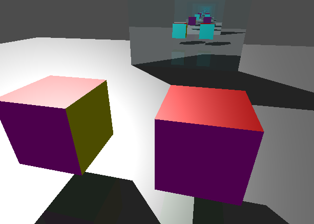
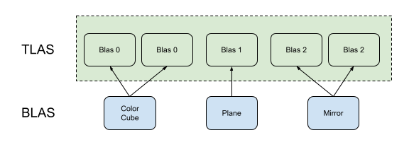
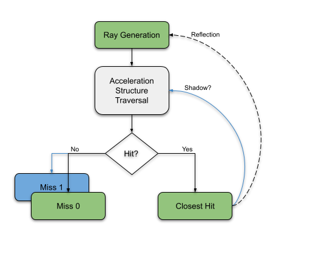

<!--
 * Copyright (c) 2014-2021, NVIDIA CORPORATION.  All rights reserved.
 *
 * Licensed under the Apache License, Version 2.0 (the "License");
 * you may not use this file except in compliance with the License.
 * You may obtain a copy of the License at
 *
 *     http://www.apache.org/licenses/LICENSE-2.0
 *
 * Unless required by applicable law or agreed to in writing, software
 * distributed under the License is distributed on an "AS IS" BASIS,
 * WITHOUT WARRANTIES OR CONDITIONS OF ANY KIND, either express or implied.
 * See the License for the specific language governing permissions and
 * limitations under the License.
 *
 * SPDX-FileCopyrightText: Copyright (c) 2014-2021 NVIDIA CORPORATION
 * SPDX-License-Identifier: Apache-2.0
-->

# Ray tracing - reflection



## Overview

This sample is a extended version of the [ray tracing basic](../raytracing_basic) with the addition of multiple geometries,
instances and materials.

In addition this sample is showing how to cast shadow rays and reflections.

## Geometries, bottom and top level acceleration structures

The structures of the geometry are similar to those described in the OBJ format. For our geometry there is a list of vertices (position and normal) and a triplet of indices for each triangle.

Each triangle also has an index for a material. In this example, each object has its own list of materials, but we could have made it so that the materials are shared by all objects in the scene.

The example scene has two geometries: a plane and a cube.

You can see the creation of the scene under `RaytracingReflection::create_scene()`.

### `create_model()`

This function allocates and upload the geometry to the GPU. There are four buffers per geometry

* vertices: the position and normal
* indices: index of vertex to form a triangle
* material index: material id per triangle
* materials: a list of materials (albedo, specular, reflection)

### `create_buffer_references()`

In this example, buffer references are used. Instead of having a descriptor set with multiple arrays to access the buffers, we create a buffer that contains the addresses of the scene models. With this method, we can easily access the data of the model we hit in the shader.

In the shader, `VkDeviceAddress` are `uint64_t`, therefore we will access a buffer of an array of structure `ObjBuffers`.

````cpp
struct ObjBuffers
{
 uint64_t vertices;
 uint64_t indices;
 uint64_t materials;
 uint64_t materialIndices;
};
layout(set = 0, binding = 3)    buffer _scene_desc { ObjBuffers i[]; } scene_desc;
````

The addresses corespond to buffers, so we will declare them like this:

````cpp
layout(buffer_reference, scalar) buffer Vertices {Vertex v[]; }; // Positions of an object
layout(buffer_reference, scalar) buffer Indices {uvec3 i[]; }; // Triangle indices
layout(buffer_reference, scalar) buffer Materials {WaveFrontMaterial m[]; }; // Array of all materials on an object
layout(buffer_reference, scalar) buffer MatIndices {int i[]; }; // Material ID for each triangle
````

The in the shader, to access the data of an object, we will do the following:

````cpp
 ObjBuffers objResource = scene_desc.i[gl_InstanceCustomIndexEXT];
 MatIndices matIndices  = MatIndices(objResource.materialIndices);
 Materials  materials   = Materials(objResource.materials);
 Indices    indices     = Indices(objResource.indices);
 Vertices   vertices    = Vertices(objResource.vertices);
````

Note that `gl_InstanceCustomIndexEXT` was set with one of the three  scene object. See `RaytracingReflection::create_blas_instance`.

### `create_bottom_level_acceleration_structure()`

We build a lower-level acceleration structure (BLAS) for each geometry: a cube with one material on each face (0), a plane (1), and a mirror cube (2).

These BLAS are instantiated by the top-level acceleration structure (TLAS) with a transformation matrix.

### `create_top_level_acceleration_structure()`

The top-level acceleration structure (TLAS) embeds multiple BLAS. It is possible to reuse the same BLAS and give it a different transformation matrix to place it in a different position in the scene. We see this in `create_scene()`, the same BLAS id is reused with different matrices.

Note, the BLAS id will be identified by the `gl_InstanceCustomIndexEXT` in the shader.



## Ray tracing pipeline

The difference with [ray tracing basic](../raytracing_basic), is the addition of the second miss-shade module. This is called from the closest-hit shader to detect if there is an object between the hit point and the light.

### Shadows

In the closest-hit shader, we track a ray to determine if there is an object between the hit point and the light. For this ray, we use a different payload that contains only one boolean value, "`isShadowed`". We assume that an object is blocking the light, so we initialize the value to `true`. Then, if the ray hits nothing, we [set this value to false](missShadow.rmiss). This is fast because we set the trace flag to skip execution of the closest-hit and terminate on the first hit, then only execute the shadow-miss-shader and set a small payload.

### Reflection

For reflection, we do not change `maxPipelineRayRecursionDepth` and leave the value at 2. Instead of recursively looping from the closest-hit shader, we store the information of the next ray in the payload and send new rays from the ray generation shader. 

When we call `traceRayEXT` from the closest-hit shader, it must store the state of all variables needed after execution. Recursively calling `traceRayEXT` requires storing a lot of data per ray call, and that is typically slow. 

Instead, we store in the payload the ray origin and the ray direction that the ray generation shader will use. This method also removes the pipeline ray recursion depth constraint. 


