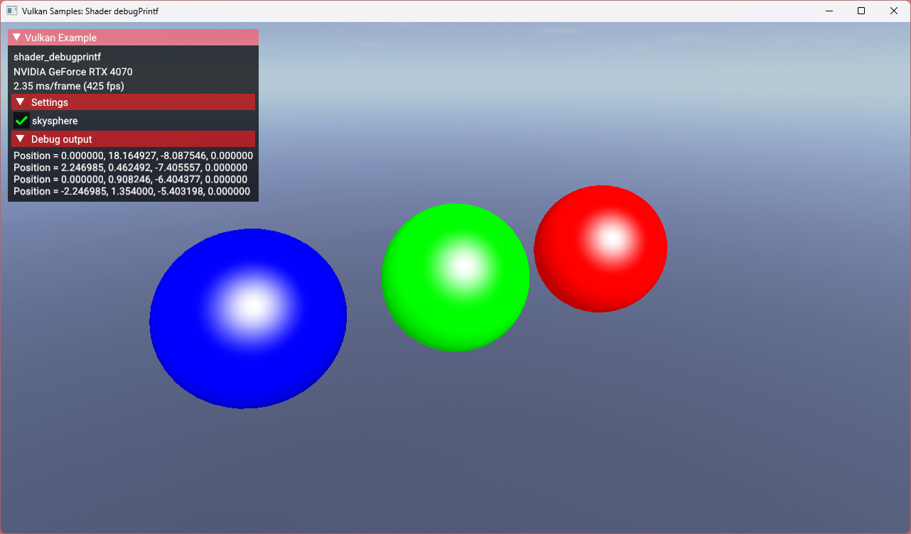
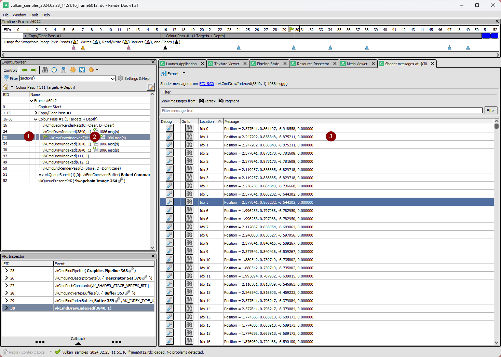

////
- Copyright (c) 2024, Sascha Willems
-
- SPDX-License-Identifier: Apache-2.0
-
- Licensed under the Apache License, Version 2.0 the "License";
- you may not use this file except in compliance with the License.
- You may obtain a copy of the License at
-
-     http://www.apache.org/licenses/LICENSE-2.0
-
- Unless required by applicable law or agreed to in writing, software
- distributed under the License is distributed on an "AS IS" BASIS,
- WITHOUT WARRANTIES OR CONDITIONS OF ANY KIND, either express or implied.
- See the License for the specific language governing permissions and
- limitations under the License.
-
////
= Shader debug Printf

ifdef::site-gen-antora[]
TIP: The source for this sample can be found in the https://github.com/KhronosGroup/Vulkan-Samples/tree/main/samples/extensions/shader_debugprintf[Khronos Vulkan samples github repository].
endif::[]

:pp: {plus}{plus}

== Overview

This sample demonstrates the usage of the https://registry.khronos.org/vulkan/specs/1.3-extensions/man/html/VK_KHR_shader_non_semantic_info.html[VK_KHR_shader_non_semantic_info] for adding means to output debug messages from SPIR-V shaders using a print function at runtime.

It allows you to output invocation related debug messages from a given shader stage and can help to find problems or bugs together with a graphics debugger like https://www.renderdoc.org[RenderDoc]. But it's also possible to display that data in your application (e.g. a debug window or the command line), although this has some limitations like a fixed buffer size that all messages need to fit in.

== (Debug) Printf for shaders

With this extension properly setup you can use https://en.wikipedia.org/wiki/Printf[Printf] statements (which exist in some form in most CPU side programming languages) in a shader to output messages from the current invocation of the shader (e.g. the current vertex processed in the vertex shader or the current fragment produced in the fragment shader). This lets you output values specific to that single invocation, adding a way of e.g. finding bugs or problems that only occur in certain invocations of execution parts of a shader.

For example outputting the transformed vertex positions in a vertex shader could look like this in glsl:

[,glsl]
----
void main()  {
	vec4 outPosition = ubo.view * ubo.model * inPosition;
	debugPrintfEXT("Transformed position = %v4f", outPosition);
}
----

And like this in HLSL:
[,hlsl]
----
VSOutput main(VSInput input) {
	float4 output.Position = mul(ubo.view, mul(ubo.model, input.Position));
	printf("Transformed position = %v4f", output.Position);
}
----

== Setup

Shader printf is a feature of the validation layers. So the first step is to enable the `VK_LAYER_KHRONOS_validation` layer at instance creation. In addition to the layer(s) to be enabled we also need to provide `VkValidationFeaturesEXT` with the `VK_VALIDATION_FEATURE_ENABLE_DEBUG_PRINTF_EXT` feature enabled:

[,cpp]
----
void ShaderDebugPrintf::create_instance()
{
    ...

    // Shader printf is a feature of the validation layers that needs to be enabled
    std::vector<VkValidationFeatureEnableEXT>  validation_feature_enables = {VK_VALIDATION_FEATURE_ENABLE_DEBUG_PRINTF_EXT};

    VkValidationFeaturesEXT validation_features{VK_STRUCTURE_TYPE_VALIDATION_FEATURES_EXT};
    validation_features.enabledValidationFeatureCount = 1;
    validation_features.pEnabledValidationFeatures    = validation_feature_enables.data();
----

This then needs to be chained into the instance creation:

[,cpp]
----
    std::vector<const char *> validation_layers = {"VK_LAYER_KHRONOS_validation"};

    VkInstanceCreateInfo instance_create_info{VK_STRUCTURE_TYPE_INSTANCE_CREATE_INFO};
    ...
    instance_create_info.pNext = &validation_features;
----

== Displaying debug printf output in your application

If all you want to do is read the shader printf messages in a debugger like RenderDoc there's no additional work involved. Simply run your application with above instance setup and a printf in your shader and you can read those messages. Or use VkConfig from the LunarG SDK to redirect the messages to a specific output.

But if you want to display or process those messages in your own application you need to do that via a debug messenger callback. This is pretty much the same as setting up such a callback for validation:

[,cpp]
----
	VkDebugUtilsMessengerCreateInfoEXT debug_utils_messenger_create_info{VK_STRUCTURE_TYPE_DEBUG_UTILS_MESSENGER_CREATE_INFO_EXT};
	debug_utils_messenger_create_info.messageSeverity = VK_DEBUG_UTILS_MESSAGE_SEVERITY_INFO_BIT_EXT;
	debug_utils_messenger_create_info.messageType     = VK_DEBUG_UTILS_MESSAGE_TYPE_VALIDATION_BIT_EXT;
	debug_utils_messenger_create_info.pfnUserCallback = debug_utils_message_callback;

	VK_CHECK(vkCreateDebugUtilsMessengerEXT(vulkan_instance, &debug_utils_messenger_create_info, nullptr, &debug_utils_messenger));
----

[NOTE]
====
Shader printf messages are of `info` type, so in order for them to be passed to the callback you need to enable the `VK_DEBUG_UTILS_MESSAGE_SEVERITY_INFO_BIT_EXT` `messageSeverity` flag.
====

With the validation layers and feature enabled and a debug callback wired up, we can process or output the shader printf messages. The most basic option could look like this:

[,cpp]
----
VKAPI_ATTR VkBool32 VKAPI_CALL ShaderDebugPrintf::debug_utils_message_callback(
    VkDebugUtilsMessageSeverityFlagBitsEXT      messageSeverity,
    VkDebugUtilsMessageTypeFlagsEXT             messageType,
    const VkDebugUtilsMessengerCallbackDataEXT *pCallbackData,
    void                                       *pUserData)
{
    std::cout << pCallbackData->pMessage << "\n";
	return VK_FALSE;
}
----

How you process those messages is up to you, in our sample we limit the output to the first invocation of a given draw call:

[,glsl]
----
// Output the vertex position using debug printf
if (gl_VertexIndex == 0) {
    debugPrintfEXT("Position = %v4f", outPos);
}
----

And then gather those so they can be displayed in the graphical user interface. The sample also checks if it's actually a printf message (`pMessageIdName == WARNING-DEBUG-PRINTF`), which is something one could do to distinguish between actual validation messages and printf outputs:

[,cpp]
----
VKAPI_ATTR VkBool32 VKAPI_CALL ShaderDebugPrintf::debug_utils_message_callback(
    VkDebugUtilsMessageSeverityFlagBitsEXT      messageSeverity,
    VkDebugUtilsMessageTypeFlagsEXT             messageType,
    const VkDebugUtilsMessengerCallbackDataEXT *pCallbackData,
    void                                       *pUserData)
{
	if (strcmp(pCallbackData->pMessageIdName, "WARNING-DEBUG-PRINTF") == 0)
	{
		// Validation messages are a bit verbose, but we only want the text from the shader, so we cut off everything before the first word from the shader message
		// See scene.vert: debugPrintfEXT("Position = %v4f", outPos);
		std::string shader_message{pCallbackData->pMessage};
		shader_message = shader_message.substr(shader_message.find("Position"));
		debug_output.append(shader_message + "\n");
	}
	return VK_FALSE;
}
----

== Printf output buffer size

The default buffer size for debug outputs is limited. If you output a lot of messages, e.g. by doing a printf per fragment shader invocation, this may not suffice and you'll get a validation warning telling you about the buffer being to small. This buffer size can be increased via the VkConfig utility from the LunarG SDK. See https://www.lunarg.com/wp-content/uploads/2021/08/Using-Debug-Printf-02August2021.pdf[this whitepaper] for details on that.

[NOTE]
====
This **does not** apply to outputting messages in graphics debuggers.
====

== Memory considerations

Using debug printf will consume a descriptor set, so if you use every last descriptor set it may not work and you may need to increase the set count at pool allocation. Thus in the sample we allocate an additional set from the pool. It also consumes device memory based on the number and/or size fo the debug messages.

== Printf in a graphics debugger

While displaying the printf messages directly in the application may be useful to a certain extent (low number of invocations or low frequency of information) the most interesting use case is to use it in combination with a graphics debugger like RenderDoc.

If we remove the sample's limitation to output only for the first invocation by changing `scene.vert` from:

[,glsl]
----
// Output the vertex position using debug printf
if (gl_VertexIndex == 0) {
    debugPrintfEXT("Position = %v4f", outPos);
}
----

to this:

[,glsl]
----
debugPrintfEXT("Position = %v4f", outPos);
----

And then run the sample in RenderDoc we now get a list of all shader debug printf messages for all invocations:

Selecting a draw call with at least one debug message on the Event browser will show a label with the no. of messages for that draw call (e.g. 1250 msg(s)). Clicking on such a label will open the list of messages for that draw call. From here you can navigate to e.g. the mesh viewer for a given vertex (in the case of a vertex shader) or the texture view (in the case of a fragment shader).

== Conclusion

While not meant as a full debugging solution, using printf in a shader can help find problems that are otherwise hard to find or visualize. Used on conjunction with a proper graphics debugger like RenderDoc, shader printf is a great tool for debugging shaders.
