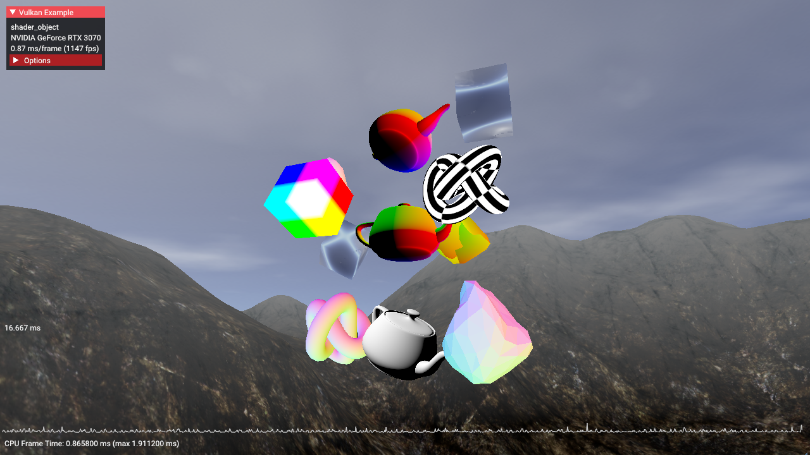

////
- Copyright 2023 Nintendo
 -
 - Licensed under the Apache License, Version 2.0 (the "License");
 - you may not use this file except in compliance with the License.
 - You may obtain a copy of the License at
 -
 -     http://www.apache.org/licenses/LICENSE-2.0
 -
 - Unless required by applicable law or agreed to in writing, software
 - distributed under the License is distributed on an "AS IS" BASIS,
 - WITHOUT WARRANTIES OR CONDITIONS OF ANY KIND, either express or implied.
 - See the License for the specific language governing permissions and
 - limitations under the License.
////
= Shader Object

== Overview

This sample demonstrates how to use the `VK_EXT_shader_object` extension, which provides a way to specify shaders and state without using `VkPipeline` objects.

When drawing with shader objects, shaders for each stage are set individually on a command buffer and state can be set at any time before calling `vkCmdDraw*`.

This sample sets a minimal amount of state required for each draw call, and only updates state when the next draw call requires it.

In its default configuration, this sample automatically iterates over permutations of shaders and state, randomly changing one of:

* The shader used by one stage of one model
* The post processing fragment shader
* The output color format
* The output depth format

The models in the middle demonstrate the use of linked vertex and fragment shaders, which can only ever change in tandem.
The surrounding models use unlinked shaders, where each model uses its own separate vertex, fragment, and potentially geometry shaders.

Post processing, which is enabled by default, applies a specified visual effect to the results of model rendering.

An optional wireframe mode may be enabled if supported by the device.

This sample can be configured at runtime through a debug GUI.
This UI allows you to change various aspects of the scene that would be impractical to control dynamically using pipelines.
UI drawing also demonstrates interoperability between pipelines within conventional render passes (which are used to render the UI) and shader objects with dynamic rendering (which are used to render the scene).

A plot of the last 2000 CPU frame times is displayed at the bottom of the screen.
This plot shows the CPU impact of swapping shaders and state at runtime.

Shader objects may only be used within `VK_KHR_dynamic_rendering` render passes.
The link:../dynamic_rendering[dynamic rendering sample] explains how to use that extension in more detail.
The main parts relevant to drawing with shader objects are `vkCmdBeginRenderingKHR` and `vkCmdEndRenderingKHR`.

== Enabling the Extension

In order to use shader objects, both the `VK_EXT_shader_object` extension and the `shaderObject` feature need to be enabled on the `VkDevice`.
This is accomplished by including `VK_EXT_SHADER_OBJECT_EXTENSION_NAME` in ``VkDeviceCreateInfo``'s `ppEnabledExtensionNames` array, and also including a `VkPhysicalDeviceShaderObjectFeaturesEXT` structure with the `shaderObject` feature set to `VK_TRUE` in its `pNext` chain.

In our case, these are handled through a common abstraction shared with the other samples.

[,CPP]
----
add_device_extension(VK_EXT_SHADER_OBJECT_EXTENSION_NAME);
----

[,CPP]
----
// Enable Shader Object
auto &requestedShaderObject        = gpu.request_extension_features<VkPhysicalDeviceShaderObjectFeaturesEXT>(VK_STRUCTURE_TYPE_PHYSICAL_DEVICE_SHADER_OBJECT_FEATURES_EXT);
requestedShaderObject.shaderObject = VK_TRUE;
----

== Shader Object Creation

`VkShaderEXT` objects are created using the `vkCreateShadersEXT` function.

[,CPP]
----
VkResult vkCreateShadersEXT(
    VkDevice                     device,
    uint32_t                     createInfoCount,
    const VkShaderCreateInfoEXT* pCreateInfos,
    const VkAllocationCallbacks* pAllocator,
    VkShaderEXT*                 pShaders);
----

In this sample, shaders are abstracted into a `Shader` class.
This class holds the created `VkShaderEXT` object, information needed for building and binding the shader.

[,CPP]
----
class Shader
{
    VkShaderStageFlagBits stage;
    VkShaderStageFlags    next_stage;
    VkShaderEXT           shader      = VK_NULL_HANDLE;
    std::string           shader_name = "shader";
    VkShaderCreateInfoEXT vk_shader_create_info;
    std::vector<uint32_t> spirv;

    // ...
}
----

The scene contains multiple models that each use multiple `Shader` objects.

== Linked Shaders

If we know a combination of shaders will always be used together we can link the shaders together.
Linked shaders allow the driver to perform cross stage optimizations that can potentially improve GPU performance when the shaders are executed.

One of the ways this sample uses linked shaders is for the skybox.

The skybox uses only a vertex and fragment shader.
The vertex shader's stage is set to `VK_SHADER_STAGE_VERTEX_BIT` with its next stage set to only `VK_SHADER_STAGE_FRAGMENT_BIT`.
The fragment shader's stage is set to `VK_SHADER_STAGE_FRAGMENT_BIT`, with no next stage.

To draw with shader objects we need to create one `VkShaderEXT` object per shader stage.
This means we need an instance of the `Shader` class for each shader stage.

[,CPP]
----
// Create shaders with current and next stage bits and set the shaders GLSL shader data, descriptor sets, and push constants

skybox_vert_shader = new Shader(VK_SHADER_STAGE_VERTEX_BIT,
                                VK_SHADER_STAGE_FRAGMENT_BIT,
                                "skybox vert",
                                vert_shader_data,
                                &descriptor_set_layouts[ShaderTypeBasic],
                                &push_constant_ranges[ShaderTypeBasic]);
skybox_frag_shader = new Shader(VK_SHADER_STAGE_FRAGMENT_BIT,
                                0,
                                "skybox frag",
                                frag_shader_data,
                                &descriptor_set_layouts[ShaderTypeBasic],
                                &push_constant_ranges[ShaderTypeBasic]);
----

The `Shader` class require us to provide the entire contents of the `VkShaderCreateInfoEXT` structure including information to compile the GLSL.
The constructor will compile the GLSL and fill out the `VkShaderCreateInfoEXT` structure for this `Shader`.

[,CPP]
----
ShaderObject::Shader::Shader(VkShaderStageFlagBits stage_,
                             VkShaderStageFlags    next_stage_,
                             std::string           shader_name_,
                             const std::vector<uint8_t> & vert_glsl_source,
                             const VkDescriptorSetLayout *pSetLayouts,
                             const VkPushConstantRange *  pPushConstantRange)
{
    stage       = stage_;
    shader_name = shader_name_;
    next_stage  = next_stage_;

	// Compile the GLSL source
	if (!glsl_compiler.compile_to_spirv(stage, vert_glsl_source, "main", {}, spirv, info_log))
	{
		LOGE("Failed to compile shader, Error: {}", info_log.c_str());
	}

	// Fill out the shader create info struct
	vk_shader_create_info.sType                  = VK_STRUCTURE_TYPE_SHADER_CREATE_INFO_EXT;
	vk_shader_create_info.pNext                  = nullptr;
	vk_shader_create_info.flags                  = 0;
	vk_shader_create_info.stage                  = stage;
	vk_shader_create_info.nextStage              = next_stage;
	vk_shader_create_info.codeType               = VK_SHADER_CODE_TYPE_SPIRV_EXT;
	vk_shader_create_info.codeSize               = spirv.size() * sizeof(spirv[0]);
	vk_shader_create_info.pCode                  = spirv.data();
	vk_shader_create_info.pName                  = "main";
	vk_shader_create_info.setLayoutCount         = 1;
	vk_shader_create_info.pSetLayouts            = pSetLayouts;
	vk_shader_create_info.pushConstantRangeCount = 1;
	vk_shader_create_info.pPushConstantRanges    = pPushConstantRange;
	vk_shader_create_info.pSpecializationInfo    = nullptr;
}
----

We want the skybox shaders to be linked, so we need to add the `VK_SHADER_CREATE_LINK_STAGE_BIT_EXT` flag to each shader's `VkShaderCreateInfoEXT`.
The sample determines whether to add the flag at shader creation time depending on if `build_shader` or `build_linked_shaders` is called.
`build_linked_shaders` will be called with pointers to the vertex and fragment shaders.
The sample only supports linked vertex and fragment shaders and does not handle linking other shader stages such as geometry.

[,CPP]
----
// Set the fragment shader as linked to build them linked and build the shader
build_linked_shaders(device, skybox_vert_shader, skybox_frag_shader);
----

To build the shaders we call `vkCreateShadersEXT` with all of the ``VkShaderCreateInfoEXT``s for each of the linked shaders.
The `build_linked_shaders` function adds the `VK_SHADER_CREATE_LINK_STAGE_BIT_EXT` flag to each `VkShaderCreateInfoEXT` struct, then calls `vkCreateShadersEXT` on both shaders.

[,CPP]
----
void ShaderObject::build_linked_shaders(VkDevice device, ShaderObject::Shader *vert, ShaderObject::Shader *frag)
{
	VkShaderCreateInfoEXT shader_create_infos[2];

	if (vert == nullptr || frag == nullptr)
	{
		LOGE("build_linked_shaders failed with null vertex or fragment shader\n");
	}

	shader_create_infos[0] = vert->get_create_info();
	shader_create_infos[1] = frag->get_create_info();

	for (auto &shader_create : shader_create_infos)
	{
		shader_create.flags |= VK_SHADER_CREATE_LINK_STAGE_BIT_EXT;
	}

	VkShaderEXT shaderEXTs[2];

	// Create the shader objects
	VkResult result = vkCreateShadersEXT(device,
	                                     2,
	                                     shader_create_infos,
	                                     nullptr,
										 shaderEXTs);

	if (result != VK_SUCCESS)
	{
		LOGE("vkCreateShadersEXT failed\n");
	}

	vert->set_shader(shaderEXTs[0]);
	frag->set_shader(shaderEXTs[1]);
}
----

The skybox shaders can now be bound and used to draw.

== Unlinked Shaders

Linking shaders is optional.
For some use cases it may be advantageous to create shaders that are not linked.
This allows arbitrary combinations of shaders to be used together at command buffer recording time, though you should keep in mind that the driver may be less able to optimize the shaders' GPU performance.

In order to use a given combination of unlinked shaders together, their input and output interfaces need to be compatible and their arrays of descriptor set layouts and push constants must be identical.

Some models in the scene use unlinked shaders.
For the sake of convenience, this sample refers to these models as "material models".

Each of the material models binds different vertex, geometry, and fragment shaders.
Each of the vertex shaders can be used with each of the geometry and fragment shaders.

This sample lets you disable the geometry stage through the debug UI, so all of the vertex shaders support both geometry or fragment as a next stage.
In order to allow either next stage, the vertex shaders are created with next stage flags of `VK_SHADER_STAGE_GEOMETRY_BIT | VK_SHADER_STAGE_FRAGMENT_BIT` and set the GLSL, descriptors, and push constants.

[,CPP]
----
// Create shader with current and next stage bits set the GLSL shader data, descriptor sets, and push constants
material_vert_shaders.emplace_back(
    new Shader(VK_SHADER_STAGE_VERTEX_BIT,
               VK_SHADER_STAGE_GEOMETRY_BIT | VK_SHADER_STAGE_FRAGMENT_BIT,
               shader_name.substr(unlinked_material_prefix_size, shader_name.length() - (unlinked_material_prefix_size + frag_suffix_size)),
               shader_data,
               &descriptor_set_layouts[ShaderTypeMaterial],
               &push_constant_ranges[ShaderTypeMaterial]));
----

Then build the shader alone.
This works similarly to the earlier skybox example, except that the ``VkShaderEXT``s are created separately.

[,CPP]
----
// Build shader
build_shader(device, material_vert_shaders.back());
----

The `build_shader` function is very similar to `build_linked_shaders` but only creates one `VkShaderEXT` object.

[,CPP]
----
void ShaderObject::build_shader(VkDevice device, ShaderObject::Shader *shader)
{
	VkShaderEXT shaderEXT;
	VkShaderCreateInfoEXT shaderCreateInfo = shader->get_create_info();

	VkResult result = vkCreateShadersEXT(device, 1, &shaderCreateInfo, nullptr, &shaderEXT);

	if (result != VK_SUCCESS)
	{
		LOGE("vkCreateShadersEXT failed\n");
	}

	shader->set_shader(shaderEXT);
}
----

== Binding Shaders

`VkShaderEXT` objects need to be bound to the command buffer for use in subsequent `vkCmdDraw*` calls.
One or more shader objects can be bound using `vkCmdBindShadersEXT`.

Before drawing the skybox we need to bind the relevant `VkShaderEXT` objects.
This sample calls the `bind_shader` function, which simply binds the ``Shader``'s `VkShaderEXT`.

[,CPP]
----
// Bind shaders for the skybox
bind_shader(draw_cmd_buffer, skybox_vert_shader);
bind_shader(draw_cmd_buffer, skybox_frag_shader);
----

[,CPP]
----
void ShaderObject::bind_shader(VkCommandBuffer cmd_buffer, ShaderObject::Shader *shader)
{
	vkCmdBindShadersEXT(cmd_buffer, 1, shader->get_stage(), shader->get_shader());
}
----

The unlinked shaders are bound with multiple calls to `bind_shader`, one per each shader to bind.

[,CPP]
----
void ShaderObject::bind_material_shader(VkCommandBuffer cmd_buffer, int shader_index)
{
	CurrentShader &shader = current_material_shaders[shader_index];

	bind_shader(cmd_buffer, material_vert_shaders[shader.vert]);
	if (enable_geometry_pass)
		bind_shader(cmd_buffer, material_geo_shaders[shader.geo]);
	bind_shader(cmd_buffer, material_frag_shaders[shader.frag]);
}
----

It would be equally valid for the `Shader` class to be designed to bind all of the `VkShaderEXT` objects in a single `vkCmdBindShadersEXT` call.

== Unbinding Shaders

Bound shaders can be unbound by calling `vkCmdBindShadersEXT` with `pShaders` set to `nullptr` and `pStages` set to an array of stages to unbind.

This sample uses a geometry shader for only some draws, so we need to unbind the geometry shader before draws that don't need them.

[,CPP]
----
// Unbind geometry shader by binding nullptr to the geometry stage
VkShaderStageFlagBits geo_stage = VK_SHADER_STAGE_GEOMETRY_BIT;
vkCmdBindShadersEXT(draw_cmd_buffer, 1, &geo_stage, nullptr);
----

Before drawing with shader objects, applications are required to bind either `nullptr` or a valid `VkShaderEXT` object for every shader stage enabled on the device.
A valid geometry stage shader will not be bound before the first draw so we need to bind `nullptr` to it.
The same code as above can be used.

This sample does not enable the `tessellationShader` device feature, so it's not necessary to bind anything to either tessellation stage.

== State Setting and Drawing

The https://registry.khronos.org/vulkan/specs/1.3-extensions/html/vkspec.html#shaders-objects-state[Setting State] subsection of the https://registry.khronos.org/vulkan/specs/1.3-extensions/html/vkspec.html#shaders-objects[Shader Objects] section of the Vulkan specification lists the graphics state that needs to be set on a command buffer before `vkCmdDraw*` can be called with graphics shader objects bound.

This sample demonstrates one possible way to take advantage of these rules to minimize calls into the Vulkan driver.

All of the required and common state for this sample, such as vertex input binding descriptions, is set in `set_initial_state` before any draw calls.
State specific to particular draws is set on the command buffer as needed.

For the skybox, we disable culling and writing to depth.

[,CPP]
----
// Disable depth write and use cull mode none to draw skybox
vkCmdSetCullModeEXT(draw_cmd_buffer, VK_CULL_MODE_NONE);
vkCmdSetDepthWriteEnableEXT(draw_cmd_buffer, VK_FALSE);
----

Then we bind the descriptor sets and push constants for the draw.

[,CPP]
----
// Bind descriptors and push constants for the skybox draw
glm::mat4 model_matrix = glm::mat4(1.0f);
vkCmdBindDescriptorSets(draw_cmd_buffer, VK_PIPELINE_BIND_POINT_GRAPHICS, pipeline_layout[ShaderTypeBasic], 0, 1, &descriptor_sets[ShaderTypeBasic], 0, nullptr);
vkCmdPushConstants(draw_cmd_buffer, pipeline_layout[ShaderTypeBasic], VK_SHADER_STAGE_VERTEX_BIT, 0, sizeof(BasicPushConstant), &model_matrix);
----

Finally, we bind the shaders and draw the model.

[,CPP]
----
// Bind shaders for the skybox
bind_shader(draw_cmd_buffer, skybox_vert_shader);
bind_shader(draw_cmd_buffer, skybox_frag_shader);

// Draw the skybox model
draw_model(skybox, draw_cmd_buffer);
----

The models that will be drawn next require different state than the skybox.

[,CPP]
----
vkCmdSetCullModeEXT(draw_cmd_buffer, VK_CULL_MODE_BACK_BIT);
vkCmdSetDepthWriteEnableEXT(draw_cmd_buffer, VK_TRUE);
----

Unlinked shaders are bound the same way as linked shaders.
First we set state, bind descriptor sets, push constants, and finally bind shaders and draw the model.

[,CPP]
----
// Update and push constants for cube 1
material_push_constant.model = glm::translate(glm::vec3(1.2f, -1.f, 0)) * glm::rotate((float) elapsed_time, glm::vec3(0, 1, 0)) * glm::scale(glm::vec3(0.05f));
vkCmdPushConstants(draw_cmd_buffer, pipeline_layout[ShaderTypeMaterial],
                    VK_SHADER_STAGE_VERTEX_BIT | VK_SHADER_STAGE_GEOMETRY_BIT | VK_SHADER_STAGE_FRAGMENT_BIT,
                    0, sizeof(MaterialPushConstant), &material_push_constant);

// Bind shaders for cube 1, which is material model 2
bind_material_shader(draw_cmd_buffer, 2);

// Draw cube 1
draw_model(cube, draw_cmd_buffer);
----

After rendering the skybox, terrain, and all other models, an optional post processing effect is applied to the intermediate image.
The final result is drawn to the screen.

== Options

The debug UI allows various aspects of rendering to be controlled dynamically.
It can change shaders per model, both color and depth output formats, and the post processing effect.
This level of dynamism would be impractical to achieve using pipelines because the tens of thousands of permutations of state would potentially each require their own pipeline.
Shader objects, on the other hand, support this kind of application architecture naturally.

== Emulation Layer

The Vulkan SDK ships with an https://github.com/KhronosGroup/Vulkan-ExtensionLayer/blob/main/docs/shader_object_layer.md[emulation layer] that allows `VK_EXT_shader_object` to be used on drivers that don't yet have native support for the extension.
The layer is useful for applications that want to use shader objects without implementing their own pipeline based fallback path for older drivers without native support.
The layer can be shipped with your application, and it will disable itself if a native implementation of `VK_EXT_shader_object` exists in the driver.

The emulation layer can be enabled by adding `VK_LAYER_KHRONOS_shader_object` to `ppEnabledLayerNames` in `VkDeviceCreateInfo`.

The sample framework already has an existing abstraction normally used for enabling the validation layer.
This sample repurposes this mechanism to instead load the emulation layer.

[,CPP]
----
const std::vector<const char *> ShaderObject::get_validation_layers()
{
    return {"VK_LAYER_KHRONOS_shader_object"};
}
----

Because you can't rely on the Vulkan SDK to be installed on a user's system, this sample's method of loading the layer is not suitable for a real application.
Instead, the layer needs to be shipped with the application.

There are various ways to ship the layer with an application.
One method is to copy the layer's `VkLayer_khronos_shader_object.dll` and `VkLayer_khronos_shader_object.json` from the Vulkan SDK to the same directory as your application's executable and then append the path to these files to the `VK_LAYER_PATH` environment variable before your first call into the Vulkan API.

However the layer is packaged, the Vulkan Loader is always responsible for loading the layer.
Because of this the layer's files will always need to be somewhere accessible to the loader.

== Additional Resources

* https://www.khronos.org/blog/you-can-use-vulkan-without-pipelines-today[You Can Use Vulkan Without Pipelines Today]
* https://github.com/KhronosGroup/Vulkan-Docs/blob/main/proposals/VK_EXT_shader_object.adoc[Extension Proposal]
* https://registry.khronos.org/vulkan/specs/1.3-extensions/html/vkspec.html#shaders-objects[Specification]
* https://github.com/KhronosGroup/Vulkan-ExtensionLayer/blob/main/docs/shader_object_layer.md[Emulation Layer]

== Conclusion

Shader objects can be an invaluable tool for simplifying shader and state management in highly dynamic application architectures which don't lend themselves to practical implementation using pipelines.

With increasingly widespread driver support augmented by the emulation layer, applications best suited to this kind of architecture can be designed around shader objects instead of pipelines with high confidence that they will achieve a user experience as good or better than what a pipeline based implementation could realistically achieve.
