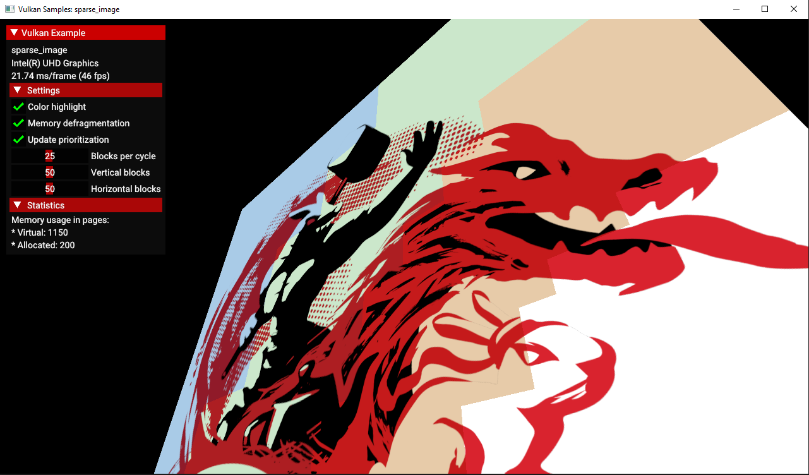

////
- Copyright (c) 2023, Mobica Limited
-
- SPDX-License-Identifier: Apache-2.0
-
- Licensed under the Apache License, Version 2.0 the "License";
- you may not use this file except in compliance with the License.
- You may obtain a copy of the License at
-
-     http://www.apache.org/licenses/LICENSE-2.0
-
- Unless required by applicable law or agreed to in writing, software
- distributed under the License is distributed on an "AS IS" BASIS,
- WITHOUT WARRANTIES OR CONDITIONS OF ANY KIND, either express or implied.
- See the License for the specific language governing permissions and
- limitations under the License.
-
////

== Sparse image

ifdef::site-gen-antora[]
TIP: The source for this sample can be found in the https://github.com/KhronosGroup/Vulkan-Samples/tree/main/samples/extensions/sparse_image[Khronos Vulkan samples github repository].
endif::[]

== Overview

The usage of
https://registry.khronos.org/vulkan/site/spec/latest/chapters/sparsemem.html[Sparse
Resources] allows for less restrict memory binding in comparison to a
standard resource.

The key differences between standard and sparse resources, showcased in
this sample are:

* Sparse resources can be bound non-contiguously to one or more
VkDeviceMemory allocations;
* Sparse resources can be re-bound to different memory allocations over
the lifetime of the resource;

The sample demonstrates usage of the Sparse Image feature by rendering a
high-resolution texture with only a fraction of the total image size
ACTUALLY allocated on the device’s memory. This is possible by
dynamically loading required memory areas, generating mip levels for
outer parts, removing unused memory and finally: binding an image in the
real-time.

== Enabling features

There are 3 features to be enabled:

* sparseBinding;
* sparseResidencyImage2D;
* shaderResourceResidency;

First two, are the key features required for the usage of the sparse
image resources. The last one - shaderResourceResidency, is required for
the fragment shader to be able to detect which parts of the image are
allocated in the memory.

[source,c++]
----
void SparseImage::request_gpu_features(vkb::PhysicalDevice &gpu)
{
	if (gpu.get_features().sparseBinding && gpu.get_features().sparseResidencyImage2D && gpu.get_features().shaderResourceResidency)
	{
		gpu.get_mutable_requested_features().sparseBinding           = VK_TRUE;
		gpu.get_mutable_requested_features().sparseResidencyImage2D  = VK_TRUE;
		gpu.get_mutable_requested_features().shaderResourceResidency = VK_TRUE;
	}
----

== Enabling extensions

There is a single extensions used in this sample:

* GL_ARB_sparse_texture2;

This extension is used only by the fragment shader, but requires
shaderResourceResidency feature to be enabled first. What this extension
does, is allowing the fragment to check if the memory for the particular
fragment is actually allocated or not. Because of this extension, it is
possible to keep checking the residency from the fragment shader, and
basically use the most detailed data available.

[source,glsl]
----
#extension GL_ARB_sparse_texture2 : enable
----

[source,glsl]
----
for(; (lod <= maxLOD) && !sparseTexelsResidentARB(residencyCode); lod += 1)
{
	residencyCode = sparseTextureLodARB(texSampler, fragTexCoord, lod, color);
}
----

== Conclusion

The primary usage of the sparse image feature is generally speaking
dedicated for cases where too much device’s memory is occupied. Keeping
a low-detailed mip-level constantly in the memory and dynamically
loading required areas when the camera changes, is the way to handle
terrain mega-textures. The downside of these solution is that there is a
possibility of a bottleneck problem when constantly transferring
required memory chunks from the CPU to the device. The other downside is
that since the application decides what memory is going to be allocated,
it must take care of the calculations such as: "`what level of detail is
required?`". This creates an unwanted CPU overhead.