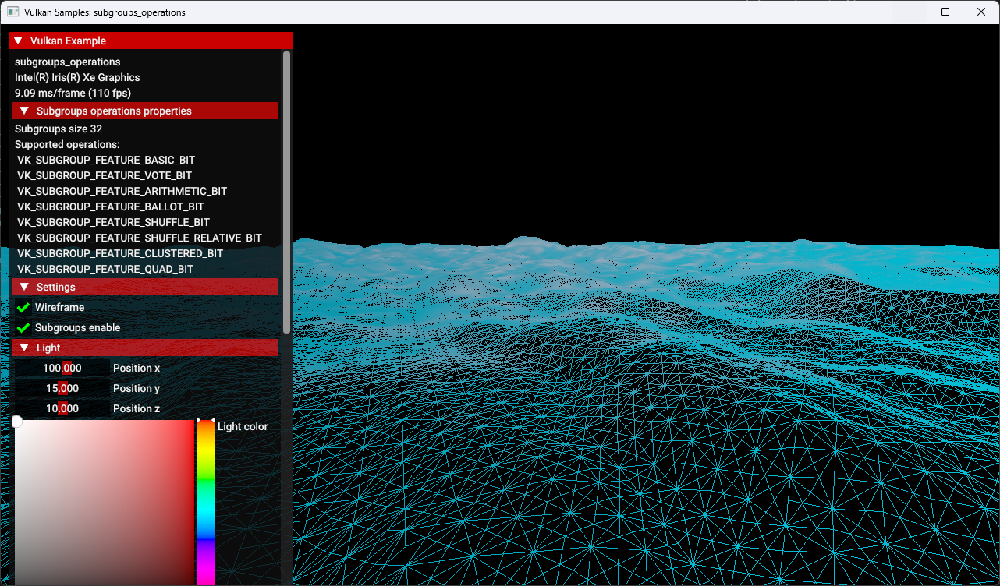

<!-- - Copyright (c) 2023, Mobica Limited - - SPDX-License-Identifier: Apache-2.0 - - Licensed under the Apache License, Version 2.0 the "License"; - you may not use this file except in compliance with the License.
- You may obtain a copy of the License at - -     http://www.apache.org/licenses/LICENSE-2.0
- - Unless required by applicable law or agreed to in writing, software - distributed under the License is distributed on an "AS IS" BASIS, - WITHOUT WARRANTIES OR CONDITIONS OF ANY KIND, either express or implied.
- See the License for the specific language governing permissions and - limitations under the License.
- -->

# Subgroups Operations

## Overview

This sample demonstrates how to use and enable the Subgroups operations feature.


## GLSL Shaders

In shader enable `GL_KHR_shader_subgroup_basic` extension.
TODO: add more description

## Enabling the Feature

To enable the subgroups feature in the Vulkan API you must create a Vulkan instance with a minimum version of version 1.1. Enable the extension `VK_EXT_subgroup_size_control` and get the subgroup properties of a physical device

```C++
VkPhysicalDeviceSubgroupProperties subgroups_properties;
subgroups_properties.sType = VK_STRUCTURE_TYPE_PHYSICAL_DEVICE_SUBGROUP_PROPERTIES;
subgroups_properties.pNext = VK_NULL_HANDLE;

VkPhysicalDeviceProperties2 device_properties2 = {};
device_properties2.sType                       = VK_STRUCTURE_TYPE_PHYSICAL_DEVICE_PROPERTIES_2;
device_properties2.pNext                       = &subgroups_properties;
vkGetPhysicalDeviceProperties2(gpu.get_handle(), &device_properties2);
```

TODO: add more description

## Additional information

More about subgroups you can read [in this article](https://www.khronos.org/blog/vulkan-subgroup-tutorial).
Documentation: https://registry.khronos.org/vulkan/specs/1.3-extensions/man/html/VkPhysicalDeviceSubgroupProperties.html
