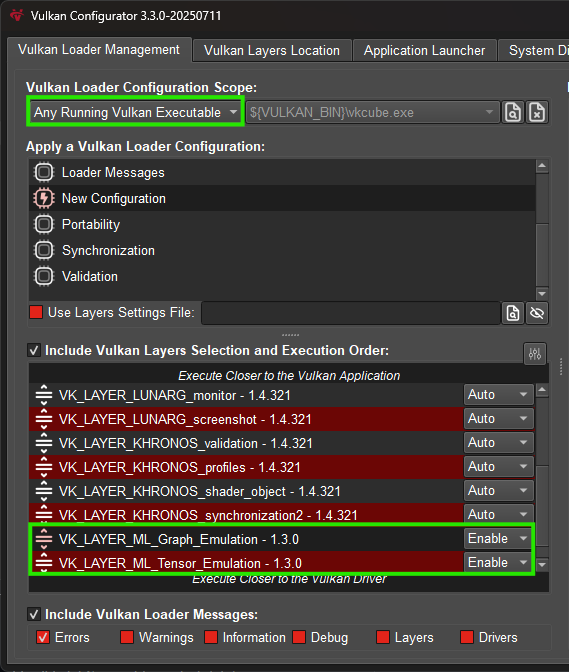

////
- Copyright (c) 2024-2025, Arm Limited and Contributors
-
- SPDX-License-Identifier: Apache-2.0
-
- Licensed under the Apache License, Version 2.0 the "License";
- you may not use this file except in compliance with the License.
- You may obtain a copy of the License at
-
-     http://www.apache.org/licenses/LICENSE-2.0
-
- Unless required by applicable law or agreed to in writing, software
- distributed under the License is distributed on an "AS IS" BASIS,
- WITHOUT WARRANTIES OR CONDITIONS OF ANY KIND, either express or implied.
- See the License for the specific language governing permissions and
- limitations under the License.
-
////

= Tensor and Data Graph

== Overview

The samples in this folder demonstrate the use of the *VK_ARM_tensors* and *VK_ARM_data_graph* extensions. The *VK_ARM_data_graph* extension introduces data graph pipelines, which are used in all samples. A data graph pipeline is a new Vulkan pipeline type designed to execute dataflow graphs that can be described using SPIR-V modules. Similar to compute pipelines, they use descriptor sets to access external resources, are compiled at creation time, and support pipeline caching and offline binaries.

Data graph pipelines integrate naturally into the existing Vulkan ecosystem, leveraging familiar SPIR-V tooling and workflows, and are especially well-suited for machine learning workloads as a drop-in replacement for sequences of compute pipelines.

To demonstrate their use, we’ve added data graph pipeline-based samples that walk through setting up a data graph pipeline and executing simple neural networks. These examples cover key features such as using graph constants, writing SPIR-V code, creating tensors, interacting with compute shaders and aliasing memory to avoid unnecessary copying.

The samples in this folder are:

* xref:./simple_tensor_and_data_graph/README.adoc[Simple tensor and data graph]

== Setup

Some setup steps are needed before you can build and run these samples.

NOTE: The samples and their dependencies can be built and run on Windows and Linux, other operating systems are not currently supported.

=== Update Vulkan SDK

In order to compile the shader code used in these samples, a recent version of the Vulkan SDK is required. The samples have been tested and confirmed to work with SDK version 1.4.321.

=== Enable the emulation layers (Graph & Tensor)

Note: The ML Emulation Layer for Vulkan is only required on devices where the *VK_ARM_tensors* and *VK_ARM_data_graph* extensions are not available.

Install and enable link:https://github.com/arm/ai-ml-emulation-layer-for-vulkan[ML Emulation Layer for Vulkan] from GitHub. Please follow the steps in that repository to build and enable the emulation layers.

Alternatively, on Windows, the Vulkan Configurator tool — which is part of the Vulkan SDK — can also be used, as described below. If it is not already installed, it can be obtained from the link:https://vulkan.lunarg.com/[Vulkan SDK] website.

Once installed, open Vulkan Configurator and navigate to the Vulkan Layers Location tab. Click the plus (+) symbol to append a user-defined layers path,
and navigate to the folder containing the built layers (DLLs and json files). Please note that there are two separate layers that need to be enabled, so if these are in separate folders then you will need to add both.

Note: It is recommended to disable the validation layer when running these samples as the new extensions are not supported yet.

This should add the layers to the Vulkan Loader Management tab. The Graph layer needs to sit on top of the Tensor layer.

When running any of these samples, if you receive an error message similar to:
----
 Requested required feature <VkPhysicalDeviceTensorFeaturesARM::shaderTensorAccess> is not supported
----
then it is likely that the emulation layers are not enabled correctly. Please check the steps above to ensure that the layers are loaded and enabled and make sure the Vulkan Configurator is running before launching the sample executable. Depending on your system, you may encounter issues with using the emulation layers when running with administrative privileges - please try running without administrative privileges if you encounter issues.

