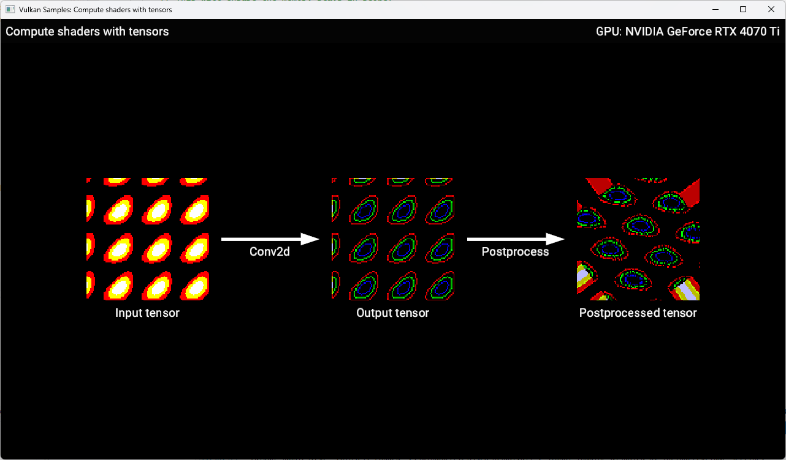

////
- Copyright (c) 2025-2026, Arm Limited and Contributors
-
- SPDX-License-Identifier: Apache-2.0
-
- Licensed under the Apache License, Version 2.0 the "License";
- you may not use this file except in compliance with the License.
- You may obtain a copy of the License at
-
-     http://www.apache.org/licenses/LICENSE-2.0
-
- Unless required by applicable law or agreed to in writing, software
- distributed under the License is distributed on an "AS IS" BASIS,
- WITHOUT WARRANTIES OR CONDITIONS OF ANY KIND, either express or implied.
- See the License for the specific language governing permissions and
- limitations under the License.
-
////
= Compute Shaders with Tensors

ifdef::site-gen-antora[]
TIP: The source for this sample can be found in the https://github.com/KhronosGroup/Vulkan-Samples/tree/main/samples/extensions/extensions/tensor_and_data_graph/compute_shaders_with_tensors[Khronos Vulkan samples github repository].
endif::[]

== Overview

This is the third sample in a series, which follows on from the xref:samples/extensions/tensor_and_data_graph/graph_constants/README.adoc[`graph_constants`] sample. To best understand this sample, it would be helpful to have first looked at the xref:samples/extensions/tensor_and_data_graph/README.adoc[previous samples in the series]. This adds the use of compute shaders for generating the input to and processing the output of the data graph pipeline.

== Setup

If you would like to build and run this sample, please make sure to first follow the setup steps on the xref:samples/extensions/tensor_and_data_graph/README.adoc[tensor and data graph] page.

== Introduction

Many real-world applications are built using a combination of Machine Learning operations and custom compute shaders.
In this sample, we will learn how to use compute shaders in combination with data graph pipelines. We will run a simple convolutional neural network (Convolution 2D layer) that consumes a single input tensor (generated by a compute shader), constant weights and constant biases.
The output of the network is then processed using another compute shader, which rotates the output tensor over time.
In order to display the contents of the tensors onto the window, a compute shader is run after the post-processing compute shader, which 'draws' the tensors into an image which is then blitted to the window.

image::./images/flow.svg[Flow]

== Accessing tensors from compute shaders

Tensor resources can be accessed from compute shaders similary to how images and buffers can be accessed - they are bound as resources in descriptor sets and can be read or written using built-in functions in GLSL.

First, we declare the `GL_ARM_tensors`` extension which is required for tensor support:

[source,cpp,options="nowrap"]
----
#extension GL_ARM_tensors : enable
----

Then we declare our descriptor set interface. In this case we’re declaring two tensor resources,
an input tensor passed via descriptor set 0, binding 0 and an output tensor passed
via descriptor set 0, binding 1. The type of both tensors is declared using
`tensorARM<float, 4>` which indicates that both are rank-4 tensors with float elements.
We also add the `writeonly` keyword to the output.

[source,cpp,options="nowrap"]
----
layout (set = 0, binding = 0) uniform tensorARM<float, 4> input_tensor;
layout (set = 0, binding = 1) writeonly uniform tensorARM<float, 4> output_tensor;
----

In the shader code we use the `tensorReadARM` and `tensorWriteARM` built-in functions to read from the input tensor and write to the output tensor, respectively. The coordinates for reading and writing are passed as an array of integers (with length equal to the rank of the tensor, in this case 4). In this example our tensors are representing 2D images and the final dimension represents the color channels (RGB), so we will use the global invocation ID to determine which element of the tensors to access. We access multiple elements at once by passing an array of elements as the final argument so that we can read/write the entire color as a `float[3]`.

[source,cpp,options="nowrap"]
----
void main()
{
    // Coordinates in 'NHWC' order
    uint coords[4] = uint;
    float[3] value;

    // Read from input tensor
    tensorReadARM(input_tensor, coords, value);

    // Do some processing on the value

    // Write to output tensor
    tensorWriteARM(output_tensor, coords, value);
}
----

In the sample code we have two compute shaders. The preprocessing shader procedurally generates the `input_tensor` using a combination of trig functions, while the post-processing shader reads elements from the `output_tensor` (output by the data graph pipeline) and writes them to different locations in the `postprocessed_tensor`, to rotate it.

== Binding tensors to compute shaders

Binding tensors to compute shaders is done in the same way as binding images and buffers, which is also the same way that tensors are bound to the inputs and outputs of data graph pipelines:

[source,cpp,options="nowrap"]
----
std::map<uint32_t, VkWriteDescriptorSetTensorARM> tensor_bindings =
{
    // Binding 0 is the output tensor from the data graph pipeline
    {0, VkWriteDescriptorSetTensorARM{VK_STRUCTURE_TYPE_WRITE_DESCRIPTOR_SET_TENSOR_ARM, nullptr, 1, &output_tensor_view->get_handle()}},
    // Binding 1 is the postprocessed tensor, which is written to.
    {1, VkWriteDescriptorSetTensorARM{VK_STRUCTURE_TYPE_WRITE_DESCRIPTOR_SET_TENSOR_ARM, nullptr, 1, &postprocessed_tensor_view->get_handle()}}
};

std::vector<VkWriteDescriptorSet> writes;
for (const auto &tensor_binding : tensor_bindings)
{
    VkWriteDescriptorSet write{VK_STRUCTURE_TYPE_WRITE_DESCRIPTOR_SET};
    write.dstSet          = descriptor_set;
    write.dstBinding      = 0;
    write.descriptorType  = VK_DESCRIPTOR_TYPE_TENSOR_ARM;
    // Tensor info is provided via pNext, rather than a pTensorInfo like for images/buffers
    write.pNext           = &tensor_binding.second;
    write.descriptorCount = 1;
    writes.push_back(write);
}

vkUpdateDescriptorSets(get_device().get_handle(), writes.size(), writes.data(), 0, nullptr);
----

== Tensor memory barriers

When using the same tensor across multiple commands it is important to ensure that the memory accesses are synchronized correctly. In our case, we have the `input_tensor` which is written by a compute shader and then read by the data graph pipeline, and the `output_tensor` which is written by the data graph pipeline and then read by the postprocess compute shader. We ensure synchronisation using tensor memory barriers, which are similar to image and buffer memory barriers. There are new pipeline stage and access flags for data graph pipelines to describe these dependencies. Here is an example of the barrier for the `input_tensor`:

[source,cpp,options="nowrap"]
----
VkTensorMemoryBarrierARM tensor_barrier = {VK_STRUCTURE_TYPE_TENSOR_MEMORY_BARRIER_ARM};
tensor_barrier.tensor                   = input_tensor->get_handle();
tensor_barrier.srcStageMask             = VK_PIPELINE_STAGE_2_COMPUTE_SHADER_BIT;
tensor_barrier.srcAccessMask            = VK_ACCESS_2_SHADER_WRITE_BIT;
tensor_barrier.dstStageMask             = VK_PIPELINE_STAGE_2_DATA_GRAPH_BIT_ARM;
tensor_barrier.dstAccessMask            = VK_ACCESS_2_DATA_GRAPH_READ_BIT_ARM;
VkDependencyInfo dependency_info        = {VK_STRUCTURE_TYPE_DEPENDENCY_INFO};
dependency_info.pNext                   = &tensor_barrier;
vkCmdPipelineBarrier2(command_buffer.get_handle(), &dependency_info);
----

A similar barrier is needed for the `output_tensor`.

== Conclusion

In this sample we've walked through how to mix compute shaders with data graph pipelines and how to synchronise memory accesses between dispatches.

This example is very simple and only scratches the surface of what the tensor extensions allow, but should be helpful for getting started with writing compute shaders that access tensors.
