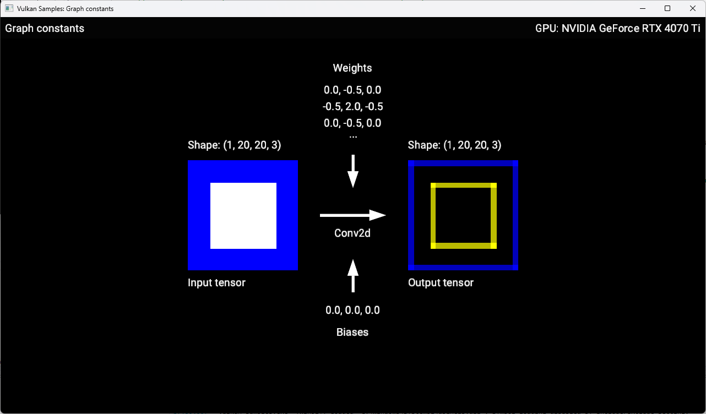
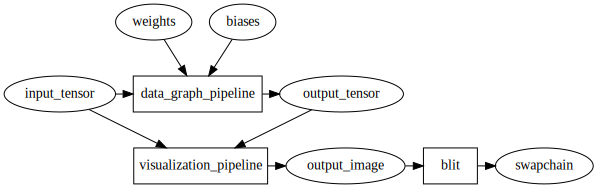

////
- Copyright (c) 2025-2026, Arm Limited and Contributors
-
- SPDX-License-Identifier: Apache-2.0
-
- Licensed under the Apache License, Version 2.0 the "License";
- you may not use this file except in compliance with the License.
- You may obtain a copy of the License at
-
-     http://www.apache.org/licenses/LICENSE-2.0
-
- Unless required by applicable law or agreed to in writing, software
- distributed under the License is distributed on an "AS IS" BASIS,
- WITHOUT WARRANTIES OR CONDITIONS OF ANY KIND, either express or implied.
- See the License for the specific language governing permissions and
- limitations under the License.
-
////
= Graph Constants

ifdef::site-gen-antora[]
TIP: The source for this sample can be found in the https://github.com/KhronosGroup/Vulkan-Samples/tree/main/samples/extensions/extensions/tensor_and_data_graph/graph_constants[Khronos Vulkan samples github repository].
endif::[]

== Overview

This is the second sample in a series, which follows on from the xref:samples/extensions/tensor_and_data_graph/simple_tensor_and_data_graph/README.adoc[`simple_tensor_and_data_graph`] sample. All the information from the previous sample applies here and acts as a baseline. This sample adds _graph constants_, which are used in a simple convolutional neural network as weights and biases.

== Setup

If you would like to build and run this sample, please make sure to first follow the setup steps on the xref:samples/extensions/tensor_and_data_graph/README.adoc[Tensor and Data Graph] page.

== Introduction

This sample demonstrates how to run a simple convolutional neural network (Convolution 2D layer) that consumes a single input tensor, constant weights and constant biases.
In order to display the contents of the input and output tensors onto the window, a compute shader is run after the neural network which 'draws' the two tensors into an image which is then blitted to the window.
The diagram below shows this overall flow:

== Graph Constants

Graph constants are resources whose values are provided at pipeline creation time and can never change. They have an integer ID that can be referenced by ML programs in SPIR-V modules.

=== SPIR-V

Here’s how a graph constant is defined in a SPIR-V module:

[source,cpp,options="nowrap"]
----
  %type = OpTypeTensorARM %float %uint_4 %uint_array_l4_3_3_3_3
   %cst = OpGraphConstantARM %type 0
----

`%cst` is the constant being defined, `%type` is its type, typically a tensor type and `0` is the unique identifier for the constant.
This identifier is used in the C++ code to provide the value for this constant.

The constant defined above can then be used in other SPIR-V instructions, such as the `CONV2D` operator:

[source,cpp,options="nowrap"]
----
  %conv = OpExtInst ... %tosa CONV2D ... %cst ...
----

For the full SPIR-V code, please see link:../../../../shaders/tensor_and_data_graph/spirv/conv2d.spvasm[conv2d.spvasm].

=== API Usage

The constants tensors are provided when creating the data graph pipeline using `vkCreateDataGraphPipelinesARM`.
The raw data for each constant is provided as a simple host pointer, which the implementation will copy and use as needed.

Here is an example of how to provide the constant data for the weights tensor of the CONV2D layer used in this sample:

[source,cpp,options="nowrap"]
----
std::vector<int64_t> dimensions = {3, 3, 3, 3};

VkTensorDescriptionARM tensor_description =
{
    VK_STRUCTURE_TYPE_TENSOR_DESCRIPTION_ARM,
    nullptr,
    VK_TENSOR_TILING_LINEAR_ARM,
    VK_FORMAT_R32_SFLOAT,
    dimensions.size(),
    dimensions.data(),
    nullptr,        // pStrides
    VK_TENSOR_USAGE_DATA_GRAPH_BIT_ARM
};

std::vector<float> constant_data = {
    // ...
};

VkDataGraphPipelineConstantARM pipeline_constant =
{
    VK_STRUCTURE_TYPE_DATA_GRAPH_PIPELINE_CONSTANT_ARM,
    &tensor_description,
    0,                                                   // Matches the unique identifier encoded in OpGraphConstantARM in the SPIR-V module
    constant_data.data()                                 // Host pointer to raw data
};

VkDataGraphPipelineCreateInfoARM pipeline_create_info
    {VK_STRUCTURE_TYPE_DATA_GRAPH_PIPELINE_CREATE_INFO_ARM};
pipeline_create_info.pNext             = &pipeline_shader_module_create_info;
pipeline_create_info.layout            = layout;
pipeline_create_info.resourceInfoCount = resource_infos.size();
pipeline_create_info.pResourceInfos    = resource_infos.data();

// Specify the graph constants
pipeline_create_info.constantCount = 1;
pipeline_create_info.pConstants = &pipeline_constant;

VK_CHECK(vkCreateDataGraphPipelinesARM(get_device().get_handle(),
                                       VK_NULL_HANDLE,
                                       VK_NULL_HANDLE,
                                       1,
                                       &pipeline_create_info,
                                       nullptr,
                                       &get_handle()));
----

Note that once the data graph pipeline is created, you don't need to keep the host pointer alive any longer.

== Conclusion

In this sample we've walked through how to add graph constants (weights and biases) to a simple neural network.