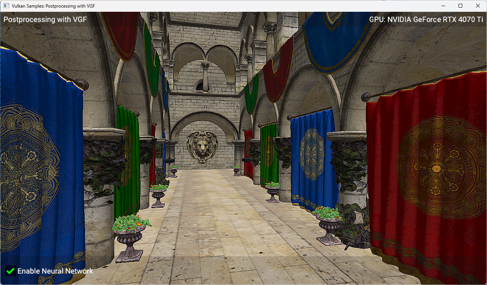

////
- Copyright (c) 2025-2026, Arm Limited and Contributors
-
- SPDX-License-Identifier: Apache-2.0
-
- Licensed under the Apache License, Version 2.0 the "License";
- you may not use this file except in compliance with the License.
- You may obtain a copy of the License at
-
-     http://www.apache.org/licenses/LICENSE-2.0
-
- Unless required by applicable law or agreed to in writing, software
- distributed under the License is distributed on an "AS IS" BASIS,
- WITHOUT WARRANTIES OR CONDITIONS OF ANY KIND, either express or implied.
- See the License for the specific language governing permissions and
- limitations under the License.
-
////
= Postprocessing with VGF

ifdef::site-gen-antora[]
TIP: The source for this sample can be found in the https://github.com/KhronosGroup/Vulkan-Samples/tree/main/samples/extensions/extensions/tensor_and_data_graph/simple_tensor_and_data_graph[Khronos Vulkan samples github repository].
endif::[]

== Overview

This is the fifth sample in a series, which follows on from the previous xref:samples/extensions/tensor_and_data_graph/tensor_image_aliasing/README.adoc[tensor image aliasing sample]. To best understand this sample, it would be helpful to have first looked at the xref:samples/extensions/tensor_and_data_graph/README.adoc[previous samples in the series].
This sample shows how to use the VGF format, which stores information about a neural network model such as SPIR-V code, input and output info and constant data used to run a data graph pipeline. The same tensor aliasing features are used as in the previous sample xref:samples/extensions/tensor_and_data_graph/tensor_image_aliasing/README.adoc[tensor image aliasing] to run a simple post-processing effect on a 3D scene.

== Setup

If you would like to build and run this sample, please make sure to first follow the setup steps on the xref:samples/extensions/tensor_and_data_graph/README.adoc[tensor and data graph] page.

== Introduction

A neural network model is more complicated than single shader and so benefits from a more structured format to describe it. The VGF format is a binary file that contains all the information needed to run a neural network model, including SPIR-V code which defines the model architecture, constant data for the trained weights and information about the inputs and outputs of the model.

VGF files are typically produced from offline tools that convert models from native formats such as PyTorch. In this sample, the VGF file is very simple and was generated from the same model used in the xref:samples/extensions/tensor_and_data_graph/tensor_image_aliasing/README.adoc[tensor image aliasing sample].

A VGF file is made up of multiple sections, as described below:

1. Module Table: This contains the SPIR-V code for each module. Each module is either a compute shader or a data graph.
2. Model Resource Table: This is a list of tensor descriptions (data formats, size etc.)
3. Model Sequence: This defines the order that the modules should be executed in, as well as their inputs and outputs.
4. Constant table: This contains the raw constant data for all constant tensors used in the model.

== VGF Creation

In this sample the VGF file has been generated offline, but there are a number of ways to create your own VGF file.

=== ML SDK for Vulkan

The link:https://github.com/arm/ai-ml-sdk-model-converter[ai-ml-sdk-model-converter] tool from the link:https://github.com/arm/ai-ml-sdk-for-vulkan[ai-ml-sdk-for-vulkan] can be used to create VGF files.

This tool currently supports several different link:https://www.mlplatform.org/tosa/[TOSA] encodings as inputs such as TOSA FlatBuffers, TOSA MLIR bytecode and TOSA MLIR textual format.
The link:https://review.mlplatform.org/plugins/gitiles/tosa/tosa_mlir_translator[tosa_mlir_translator] can be used to translate TOSA MLIR dialect into TOSA Flatbuffers.
The link:https://review.mlplatform.org/plugins/gitiles/tosa/serialization_lib[TOSA Serialization Library] also provides an API for creating TOSA FlatBuffers.

=== ai-ml-sdk-vgf-library Encoder

The link:https://github.com/arm/ai-ml-sdk-vgf-library[ai-ml-sdk-vgf-library] provides a lower level interface to create VGF files. This repository is already included as third_party dependency for this sample as it also provides the interface for decoding the VGF file, which is described in the next section. The library provides both a C and a C++ interface for decoding VGF files, in this case we are using the C interface.

=== Neural Graphics Model Gym ===

The link:https://github.com/arm/neural-graphics-model-gym[Neural Graphics Model Gym] is a Python toolkit for developing real-time neural graphics machine learning models and can export models to VGF format.

== VGF Loading

Firstly, we load the binary file into memory:

[source,cpp,options="nowrap"]
----
std::vector<uint8_t> vgf_buffer = vkb::filesystem::get()->read_file_binary(vgf_file_path);
----

We then decode the headers and validate them:

[source,cpp,options="nowrap"]
----
std::vector<uint8_t> header_decoder_memory(mlsdk_decoder_header_decoder_mem_reqs());
mlsdk_decoder_header_decoder* header_decoder =
    mlsdk_decoder_create_header_decoder(vgf_buffer.data(), header_decoder_memory.data());
----

With this we can begin to read the sections within the VGF file (as described in the <<Introduction>>):

[source,cpp,options="nowrap"]
----
mlsdk_decoder_vgf_section_info section_infos[4];
for (mlsdk_decoder_section section_type = mlsdk_decoder_section_modules;
        section_type <= mlsdk_decoder_section_constants;
        section_type = mlsdk_decoder_section(section_type + 1))
{

    mlsdk_decoder_get_header_section_info(header_decoder, section_type, &section_infos[section_type]);

    if (section_infos[section_type].offset + section_infos[section_type].size > vgf_buffer.size())
    {
        throw std::runtime_error("Corrupt VGF header (section out of bounds).");
    }
}

std::vector<uint8_t> module_table_decoder_memory(mlsdk_decoder_module_table_decoder_mem_reqs());
std::vector<uint8_t> model_resource_table_decoder_memory(mlsdk_decoder_model_resource_table_decoder_mem_reqs());
std::vector<uint8_t> model_sequence_decoder_memory(mlsdk_decoder_model_sequence_decoder_mem_reqs());
std::vector<uint8_t> constant_table_decoder_memory(mlsdk_decoder_constant_table_decoder_mem_reqs());

mlsdk_decoder_module_table_decoder* module_table_decoder =
    mlsdk_decoder_create_module_table_decoder(
        vgf_buffer.data() + section_infos[mlsdk_decoder_section_modules].offset,
        module_table_decoder_memory.data());

mlsdk_decoder_model_resource_table_decoder* model_resource_table_decoder =
    mlsdk_decoder_create_model_resource_table_decoder(
        vgf_buffer.data() + section_infos[mlsdk_decoder_section_resources].offset,
        model_resource_table_decoder_memory.data());

mlsdk_decoder_model_sequence_decoder* model_sequence_decoder =
    mlsdk_decoder_create_model_sequence_decoder(
        vgf_buffer.data() + section_infos[mlsdk_decoder_section_model_sequence].offset,
        model_sequence_decoder_memory.data());

mlsdk_decoder_constant_table_decoder* constant_table_decoder =
    mlsdk_decoder_create_constant_table_decoder(
        vgf_buffer.data() + section_infos[mlsdk_decoder_section_constants].offset,
        constant_table_decoder_memory.data());
----

We can then start to read the tensor info from the VGF file. We start by reading all the tensor information into the `all_tensor_infos` array:

[source,cpp,options="nowrap"]
----
size_t num_resource_entries = mlsdk_decoder_get_model_resource_table_num_entries(model_resource_table_decoder);
all_tensor_infos.reserve(num_resource_entries);

for (int resource_idx = 0; resource_idx < num_resource_entries; ++resource_idx)
{
    mlsdk_vk_format vk_format = mlsdk_decoder_get_vk_format(model_resource_table_decoder, resource_idx);

    mlsdk_decoder_tensor_dimensions dims_raw;
    mlsdk_decoder_model_resource_table_get_tensor_shape(model_resource_table_decoder, resource_idx, &dims_raw);
    std::vector<int64_t> tensor_shape(dims_raw.data, dims_raw.data + dims_raw.size);

    TensorInfo tensor_info;
    tensor_info.binding = resource_idx;
    tensor_info.dimensions = tensor_shape;
    tensor_info.format = static_cast<VkFormat>(vk_format);

    all_tensor_infos.push_back(tensor_info);
}
----

Next we can load the constants:

[source,cpp,options="nowrap"]
----
size_t num_model_constants = mlsdk_decoder_get_constant_table_num_entries(constant_table_decoder);

mlsdk_decoder_constant_indexes constant_indexes;
mlsdk_decoder_model_sequence_get_segment_constant_indexes(model_sequence_decoder, 0, &constant_indexes);

for (uint32_t idx = 0; idx < constant_indexes.size; ++idx)
{
    int model_constant_idx = constant_indexes.data[idx];
    if (model_constant_idx >= num_model_constants)
    {
        throw std::runtime_error("Corrupt VGF (segment constant idx out of bounds).");
    }

    uint32_t resource_index = mlsdk_decoder_constant_table_get_mrt_index(constant_table_decoder, model_constant_idx);
    if (resource_index >= num_resource_entries)
    {
        throw std::runtime_error("Corrupt VGF (constant resource idx out of bounds)");
    }

    mlsdk_decoder_constant_data constant_data;
    mlsdk_decoder_constant_table_get_data(constant_table_decoder, model_constant_idx, &constant_data);

    std::vector<int8_t> vector_data(constant_data.data, constant_data.data + constant_data.size);
}
----

We also query the input and output binding slots and save the tensor information for these tensors.

[source,cpp,options="nowrap"]
----
// Input
{
    uint32_t resource_index = mlsdk_decoder_binding_slot_mrt_index(model_sequence_decoder,
        mlsdk_decoder_model_sequence_get_input_binding_slot(model_sequence_decoder), 0);
    uint32_t binding_id = mlsdk_decoder_binding_slot_binding_id(model_sequence_decoder,
        mlsdk_decoder_model_sequence_get_input_binding_slot(model_sequence_decoder), 0);

    all_tensor_infos[resource_index].binding = binding_id;
    input_tensor_infos.push_back(all_tensor_infos[resource_index]);
}

// Output
{
    uint32_t resource_index = mlsdk_decoder_binding_slot_mrt_index(model_sequence_decoder,
        mlsdk_decoder_model_sequence_get_output_binding_slot(model_sequence_decoder), 0);
    uint32_t binding_id = mlsdk_decoder_binding_slot_binding_id(model_sequence_decoder,
        mlsdk_decoder_model_sequence_get_output_binding_slot(model_sequence_decoder), 0);

    all_tensor_infos[resource_index].binding = binding_id;
    output_tensor_infos.push_back(all_tensor_infos[resource_index]);
}
----

Lastly, we get the SPIR-V code and the entry point, which is used for setting up a data graph pipeline.

[source,cpp,options="nowrap"]
----
int32_t module_index = mlsdk_decoder_model_sequence_get_segment_module_index(model_sequence_decoder, 0);

mlsdk_decoder_spirv_code spirv_code;
mlsdk_decoder_get_module_code(module_table_decoder, module_index, &spirv_code);
if (!spirv_code.code || spirv_code.words == 0)
{
    throw std::runtime_error("Missing SPIRV code for module.");
}

std::vector<uint32_t> code(spirv_code.code, spirv_code.code + spirv_code.words);
const char* entry_point = mlsdk_decoder_get_module_entry_point(module_table_decoder, 0);
----

We then use this information when creating our input and output tensors and our data graph pipeline. The SPIR-V code is used to create the `VkShaderModule` and the constant data is used when creating the data graph pipeline. Once created, the data graph pipeline can be executed as normal.

== Conclusion

In this sample, we've walked through some options for creating a VGF file, loading it, and using the data from it to run a data graph pipeline.

== Known Issues

* The model in the VGF file uses a fixed resolution of 1280x720, so the sample will always render to a render target of this size, no matter the window size. This will result in poor quality rendering if the window size does not match 1280x720. 1280x720 is the default resolution when running the sample, so this is only a concern if you resize the window manually or using command-line arguments.
