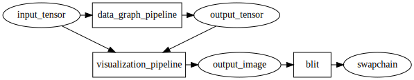
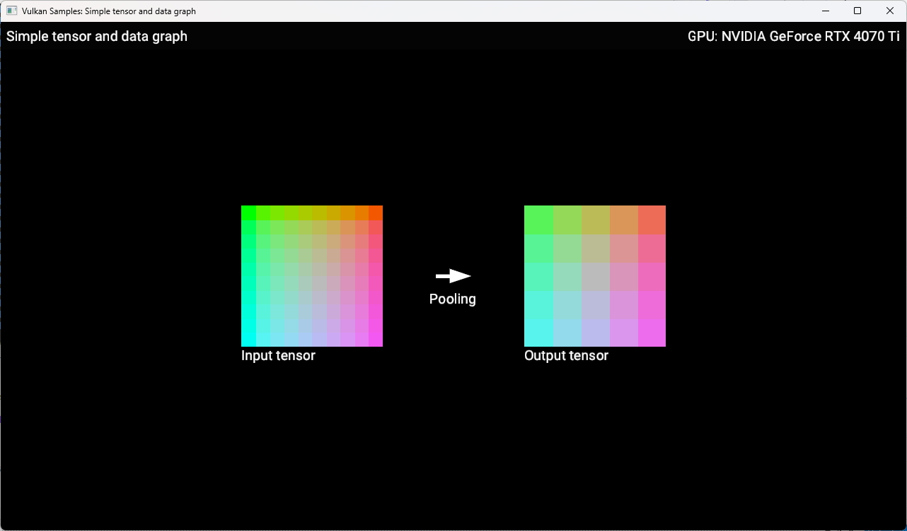
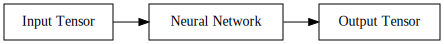
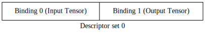

////
- Copyright (c) 2024-2025, Arm Limited and Contributors
-
- SPDX-License-Identifier: Apache-2.0
-
- Licensed under the Apache License, Version 2.0 the "License";
- you may not use this file except in compliance with the License.
- You may obtain a copy of the License at
-
-     http://www.apache.org/licenses/LICENSE-2.0
-
- Unless required by applicable law or agreed to in writing, software
- distributed under the License is distributed on an "AS IS" BASIS,
- WITHOUT WARRANTIES OR CONDITIONS OF ANY KIND, either express or implied.
- See the License for the specific language governing permissions and
- limitations under the License.
-
////
= Simple tensor and data graph

ifdef::site-gen-antora[]
TIP: The source for this sample can be found in the https://github.com/KhronosGroup/Vulkan-Samples/tree/main/samples/extensions/extensions/tensor_and_data_graph/simple_tensor_and_data_graph[Khronos Vulkan samples github repository].
endif::[]

== Overview

This sample demonstrates the usage of the `VK_ARM_tensors` and `VK_ARM_data_graph` extensions for machine learning inference. These extensions provide a way to define tensor data and construct computation graphs for neural network execution using hardware acceleration.

This is the first in a series of samples which introduce the tensor and data graph extensions. Please see the parent xref:samples/extensions/tensor_and_data_graph/README.adoc[Tensor and Data Graph] page for the full list of samples.

NOTE: While the model used in this example is expressed using https://www.mlplatform.org/tosa/[TOSA operations], there is currently no defined way to query for TOSA operation support from the Vulkan API. Execution of this sample may fail on implementations of these extensions that do not include specific support for TOSA operations.

== Setup

If you would like to build and run this sample, please make sure to first follow the setup steps on the xref:samples/extensions/tensor_and_data_graph/README.adoc[Tensor and Data Graph] page.

== Introduction

This sample demonstrates how to run a minimal neural network that consumes a single input tensor, with a batch size of 1, a width and height of 10 and 3 channels. The input tensor has a fixed pattern of colors uploaded to it from the CPU. In this case we are using a neural network with a single 2D average pooling layer. In order to display the contents of the input and output tensors onto the window, a compute shader is run after the neural network which 'draws' the two tensors into an image which is then blitted to the window. The diagram below shows how this works:

The image below shows how this sample will look when running:

== Graph Pipelines

The neural network is executed using a new type of pipeline called a _data graph pipeline_. The overall flow when using data graph pipelines is very similar to using compute or graphics pipelines. Our neural network will be encapsulated into a data graph pipeline that can be dispatched using a command buffer. Similarly to compute or graphics pipelines, data graph pipelines can access resources defined outside of the pipeline via descriptor sets and their external interface has to be described using a pipeline layout. Therefore we'll need to create a descriptor set layout and a pipeline layout to that effect. Then we will create the pipeline itself. Data graph pipelines need state and memory to run. Both are encapsulated in a resource called a _data graph pipeline session_. We will create one for our pipeline. We will then create tensor objects for the input and output to our network, descriptor sets to communicate these objects and, finally, record a dispatch command in a command buffer to execute our network.

In summary, we need to create these objects:

1. A descriptor set layout and pipeline layout to describe the interface with our data graph pipeline

2. A data graph pipeline to encapsulate the behavior of our neural network

3. A data graph pipeline session within which the data graph pipeline can run

4. Tensor objects for our network's input and output

5. Descriptor sets to communicate these tensor resources to our data graph pipeline

=== Pipeline interface ===

The external interface to our pipeline is described using descriptor set layouts and pipeline layouts, just like for compute or graphics pipelines. Here’s the interface we will use:

The code to create these objects is in the `prepare_data_graph_pipeline` method, but calls out to a helper class `DataGraphPipelineLayout` to do most of the work. The `DataGraphPipelineLayout` constructor creates a single `VkDescriptorSetLayout` containing the two tensor bindings (the binding numbers of the tensors are passed as parameters) and then creates a `VkPipelineLayout` from the descriptor set layout:

[source,cpp,options="nowrap"]
----
std::set<uint32_t> tensor_bindings = {0, 1};
std::vector<VkDescriptorSetLayoutBinding> layout_bindings;
for (uint32_t binding : tensor_bindings)
{
    VkDescriptorSetLayoutBinding layout_binding{};
    layout_binding.binding         = binding;
    layout_binding.descriptorCount = 1;
    layout_binding.descriptorType  = VK_DESCRIPTOR_TYPE_STORAGE_TENSOR_ARM;

    // Data graph pipelines don't have shader stages per-se, so VK_SHADER_STAGE_ALL is used.
    layout_binding.stageFlags      = VK_SHADER_STAGE_ALL;
    layout_bindings.push_back(layout_binding);
}

// Create set layout
VkDescriptorSetLayoutCreateInfo set_layout_create_info
    {VK_STRUCTURE_TYPE_DESCRIPTOR_SET_LAYOUT_CREATE_INFO};
set_layout_create_info.bindingCount = layout_bindings.size();
set_layout_create_info.pBindings    = layout_bindings.data();

VK_CHECK(vkCreateDescriptorSetLayout(get_device().get_handle(),
                                     &set_layout_create_info,
                                     nullptr,
                                     &descriptor_set_layout));

// Create pipeline layout
VkPipelineLayoutCreateInfo pipeline_layout_create_info
    {VK_STRUCTURE_TYPE_PIPELINE_LAYOUT_CREATE_INFO};
pipeline_layout_create_info.setLayoutCount = 1;
pipeline_layout_create_info.pSetLayouts    = &descriptor_set_layout;

VK_CHECK(vkCreatePipelineLayout(get_device().get_handle(),
                                &pipeline_layout_create_info,
                                nullptr,
                                &get_handle()));
----

The pipeline layout object is now ready to use for creating a data graph pipeline.

=== Pipeline ===

Neural networks can be described using SPIR-V modules and use descriptor sets to access external resources. The contents of the SPIR-V module for this sample is explained further in <<Appendix A: SPIR-V programs for neural networks>>, but for now we will treat it as a closed box, and just need to know that it takes one input tensor, produces one output tensor and performs a pooling operation which reduces the width and height of its input by half.

The code to create the pipeline is in the `prepare_data_graph_pipeline` method, just after creating the pipeline layout. As with the layout, a helper class `DataGraphPipeline` does most of the work.

Before we can create a data graph pipeline from a SPIR-V module, we need to create a `VkShaderModule` object to encapsulate that module, as would be done for compute or graphics pipelines:

[source,cpp,options="nowrap"]
----
// This could be created using the SPIR-V assembler or from other tooling (see Appendix A)
std::vector<uint32_t> spvcode;

// Create shader module from binary
VkShaderModuleCreateInfo module_create_info{};
module_create_info.sType    = VK_STRUCTURE_TYPE_SHADER_MODULE_CREATE_INFO;
module_create_info.codeSize = spvcode.size() * 4;
module_create_info.pCode    = spvcode.data();

VkShaderModule shader_module;
VK_CHECK(vkCreateShaderModule(get_device().get_handle(), &module_create_info, NULL, &shader_module));
----

Now that we have a `VkShaderModule` for our neural network, we can create a data graph pipeline for it. Data graph pipelines are created using `vkCreateDataGraphPipelinesARM` in a manner similar to how other types of pipelines are created. We also need to provide additional information about the resources accessed by the pipeline via descriptor sets. This information is not present in the SPIR-V module, but needs to be known when creating the pipeline, so is provided here. For each resource binding that is part of the pipeline layout, a `VkDataGraphPipelineResourceInfoARM` must be provided which describes the dimensions, memory layout and element type for each tensor. The `DataGraphPipeline` constructor takes this information as a parameter:

[source,cpp,options="nowrap"]
----
// Create array of data graph pipeline resource infos (one for each input/output tensor)
// Use std::list for VkDataGraphPipelineResourceInfoTensorARMs so that the addresses don't
// change as we add (because resource_infos will point to these)
std::list<VkTensorDescriptionARM>				tensor_description_list;
std::vector<VkDataGraphPipelineResourceInfoARM> resource_infos;
for (const auto &tensor_descriptions_set : tensor_descriptions)
{
	uint32_t set_idx = tensor_descriptions_set.first;
	const std::map<uint32_t, VkTensorDescriptionARM> &tensor_descriptions_this_set =
        tensor_descriptions_set.second;

	for (const auto &tensor_description_binding : tensor_descriptions_this_set)
	{
		VkTensorDescriptionARM tensor_description = tensor_description_binding.second;
		tensor_description_list.push_back(tensor_description);

		VkDataGraphPipelineResourceInfoARM resource_info =
            {VK_STRUCTURE_TYPE_DATA_GRAPH_PIPELINE_RESOURCE_INFO_ARM};
        // Note we use the copy that we saved in the list, not the local stack copy!
		resource_info.pNext                              = &tensor_description_list.back();
		resource_info.descriptorSet                      = set_idx;
		resource_info.binding                            = tensor_description_binding.first;
		resource_infos.push_back(resource_info);
	}
}

// Create data graph pipeline
VkDataGraphPipelineShaderModuleCreateInfoARM pipeline_shader_module_create_info
    {VK_STRUCTURE_TYPE_DATA_GRAPH_PIPELINE_SHADER_MODULE_CREATE_INFO_ARM};
pipeline_shader_module_create_info.module = shader_module;
pipeline_shader_module_create_info.pName  = entry_point;

VkDataGraphPipelineCreateInfoARM pipeline_create_info
    {VK_STRUCTURE_TYPE_DATA_GRAPH_PIPELINE_CREATE_INFO_ARM};
pipeline_create_info.pNext             = &pipeline_shader_module_create_info;
pipeline_create_info.layout            = layout;
pipeline_create_info.resourceInfoCount = resource_infos.size();
pipeline_create_info.pResourceInfos    = resource_infos.data();

VK_CHECK(vkCreateDataGraphPipelinesARM(get_device().get_handle(),
                                       VK_NULL_HANDLE,
                                       VK_NULL_HANDLE,
                                       1,
                                       &pipeline_create_info,
                                       nullptr,
                                       &get_handle()));
----

The data graph pipeline object is now created, but needs a session before it can be used.

=== Pipeline session ===

A data graph pipeline needs state to execute, for example to store the results of any intermediate operations in the neural network. The implementation handles all this internally but it does need some memory to be provided. This state is encapsulated into _data graph pipeline session_ objects.

This session object is created in the `prepare_data_graph_pipeline` method, just after creating the pipeline itself. As with the pipeline, a helper class `DataGraphPipelineSession` does most of the work. Because sessions need to be bound to memory (just like images and buffers), the sample code makes use of the _Vulkan Memory Allocator_ (VMA) framework to abstract away the details of the memory allocation. This is wrapped up in the function `vmaCreateDataGraphPipelineSession` which is written to be very similar to the existing `vmaCreateImage/vmaCreateBuffer` functions. As with buffers and images, the session is created without any backing memory and then its memory requirements are queried. We can then allocate some appropriate memory and bind it to the session:

[source,cpp,options="nowrap"]
----
// 1. Create DataGraphPipelineSession.
VkResult res = vkCreateDataGraphPipelineSessionARM(
    device,
    pDataGraphPipelineSessionCreateInfo,
    nullptr,
    pDataGraphPipelineSession);
if (res >= 0)
{
    // 2. Query valid bind points for the session
    VkDataGraphPipelineSessionBindPointRequirementsInfoARM bind_point_req_info =
        {VK_STRUCTURE_TYPE_DATA_GRAPH_PIPELINE_SESSION_BIND_POINT_REQUIREMENTS_INFO_ARM};
    bind_point_req_info.session = *pDataGraphPipelineSession;
    uint32_t requirement_count  = 0;

    res = vkGetDataGraphPipelineSessionBindPointRequirementsARM(
        device, &bind_point_req_info, &requirement_count, nullptr);
    if (res != VK_SUCCESS)
    {
        return res;
    }

    if (requirement_count > 1)
    {
        // A session could require more than one bind point,
        // but for simplicity we only support one bind point type in this function.
        return VK_ERROR_INITIALIZATION_FAILED;
    }

    VkDataGraphPipelineSessionBindPointRequirementARM bind_point_requirement{
        VK_STRUCTURE_TYPE_DATA_GRAPH_PIPELINE_SESSION_BIND_POINT_REQUIREMENT_ARM};
    res = vkGetDataGraphPipelineSessionBindPointRequirementsARM(
        device, &bind_point_req_info, &requirement_count, &bind_point_requirement);
    if (res != VK_SUCCESS)
    {
        return res;
    }

    if (bind_point_requirement.numObjects > 1)
    {
        // A single bind point requirement could require more than one object,
        // but for simplicity we only support one object type in this function.
        return VK_ERROR_INITIALIZATION_FAILED;
    }
    if (bind_point_requirement.bindPointType != VK_DATA_GRAPH_PIPELINE_SESSION_BIND_POINT_TYPE_MEMORY_ARM)
    {
        // Currently we only support the memory bind point type
        return VK_ERROR_INITIALIZATION_FAILED;
    }

    // 3. vkGetDataGraphPipelineSessionMemoryRequirements.
    VkDataGraphPipelineSessionBindPointARM memory_bind_point =
        VK_DATA_GRAPH_PIPELINE_SESSION_BIND_POINT_TRANSIENT_ARM;
    VkMemoryRequirements2 vkMemReq = {VK_STRUCTURE_TYPE_MEMORY_REQUIREMENTS_2};
    VkDataGraphPipelineSessionMemoryRequirementsInfoARM memory_requirements_info =
        {VK_STRUCTURE_TYPE_DATA_GRAPH_PIPELINE_SESSION_MEMORY_REQUIREMENTS_INFO_ARM};
    memory_requirements_info.session      = *pDataGraphPipelineSession;
    memory_requirements_info.bindPoint    = memory_bind_point;
    memory_requirements_info.objectIndex  = 0;
    vkGetDataGraphPipelineSessionMemoryRequirementsARM(device, &memory_requirements_info, &vkMemReq);

    if (vkMemReq.memoryRequirements.size > 0)
    {
        // 4. Allocate memory using allocator.
        VmaAllocationInfo allocation_info;
        res = vmaAllocateMemory(allocator,
                                &vkMemReq.memoryRequirements,
                                pAllocationCreateInfo,
                                pAllocation,
                                &allocation_info);

        if (res >= 0)
        {
            if (pAllocationInfo != nullptr)
            {
                // Return allocation info to caller, if requested
                *pAllocationInfo = allocation_info;
            }

            // 5. Bind session with memory.
            if ((pAllocationCreateInfo->flags & VMA_ALLOCATION_CREATE_DONT_BIND_BIT) == 0)
            {
                VkBindDataGraphPipelineSessionMemoryInfoARM bind_info =
                    {VK_STRUCTURE_TYPE_BIND_DATA_GRAPH_PIPELINE_SESSION_MEMORY_INFO_ARM};
                bind_info.session      = *pDataGraphPipelineSession;
                bind_info.memory       = allocation_info.deviceMemory;
                bind_info.memoryOffset = allocation_info.offset;
                bind_info.bindPoint    = memory_bind_point;
                bind_info.objectIndex  = 0;
                res                    = vkBindDataGraphPipelineSessionMemoryARM(device, 1, &bind_info);
            }
            if (res >= 0)
            {
                // All steps succeeded.
                return VK_SUCCESS;
            }

            // Cleanup in case of errors
            vmaFreeMemory(allocator, *pAllocation);
            *pAllocation = VK_NULL_HANDLE;
            vkDestroyDataGraphPipelineSessionARM(device, *pDataGraphPipelineSession, nullptr);
            *pDataGraphPipelineSession = VK_NULL_HANDLE;
            return res;
        }

        // Cleanup in case of errors
        vkDestroyDataGraphPipelineSessionARM(device, *pDataGraphPipelineSession, nullptr);
        *pDataGraphPipelineSession = VK_NULL_HANDLE;
        return res;
    }
}
return res;
----

The session object is now ready to use, but we'll need some tensors to provide as input and output.

=== Tensors

Tensor resources are created and used in a similar fashion to Vulkan images and buffers:

1. They are created from a description (size, tiling, usage, etc)

2. Their memory requirements are queried

3. We allocate memory compatible with those requirements

4. We bind the tensor resource to the memory we allocated

5. We create a view of the tensor resource for use with pipelines

In the sample code, this is handled by the helper classes `Tensor` and `TensorView` which are analogous to the `Image`/`Buffer` and `ImageView`/`BufferView` classes in the common sample framework. Similar to data graph pipeline sessions discussed above, the sample code makes use of the _Vulkan Memory Allocator_ (VMA) framework to abstract away the details of the memory allocation for tensors. This is wrapped up in the function `vmaCreateTensor` which is written to be very similar to the existing `vmaCreateImage/vmaCreateBuffer` functions. As with buffers and images, the tensor is created without any backing memory and then its memory requirements are queried. We can then allocate some appropriate memory and bind it to the session:

[source,cpp,options="nowrap"]
----
// 1. Create VkTensor, using create_info from TensorBuilder
// In this case we are going to represent a small RGB image, so have a batch size of 1, a width and height of 10 and 3 channels.
std::vector<uint64_t> dimensions = {1, 10, 10, 3};
TensorBuilder tensorBuilder = TensorBuilder(dimensions)
    .with_tiling(VK_TENSOR_TILING_LINEAR_ARM)
    .with_usage(VK_TENSOR_USAGE_DATA_GRAPH_BIT_ARM)
    .with_format(VK_FORMAT_R32_SFLOAT)
    .with_vma_required_flags(VK_MEMORY_PROPERTY_HOST_VISIBLE_BIT));

VkTensorARM tensor = VK_NULL_HANDLE;
VkTensorCreateInfoARM create_info = builder.get_create_info();
VkResult res = vkCreateTensorARM(device, create_info, nullptr, tensor);

if (res != VK_SUCCESS)
{
    throw std::runtime_error("Vulkan error: vkCreateTensorARM failed.");
}

// 2. vkGetTensorMemoryRequirements.
VkMemoryRequirements2             vkMemReq = {};
VkTensorMemoryRequirementsInfoARM memory_requirements_info =
    {VK_STRUCTURE_TYPE_TENSOR_MEMORY_REQUIREMENTS_INFO_ARM};
memory_requirements_info.tensor = tensor;

vkGetTensorMemoryRequirementsARM(device, &memory_requirements_info, &vkMemReq);

// 3. Allocate memory using allocator.
VmaAllocater&           allocator         = vkb::allocated::get_memory_allocator();
VmaAllocationCreateInfo alloc_create_info = {};
VmaAllocation           allocation        = VK_NULL_HANDLE;
VmaAllocationInfo       allocation_info;

res = vmaAllocateMemory(allocator,
                        &vkMemReq.memoryRequirements,
                        alloc_create_info,
                        allocation,
                        &allocation_info);

if (res != VK_SUCCESS)
{
    throw std::runtime_error("Vulkan error: vmaAllocateMemory failed.");
}

// 4. Bind tensor with memory.
VkBindTensorMemoryInfoARM bind_info = {VK_STRUCTURE_TYPE_BIND_TENSOR_MEMORY_INFO_ARM};
bind_info.tensor       = tensor;
bind_info.memory       = allocation_info.deviceMemory;
bind_info.memoryOffset = allocation_info.offset;
res                    = vkBindTensorMemoryARM(device, 1, &bind_info);

if (res != VK_SUCCESS)
{
    throw std::runtime_error("Vulkan error: vkBindTensorMemoryARM failed.");
}
----

The `VkTensorCreateInfoARM` struct is provided to the `Tensor` constructor through a `TensorBuilder` object which provides a convenient way of making the create info with sensible default values, similar to the `ImageBuilder` and `BufferBuilder` classes which the common sample framework provides.

The `TensorView` constructor takes a `Tensor` and constructs a view for it, which specifies how the data in a tensor is presented to the pipeline that is using it. Most often, we just want direct access to the tensor data so the format of the view matches that of the tensor.

[source,cpp,options="nowrap"]
----
if (format == VK_FORMAT_UNDEFINED)
{
    // VK_FORMAT_UNDEFINED means to use the same format as the provided tensor.
    format = tensor.get_format();
}

VkTensorViewCreateInfoARM view_info{VK_STRUCTURE_TYPE_TENSOR_VIEW_CREATE_INFO_ARM};
view_info.tensor = tensor.get_handle();
view_info.format = format;
VK_CHECK(vkCreateTensorViewARM(get_device().get_handle(), &view_info, nullptr, &get_handle()));
----

We create a `Tensor` and a corresponding `TensorView` in each the `prepare_input_tensor` and `prepare_output_tensor` methods, for use as the input and output of our neural network. In both cases we describe the tensor as four-dimensional and with an element format of `VK_FORMAT_R32_SFLOAT` (i.e. 32-bit floating point). We also declare that we will use these tensors from a graph pipeline via the `VK_TENSOR_USAGE_DATA_GRAPH_BIT_ARM` usage flag.

Tensors are often four-dimensional, representing batch size, height, width and channels. In this sample our input tensor will represent a small RGB image, so has a batch size of 1, a width and height of 10 and 3 channels. The output will be half the width and height (reduced by the pooling operation of the neural network), but still 3 channels.

The input tensor will have some initial, fixed data uploaded to it from the CPU and so needs to be linearly-tiled. This may not be the most efficient memory layout, but it makes the tensor a host-accessible subresource so that we know how the data is laid out. We generate a simple pattern of colors, as can be seen on the _input tensor_ in the screenshot at the top of this page. The data is uploaded by mapping the backing memory of the tensor to get a CPU-accesssible pointer, writing through that pointer, and unmapping the memory. This is handled for us by the VMA framework, and is identical to how you could upload data for an image or buffer.

The tensor objects are now ready to use, and we can place them in a descriptor set to provide them to the data graph pipeline.

=== Descriptor sets

_Descriptor sets_ are used to provide tensor resources to data graph pipelines, just as they are used to provide images and buffers to compute and graphics pipelines. This is done in the `prepare_data_graph_pipeline_descriptor_set` method, which allocates a single descriptor set from a pool (using the descriptor set layout created as part of the `DataGraphPipelineLayout`) and then fills in the descriptor bindings for the input and output tensor views:

[source,cpp,options="nowrap"]
----
// Allocate descriptor set using the layout of the Data Graph Pipeline
VkDescriptorSetAllocateInfo alloc_info = {VK_STRUCTURE_TYPE_DESCRIPTOR_SET_ALLOCATE_INFO};
alloc_info.descriptorPool              = descriptor_pool;
alloc_info.descriptorSetCount          = 1;
alloc_info.pSetLayouts                 = &data_graph_pipeline_layout->get_descriptor_set_layout();

VK_CHECK(vkAllocateDescriptorSets(get_device().get_handle(),
                                  &alloc_info,
                                  &data_graph_pipeline_descriptor_set));

// Write bindings to it, telling it which tensors to use as input and output
std::map<uint32_t, VkWriteDescriptorSetTensorInfoARM> tensor_bindings =
{
    // Binding 0 is the input tensor
    {0, VkWriteDescriptorSetTensorInfoARM{VK_STRUCTURE_TYPE_WRITE_DESCRIPTOR_SET_TENSOR_INFO_ARM,
        nullptr, 1, &input_tensor_view->get_handle()}},
    // Binding 1 is the output tensor
    {1, VkWriteDescriptorSetTensorInfoARM{VK_STRUCTURE_TYPE_WRITE_DESCRIPTOR_SET_TENSOR_INFO_ARM,
        nullptr, 1, &output_tensor_view->get_handle()}}
};

std::vector<VkWriteDescriptorSet> writes;
for (const auto &tensor_binding : tensor_bindings)
{
    VkWriteDescriptorSet write{VK_STRUCTURE_TYPE_WRITE_DESCRIPTOR_SET};
    write.dstSet          = data_graph_pipeline_descriptor_set;
    write.dstBinding      = tensor_binding.first;
    write.descriptorType  = VK_DESCRIPTOR_TYPE_TENSOR_ARM;
    // Tensor info is provided via pNext, rather than a pTensorInfo like for images/buffers
    write.pNext           = &tensor_binding.second;
    write.descriptorCount = 1;
    writes.push_back(write);
}

vkUpdateDescriptorSets(get_device().get_handle(), writes.size(), writes.data(), 0, nullptr);
----

The descriptor set is now ready to use, and we have everything we need to run an inference!

=== Command buffer

Similar to how compute and graphics pipelines are executed, data graph pipelines need to be bound to a dedicated bind point on a command buffer, descriptor sets need to be bound to provide resources to the pipeline, and then they can be dispatched. This is done in the `draw_renderpass` method which is called to record a new command buffer every frame:

[source,cpp,options="nowrap"]
----
// Bind and run data graph pipeline.
vkCmdBindPipeline(command_buffer.get_handle(),
                  VK_PIPELINE_BIND_POINT_DATA_GRAPH_ARM,
                  data_graph_pipeline->get_handle());
vkCmdBindDescriptorSets(command_buffer.get_handle(),
                        VK_PIPELINE_BIND_POINT_DATA_GRAPH_ARM, data_graph_pipeline_layout->get_handle(),
                        0,
                        1,
                        &data_graph_pipeline_descriptor_set,
                        0,
                        nullptr);
vkCmdDispatchDataGraphARM(command_buffer.get_handle(), data_graph_pipeline_session->get_handle());
----

That's all that's necessary to run a simple neural network using a data graph pipeline, but there are more details to cover for using the extensions in more practical use cases.

== Practical Use

The tensor object which is written to by the data graph pipeline can be used in numerous ways. In this sample we are reading from it using a compute shader which produces the simple visualization of the tensor contents which is drawn on the window. There are also several other options for how to use the output tensor:

* Read directly from other shaders by binding it as a Tensor resource, as we do in this sample.
* Aliased as a regular `VkImage` and used as a texture to be sampled from in another shader.
* Aliased as a regular `VkBuffer` and read from in another shader
* Mapped to host-accessible memory and read back for further processing on the CPU

There is also the question of how to produce inputs for the neural network - in this example we simply uploaded some fixed data from the CPU but there are also many options here (equivalent to the above):

* Write directly from other shaders by binding it as a Tensor resource.
* Aliased as a regular `VkImage` and written to via. a render target (or writable texture).
* Aliased as a regular `VkBuffer` and written to from another shader.
* Mapped to host-accessible memory and written to with data produced on the CPU, as we do in this sample.

Accesses to tensor resources must be synchronised correctly, just as for images and buffers. This normally involves adding barriers to the command buffer to ensure that accesses happen in the expected order and that data is visible to the required pipeline stages. There is a new kind of barrier, a Tensor Memory Barrier (analogous to the existing Image Memory Barriers and Buffer Memory Barriers) which can be used for this purpose. The later samples in this series make more use of these.

== Conclusion

In this sample we've introduced the VK_ARM_tensors and VK_ARM_data_graph extensions and shown how to use them to run a simple neural network. We've shown the steps needed to run a neural network - creating a pipeline layout, data graph pipeline, data graph pipeline session, tensor objects, descriptor sets and finally recording binding and dispatch commands in a command buffer. The following samples in xref:samples/extensions/tensor_and_data_graph/README.adoc[this series] build upon these concepts.

== Appendix A: SPIR-V programs for neural networks

Neural networks can be described using SPIR-V modules, but unlike SPIR-V modules for graphics and compute shaders, there is no GLSL or HLSL syntax for expressing SPIR-V modules for data graph pipelines. There are tools available for generating the SPIR-V code from higher level representations of neural networks such as PyTorch or TensorFlow models (see: link:https://github.com/arm/ai-ml-sdk-model-converter[ML SDK Model Converter]).
However, for this sample we have written the SPIR-V code directly in low-level SPIR-V assembly language to avoid bringing in more dependencies and to give some idea of how the SPIR-V code looks. It is unlikely in practice that you would manually write SPIR-V assembly, however below is a quick overview of SPIR-V for context.

The assembly code is in the link:../../../../shaders/tensor_and_data_graph/simple_tensor_and_data_graph/spirv/pooling.spvasm[pooling.spvasm] file and is assembled into SPIR-V binary code using `spirv-as` as part of the link:../../../../bldsys/cmake/sample_helper.cmake[build system]. Note this is exactly the same process that would be used to compile compute or graphics shaders from SPIR-V assembly, although typically these would be compiled from GLSL or HLSL instead.

=== Boilerplate

The SPIR-V assembly starts with the usual list of capabilities and extensions. Here, we declare that we will make use of the link:https://github.khronos.org/SPIRV-Registry/extensions/ARM/SPV_ARM_graph.html[Graph] and link:https://github.khronos.org/SPIRV-Registry/extensions/ARM/SPV_ARM_tensors.html[Tensors] SPIR-V extensions:

[source,cpp,options="nowrap"]
----
                     OpCapability Shader
                     OpCapability TensorsARM
                     OpCapability GraphARM
                     OpExtension "SPV_ARM_tensors"
                     OpExtension "SPV_ARM_graph"
----

Next is an important line which imports link:https://registry.khronos.org/SPIR-V/specs/unified1/SPIRV.html#_extended_instruction_sets[external instructions] for all of the neural network operations. This defines operations like convolution, pooling, matmul which come from the https://www.mlplatform.org/tosa/[TOSA specification].

[source,cpp,options="nowrap"]
----
             %tosa = OpExtInstImport "TOSA.001000.1"
----

=== Descriptor set interface

The next section declares the descriptor set and bindings that form the interface between the Vulkan API data graph pipeline and the SPIR-V module, and is what we used when defining our pipeline layout in the <<Pipeline interface>> section.

[source,cpp,options="nowrap"]
----
                     OpDecorate %input_tensor_ptr DescriptorSet 0
                     OpDecorate %input_tensor_ptr Binding 0
                     OpDecorate %output_tensor_ptr DescriptorSet 0
                     OpDecorate %output_tensor_ptr Binding 1
----

Note this is the same as you would find for compute or graphics shaders.

=== Types and constants

All the types and constants used in the code are declared next, with the notable inclusion of _tensor types_ and a _graph type_:

[source,cpp,options="nowrap"]
----
%float_tensor_r4_s_1_ih_iw_3 = OpTypeTensorARM %float %uint_4 %uint_array_l4_1_ih_iw_3
%float_tensor_r4_s_1_oh_ow_3 = OpTypeTensorARM %float %uint_4 %uint_array_l4_1_oh_ow_3
                            ...
                 %graph_type = OpTypeGraphARM 1 %float_tensor_r4_s_1_ih_iw_3 %float_tensor_r4_s_1_oh_ow_3
----

This defines two types for tensors - both four-dimensional tensors with 32-bit floating point elements but with different shapes, which matches the tensor description we used in our C++ code for our input and output tensors. It then defines a graph type which takes one input and one output of their respective types.

=== Interface variables

We then declare variables for the input and output tensors which are the external interface for the program. Again, this is the same as you would find for compute or graphics shaders:

[source,cpp,options="nowrap"]
----
 %input_tensor_ptr = OpVariable %ptr_float_tensor_r4_s_1_ih_iw_3 UniformConstant
%output_tensor_ptr = OpVariable %ptr_float_tensor_r4_s_1_oh_ow_3 UniformConstant
----

=== Graph definition

Finally, we declare our graph and list the operations that make up our neural network:

[source,cpp,options="nowrap"]
----
                     OpGraphEntryPointARM %graph "main" %input_tensor_ptr %output_tensor_ptr
            %graph = OpGraphARM %graph_type
               %in = OpGraphInputARM %float_tensor_r4_s_1_ih_iw_3 %uint_0
              %out = OpExtInst %float_tensor_r4_s_1_oh_ow_3 %tosa AVG_POOL2D %avg_pool_kernel %avg_pool_stride %avg_pool_pad %uint_2 %in %avg_pool_input_zero_point %avg_pool_output_zero_point
                     OpGraphSetOutputARM %out %uint_0
                     OpGraphEndARM
----

The `OpGraphEntryPointARM` instruction exports the graph (which will be defined in the lines below) to be visible to our C++ code under the entry point name `"main"`, which we used when creating our data graph <<Pipeline>>. It connects the interface variables declared above to the inputs and outputs of the data graph.

The lines between `OpGraphARM` and `OpGraphEndARM` define the body of our graph and is where the neural network operations are listed. Here we are using a single instruction imported from the TOSA SPIR-V xref:Boilerplate[extended instruction set]: AVG_POOL2D. That instruction requires a number of arguments describing the properties of the pooling operation (the pooling kernel size, striding, etc.).

