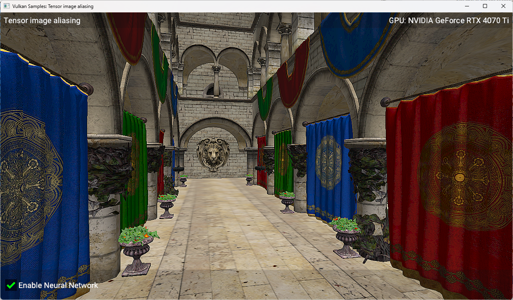
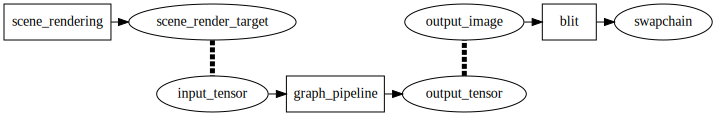

////
- Copyright (c) 2025-2026, Arm Limited and Contributors
-
- SPDX-License-Identifier: Apache-2.0
-
- Licensed under the Apache License, Version 2.0 the "License";
- you may not use this file except in compliance with the License.
- You may obtain a copy of the License at
-
-     http://www.apache.org/licenses/LICENSE-2.0
-
- Unless required by applicable law or agreed to in writing, software
- distributed under the License is distributed on an "AS IS" BASIS,
- WITHOUT WARRANTIES OR CONDITIONS OF ANY KIND, either express or implied.
- See the License for the specific language governing permissions and
- limitations under the License.
-
////
= Tensor Image Aliasing

ifdef::site-gen-antora[]
TIP: The source for this sample can be found in the https://github.com/KhronosGroup/Vulkan-Samples/tree/main/samples/extensions/extensions/tensor_and_data_graph/simple_tensor_and_data_graph[Khronos Vulkan samples github repository].
endif::[]

== Overview

This is the fourth sample in a series, which follows on from the previous xref:samples/extensions/tensor_and_data_graph/graph_constants/README.adoc[graph_constants sample]. To best understand this sample, it would be helpful to have first looked at the xref:samples/extensions/tensor_and_data_graph/README.adoc[previous samples in the series].
This sample shows how to use link:https://registry.khronos.org/vulkan/specs/latest/html/vkspec.html#resources-memory-aliasing[tensor/image aliasing] so that tensors and images use the same memory. This enables the mixing of traditional compute and graphics operations with ML operations without overhead from copying or format conversions. In this sample we show how to run a simple post-processing effect on a 3D scene using a convolutional neural network.

== Setup

If you would like to build and run this sample, please make sure to first follow the setup steps on the xref:samples/extensions/tensor_and_data_graph/README.adoc[tensor and data graph] page.

== Introduction

Neural networks are often used to process image data. In a Vulkan application, image data is usually manipulated via a `VkImage` resource, however images cannot be used directly by data graph pipelines - they require tensors as inputs and outputs. There is no API to copy data between tensor and image resources (like there is for copying between images and buffers), however there is support for _aliasing_ the same underlying memory between a tensor and an image. This means that the same memory can be used for both resources, allowing data to be written to an image and read from a tensor, or vice versa, without copying.

This sample uses these features to run a simple edge-enhacement convolutional neural network (with a single convolution layer) as a post-processing effect on a 3D rendered scene. The scene is rendered (using the existing Vulkan Sample framework) to an offscreen render target (`scene_render_target`), whose colour attachment is aliased to the same memory as a tensor (`input_tensor`). This tensor is then used as the input
to a data draph pipeline (`graph_pipeline`), which implements a simple sharpening filter using a convolution layer. The output of this data graph pipeline is written to another tensor (`output_tensor`), which is aliased to the same memory as another image (`output_image`), which is then used to blit the results to the swapchain:

== Resource creation

When creating images that are going to be aliased as tensors, the image must be created with the `VK_IMAGE_USAGE_TENSOR_ALIASING_BIT_ARM` usage flag. In the sample code, we do this when creating the colour attachment for the render target (in `prepare_scene_render_target()`) and when creating the output image (in `prepare_output_image()`):

[source,cpp,options="nowrap"]
----

vkb::core::Image colour_image = vkb::core::ImageBuilder(width, height)
                                   .with_format(VK_FORMAT_R8G8B8A8_UNORM)
                                   // Extra flags are required to allow aliasing of this image as a tensor.
                                   .with_usage(
                                       VK_IMAGE_USAGE_COLOR_ATTACHMENT_BIT |
                                       VK_IMAGE_USAGE_TENSOR_ALIASING_BIT_ARM
                                   )
                                   .with_vma_flags(VMA_ALLOCATION_CREATE_CAN_ALIAS_BIT)
                                   .with_debug_name("SceneRenderColour")
                                   .build(get_device().get_device());

----

There is an equivalent flag to use when creating tensors, which is `VK_TENSOR_USAGE_IMAGE_ALIASING_BIT_ARM`. This flag is used when creating the input tensor in `prepare_input_tensor()` and the output tensor in `prepare_output_tensor()`. When creating these tensors, rather than using the helper class `Tensor` which also allocates and binds backing memory for the tensor, we use the `ExternallyAllocatedTensor` helper class which allows us to provide existing memory that the tensor should use. We use the backing memory of the image that we already created, so that the tensor and image will be aliasing each other:

[source,cpp,options="nowrap"]
----

const vkb::core::Image &image_to_alias = scene_render_target->get_views().at(0).get_image();
input_tensor = std::make_unique<ExternallyAllocatedTensor>(
    get_device(),
    TensorBuilder({1, image_to_alias.get_extent().height, image_to_alias.get_extent().width, 4})
        .with_usage(
            VK_TENSOR_USAGE_DATA_GRAPH_BIT_ARM |
            VK_TENSOR_USAGE_IMAGE_ALIASING_BIT_ARM
        )
        .with_format(VK_FORMAT_R8_SINT),
    image_to_alias.get_memory(), image_to_alias.get_memory_offset()
);

----

== Running the data graph pipeline

The scene is rendered as normal into `scene_render_target` and because the colour attachment is aliased to the same memory as `input_tensor`, this tensor will get the rendered image data directly. The data graph pipeline is then executed, which reads from `input_tensor` and writes to `output_tensor`. Because `output_tensor` is aliased to `output_image`, when `output_image` is blitted to the swapchain it will contain
the results of the data graph pipeline.

== Synchronization and image layout

There are some important synchronisation and image layout details to keep in mind when working with aliased tensors and images. Since the tensor and image share the same memory, it's crucial to ensure that they are in compatible layouts and that proper synchronization is in place to avoid any data hazards.

The colour attachement image of the `scene_render_target` needs to be transitioned to the `VK_IMAGE_LAYOUT_TENSOR_ALIASING_ARM` layout before its underlying memory can be used as a tensor. It also needs a barrier to ensure that the data written to it as a colour attachment is visible to the data graph pipeline when it reads from the tensor. The `oldLayout` parameter needs to be set here, because we want to preserve the existing contents.

Similarly, the `output_image` which is aliased to `output_tensor` needs to be transitioned to the `VK_IMAGE_LAYOUT_TENSOR_ALIASING_ARM` layout before it can be used as a tensor, however in this case we don't need to preserve the existing contents so set `oldLayout` to `VK_IMAGE_LAYOUT_UNDEFINED`. It also has a barrier to prevent the data graph pipeline from writing to it before the blit shader (on the previous frame) reads from it:

[source,cpp,options="nowrap"]
----
    const VkImageMemoryBarrier2 imageBarriers[2] = {
        // Input tensor (which is aliased as input_image)
        {
            VK_STRUCTURE_TYPE_IMAGE_MEMORY_BARRIER_2,
            nullptr,
            // Previously was rendered to as a color attachment
            VK_PIPELINE_STAGE_COLOR_ATTACHMENT_OUTPUT_BIT,        // srcStageMask
            VK_ACCESS_2_COLOR_ATTACHMENT_WRITE_BIT,               // srcAccessMask
            // Will be read by the data graph pipeline
            VK_PIPELINE_STAGE_2_DATA_GRAPH_BIT_ARM,               // dstStageMask
            VK_ACCESS_2_DATA_GRAPH_READ_BIT_ARM,                  // dstAccessMask
            VK_IMAGE_LAYOUT_COLOR_ATTACHMENT_OPTIMAL,             // oldLayout
            // Transition to the special layout for tensor aliasing
            VK_IMAGE_LAYOUT_TENSOR_ALIASING_ARM,        // newLayout
            0,                                          // srcQueueFamilyIndex
            0,                                          // dstQueueFamilyIndex
            scene_render_target->get_views().at(0).get_image().get_handle(),
            VkImageSubresourceRange{VK_IMAGE_ASPECT_COLOR_BIT, 0, 1, 0, 1}
        },
         // Output tensor (which is aliased as output_image)
        {
            VK_STRUCTURE_TYPE_IMAGE_MEMORY_BARRIER_2,
            nullptr,
            // Previously was read by the blit shader
            VK_PIPELINE_STAGE_FRAGMENT_SHADER_BIT,         // srcStageMask
            VK_ACCESS_2_SHADER_READ_BIT,                   // srcAccessMask
            // Will be written to by the data graph pipeline
            VK_PIPELINE_STAGE_2_DATA_GRAPH_BIT_ARM,        // dstStageMask
            VK_ACCESS_2_DATA_GRAPH_WRITE_BIT_ARM,          // dstAccessMask
            VK_IMAGE_LAYOUT_UNDEFINED,                     // oldLayout
            // Transition to the special layout for tensor aliasing
            VK_IMAGE_LAYOUT_TENSOR_ALIASING_ARM,        // newLayout
            0,                                          // srcQueueFamilyIndex
            0,                                          // dstQueueFamilyIndex
            output_image->get_handle(),
            VkImageSubresourceRange{VK_IMAGE_ASPECT_COLOR_BIT, 0, 1, 0, 1}
        }
    };
    VkDependencyInfo dependencyInfo        = {VK_STRUCTURE_TYPE_DEPENDENCY_INFO};
    dependencyInfo.imageMemoryBarrierCount = 2;
    dependencyInfo.pImageMemoryBarriers    = &imageBarriers[0];
    vkCmdPipelineBarrier2(command_buffer.get_handle(), &dependencyInfo);
----

After the data graph pipeline has run, the `output_image` which is aliased to `output_tensor` needs to be transitioned out of the `VK_IMAGE_LAYOUT_TENSOR_ALIASING_ARM` layout so that it can be used as a regular image again, and it needs a barrier to ensure that the data written by the data graph pipeline is visible to the blit shader when it reads from it:

[source,cpp,options="nowrap"]
----
const VkImageMemoryBarrier2 imageBarrier = {
    VK_STRUCTURE_TYPE_IMAGE_MEMORY_BARRIER_2,
    nullptr,
    // Was previously written to by the data graph pipeline
    VK_PIPELINE_STAGE_2_DATA_GRAPH_BIT_ARM,          // srcStageMask
    VK_ACCESS_2_DATA_GRAPH_WRITE_BIT_ARM,            // srcAccessMask
    // Will be read by the blit shader
    VK_PIPELINE_STAGE_FRAGMENT_SHADER_BIT,           // dstStageMask
    VK_ACCESS_2_SHADER_READ_BIT,                     // dstAccessMask
    // Transition out of aliasing layout
    VK_IMAGE_LAYOUT_TENSOR_ALIASING_ARM,             // oldLayout
    VK_IMAGE_LAYOUT_SHADER_READ_ONLY_OPTIMAL,        // newLayout
    0,                                               // srcQueueFamilyIndex
    0,                                               // dstQueueFamilyIndex
    output_image->get_handle(),
    VkImageSubresourceRange{VK_IMAGE_ASPECT_COLOR_BIT, 0, 1, 0, 1}};

VkDependencyInfo dependencyInfo        = {VK_STRUCTURE_TYPE_DEPENDENCY_INFO};
dependencyInfo.imageMemoryBarrierCount = 1;
dependencyInfo.pImageMemoryBarriers    = &imageBarrier;
vkCmdPipelineBarrier2(command_buffer.get_handle(), &dependencyInfo);
----

== Conclusion

In this sample, we've walked through how we can implement zero-copy data exchange between tensors and images to run a simple post-processing effect using a convolutional neural network.

== Known Issues

* The model in the VGF file uses a fixed resolution of 1280x720, so the sample will always render to a render target of this size, no matter the window size. This will result in poor quality rendering if the window size does not match 1280x720. 1280x720 is the default resolution when running the sample, so this is only a concern if you resize the window manually or using command-line arguments.
