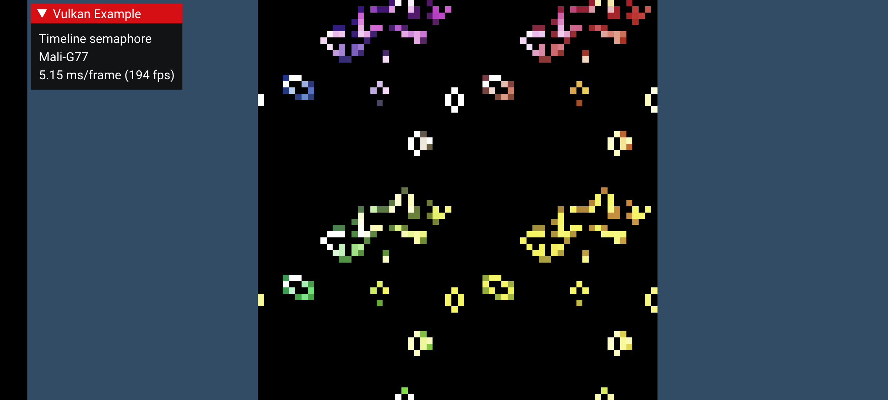

////
- Copyright (c) 2021-2024, Arm Limited and Contributors
-
- SPDX-License-Identifier: Apache-2.0
-
- Licensed under the Apache License, Version 2.0 the "License";
- you may not use this file except in compliance with the License.
- You may obtain a copy of the License at
-
-     http://www.apache.org/licenses/LICENSE-2.0
-
- Unless required by applicable law or agreed to in writing, software
- distributed under the License is distributed on an "AS IS" BASIS,
- WITHOUT WARRANTIES OR CONDITIONS OF ANY KIND, either express or implied.
- See the License for the specific language governing permissions and
- limitations under the License.
-
////
= Timeline semaphore

ifdef::site-gen-antora[]
TIP: The source for this sample can be found in the https://github.com/KhronosGroup/Vulkan-Samples/tree/main/samples/extensions/timeline_semaphore[Khronos Vulkan samples github repository].
endif::[]

== Overview

In Vulkan 1.0, we were introduced to `VkSemaphore` which is able to synchronize work between Vulkan queues.
It has some peculiar behavior which makes it somewhat difficult to use in practice.
The timeline semaphore is designed to solve these problems and it also makes the queue synchronization model closer to what we see in D3D12.

The existing semaphore as-is works fine in normal situations, but as applications learn to take advantage of async compute, async transfer, and other advanced synchronization use cases, there are problems which are hard to ignore.

=== The binary semaphore problems

The existing semaphore type is now called a `BINARY` semaphore, as signals and waits must always happen in 1:1 pairs.
Completing a wait for a semaphore on the `VkQueue` also *unsignals it*.
This is problematic for more advanced use cases where we wish to create a single producer, multiple consumers scenario.
To make binary semaphores work, we would have to signal multiple semaphores in a single `vkQueueSubmit`, and then assign one semaphore to each waiting queue.
This is rather awkward, since it might not be obvious at signal time how this scenario will play out, and juggling N semaphores just for this case is not fun.

When juggling N semaphores, it might also happen that a semaphore was not required after all, and we are now sitting with a signalled semaphore which cannot be recycled and signalled again unless we wait for it first.
The solution here is to just destroy such "hung" semaphores, which is unfortunate.
Ideally we would be able to reset semaphores on the host as well, but no such API exists and submitting a wait to GPU just for the purpose of unsignalling a semaphore is silly.

There is also an object bloat problem.
Usually, there are many submissions in flight on a GPU, and to be able to synchronize with each submission, we must keep track of a certain number of semaphores which are in-flight at any one time.
This is doable, but inelegant.
There is a similar problem for `VkFence` as well.

The final problem is a lack of out-of-order signal and wait.
This is a somewhat of a niche problem, but in a world with free threaded task graphs, it could make sense to be able to submit work out of order and let synchronization objects take care of synchronization on the GPU.
With binary semaphores, a signal must be submitted before the wait, which guarantees forward progress, but guarantees jank in the engine.
There are certainly good reasons for this restriction, but it removes some flexibility.

=== Viewing a `VkQueue` as a sequence - thinking in terms of counters

In order to signal on a `VkQueue`, we wait for everything that happened before we signal anything.
This also means that future signal operations will wait for a superset of the operations in the signal that came before.
In this sense, instead of thinking of synchronizing against individual submissions, we can think about things like "Wait for submission #134 on compute queue to complete", i.e.
we just associate a single monotonically increasing number to a queue.
Submitting to a `VkQueue` can now be considered a simple increment of the monotonically increasing number.

This is the foundation of timeline semaphores.
A `VkSemaphore` can have a 64-bit counter associated with it and there are two new operations we can do:

* As a signal semaphore, wait for everything to complete in queue, then *monotonically* bump counter value to `$old_value + $increment`, where `$increment` is usually 1.
* As a wait semaphore, wait for the counter of the semaphore to reach *at least* the wait count value.

From an application point of view, there is no longer a need to own synchronization objects and applications can instead agree on 64-bit counters.

=== Out-of-order signal and wait

Timeline semaphores also adds support for submitting waits before the corresponding signal operation.
This hands over the burden to the driver, where it will need to either hold back submissions on its own, or defer this work to the kernel driver.
Either way, the application no longer needs to hold back submissions.

This can be quite useful when applications have multiple threads which perform queue submission, since ensuring ordering otherwise would require a lot of careful thread synchronization.

=== Single producer, multiple consumers

There is no unsignal operation with timeline semaphores, so it's perfectly fine to do something like:

* Signal graphics queue, value 40
* Wait async compute queue 0, value 40
* Wait async compute queue 1, value 39
* Wait async compute queue 2, value 36

Once the counter reaches 40, it will always be at least 40, and we can keep waiting for this counter as long as we wish.

=== Integration of host signal and wait, good night sweet `VkFence`

VkFence is somewhat redundant when we have timeline semaphores, since we can now wait for counter values on CPU as well.
There is not even a requirement to externally synchronize `VkSemaphore` objects when doing so, which is very nice!
To synchronize GPU work with CPU, we just need to know the timeline value we signalled with.

== Using timeline semaphores

First, we need to create a `VkSemaphore` with `TIMELINE` type.

[,cpp]
----
// A timeline semaphore is still a semaphore, but it is of TIMELINE type rather than BINARY.
VkSemaphoreCreateInfo        create_info = vkb::initializers::semaphore_create_info();
VkSemaphoreTypeCreateInfoKHR type_create_info{VK_STRUCTURE_TYPE_SEMAPHORE_TYPE_CREATE_INFO_KHR};

type_create_info.semaphoreType = VK_SEMAPHORE_TYPE_TIMELINE_KHR;
type_create_info.initialValue  = 0;
create_info.pNext              = &type_create_info;

VK_CHECK(vkCreateSemaphore(get_device().get_handle(), &create_info, nullptr, &timeline.semaphore));
----

We can signal the timeline in `vkQueueSubmit`.

[,cpp]
----
VkSubmitInfo submit         = vkb::initializers::submit_info();
submit.pSignalSemaphores    = &timeline.semaphore;
submit.signalSemaphoreCount = 1;
submit.pCommandBuffers      = &cmd;
submit.commandBufferCount   = 1;

// For every timeline semaphore we signal, we give an auxillary timeline value.
VkTimelineSemaphoreSubmitInfoKHR timeline_info{VK_STRUCTURE_TYPE_TIMELINE_SEMAPHORE_SUBMIT_INFO_KHR};
timeline_info.signalSemaphoreValueCount = 1;
timeline_info.pSignalSemaphoreValues    = &timeline.timeline;

submit.pNext = &timeline_info;

VK_CHECK(vkQueueSubmit(signal_queue, 1, &submit, VK_NULL_HANDLE));
----

Similarly, we can wait in `vkQueueSubmit`.

[,cpp]
----
const VkPipelineStageFlags wait_stages = VK_PIPELINE_STAGE_TOP_OF_PIPE_BIT;

VkSubmitInfo submit       = vkb::initializers::submit_info();
submit.pWaitSemaphores    = &timeline.semaphore;
submit.pWaitDstStageMask  = &wait_stages;
submit.waitSemaphoreCount = 1;
submit.pCommandBuffers    = &cmd;
submit.commandBufferCount = 1;

VkTimelineSemaphoreSubmitInfoKHR timeline_info{VK_STRUCTURE_TYPE_TIMELINE_SEMAPHORE_SUBMIT_INFO_KHR};
timeline_info.waitSemaphoreValueCount = 1;
timeline_info.pWaitSemaphoreValues    = &timeline.timeline;

submit.pNext = &timeline_info;

VK_CHECK(vkQueueSubmit(wait_queue, 1, &submit, VK_NULL_HANDLE));
----

We can wait for one or more semaphores on host as well!

[,cpp]
----
VkSemaphoreWaitInfoKHR wait_info{VK_STRUCTURE_TYPE_SEMAPHORE_WAIT_INFO_KHR};
wait_info.pSemaphores    = &semaphore;
wait_info.semaphoreCount = 1;
wait_info.pValues        = &value;
VK_CHECK(vkWaitSemaphoresKHR(device->get_handle(), &wait_info, UINT64_MAX));
----

A somewhat esoteric feature is to signal a timeline on host, this can be used to "kick" the GPU.

[,cpp]
----
VkSemaphoreSignalInfoKHR signal_info{VK_STRUCTURE_TYPE_SEMAPHORE_SIGNAL_INFO_KHR};
signal_info.semaphore = semaphore;
signal_info.value     = value;
VK_CHECK(vkSignalSemaphoreKHR(device->get_handle(), &signal_info));
----

== The sample

This sample demonstrates an esoteric way of implementing the well-known "Game of Life".
Through this sample we end up using all the core features of timeline semaphores.

=== The queues

In this sample, we make use of two `VkQueues`, an async compute queue which performs simulation, and the main graphics queue which blits to swapchain and presents the results.
The two queues need to carefully synchronize with each other.
This sample could trivially be done with binary semaphores of course, so in this sample we implement it in a difficult way to demonstrate the full API capabilities.

=== Async worker thread - out-of-order submission

The key aspect we use to demonstrate out of order submission is a dedicated worker thread which does all work related to simulation on the async compute queue.
It never synchronizes with the main thread except at teardown, so the only way it synchronizes is through timeline semaphores.
Submission order is completely out-of-order in this case and forward progress in the async queue is generally blocked by the main thread submitting more work.

=== Data flow

To simulate "Game of Life", we allocate two images of 64x64 RGBA8.
First, one image is initialized with initial state, and from here there is a ping-pong where image N is updated, while reading from image 1 - N.

After updating image N, the main thread will sample from image N.
Before async compute updates the same image index N again, it must wait for graphics queue to complete.
With the double buffer in play, the async queue can run ahead for a little while and it will be mostly stalled by graphics queue.

The sequential flow of the rendering is something like, assuming two timeline semaphores A and G:

* Async compute write image 1.
* Async compute signal A = 1.
* Graphics wait A = 1.
* Graphics read image 1.
* Graphics signal G = 1.
* Async compute wait A = 1.
(Could use pipeline barrier of course, but hey!)
* Async compute write image 0.
* Async compute signal A = 2.
* Graphics wait A = 2.
* Graphics read image 0.
* Graphics signal G = 2.
* Async compute wait G = 1.
(Resolve write-after-read hazard)
* Async compute wait A = 2.
(Could use pipeline barrier of course, but hey!)
* Async compute wait host A = 1.
(Wait for command buffer to retire so we can re-record it!)
* Async compute write image 1.
* Async compute signal A = 3.
* Graphics wait A = 3.
* Graphics read image 1.
* Graphics signal G = 3.

And so on ...
With out of order signal, we can end up observing this order of submissions instead.

* Async compute write image 1.
* Async compute signal A = 1.
* Async compute wait A = 1.
* Async compute write image 0.
* Async compute signal A = 2.
* Async compute wait G = 1.
(Out of order submission, queue progress is stalled, but we can keep recording)
* Async compute wait A = 2.
* Async compute wait host A = 1.
* Async compute write image 1.
* Async compute signal A = 3.
* Graphics wait A = 1.
* Graphics read image 1.
* Graphics signal G = 1.
(Unblocks queue forward progress)
* Graphics wait A = 2.
* Graphics read image 0.
* Graphics signal G = 2.
* Graphics wait A = 3.
* Graphics read image 1.
* Graphics signal G = 3.

When submitting out of order, it is important that you don't just submit work way ahead of where the GPU actually is, since the latency becomes extremely large.
The natural place to keep submission explosion under control here is the place where we wait for the timeline on host, since we need to re-record command buffers anyways.

=== Avoiding deadlocks in `vkDeviceWaitIdle`

When submitting out-of-order we end up in a situation where a queue cannot see any forward progress until another queue submits.
Calling `vkDeviceWaitIdle` at this point triggers a deadlock of the application since `vkDeviceWaitIdle` will never finish, as there is one queue which cannot make forward progress.
While calling `vkDeviceWaitIdle`, you cannot call `vkQueueSubmit` due to external synchronization rules.

Instead, just wait for timeline semaphores on host to "drain" the GPU, or if you must use API calls, use `vkQueueWaitIdle` and only wait on queues which you need.

=== Avoiding deadlocks when tearing down worker thread

Similar to `vkDeviceWaitIdle`, when tearing down the application, an out-of-order submission might be waiting on work which never comes, and that queue becomes deadlocked.
To alleviate this, we can make use of host signalling of timeline semaphores to unblock everything in one fell swoop.

From `TimelineSemaphore::finish()`:

[,cpp]
----
// Draining queues which submit out-of-order can be quite tricky, since QueueWaitIdle can deadlock for threads which want to run ahead.
// If we call Submit waiting for a semaphore which is yet to be signalled,
// QueueWaitIdle will not finish until a signal in another thread happens.
// Here's an approach we can use to safely tear down the queue.

// Drain the main thread timeline.
// The async queue might be stalled waiting on the main queue to finish rendering a future frame which it never completes,
// but we might never hit that count, since we're tearing down the application now.
wait_timeline_cpu(main_thread_timeline);

// Now we're guaranteed that the graphics timeline is at N and the async compute queue is blocked at N + num_frames + 1, waiting for N + 1 to finish.
// Since we're not reading any more in graphics queue, we can jump bump the timeline on CPU towards infinity.
// On the next loop iteration, we will exit the rendering loop and QueueWaitIdle will not be blocked on async thread anymore.
// Just bump the timeline by INT32_MAX which is min-spec for maxTimelineSemaphoreValueDifference.
// This is a useful way to mark a timeline semaphore as "permanently" signalled.
main_thread_timeline.timeline += std::numeric_limits<int32_t>::max();

// Order matters here, this works kinda like a condition variable.
// If the timeline update is observed, we should see that the worker is not alive anymore.
async_compute_worker.alive = false;
signal_timeline_cpu(main_thread_timeline, main_thread_timeline_lock);

// This will now complete in finite time.
if (async_compute_worker.thread.joinable())
{
    async_compute_worker.thread.join();
}
----

=== Out-of-order submission fallbacks for single queue implementations

Since this sample needs to run on all implementations which support timeline semaphores, the sample also demonstrates the limitations of out-of-order queue submissions.
It's easy to land in a situation where you deadlock the GPU or driver which only happens on single queue Vulkan implementations.
There are two fixes we need to make this work.

==== Holding back submissions

This workaround ensures that submissions happen in-order, where forward progress can always be made.
Since we are using multiple submission threads this sample uses a condition variable to only allow a wait to be submitted if it ensures forward progress.
This is handled by `TimelineSemaphore::update_pending()`:

[,cpp]
----
std::lock_guard<std::mutex> holder{lock.lock};
lock.pending_timeline = timeline;
lock.cond.notify_one();
----

and `TimelineSemaphore::wait_pending()`:

[,cpp]
----
std::unique_lock<std::mutex> holder{lock.lock};
lock.cond.wait(holder, [&lock, timeline]() -> bool {
    return lock.pending_timeline >= timeline;
});
----

Blocking like this only works when multiple threads can submit, but that's what this sample is doing, so it is a simple fix.

The most robust workaround is probably to not lean too heavily on out-of-order submission unless you know you have all the `VkQueues` you need to resolve the dependencies properly.

==== Locking `vkQueueSubmit`

If two threads end up submitting to the same queue at the same time, we need to add locks due to external synchronization requirement of the `VkQueue`.
In this sample, we only add the locks if we're applying workarounds.

== API limitations

Currently, the Vulkan WSI swapchain does not support timeline semaphores.
In practice, this isn't too big of a deal as swapchain integration tends to be a "special case" either way in most rendering backends.
The acquire and release semaphores have no analog in other modern APIs.

Another related issue with WSI swapchains is that when using binary semaphores, it is not possible to use wait-before-signal.
The specification states that in order to submit a wait on a binary semaphore all dependencies for that semaphore wait must have been submitted already.
This means that we need to potentially block a bit on host before we can call vkQueuePresentKHR.
The sample does this right before calling `ApiVulkanSample::submit_frame()`.

[,cpp]
----
// Before we call present, which uses a binary semaphore, we must ensure that all dependent submissions
// have been submitted, so that the presenting queue is unblocked at the time of calling.
wait_pending(async_compute_timeline_lock, main_thread_timeline.timeline);

ApiVulkanSample::submit_frame();
----

== Conclusion

Timeline semaphores grants a lot of flexibility to applications.
With modern approaches of task graphs, many threads and free flowing synchronization, timeline semaphores simplify a lot of things and removes the need for emulating a similar concept with binary semaphores and fences.

Be careful with out-of-order submissions.
There are various pitfalls with this approach which have been outlined in this sample.
