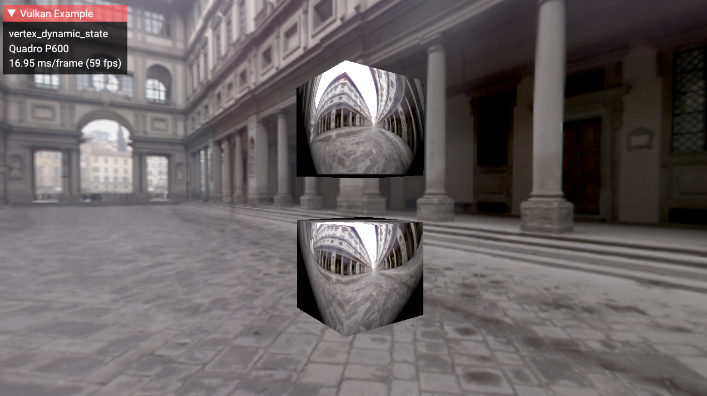

////
- Copyright (c) 2022, Mobica Limited
-
- SPDX-License-Identifier: Apache-2.0
-
- Licensed under the Apache License, Version 2.0 the "License";
- you may not use this file except in compliance with the License.
- You may obtain a copy of the License at
-
-     http://www.apache.org/licenses/LICENSE-2.0
-
- Unless required by applicable law or agreed to in writing, software
- distributed under the License is distributed on an "AS IS" BASIS,
- WITHOUT WARRANTIES OR CONDITIONS OF ANY KIND, either express or implied.
- See the License for the specific language governing permissions and
- limitations under the License.
-
////
= Vertex input dynamic state

== Overview

This sample demonstrates how to use the `VK_EXT_vertex_input_dynamic_state` extension, which eliminates the need to create multiple pipelines in case of different binding and/or attribute descriptions.

This extension changes how attributes and bindings are managed.
Instead of static description during pipeline creation, this extension allows developers to change attributes and bindings using a function before every draw.

Below is a comparison of common Vulkan vertex input description and dynamic one.

|===
| Vertex input static state | Vertex input dynamic state

| dynamic_state = {}
| dynamic_state = \{VK_DYNAMIC_STATE_VERTEX_INPUT_EXT}

| pVertexInputState = &vertex_input_state
| pVertexInputState = VK_NULL_HANDLE

| vkCreateGraphicsPipelines(model1) + vkCreateGraphicsPipelines(model2)
| vkCreateGraphicsPipelines(model)

| draw(model1, pipeline1) + draw(model2, pipeline2)
| vertex_bindings_description.stride  = sizeof(Vertex1);
+ vertex_attribute_description.offset = offsetof(Vertex1, param);
+ vkCmdSetVertexInputEXT(&vertex1_params) + draw(model1, pipeline) + vertex_bindings_description.stride  = sizeof(Vertex2);
+ vertex_attribute_description.offset = offsetof(Vertex2, param);
+ vkCmdSetVertexInputEXT(&vertex2_params) + draw(model2, pipeline)
|===

More details are provided in the sections that follow.

== Pipelines

Previously, developers had to create multiple pipeline's for models with different vertex input data, which would be referenced in  `VkGraphicsPipelineCreateInfo`.
This is illustrated in the non-dynamic version of vertex input.

[,C++]
----
  // First pipeline vertex data
  // Binding description
  std::vector<VkVertexInputBindingDescription> vertex_input_bindings_1 = {
      vkb::initializers::vertex_input_binding_description(
          0, sizeof(Vertex1), VK_VERTEX_INPUT_RATE_VERTEX),
  };

  // Attribute descriptions
  std::vector<VkVertexInputAttributeDescription> vertex_input_attributes_1 = {
    vkb::initializers::vertex_input_attribute_description(
        0, 0, VK_FORMAT_R32G32B32_SFLOAT, 0),                  // Position
    vkb::initializers::vertex_input_attribute_description(
        0, 1, VK_FORMAT_R32G32B32_SFLOAT, offsetof(Vertex1, normal)),  // Normal

    VkPipelineVertexInputStateCreateInfo vertex_input_state_1 =
      vkb::initializers::pipeline_vertex_input_state_create_info();
    vertex_input_state_1.vertexBindingDescriptionCount = static_cast<uint32_t>(vertex_input_bindings_1.size());
    vertex_input_state_1.pVertexBindingDescriptions = vertex_input_bindings_1.data();

    vertex_input_state_1.vertexAttributeDescriptionCount = static_cast<uint32_t>(vertex_input_attributes_1.size());
    vertex_input_state_1.pVertexAttributeDescriptions = vertex_input_attributes_1.data();

    graphics_create_info_1.pVertexInputState = &vertex_input_state_1;

  vkCreateGraphicsPipelines(get_device().get_handle(), VK_NULL_HANDLE, 1,
                            &graphics_create_info, VK_NULL_HANDLE, &pipeline1);

  // Second pipeline vertex data
  // Binding description
  std::vector<VkVertexInputBindingDescription> vertex_input_bindings_2 = {
      vkb::initializers::vertex_input_binding_description(
          0, sizeof(Vertex2), VK_VERTEX_INPUT_RATE_VERTEX),
  };

  // Attribute descriptions
  std::vector<VkVertexInputAttributeDescription> vertex_input_attributes_2 = {
    vkb::initializers::vertex_input_attribute_description(
        0, 0, VK_FORMAT_R32G32B32_SFLOAT, 0),                  // Position
    vkb::initializers::vertex_input_attribute_description(
        0, 1, VK_FORMAT_R32G32B32_SFLOAT, offsetof(Vertex2, normal)),  // Normal (different offset than in vertex_input_attributes_1)

    VkPipelineVertexInputStateCreateInfo vertex_input_state_2 =
      vkb::initializers::pipeline_vertex_input_state_create_info();
    vertex_input_state_1.vertexBindingDescriptionCount = static_cast<uint32_t>(vertex_input_bindings_2.size());
    vertex_input_state_2.pVertexBindingDescriptions = vertex_input_bindings_2.data();

    vertex_input_state_2.vertexAttributeDescriptionCount = static_cast<uint32_t>(vertex_input_attributes_2.size());
    vertex_input_state_2.pVertexAttributeDescriptions = vertex_input_attributes_2.data();

    graphics_create_info_2.pVertexInputState = &vertex_input_state_2;

    vkCreateGraphicsPipelines(get_device().get_handle(), VK_NULL_HANDLE, 1,
                              &graphics_create_info_2, VK_NULL_HANDLE, &pipeline2);

    draw_model(model1, pipeline1);
    draw_model(model2, pipeline2);
  };
----

However, with dynamic vertex input state the number of pipelines can be reduced because of possibility to change vertex bindings and attribute descriptions on runtime by calling `vkCmdSetVertexInputEXT` before `draw_model`.
+ This extension extends 2 structures: + `VkVertexInputBindingDescription` to `VkVertexInputBindingDescription2EXT` + `VkVertexInputAttributeDescription` to `VkVertexInputAttributeDescription2EXT` + An example of 2 sets of different vertex input data architectures `Vertex` and `SampleVertex`.
First model is loaded from assets (load_model function from framework), second model was created directly in code (have different vertex input data architecture).

[,C++]
----
  VkVertexInputBindingDescription2EXT   vertex_bindings_description_ext = {
  vkb::initializers::vertex_input_binding_description2ext(
	    0,
	    sizeof(Vertex),
	    VK_VERTEX_INPUT_RATE_VERTEX,
	    1);
  }
	VkVertexInputAttributeDescription2EXT vertex_attribute_description_ext[2] = {
  vkb::initializers::vertex_input_attribute_description2ext(
	    0,
	    0,
	    VK_FORMAT_R32G32B32_SFLOAT,
	    offsetof(Vertex, pos)),
  vkb::initializers::vertex_input_attribute_description2ext(
	    0,
	    1,
	    VK_FORMAT_R32G32B32_SFLOAT,
	    offsetof(Vertex, normal);
  }

    graphics_create_info.pVertexInputState = nullptr;

    vkCreateGraphicsPipelines(get_device().get_handle(), VK_NULL_HANDLE, 1,
                              &graphics_create_info, VK_NULL_HANDLE, &pipeline);

/* First set of vertex input dynamic data (Vertex structure) */
		vertex_bindings_description_ext[0].stride  = sizeof(Vertex);
		vertex_attribute_description_ext[1].offset = offsetof(Vertex, normal);
		vkCmdSetVertexInputEXT(draw_cmd_buffer,
		                       static_cast<uint32_t>(vertex_bindings_description_ext.size()),
		                       vertex_bindings_description_ext.data(),
		                       static_cast<uint32_t>(vertex_attribute_description_ext.size()),
		                       vertex_attribute_description_ext.data());
    draw_model(model1, pipeline);

/* Second set of vertex input dynamic data (SampleVertex structure) */
		vertex_bindings_description_ext[0].stride  = sizeof(SampleVertex);
		vertex_attribute_description_ext[1].offset = offsetof(SampleVertex, normal);
		vkCmdSetVertexInputEXT(draw_cmd_buffer,
		                       static_cast<uint32_t>(vertex_bindings_description_ext.size()),
		                       vertex_bindings_description_ext.data(),
		                       static_cast<uint32_t>(vertex_attribute_description_ext.size()),
		                       vertex_attribute_description_ext.data());
    draw_model(model2, pipeline);
----

== Enabling the Extension

The vertex input dynamic state api is provided in Vulkan 1.0 and the appropriate headers / SDK is required.

In addition, since vertex input dynamic state is provided as an extension and may have varying levels of support, the developer must query availability for each device used.

The device extension is provided by `VK_EXT_VERTEX_INPUT_DYNAMIC_STATE_EXTENSION_NAME`.
It also requires  `VK_KHR_GET_PHYSICAL_DEVICE_PROPERTIES_2_EXTENSION_NAME` instance extension to be enabled:

[,C++]
----
	add_instance_extension(VK_KHR_GET_PHYSICAL_DEVICE_PROPERTIES_2_EXTENSION_NAME);
	add_device_extension(VK_EXT_VERTEX_INPUT_DYNAMIC_STATE_EXTENSION_NAME);
----

Additional features are provided by the `VkPhysicalDeviceVertexInputDynamicStateFeaturesEXT` struct:

[,C++]
----
typedef struct VkPhysicalDeviceVertexInputDynamicStateFeaturesEXT {
    VkStructureType    sType;
    void*              pNext;
    VkBool32           vertexInputDynamicState;
} VkPhysicalDeviceVertexInputDynamicStateFeaturesEXT;
----
