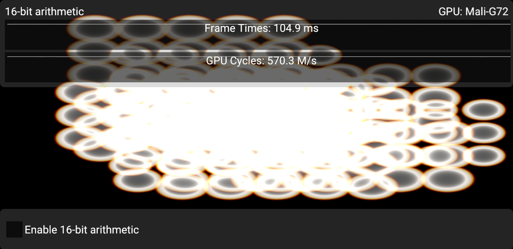
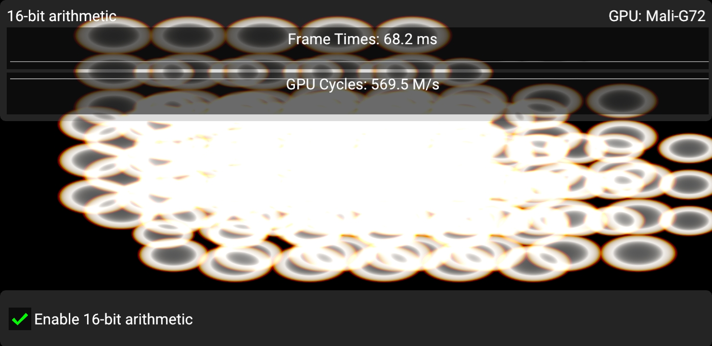

<!--
- Copyright (c) 2020, Arm Limited and Contributors
-
- SPDX-License-Identifier: Apache-2.0
-
- Licensed under the Apache License, Version 2.0 the "License";
- you may not use this file except in compliance with the License.
- You may obtain a copy of the License at
-
-     http://www.apache.org/licenses/LICENSE-2.0
-
- Unless required by applicable law or agreed to in writing, software
- distributed under the License is distributed on an "AS IS" BASIS,
- WITHOUT WARRANTIES OR CONDITIONS OF ANY KIND, either express or implied.
- See the License for the specific language governing permissions and
- limitations under the License.
-
-->

# Using explicit 16-bit arithmetic in applications

## Overview

In the world of mobile GPUs, `mediump` has long been used as a critical optimization for performance and bandwidth.
The desktop GPUs and APIs have not had much support for native 16-bit operations, but in recent architectures,
this feature is becoming widespread, and FP16 in particular is becoming more common.
In this sample, we demonstrate `VK_KHR_shader_float16_int8`, which adds standardized support for FP16 arithmetic (and INT8 arithmetic).

## Enable 16-bit floating-point arithmetic support

To add FP16 arithmetic support, enable the `VK_KHR_shader_float16_int8` extension.
You will also need to query `vkGetPhysicalDeviceFeatures2` with the `VkPhysicalDeviceShaderFloat16Int8Features` struct.
Here, we can query and enable two separate features:

- `shaderFloat16`
- `shaderInt8`

With these features enabled, we can create SPIR-V modules with the `Float16` and `Int8` capabilities enabled, respectively.
Note that this feature does not include support for 16-bit or 8-bit storage. For 16-bit storage, see `VK_KHR_16bit_storage`.

### 8-bit arithmetic?

While this extension also adds supports for using 8-bit integer arithmetic, this feature is not exercised by this sample.

### 16-bit integers?

Vulkan 1.0 already had a `shaderInt16` feature.

## Enable 16-bit storage support

When using 16-bit arithmetic, it's very likely that you would also use 16-bit values in buffers.
To that end, this sample also shows how to make use of 16-bit storage in SSBOs and push constants.

For this case, we need enable the `VK_KHR_16bit_storage` extension, as well as `VK_KHR_storage_buffer_storage_class`, which
is required for `VK_KHR_16bit_storage`.

From `vkGetPhysicalDeviceFeatures2`, we check `VkPhysicalDevice16BitStorageFeatures`, and enable:

- `storageBuffer16BitAccess`
- `storagePushConstant16`

## The 16-bit arithmetic sample

This sample aims to hammer the GPU with 16-bit floating-point arithmetic to observe a significant uplift in arithmetic throughput.
The sample is completely brute force and computes some procedural color rings.
For animation purposes, these rings move around on screen and change their appearance over time.
This is not intended to be an efficient way of rendering this kind of effect, quite the contrary.
Every pixel tests every ring unconditionally, and the math expended to compute the final color is heavily exaggerated to make sure that we
completely isolate arithmetic throughput as the main bottleneck.



Here, the critical arithmetic overhead is:

```
// This is very arbitrary. Expends a ton of arithmetic to compute
// something that looks similar to a lens flare.
vec4 compute_blob(vec2 pos, vec4 blob, float seed)
{
    vec2 offset = pos - blob.xy;
    vec2 s_offset = offset * (1.1 + seed);
    vec2 r_offset = offset * 0.95;
    vec2 g_offset = offset * 1.0;
    vec2 b_offset = offset * 1.05;

    float r_dot = dot(r_offset, r_offset);
    float g_dot = dot(g_offset, g_offset);
    float b_dot = dot(b_offset, b_offset);
    float s_dot = dot(s_offset, s_offset);

    vec4 dots = vec4(r_dot, g_dot, b_dot, s_dot) * blob.w;

    // Now we have square distances to blob center.

    // Gotta have some FMAs, right? :D
    dots = dots * dots + dots;
    dots = dots * dots + dots;
    dots = dots * dots + dots;
    dots = dots * dots + dots;
    dots = dots * dots + dots;
    dots = dots * dots + dots;

    vec4 parabolas = max(vec4(1.0, 1.0, 1.0, 0.9) - dots, vec4(0.0));
    parabolas -= parabolas.w;
    parabolas = max(parabolas, vec4(0.0));
    return parabolas;
}
```



In this version, we rewrite `compute_blob` and the rest of the shader to be as pure FP16 as we can:

```
// Allows us to use float16_t for arithmetic purposes.
#extension GL_EXT_shader_explicit_arithmetic_types_float16 : require

// Allows us to use int16_t, uint16_t and float16_t for buffers.
#extension GL_EXT_shader_16bit_storage : require
```

```
// This is very arbitrary. Expends a ton of arithmetic to compute
// something that looks similar to a lens flare.
f16vec4 compute_blob(f16vec2 pos, f16vec4 blob, float16_t seed)
{
    f16vec2 offset = pos - blob.xy;
    f16vec4 rg_offset = offset.xxyy * f16vec4(0.95hf, 1.0hf, 0.95hf, 1.0hf);
    f16vec4 bs_offset = offset.xxyy * f16vec4(1.05hf, 1.1hf + seed, 1.05hf, 1.1hf + seed);

    f16vec4 rg_dot = rg_offset * rg_offset;
    f16vec4 bs_dot = bs_offset * bs_offset;

    // Dot products can be somewhat awkward in FP16, since the result is a scalar 16-bit value, and we don't want that.
    // To that end, we compute at least two dot products side by side, and rg_offset and bs_offset are swizzled
    // such that we avoid swizzling across a 32-bit boundary.
    f16vec4 dots = f16vec4(rg_dot.xy + rg_dot.zw, bs_dot.xy + bs_dot.zw) * blob.w;

    // Now we have square distances to blob center.

    // Gotta have some FMAs, right? :D
    dots = dots * dots + dots;
    dots = dots * dots + dots;
    dots = dots * dots + dots;
    dots = dots * dots + dots;
    dots = dots * dots + dots;
    dots = dots * dots + dots;

    f16vec4 parabolas = max(f16vec4(1.0hf, 1.0hf, 1.0hf, 0.9hf) - dots, f16vec4(0.0hf));
    parabolas -= parabolas.w;
    parabolas = max(parabolas, f16vec4(0.0hf));
    return parabolas;
}
```

## Explicit 16-bit arithmetic vs. `mediump` / `RelaxedPrecision`

Explicit, standardized 16-bit arithmetic support is quite recent in the graphics API world,
but `mediump` will be familiar to many mobile (OpenGL ES) developers.
In SPIR-V, this translates to the `RelaxedPrecision` decoration.

The main problem with `mediump` has always been that you're just not quite sure if the driver actually makes use of the precision qualifier.
`mediump` simply signals the intent that "it's okay to use FP16 here, but compiler is free to ignore it and just use FP32".
This causes many headaches for developers (and users!), as developers might add `mediump`, observe that everything renders correctly on their implementation,
but then try on a different implementation and see that rendering is broken.
If you use explicit FP16, you're guaranteed that the device in question is actually using FP16, and there is no guesswork involved.

`mediump` is supported in Vulkan GLSL even in desktop profile, and some desktop drivers and GPUs actually do make use of the resulting `RelaxedPrecision` qualifier.
It is a legitimate strategy to use `mediump` in Vulkan. The main benefit of going that route is that you do not need to implement shader variants to handle FP16 vs. FP32, as
not all devices support explicit FP16 arithmetic yet. Especially for fragment shaders rendering normal graphics, it can cause a headache to have to add more shader variants
just for this case. `mediump` can be a useful tool here since it works everywhere, but you have to accept different rendering results on different devices.

Explicit FP16 shines in compute workloads, where the consideration for shader variants is less of a concern, and you can implement and tune FP16 kernels.

## The hidden benefit of FP16, reducing register pressure

A somewhat hidden benefit of using smaller arithmetic types is not just a higher throughput potential,
but reduction in register use. GPU performance is in large part dictated by how many registers are required to run shaders.
As more registers are used, fewer threads can run concurrently, and thus, it is worse at hiding instruction latency.
Memory operations such as loads and stores, as well as texture operations tend to have high latencies,
and if register use is too high, the shader cores are not able to effectively "hide" this latency.
This directly results in worse performance as the shader cores spend cycles doing nothing useful.

In compute shaders, you can also use shared memory with small arithmetic types, which is very nice as well.

Demonstrating these effects in a sample is quite difficult since it depends on so many unknown factors, but these effects are possible
to study by using vendor tools or the `VK_KHR_pipeline_executable_properties` extension, which typically reports register usage/occupancy.

## Best practice summary

**Do**

- Consider using FP16 if you're struggling with arithmetic throughput or register pressure.
- Carefully benchmark your algorithmic improvements. It is very hard to guarantee uplift when using FP16.
  The more complicated the code is, the harder it is to successfully make good use of FP16.
  If the problem can be expressed almost entirely with FMA, it is very easy to see uplift however.
- Consider using `mediump` / `RelaxedPrecision` if you don't want to explicitly use FP16,
  or you would need to use a lot of shader variants to select between FP32 and FP16.
  The most common case here being typical graphics fragment shaders, which can easily have a combinatorial explosion of variants.
  Using specially optimized compute shaders is a more plausible scenario for explicit FP16.
- If using `mediump`, make sure you test on a wide number of implementations to actually observe precision losses when using it.
- If using FP16, make sure you carefully vectorize the code by using `f16vec2` or `f16vec4`.
  Modern GPU architectures rely on "packed" f16x2 instructions to achieve improved arithmetic performance.
  Scalar `float16_t` won't have much, if any, benefit.

**Don't**

- Cast between FP16 and FP32 too much. Most GPUs need to spend cycles when converting between FP16 and FP32.
- Rely on `mediump` without testing it on a wide range of implementations.

**Impact**

- Not taking advantage of FP16 could leave some optimization potential on the table.
- Not taking advantage of FP16 could lead to poor shader occupancy, i.e. too many registers are used.
  This in turn would lead to execution bubbles on a shader core, where cycles are wasted.

**Debugging**

- The only reasonable way to debug arithmetic throughput is with a profiler that can give you stats about this.
- To debug shader occupancy, an offline compiler, vendor tools or the standard `VK_KHR_pipeline_executable_properties` extension could help
  to obtain this kind of information.
