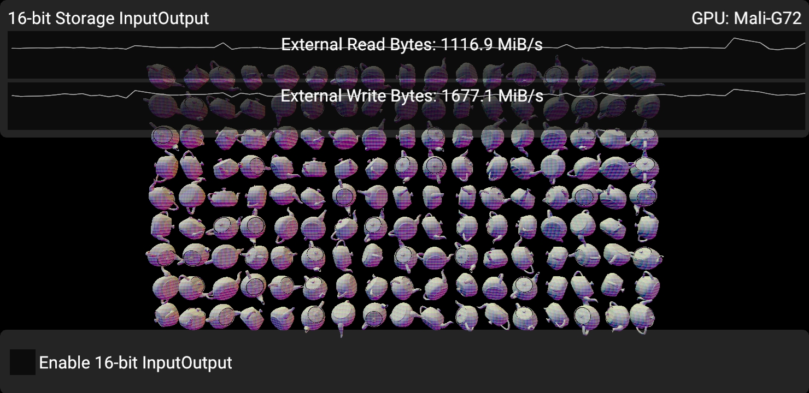
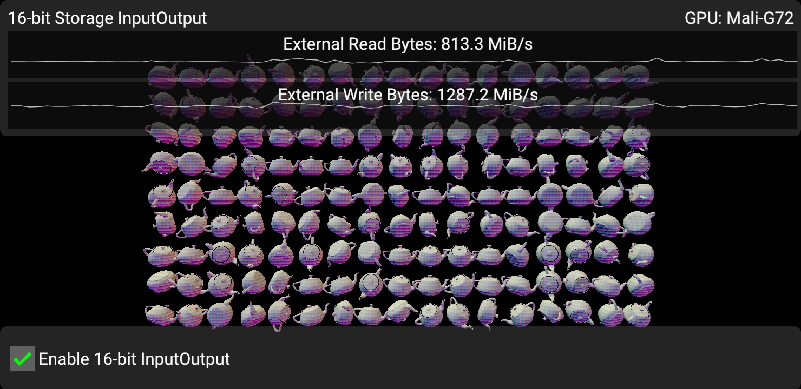

<!--
- Copyright (c) 2020-2021, Arm Limited and Contributors
-
- SPDX-License-Identifier: Apache-2.0
-
- Licensed under the Apache License, Version 2.0 the "License";
- you may not use this file except in compliance with the License.
- You may obtain a copy of the License at
-
-     http://www.apache.org/licenses/LICENSE-2.0
-
- Unless required by applicable law or agreed to in writing, software
- distributed under the License is distributed on an "AS IS" BASIS,
- WITHOUT WARRANTIES OR CONDITIONS OF ANY KIND, either express or implied.
- See the License for the specific language governing permissions and
- limitations under the License.
-
-->

# Using 16-bit storage InputOutput feature to reduce bandwidth on tile-based architectures

## Overview

On some tile-based deferred renderers (TBDR), such as Arm Mali GPUs, vertex shading and fragment shading
is split into two distinct stages. Vertex shaders and the general geometry pipeline will write to memory for each visible vertex:

- Position (`gl_Position`)
- Vertex output data (`layout(location = N) out`).
- GPU specific data structures to accelerate rasterization later.

Then, in fragment stage, the positions and GPU specific data structures are read to rasterize primitives,
and for each fragment we invoke, the vertex output data can be read by the fragment shader as input variables.
All of this consumes bandwidth.

As vertex output data is something the application controls (and tends to consume many bytes per vertex),
we should attempt to minimize the bandwidth we consume. This samples demonstrates real bandwidth saving
achieved with a simple sample.

## Enabling the 16-bit storage extension

`VK_KHR_16bit_storage` is an extension which supports many different features, but this sample in particular
will focus on the `storageInputOutput16` feature.

The `VK_KHR_16bit_storage` is core in Vulkan 1.1, so an extension is not required, but the feature you plan to use
must still be enabled.

First, add `VkPhysicalDevice16BitStorageFeatures` as a `pNext` to `vkGetPhysicalDeviceFeatures2`.
Now, you can check which features are supported:

- `storageBuffer16BitAccess`: Allows you to use true 16-bit values in SSBOs.
- `uniformAndStorageBuffer16BitAccess`: Allows you to use true 16-bit values in UBOs as well.
- `storagePushConstant16`: Allows you to use true 16-bit values in push constant blocks (quite handy since push constant space is so tight!)
- `storageInputOutput16`: A TBDR friendly feature, allows you to use true 16-bit values in shader input and output interfaces.

To use the feature, make sure `VkPhysicalDevice16BitStorageFeatures` is passed down to `vkCreateDevice`'s `pNext` chain.

### Difference between storage and arithmetic support

There's two aspects to 16-bit support, storage and arithmetic.

With storage support, the main goal is to reduce bandwidth and memory requirements.
With 16-bit arithmetic, we will be able to improve arithmetic throughput.
This sample focuses on storage only, so the sample takes care not to enable any 16-bit arithmetic features.

If a device only supports 16-bit storage, but not arithmetic, we need to be somewhat careful when writing
shaders.

The native 16-bit types can only be used when storing to the variable, or when loading from the variable.

```
// GL_EXT_16bit_storage would normally be used here, but that extension does not support input/output.
// glslang enables SPIR-V capabilities as required.
#extension GL_EXT_shader_explicit_arithmetic_types_float16 : require
layout(location = 0) out f16vec4 Foo;

vec4 arithmetic = blah(); // Arithmetic happens in FP32.
Foo = f16vec4(arithmetic); // Narrowing store.
```

```
// GL_EXT_16bit_storage would normally be used here, but that extension does not support input/output.
// glslang enables SPIR-V capabilities as required.
#extension GL_EXT_shader_explicit_arithmetic_types_float16 : require
layout(location = 0) in f16vec4 Foo;
vec4 arithmetic = vec4(Foo); // Expand fp16 -> fp32.
arithmetic += blah();
```

In SPIR-V, you can verify what is going on by looking at the enabled capabilities:

```
OpCapability Shader
OpCapability StorageInputOutput16 ; <-- Only needs VK_KHR_16bit_storage

         %51 = OpLoad %v4float %color
         %52 = OpFConvert %v4half %51 <-- OpFConvert followed by OpStore just requires storage.
        ; Similarly, OpLoad followed by OpFConvert just requires Storage feature.
               OpStore %o_color %52
```

For example, if you use 16-bit arithmetic, you will see:

```
OpCapability Shader
OpCapability Float16 ; <-- Arithmetic support, needs a different extension.
OpCapability StorageInputOutput16

         %55 = OpFAdd %v4half %52 %54 <-- This is arithmetic in native FP16
               OpStore %o_color %55
```

The validation layers will catch this if you forget to enable the extensions and features.

## The 16-bit InputOutput storage sample

In the sample, we render a large number of teapot meshes (17 * 9 = 153), each with
9128 triangles and 4689 unique vertices.
The teapots are not textured, and there is no post-processing happening,
meaning that geometry bandwidth is the key contributor to overall bandwidth.

As mentioned above, a significant contributor to geometry bandwidth on TBDR is the storage for
shader input and output data.
Vertex shaders which write to `layout(location = N) out T variable;` consume bandwidth.
Similarly, fragment shaders which read `layout(location = N) in T variable;` also consume bandwidth.

This sample demonstrates that there can be significant savings in global device bandwidth by ensuring
that the types used in vertex output and fragment input interfaces are as narrow as possible.

In the first scenario, the vertex shader has 3 vec3 outputs,
which is not a lot when considering modern rendering engines.

```
layout (location = 0) out vec3 o_vertex_color;
layout (location = 1) out vec3 o_normal;
layout (location = 2) out vec3 o_delta_pos;
```

For each unique vertex that is visible on screen, we must assume 52 bytes of memory bandwidth is consumed,
16 bytes for `gl_Position` and 36 bytes for vertex outputs.

The shading itself is somewhat contrived, it is mostly there to show something being rendered.



In the unoptimized case, we observe ~1.67 GB/s write bandwidth and ~1.16 GB/s read bandwidth
on the specific device we tested (see screenshot).
We can estimate what is going on here using intuition.

We are rendering 153 teapots with 4689 vertices. 717417 unique vertices will be vertex shaded.
On average, half the vertices are actually visible due to back-face culling (358k).
VSync is approximately 60 FPS on the test device in the screenshots,
so ~21.5M unique vertices / s will need to be written to memory.

For each vertex, we have 16 bytes for `gl_Position` and 36 bytes for output variables, meaning this data accounts for at least
~1.11 GB/s here. That's about 2/3 of the total write bandwidth we are measuring here.



Here, we simply replace the vertex outputs and fragment inputs to be fp16. This should theoretically save
18 bytes per vertex, or ~21.5 M/s * 18 B = 387 MB / s of pure write bandwidth, and that seems to be almost spot-on
with observed results. Similarly, read bandwidth is significantly reduced as well.

## Alternative implementation: `mediump`

Marking vertex output variables as `mediump` will generally allow us to achieve the same
bandwidth savings as explicit FP16 would, but the caveat is that you cannot be sure unless
you know the driver implementation details. The snippet below will work on any core Vulkan 1.0 implementation,
but it may or may not give you true FP16 vertex outputs:

```
// Vertex
layout(location = 0) out mediump vec3 o_normal;

// Fragment
layout(location = 0) in mediump vec3 in_normal;
```

## Considering precision

FP16 is not very accurate, and you most likely cannot use FP16 for every vertex output in your application.
Things which work well with FP16 precision:

- Normals / Tangent / Bi-tangent
- Vertex colors (if you're still using those)
- Any auxillary data which is centered around 0 and doesn't need exceptionally high precision.

Use cases which may, or may not work well with FP16 precision:

- Local world position.
  Precision can be significantly improved if you use `delta_pos = f16vec3(world_position - camera_position);`.
  This centers the value around 0, and has the nice property that the closer you get to the camera,
  the better precision you get. Far away from the camera precision is less of a concern anyways.
  On a mobile screen, the precision errors might not be perceptible.
- Texture coordinates with smaller texture resolutions and constrained UV range.
  If UVs can be kept between `[-1, 1]`, we have reasonable resolution in FP16, but might not be enough.

Things which almost certainly won't work:

- Global world position.
- UI texture coordinates.

## Best practice summary

**Do**

- Use FP16 vertex outputs when possible and meets quality requirements.
- If you cannot rely on VK_KHR_16bit_storage being available, at the very least use `mediump` in lieu of true FP16.

**Don't**

- Ignore bandwidth benefits of FP16 vertex outputs. Even if 60 FPS is met, battery life can be extended by saving bandwidth.

**Impact**

- Not using FP16 vertex outputs where you can will waste bandwidth on TBDR renderers, leading to increased power consumption.

**Debugging**

- To observe the impact of any change to vertex output precision, use a profiler such as Streamline to observe external write or read bandwidth.
