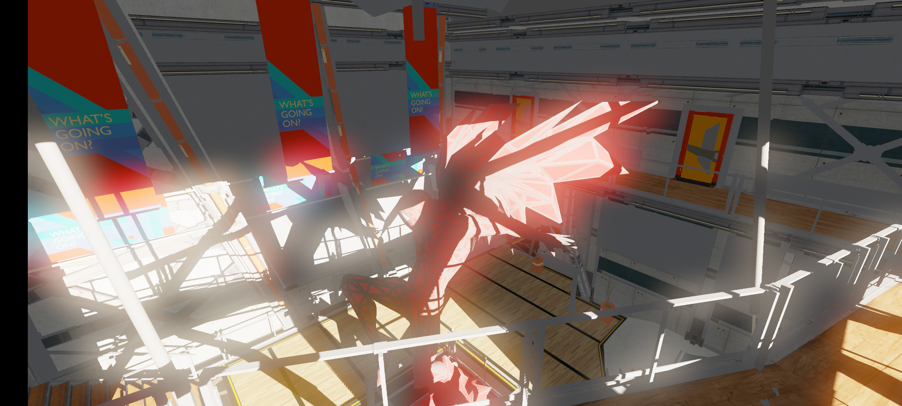
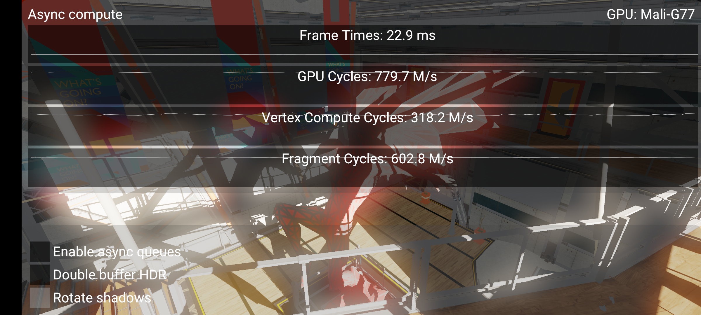
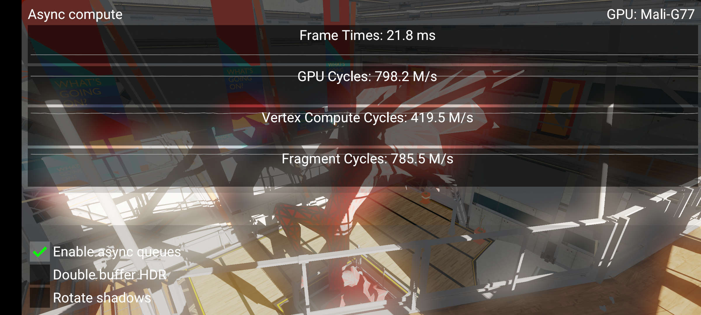

////
- Copyright (c) 2021-2023, Arm Limited and Contributors
-
- SPDX-License-Identifier: Apache-2.0
-
- Licensed under the Apache License, Version 2.0 the "License";
- you may not use this file except in compliance with the License.
- You may obtain a copy of the License at
-
-     http://www.apache.org/licenses/LICENSE-2.0
-
- Unless required by applicable law or agreed to in writing, software
- distributed under the License is distributed on an "AS IS" BASIS,
- WITHOUT WARRANTIES OR CONDITIONS OF ANY KIND, either express or implied.
- See the License for the specific language governing permissions and
- limitations under the License.
-
////
= Using async compute to saturate GPU

ifdef::site-gen-antora[]
TIP: The source for this sample can be found in the https://github.com/KhronosGroup/Vulkan-Samples/tree/main/samples/performance/async_compute[Khronos Vulkan samples github repository].
endif::[]

== Overview

Most Vulkan implementations expose multiple Vulkan queues which the application can make use of at any one time.
The main motivation for hardware to expose multiple queues is that we can express parallelism at a higher level than threads.

== Compute all the things - a post processing case study

Compute shaders are increasingly being employed to do "everything" except for main pass rasterization in modern game engines.
This sample aims to demonstrate some techniques we can use to get optimal behavior on tile based renderers in particular.
As we will discuss later, the strategy for immediate mode renderers are somewhat different due to architectural differences.

== The challenge of compute shader post processing on tile-based deferred renderers (TBDR)

The TBDR architecture splits vertex shading and fragment shading in two.
First, vertices and shaded and binned, and once all of that is done, fragment shading happens.
A critical performance win is that vertex shading in render pass N + {1, 2, ...} can overlap fragment shading in render pass N.
When targeting optimal performance on these GPUs, we must ensure to never stall fragment shading.

Due to this kind of rendering architecture, there should be at least two hardware queues on these GPUs.

At least on Arm Mali GPUs, compute workloads run in the same queue as vertex shading and binning.
This is intuitive since vertex shading is basically the same as compute shading with some extra fixed function magic.

Compute shader post processing becomes problematic in this kind of frame:

* Rasterize pass
* FRAGMENT \-> COMPUTE semaphore
* Compute pass
* COMPUTE \-> FRAGMENT semaphore *(Perf cliff!
:<)*
* Render UI + post output
* Present in graphics

It is natural to end a frame in the graphics queue for two reasons:

* We really want to render UI in the same render pass where we render to swapchain.
Bandwidth is very important, and this way we avoid a writeback and readback of the native-resolution UI image which can be rather large.
* Rendering UI inline in one compute thread is theoretically possible (VK_EXT_descriptor_indexing can certainly help!) but an extremely complex thing to hack in.

The real problem is the COMPUTE \-> FRAGMENT semaphore here.
Due to the FRAGMENT \-> COMPUTE and COMPUTE \-> FRAGMENT barriers we have effectively blocked FRAGMENT from doing any work while COMPUTE is running.
As mentioned earlier, this is a performance problem on TBDR.

=== A note on compute post-processing on TBDR vs immediate mode (IMR) desktop GPUs

A more desktop-style approach here is to present from async compute, i.e., do *everything* in compute, and try to go with this approach instead:

* Rasterize pass
* FRAGMENT \-> COMPUTE semaphore
* Compute post
* Render UI in graphics queue (bandwidth hit, but we don't really care here)
* FRAGMENT \-> COMPUTE semaphore
* Composite final result in a compute shader
* Present in compute

Presenting from async compute is a different topic and is not covered by this sample, but it's something to keep in mind.

=== Using multiple graphics queues to pop the bubble

Some GPUs expose multiple graphics queues in Vulkan.
This is very handy since we can fix the barrier problem this way.
Assume that we have 2 VkQueues which support everything, and we can render the frame like this instead:

* Rasterize pass (Queue #1)
* FRAGMENT (Queue #1) \-> COMPUTE (Queue #0) semaphore
* Compute pass (Queue #0)
* COMPUTE (Queue #0) \-> FRAGMENT (Queue #0) semaphore *(No perf OOF!
:>)*
* Render UI + post output (Queue #0)
* Present in graphics (Queue #0)
* ...
* Rasterize pass (Queue #1) is not blocked on compute, overlap achieved :>

== Queue priorities

A final cherry on top is to fiddle with queue priorities.
How queue priorities behave is implementation independent, but the intention is that it allows drivers to prioritize work in one queue over another.
In our case, we should make Queue #0 high priority and #1 low priority, since work late in the frame is more important than work happening early in next frame.
From a latency point of view, it would be ideal if Queue #0 can interrupt Queue #1.

== Reordering passes manually?

An alternative to the approach in this sample which sidesteps the issue is to defer submitting the UI + present work, and start submitting graphics work for the next frame before blocking on compute work.
This is problematic because:

* It adds complexity to juggle multiple in-flight frames.
* It adds needless input latency.
When we add more overlap between frames we also reduce responsiveness, which is very important for interactive content.

== The sample

The sample implements a very bare bones rendering pipeline which demonstrates a plausible rendering scenario consisting of:

* Render directional shadowmap at 8K
* Render HDR image at 4K with very basic lighting
* Very naive and simple HDR + (a very bloomy) Bloom pipeline in async compute
* Tonemap + UI in swapchain pass

The goal here is to exploit the shadow mapping pass, which is extremely bound on fixed function rasterization performance.
If we can do useful compute work in parallel, we should get a win in performance.

Here we see that fragment cycles is much lower than GPU cycles.
This means the fragment queue is starved for work.
This is due to our bad barriers mentioned above.
Vertex + Fragment cycles is still > GPU cycles, which means there is some overlap, but this is only vertex shading that overlaps.
Post-process compute is starving the GPU.

Here we can see a nice perf win (21.8 ms vs.
22.9 ms), and fragment cycles is very close to GPU cycles now, which means no starvation is happening.
Note that performance does not scale immensely here, and we shouldn't expect that either.
While vertex cycles and fragment cycles both increase, they are still competing for resources on the same shader core.
The work we do to get good overlap means the GPU always has something to do in the lull periods between barriers which drain a hardware queue for work.

=== Options

* *Enable async queues*: Uses multiple queues to avoid stalling the fragment queue.
* *Double buffer HDR*: Aims to exploit more overlap opportunities.
* *Rotate shadows*: Disables the animated light, it is hard to study performance differences when it is on since performance fluctuates a bit with it on.

== Best practice summary

These tips are somewhat TBDR specific.

*Do*

* Use multiple Vulkan queues if there is any FRAGMENT \-> COMPUTE workload happening.
* Any COMPUTE work which depends on FRAGMENT should be done in a different queue to avoid stalling FRAGMENT.
* Use higher priority on the queue which presents the final image.

*Don't*

* Introduce a FRAGMENT \-> COMPUTE barrier unless you have a plan on how to avoid the inevitable COMPUTE \-> FRAGMENT barrier.

*Debugging*

* IHV profiling tools can visualize how different hardware queues are saturated.
