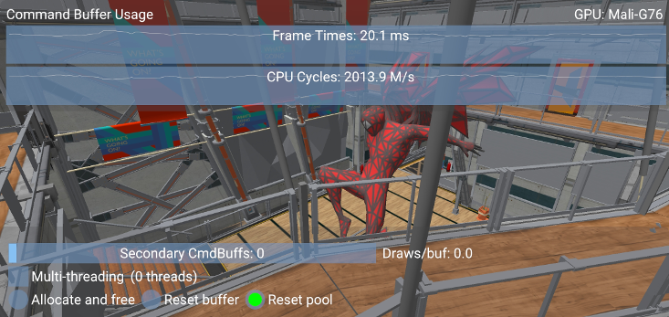
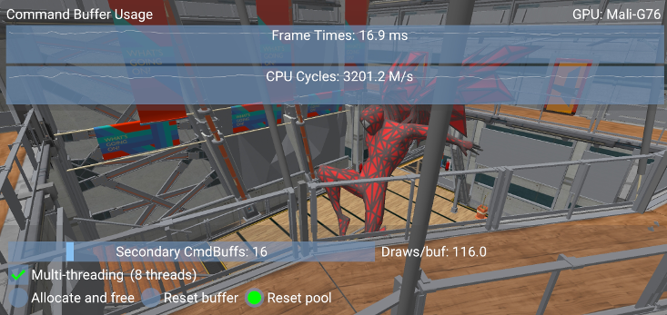
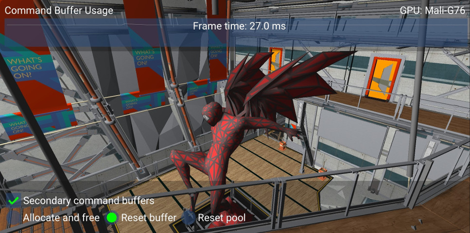
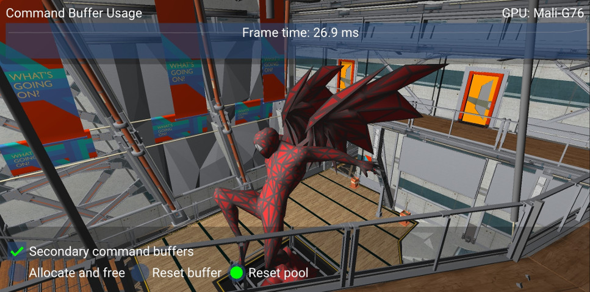

////
- Copyright (c) 2019-2023, Arm Limited and Contributors
-
- SPDX-License-Identifier: Apache-2.0
-
- Licensed under the Apache License, Version 2.0 the "License";
- you may not use this file except in compliance with the License.
- You may obtain a copy of the License at
-
-     http://www.apache.org/licenses/LICENSE-2.0
-
- Unless required by applicable law or agreed to in writing, software
- distributed under the License is distributed on an "AS IS" BASIS,
- WITHOUT WARRANTIES OR CONDITIONS OF ANY KIND, either express or implied.
- See the License for the specific language governing permissions and
- limitations under the License.
-
////
= Command buffer usage and multi-threaded recording
:pp: {plus}{plus}

== Overview

This sample demonstrates how to use and manage secondary command buffers, and how to record them concurrently.

Implementing multi-threaded recording of draw calls can help reduce CPU frame time.

In tile-based renderers, the best approach to split the draw calls is to record them in secondary command buffers.
This way they can all be submitted to the same render pass, and can take advantage of tile local memory.

== Secondary command buffers

Secondary command buffers can inherit the render pass state from a primary command buffer using a https://www.khronos.org/registry/vulkan/specs/1.1-extensions/man/html/VkCommandBufferInheritanceInfo.html[VkCommandBufferInheritanceInfo] structure which is passed to https://www.khronos.org/registry/vulkan/specs/1.1-extensions/man/html/vkBeginCommandBuffer.html[vkBeginCommandBuffer] as part of https://www.khronos.org/registry/vulkan/specs/1.1-extensions/man/html/VkCommandBufferBeginInfo.html[VkCommandBufferBeginInfo], along with the flag `VK_COMMAND_BUFFER_USAGE_RENDER_PASS_CONTINUE_BIT`.
Secondary command buffers may then be recorded concurrently.

The primary command buffer must have used the flag `VK_SUBPASS_CONTENTS_SECONDARY_COMMAND_BUFFERS` in https://www.khronos.org/registry/vulkan/specs/1.1-extensions/man/html/vkCmdBeginRenderPass.html[vkCmdBeginRenderPass].

Finally, the primary command buffer records https://www.khronos.org/registry/vulkan/specs/1.1-extensions/man/html/vkCmdExecuteCommands.html[vkCmdExecuteCommands] (before https://www.khronos.org/registry/vulkan/specs/1.1-extensions/man/html/vkCmdEndRenderPass.html[vkCmdEndRenderPass]) with an array of recorded secondary command buffers to execute.
The sample divides the draw calls for opaque objects based on the slider value.
It then submits a separate buffer for transparent objects if any, and finally one for the GUI elements if visible.

== Multi-threaded recording

To record command buffers concurrently, the framework needs to manage resource pools per frame and per thread.
According to the Vulkan Spec:

* https://www.khronos.org/registry/vulkan/specs/1.1-extensions/man/html/VkCommandPool.html[_A command pool must not be used concurrently in multiple threads._]
* https://www.khronos.org/registry/vulkan/specs/1.1-extensions/man/html/VkDescriptorPool.html[_The application must not allocate and/or free descriptor sets from the same pool in multiple threads simultaneously._]

In the framework, each frame in the queue (e.g.
three frames in case of triple buffering) manages a collection of pools so that each thread can own:

* A command pool
* A descriptor pool cache
* A descriptor set cache
* A buffer pool

This sample then uses a thread pool to push work to multiple threads.
When splitting the draw calls, it is advisable to keep the loads balanced.
The sample allows to change the number of buffers, but if the number of calls is not divisible, the remaining will be evenly spread through other buffers.
The average number of draws per buffer is shown on the screen.

Note that since state is not reused across command buffers, a reasonable number of draw calls should be submitted per command buffer, to avoid having the GPU going idle while processing commands.
Therefore having many secondary command buffers with few draw calls can negatively affect performance.
In any case there is no advantage in exceeding the CPU parallelism level i.e.
using more command buffers than threads.
Similarly having more threads than buffers may have a performance impact.
To keep all threads busy, the sample resizes the thread pool for low number of buffers.
The sample slider can help illustrate these trade-offs and their impact on performance, as shown by the performance graphs.

In this case, a scene with a high number of draw calls (~1800, this number may be found in the link:../../../docs/misc.adoc#debug-window[debug window]) shows a 15% improvement in performance when dividing the workload among 8 buffers across 8 threads:

To test the sample, make sure to build it in release mode and without validation layers.
Both these factors can significantly affect the results.

== Recycling strategies

Vulkan provides different ways to manage and allocate command buffers.
This sample compares them and demonstrates the best approach.

* <<allocate-and-free,Allocate and Free>>
* <<resetting-individual-command-buffers,Resetting individual command buffers>>
* <<resetting-the-command-pool,Resetting the command pool>>

=== Allocate and free

Command buffers are allocated from a command pool with https://www.khronos.org/registry/vulkan/specs/1.1-extensions/man/html/vkAllocateCommandBuffers.html[vkAllocateCommandBuffers].
They can then be recorded and submitted to a queue for the Vulkan device to execute them.

A possible approach to managing the command buffers for each frame in our application would be to free them once they are executed, using https://www.khronos.org/registry/vulkan/specs/1.1-extensions/man/html/vkFreeCommandBuffers.html[vkFreeCommandBuffers].

The command pool will not automatically recycle memory from deleted command buffers if the command pool was created without the https://www.khronos.org/registry/vulkan/specs/1.1-extensions/man/html/VkCommandPoolCreateFlagBits.html[RESET_COMMAND_BUFFER_BIT] flag.
This flag however will force separate internal allocators to be used for each command buffer in the pool, which can increase CPU overhead compared to a single pool reset.

This is the worst-performing method of managing command buffers as it involves a significant CPU overhead for allocating and freeing memory frequently.
The sample shows how to use the framework to follow this approach and profile its performance.

Rather than freeing and re-allocating the memory used by a command buffer, it is more efficient to recycle it for recording new commands.
There are two ways of resetting a command buffer: individually, with https://www.khronos.org/registry/vulkan/specs/1.1-extensions/man/html/vkResetCommandBuffer.html[vkResetCommandBuffer], or indirectly by resetting the command pool with https://www.khronos.org/registry/vulkan/specs/1.1-extensions/man/html/vkResetCommandPool.html[vkResetCommandPool].

=== Resetting individual command buffers

In order to reset command buffers individually with https://www.khronos.org/registry/vulkan/specs/1.1-extensions/man/html/vkResetCommandBuffer.html[vkResetCommandBuffer], the pool must have been created with the https://www.khronos.org/registry/vulkan/specs/1.1-extensions/man/html/VkCommandPoolCreateFlagBits.html[RESET_COMMAND_BUFFER_BIT] flag set.
The buffer will then return to a recordable state and the command pool can reuse the memory it allocated for it.

However frequent calls to https://www.khronos.org/registry/vulkan/specs/1.1-extensions/man/html/vkResetCommandBuffer.html[vkResetCommandBuffer] are more expensive than a command pool reset.

=== Resetting the command pool

Resetting the pool with https://www.khronos.org/registry/vulkan/specs/1.1-extensions/man/html/vkResetCommandPool.html[vkResetCommandPool] automatically resets all the command buffers allocated by it.
Doing this periodically will allow the pool to reuse the memory allocated for command buffers with lower CPU overhead.

To reset the pool the flag https://www.khronos.org/registry/vulkan/specs/1.1-extensions/man/html/VkCommandPoolCreateFlagBits.html[RESET_COMMAND_BUFFER_BIT] is _not_ required, and it is actually better to avoid it since it prevents it from using a single large allocator for all buffers in the pool thus increasing memory overhead.

=== Relative performance

The sample offers the option of recording all drawing operations on a single command buffer, or to divide the opaque object draw calls among a given number of secondary command buffers.
The second method allows multi-threaded command buffer construction.
However the number of secondary command buffers should be kept low since their invocations are expensive.
This sample lets the user adjust the number of command buffers.
Using a high number of secondary command buffers causes the application to become CPU bound and makes the differences between the described memory allocation approaches more pronounced.

All command buffers in this sample are initialized with the https://www.khronos.org/registry/vulkan/specs/1.1-extensions/man/html/VkCommandBufferUsageFlagBits.html[ONE_TIME_SUBMIT_BIT] flag set.
This indicates to the driver that the buffer will not be re-submitted after execution, and allows it to optimize accordingly.
Performance may be reduced if the https://www.khronos.org/registry/vulkan/specs/1.1-extensions/man/html/VkCommandBufferUsageFlagBits.html[SIMULTANEOUS_USE_BIT] flag is set instead.

This sample provides options to try the three different approaches to command buffer management described above and monitor their efficiency.
This is relatively obvious directly on the device by monitoring frame time.

Since the application is CPU bound, the https://developer.android.com/studio/profile/android-profiler[Android Profiler] is a helpful tool to analyze the differences in performance.
As expected, most of the time goes into the https://github.com/ARM-software/vulkan_best_practice_for_mobile_developers/blob/master/framework/core/command_pool.cpp[command pool framework functions]: `request_command_buffer` and `reset`.
These handle the different modes of operation exposed by this sample.

image:images/android_profiler_allocate_and_free.png[Android Profiler: Allocate and Free] _Android Profiler capture: use the Flame Chart to visualize which functions take the most time in the capture.
Filter for command buffer functions, and use the tooltips to find out how much time out of the overall capture was used by each function._

Capturing the C{pp} calls this way allows us to determine how much each function contributed to the overall running time.
The results are captured in the table below.

|===
| Mode | Request + Reset command buffers (ms) | Total capture (ms) | Contribution

| Reset pool
| 53.3
| 11 877
| 0.45 %

| Reset buffers
| 140.29
| 12 087
| 1.16 %

| Allocate and free
| 3 319.25
| 11 513
| 28.8 %
|===

In this application the differences between individual reset and pool reset are more subtle, but allocating and freeing buffers are clearly the bottleneck in the worst performing case.

== Further reading

* xref:../multithreading_render_passes/README.adoc[Multi-threaded recording with multiple render passes]
* https://www.khronos.org/registry/vulkan/specs/1.3-extensions/html/chap6.html#commandbuffer-allocation[Command Buffer Allocation and Management]
* https://www.khronos.org/registry/vulkan/specs/1.0-wsi_extensions/html/chap5.html#commandbuffers-lifecycle[Command Buffer Lifecycle]
* _"Writing an efficient Vulkan renderer"_ by Arseny Kapoulkine (from "GPU Zen 2: Advanced Rendering Techniques")

== Best-practice summary

*Do*

* Use secondary command buffers to allow multi-threaded render pass construction.
* Minimize the number of secondary command buffer invocations used per frame.
* Set https://www.khronos.org/registry/vulkan/specs/1.1-extensions/man/html/VkCommandBufferUsageFlagBits.html[ONE_TIME_SUBMIT_BIT] if you are not going to reuse the command buffer.
* Periodically call https://www.khronos.org/registry/vulkan/specs/1.1-extensions/man/html/vkResetCommandPool.html[vkResetCommandPool()] to release the memory if you are not reusing command buffers.

*Don't*

* Set https://www.khronos.org/registry/vulkan/specs/1.1-extensions/man/html/VkCommandPoolCreateFlagBits.html[RESET_COMMAND_BUFFER_BIT] if you only need to free the whole pool.
If the bit is not set, some implementations might use a single large allocator for the pool, reducing memory management overhead.
* Call https://www.khronos.org/registry/vulkan/specs/1.1-extensions/man/html/vkResetCommandBuffer.html[vkResetCommandBuffer()] on a high frequency call path.

*Impact*

* Increased CPU load will be incurred with secondary command buffers.
* Increased CPU load will be incurred if command pool creation and command buffer begin flags are not used appropriately.
* Increased CPU overhead if command buffer resets are too frequent.
* Increased memory usage until a manual command pool reset is triggered.

*Debugging*

* Evaluate every use of any command buffer flag other than https://www.khronos.org/registry/vulkan/specs/1.1-extensions/man/html/VkCommandBufferUsageFlagBits.html[ONE_TIME_SUBMIT_BIT], and review whether it's a necessary use of the flag combination.
* Evaluate every use of https://www.khronos.org/registry/vulkan/specs/1.1-extensions/man/html/vkResetCommandBuffer.html[vkResetCommandBuffer()] and see if it could be replaced with https://www.khronos.org/registry/vulkan/specs/1.1-extensions/man/html/vkResetCommandPool.html[vkResetCommandPool()] instead.
