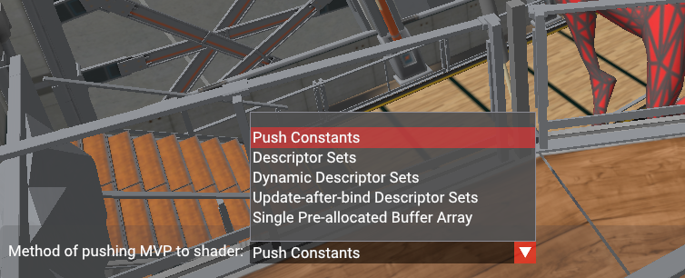
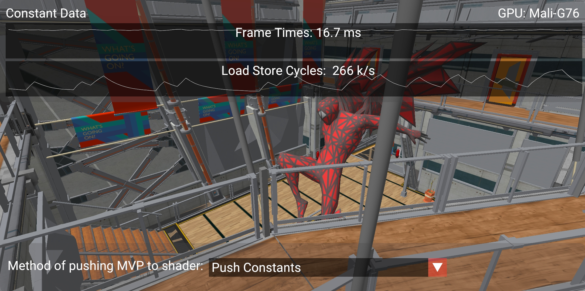
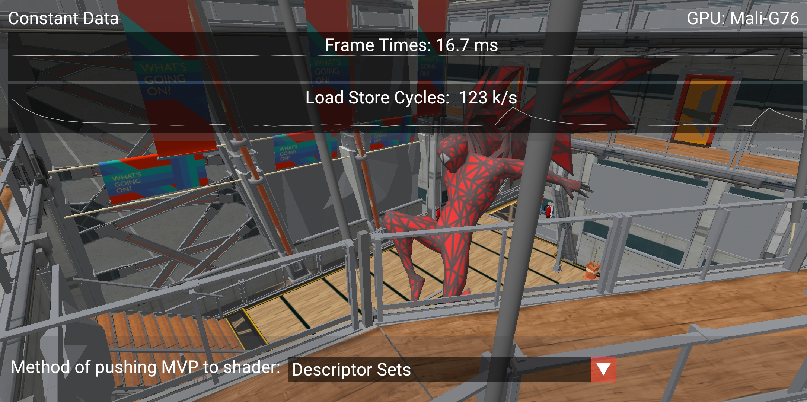
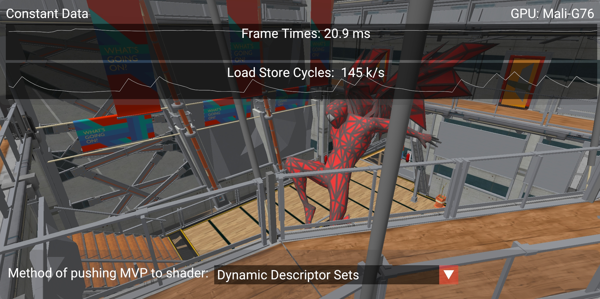
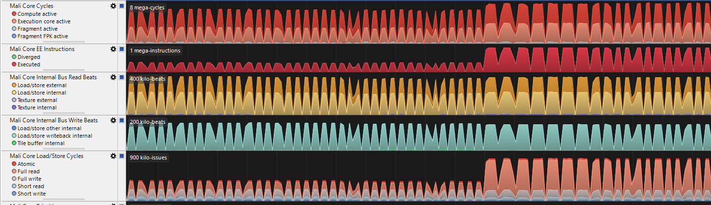

<!--
- Copyright (c) 2020, Arm Limited and Contributors
-
- SPDX-License-Identifier: Apache-2.0
-
- Licensed under the Apache License, Version 2.0 the "License";
- you may not use this file except in compliance with the License.
- You may obtain a copy of the License at
-
-     http://www.apache.org/licenses/LICENSE-2.0
-
- Unless required by applicable law or agreed to in writing, software
- distributed under the License is distributed on an "AS IS" BASIS,
- WITHOUT WARRANTIES OR CONDITIONS OF ANY KIND, either express or implied.
- See the License for the specific language governing permissions and
- limitations under the License.
-
-->

# **Constant data in Vulkan**

## **Overview**

The Vulkan API exposes a few different ways in which we can send uniform data into our shaders. There are enough methods that it raises the question "Which one is fastest?", and more often than not the answer is "It depends".

This sample aims to break this question down by highlighting the different methods we can use, and the performance implications that each of them bring. Then you, the developer, can pick the right one.

## **Contents**

- [What is Constant Data?](#what-is-constant-data)
    - [Introduction](#introduction)
    - [Constant data in Vulkan shaders](#constant-data-in-vulkan-shaders)
    - [Vulkan API](#vulkan-api)
- [Sample Overview](#sample-overview)
- [Push Constants](#push-constants)
- [Descriptor Sets](#descriptor-sets)
- [Dynamic Descriptor Sets](#dynamic-descriptor-sets)
- [Update-after-bind Descriptor Sets](#update-after-bind-descriptor-sets)
- [Buffer Object Arrays](#buffer-object-arrays)
- [Further reading](#further-reading)
- [Best practice summary](#best-practice-summary)

## **What is constant data?**

### **Introduction**

Constant data is a form of information that is supplied to the pipeline to help with shader computations.

In theory, this data can be anything we want it to be, for instance it can be used for things such as calculating where an object should be placed inside our world, or computing the overall brightness of an object based on the lights in the scene.

It differs from other data (e.g. input vertex data) in the sense that it remains *constant* across every shader invocation of a draw call.

This is important as because of this assumption, the data can be **shared** between shader stages, as we know it isn't going to be changed throughout the runtime of a single draw call in a render pipeline.

The next section aims to cover the constant data theory, starting at the shader level before moving to the basics of how to plug in your data using Vulkan.

### **Constant data in Vulkan shaders**

Constant data is implemented in shader code by using global variables.

**Global variables** have the following format:
`<layout> <storage> <type> <variable_name>`.  

Take this vertex shader for example:

```
layout(location = 0) in vec4 position;

layout(set = 0, binding = 0) uniform ConstantData
{
    mat4 model;
} constant_data;

layout(location = 0) out vec4 o_pos;
```

We can see three global variables, each with a different **storage type**:
* Inputs (`in`)
* Uniforms (`uniform`)
* Outputs (`out`)

#### *Varying Types*

The global variables that use inputs (`in`) and outputs (`out`) are values that *may vary* from one shader invocation to the next, therefore they **shouldn't** be used for constant data. They require a `layout location` which is used to identify a particular input/output.

They have slightly different rules for what they do depending on the shader stage, and have slightly different restrictions on the types of data it can represent. However, generally their use is to feed values from one stage to the next (e.g. from vertex shader to fragment shader). 

*You can read more about shader stage inputs and outputs [here](https://www.khronos.org/opengl/wiki/Type_Qualifier_(GLSL)#Shader_stage_inputs_and_outputs).*

#### *Constant Types*

Constant types are global variables that have either the `uniform` or `buffer` storage type, these are *uniform buffer objects* and *shader storage buffer objects* respectively. They describe data which remains constant across an entire draw call, meaning that the values stay the same across the different shader stages and shader invocations.

These values use a `layout binding` and, when working with multiple `VkDescriptorSet`s, we will also give it a `layout set`.

**Uniform buffer objects (UBOs)** are the more commonly used of the two. They are *read-only* buffers, so trying to edit them in shader code will result in a compile-time error. 

**Shader storage buffer objects (SSBOs)** are like special types of uniform buffer objects, denoted by the storage type `buffer`. Unlike UBOs they can be written to, meaning the values *can* be changed in the shaders so therefore they don't always represent data that is constant. Having said this, depending on the implementation, they generally can hold a lot more data as opposed to UBOs.

***Note:** To check how much data we can store in uniform buffers and storage buffers, you can query the physical device for its `VkPhysicalDeviceLimits` and check the values `maxUniformBufferRange` and `maxStorageBufferRange` respectively.*

#### *Interface Blocks*

To implement our constant data we have to use an interface block. Interface blocks in shader code are used to group multiple global variables of the same `<storage>` type, so in theory they aren't necessarily solely for constant data.

For example:

```
layout(set = 0, binding = 0) uniform PerMeshData
{
    vec4 camera_position;
    mat4 model_matrix;
    vec3 mesh_color;
}
per_mesh_data;
```

Interface blocks are still global variables, and technically still follow the global variable format that was mentioned at the start of this chapter. However, the difference is that they have to be given a user-defined type. They work exactly the same way as a `struct` in GLSL/C++. For example, to access the model matrix in this interface block, you'd use `per_mesh_data.model_matrix`. 

*You can read more about interface blocks [here](https://www.khronos.org/opengl/wiki/Interface_Block_(GLSL)).*

### **Vulkan API**

We've covered how constant data is implemented in the shader, however to push the data from the application to the shader we need to use Vulkan.

We do this mainly with the use of `VkBuffer`s, which is Vulkan's implementation of buffer memory.

Buffers in Vulkan are just chunks of memory used for storing data, which can be read by the GPU.

They need to be created and have their memory *manually* allocated, and then we can copy our constant data into the allocated memory. This data can then be plugged into the draw calls, so that it can finally be used in our shader computations. 

**Note:** *The library [Vulkan Memory Allocator (VMA)](https://github.com/GPUOpen-LibrariesAndSDKs/VulkanMemoryAllocator) is extremely good for handling a lot of the common pitfalls that come with managing your Vulkan memory, without removing the control that you would otherwise have with native Vulkan.*

The following links are useful for learning how to create a Vulkan buffer in your application:

* https://vulkan-tutorial.com/Vertex_buffers/Vertex_buffer_creation
* https://vulkan-tutorial.com/Vertex_buffers/Staging_buffer#page_Abstracting-buffer-creation
* https://vulkan-tutorial.com/Uniform_buffers/Descriptor_layout_and_buffer#page_Uniform-buffer

#### *The Methods*

Generally, there are two ways to push your constant data. It is either with **push constants** or **descriptor sets**. 

However the Vulkan API gives a lot of flexibility about how to handle **descriptor sets**, offering many different types and different ways to bind and use them (especially when we factor in extensions). This can puzzle developers about which is best, and for which scenarios. This tutorial aims to ease some of the confusion and uncertainty around this subject. 

When we break this down, we have the following methods:

* Push Constants
* Descriptor Sets
* Dynamic Descriptor Sets
* Update-after-bind Descriptor Sets
* Buffer array with dynamic indexing
* [Inline uniform buffer objects](https://www.khronos.org/registry/vulkan/specs/1.2-extensions/man/html/VK_EXT_inline_uniform_block.html) (click to read more)
* [Push descriptors](https://www.khronos.org/registry/vulkan/specs/1.2-extensions/man/html/VK_KHR_push_descriptor.html) (click to read more)

**Inline uniform buffer objects** and **push descriptors** are not covered by this tutorial, please use the links above to learn more about them.

## **Sample Overview**

### **Introduction**

The sample uses a mesh heavy scene which has 1856 meshes (475 KB of mesh data). This is to demonstrate a use case where many different calls to pushing constant data will occur during a single frame. This is to artificially exaggerate the performance delta.

The constant data that is being sent is the per-mesh model matrix, the camera view projection matrix, a scale matrix and some extra padding. If the GPU doesn't support at least 256 bytes of push constants, it will instead push 128 bytes (it won't include the scale matrix and the extra padding).

A performance graph is displayed at the top with two charts, one showing frame time, and one showing the load/store cycles.


These two counters will show the CPU and GPU cost respectively, so when you go to toggle the different method you can see how it changes.

### **Controls**

The options presented to the user lets them change the method by which we push the MVP data.



It is important to note that the configuration adapts to the device and GPU. This is so if an extension isn't supported, the related option will no longer show. You can check the console log to see a warning message detailing what features were disabled and why.

When an option is changed, the descriptor sets are flushed and recreated with their new setup, and the respective render pipeline/subpass.

## **Push Constants**

### **Introduction**

Push constants are usually the first method newer Vulkan programmers will stumble upon when beginning to work with constant data. They are straightforward to use and integrate nicely into any codebase, making them a great option to send simple data to your shaders.

A downside to push constants is that on some platforms they have strict limitations on how much data can be sent.
The Vulkan spec guarantees that drivers will support at least 128 bytes of push constants. Many modern implementations of Vulkan will commonly support 256 bytes and sometimes much more. 

***Note:** To determine how many bytes your system supports, you can query the physical device for its `VkPhysicalDeviceLimits` and check the value `maxPushConstantsSize`.*

Having said this, 128/256 bytes is still a useful amount of data, even if it isn't exactly scalable to a full game scenario. In the case of 128 bytes, we can at least send two float 4x4 matrices (2 * 4 * 16 = 128). This, for example, can hold our world matrix and our view-projection matrix.

So that the shader can understand where this data will be sent, we specify a special push constants `<layout>` in our shader code.

For example:

```
layout(push_constant) uniform MeshData
{
	mat4 model;
} mesh_data;
```

To then send the push constant data to the shader we use the [`vkCmdPushConstants`](https://www.khronos.org/registry/vulkan/specs/1.2-extensions/html/vkspec.html#vkCmdPushConstants) function: 

```
void vkCmdPushConstants(
    VkCommandBuffer                             commandBuffer,
    VkPipelineLayout                            layout,
    VkShaderStageFlags                          stageFlags,
    uint32_t                                    offset,
    uint32_t                                    size,
    const void*                                 pValues);
```

### **Performance**



In early implementations of Vulkan on Arm Mali, this was usually the fastest way of pushing data to your shaders. In more recent times, we have observed on Mali devices that *overall* they can be slower. If performance is something you are trying to maximise on Mali devices, descriptor sets may be the way to go. However, other devices may still favour push constants. 

Having said this, descriptor sets are one of the more complex features of Vulkan, making the convenience of push constants still worth considering as a go-to method, especially if working with trivial data. 

Scroll down for a comparison with static descriptor sets.

## **Descriptor Sets**

### **Introduction**

In Vulkan, resources are exposed to shaders by the use of **resource descriptors**. 

A **resource descriptor** (or **descriptor** for short) is a way for a shader to access a resource such as a buffer or an image. These **descriptors** are simple structures holding a pointer to the resource it is "describing", along with an associated *resource binding* so that when we execute a draw call the shader knows where to look for the resource. 

A collection of **descriptor**s are called a **descriptor set**, which itself will have an associated *set binding*.

For example, if we take this line of shader code:

```
layout(set = 0, binding = 0) uniform ConstantData
{
    mat4 model;
} constant_data;
```

The `set` value maps to the *set binding*, and the `binding` value maps to the *resource binding*. So therefore we can deduce that for this shader we'd need a pipeline that has one descriptor set with one binding (0 and 0 respectively). 

To create a **descriptor set**, we need to allocate it from a **descriptor set pool** and give it a specific **descriptor set layout**.

After a **descriptor set** is allocated, it needs to be updated with the **descriptors**. The update process requires us to specify a list of **write operations**, where a write operation is a [`VkWriteDescriptorSet`](https://www.khronos.org/registry/vulkan/specs/1.2-extensions/man/html/VkWriteDescriptorSet.html) struct.

Then the valid **descriptor set** is bound to a command buffer so that when `vkCmdDraw*()` commands are run, the right resources are made available in the GPU.

#### *Buffer Object*

For all the descriptor set sections below, we will use one such resource known as a **buffer object**, as this will be what we use to store our MVP data.

A **buffer object** in Vulkan is a type of `VkBuffer`, created with the respective buffer usage flag. For uniform buffer objects we use the `VK_BUFFER_USAGE_UNIFORM_BUFFER_BIT` flag, and for shader storage buffer objects we use the `VK_BUFFER_USAGE_STORAGE_BUFFER_BIT` flag. These map to the shader `<storage>` type `uniform`s and `buffer`s respectively. 

### **Performance**



While it is not straightforward to perform a 1:1 comparison between push constants and descriptor sets, the sample does show static descriptor sets outperforming push constants.

When comparing with [push constants](#push-constants) on an Arm Mali GPU, we can see the frametime remains the same (16.7ms), however it is the load/store cycles we want to look at. They drop from 266 k/s to 123 k/s, showing that the GPU is worked more in the case of push constants to achieve the same visual results.

## **Dynamic Descriptor Sets**

### **Introduction**

Dynamic descriptor sets differ to the regular descriptor sets because they allow an offset to be specified when we are *binding* (`vkCmdBindDescriptorSets`) the descriptor set. This dynamic offset can be used in addition to the base offset used at the time of updating the descriptor set.

One case in which this can be useful is:

1. Allocating one giant **uniform buffer object** containing all the world matrices of the meshes in your scene. 
2. Allocating a **descriptor set** with a binding containing the `VK_DESCRIPTOR_TYPE_UNIFORM_BUFFER_DYNAMIC` flag that then points to the **UBO** you just created.
3. In our draw call, for each mesh, *dynamically* offset into the giant **uniform buffer object**.

### **Performance**



In the screenshot above (taken on an S10 with a Mali G76 GPU) we can see the load/store cycles stay roughly the same compared to [static uniform buffer objects](#uniform-buffer-objects). However, the frame time goes up from 16.7 ms to 20.9 ms. This is due to the extra time you need to spend every frame determining the dynamic offsets, that you need to send in the bind call (`vkCmdBindDescriptorSets`).

## **Update-after-bind Descriptor Sets**

### **Introduction**

Traditionally, **descriptor sets** require updating before they are bound to a command buffer - any further updates after it is bound will invalidate the command buffer it is bound to. However, this can be considered an "overly cautious" restriction when we realise that the command buffer isn't actually executed until it's submitted on a queue. This is where newer versions of Vulkan have introduced the concept of "update after bind". 

Essentially it adds in a binding flag to descriptor set layouts which allows the contents of the **descriptor set** to be updated up until the command buffer *is submitted to the queue*, rather than when the descriptor set is *bound to the command buffer*.

***Note:** Update-after-bind bindings cannot be used with dynamic descriptor sets.*

### **Performance**

This should come with zero performance costs, and as a result this method is designed purely for offering flexibility to your codebase. 

## **Buffer Object Arrays**

### **Introduction**

Another approach, which can be likened to a dynamic descriptor set, is a buffer object array. This is the concept of allocating all of your constant data *upfront* in a large buffer, and writing the entire buffer to a descriptor set. This means in any one shader invocation we have access to all of the model data for the entire scene, at the benefit of only needing to bind one descriptor set per entire draw call.

You can use either a `uniform` or a `buffer` storage type in your shader code to achieve this. However, since `buffer`s can generally hold bigger amounts of data, this tutorial will use them. 

***Note:** If deciding to use a `uniform`, then the size of the array needs to be defined at compile time. This can be achieved with a shader variant definition.*

Here is an example of using a `buffer` in shader code:

```
layout(set = 0, binding = 1) buffer MeshArray
{
	mat4 model_matrices[];
} mesh_array;
```

Before you draw the scene, you create a `VkBuffer` with the  `VK_BUFFER_USAGE_STORAGE_BUFFER_BIT` usage flag, and fill it with all the model matrices of each mesh in the scene.

Then to get the correct matrix inside our shader, we can pass a **dynamic index** to our draw call. We do this by using the `gl_InstanceIndex` value.

For example, your shader code will look something like this:

```
mat4 model_matrix = mesh_array.model_matrices[gl_InstanceIndex];

out_pos = model_matrix * vec4(in_pos, 1.0);
```

To control the value of `gl_InstanceIndex` we use the `uint32_t firstInstance` parameter of the `vkCmdDraw*()` commands.

It's important to note that we can use other mechanisms to push this index to the shader, such as push constants.

For example, this `vkCmdDrawIndexed` is taken from the [Vulkan spec](https://www.khronos.org/registry/vulkan/specs/1.2-extensions/man/html/vkCmdDrawIndexed.html):

```
void vkCmdDrawIndexed(
    VkCommandBuffer                             commandBuffer,
    uint32_t                                    indexCount,
    uint32_t                                    instanceCount,
    uint32_t                                    firstIndex,
    int32_t                                     vertexOffset,
    uint32_t                                    firstInstance);
```

Here is some pseudo-code to show how the `vkCmdDrawIndexed` function is used, and also to describe how a generic scene render function will look:

```
uint32_t instance_index = 0;

vkCmdBindDescriptorSet(command_buffer, buffer_array_descriptor_set);

for(auto &mesh : meshes)
{
    vkCmdBindVertexBuffer(command_buffer, mesh.vertex_buffer);
    vkCmdBindIndexBuffer(command_buffer, mesh.index_buffer);

    // This line does our drawing
    vkCmdDrawIndexed(command_buffer, mesh.index_buffer.size(), 1, 0, 0, instance_index++);
}
```

In the code snippet above we can see that we bind our descriptor set once, and for each mesh bind its vertex and index buffers and then execute a draw call with an incrementing value for `uint32_t firstInstance`. This `uint32_t` will be substituted in wherever `gl_InstanceIndex` exists in the shader code, which will pull out the required model matrix to position the mesh inside our world.


### **Performance**

While this could be a fast method for some devices, on Mali it is not a recommend practice as it disables a compiler optimisation technique known as **pilot shaders**.

Pilot shaders are a technique that allows us to determine what calculations can be "piloted" into your GPU's register so that when the data needs to be read it doesn't take a full read cycle from the GPU RAM.

To show this here is a Streamline capture of a Mali G76, showing the read cycles for using a single descriptor set per mesh against the pre allocated buffer array:



A few different stats are affected in the Mali GPU by using this, but the main thing is the **full read** in the **Mali Core Load/Store Cycles**.

## **Further reading**

* The [Vulkan 1.2 spec](https://www.khronos.org/registry/vulkan/specs/1.2-extensions/html/vkspec.html)
* "Writing an efficient Vulkan renderer" by Arseny Kapoulkine https://zeux.io/2020/02/27/writing-an-efficient-vulkan-renderer/
* Alexander Overvoorde's [Vulkan Tutorial on Descriptors](https://vulkan-tutorial.com/Uniform_buffers/Descriptor_layout_and_buffer) guide
* Vulkan Fast Paths http://32ipi028l5q82yhj72224m8j-wpengine.netdna-ssl.com/wp-content/uploads/2016/03/VulkanFastPaths.pdf
* Performance root signature of descriptor sets https://gpuopen.com/performance-root-signature-descriptor-sets/

## **Best practice summary**

**Do**

* Do keep constant data small, where 128 bytes is a good rule of thumb.
* Do use push constants if you do not want to set up a descriptor set/UBO system.
* Do make constant data directly available in the shader if it is pre-determinable, such as with the use of specialization constants.

**Avoid**

* Avoid indexing in the shader if possible, such as dynamically indexing into `buffer` or `uniform` arrays.

**Impact**

* Failing to use the correct method of constant data will negatively impact performance, causing either reduced FPS and/or increased BW and load/store activity.
* On Mali, register mapped uniforms are effectively free. Any spilling to buffers in memory will increase load/store cache accesses to the per thread uniform fetches.
