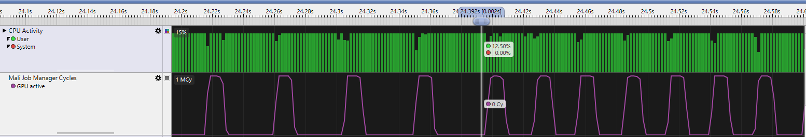
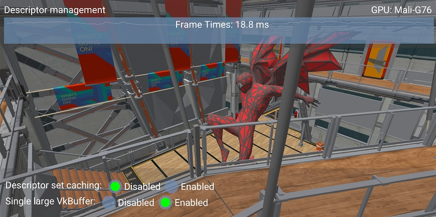

<!--
- Copyright (c) 2019-2021, Arm Limited and Contributors
-
- SPDX-License-Identifier: Apache-2.0
-
- Licensed under the Apache License, Version 2.0 the "License";
- you may not use this file except in compliance with the License.
- You may obtain a copy of the License at
-
-     http://www.apache.org/licenses/LICENSE-2.0
-
- Unless required by applicable law or agreed to in writing, software
- distributed under the License is distributed on an "AS IS" BASIS,
- WITHOUT WARRANTIES OR CONDITIONS OF ANY KIND, either express or implied.
- See the License for the specific language governing permissions and
- limitations under the License.
-
-->

# Descriptor and buffer management

## Overview

An application using Vulkan will have to implement a system to manage descriptor pools and sets.
The most straightforward and flexible approach is to re-create them for each frame, but doing so might be very inefficient, especially on mobile platforms.

The problem of descriptor management is intertwined with that of buffer management, that is choosing how to pack data in `VkBuffer` objects. This tutorial will explore a few options to improve both descriptor and buffer management.

## The problem

When rendering dynamic objects the application will need to push some amount of per-object data to the GPU, such as the MVP matrix.
This data may not fit into the push constant limit for the device, so it becomes necessary to send it to the GPU by putting it into a `VkBuffer` and binding a descriptor set that points to it.

Materials also need their own descriptor sets, which point to the textures they use. We can either bind per-material and per-object descriptor sets separately or collate them into a single set.
Either way, complex applications will have a large amount of descriptor sets that may need to change on the fly, for example due to textures being streamed in or out.

The simplest approach to circumvent the issue is to have one or more `VkDescriptorPool`s per frame, reset them at the beginning of the frame and allocate the required descriptor sets from it.
This approach will consist of a [vkResetDescriptorPool()](https://www.khronos.org/registry/vulkan/specs/1.1-extensions/man/html/vkResetDescriptorPool.html) call at the beginning, followed by a series of [vkAllocateDescriptorSets()](https://www.khronos.org/registry/vulkan/specs/1.1-extensions/man/html/vkAllocateDescriptorSets.html) and [vkUpdateDescriptorSets()](https://www.khronos.org/registry/vulkan/specs/1.1-extensions/man/html/vkUpdateDescriptorSets.html) to fill them with data.

The issue is that these calls can add a significant overhead to the CPU frame time, especially on mobile. In the worst cases, for example calling [vkUpdateDescriptorSets()](https://www.khronos.org/registry/vulkan/specs/1.1-extensions/man/html/vkUpdateDescriptorSets.html) for each draw call, the time it takes to update descriptors can be longer than the time of the draws themselves.

The sample highlights the issue with a draw-call intensive scene. Frame time is around 44 ms (on a 2019 high-end mobile phone), corresponding to 23 FPS, with the simplest descriptor management scheme.

If you want to test the sample, make sure to set it in release mode and without validation layers.
Both these factors can significantly affect the results.

## Caching descriptor sets

A major way to reduce descriptor set updates is to re-use them as much as possible. Instead of calling [vkResetDescriptorPool()](https://www.khronos.org/registry/vulkan/specs/1.1-extensions/man/html/vkResetDescriptorPool.html) every frame, the app will keep the `VkDescriptorSet` handles stored with some caching mechanism to access them.

The cache could be a hashmap with the contents of the descriptor set (images, buffers) as key. This approach is used in our framework by default.
It is possible to remove another level of indirection by storing descriptor sets handles directly in the materials and/or meshes.

Caching descriptor sets has a dramatic effect on frame time for our CPU-heavy scene:

The frame time is now around 27 ms, corresponding to 37 FPS. This is a 38% decrease in frame time.

We can confirm this behavior using [Streamline Performance Analyzer](https://developer.arm.com/tools-and-software/graphics-and-gaming/arm-mobile-studio/components/streamline-performance-analyzer).

The first part of the trace until the marker is without descriptor set caching. We can see that the app is CPU bound, since the GPU is idling between frames while the CPU is fully utilized.

After the marker we enable descriptor set caching and we can see that frames are processed faster. GPU frame time does not change much and the app is still CPU bound, so the speedup is related to CPU-side improvements.

This system is reasonably easy to implement for a static scene, but it becomes harder when you need to delete descriptor sets. Complex engines may implement techniques to figure out which descriptor sets have not been accessed for a certain number of frames, so they can be removed from the map.

This may correspond to calling [vkFreeDescriptorSets()](https://www.khronos.org/registry/vulkan/specs/1.1-extensions/man/html/vkFreeDescriptorSets.html), but this solution poses another issue: in order to free individual descriptor sets the pool has to be created with the `VK_DESCRIPTOR_POOL_CREATE_FREE_DESCRIPTOR_SET_BIT` flag.
Mobile implementations may use a simpler allocator if that flag is not set, relying on the fact that pool memory will only be recycled in block.

It is possible to avoid using that flag by updating descriptor sets instead of deleting them. The application can keep track of recycled descriptor sets and re-use one of them when a new one is requested. The [subpasses sample](../subpasses/subpasses_tutorial.md) uses this approach when it re-creates the G-buffer images.

## Buffer management

Going back to the initial case, we will now explore an alternative approach, that is complementary to descriptor caching in some way. Especially for applications in which descriptor caching is not quite feasible, buffer management is another lever for optimizing performance.

As discussed at the beginning, each rendered object will typically need some uniform data along with it, that needs to be pushed to the GPU somehow.
A straightforward approach is to store a `VkBuffer` per object and update that data for each frame.

This already poses an interesting question: is one buffer enough? The problem is that this data will change dynamically and will be in use by the GPU while the frame is in flight.

Since we do not want to flush the GPU pipeline between each frame, we will need to keep several copies of each buffer, one for each frame in flight. Another similar option is to use just one buffer per object, but with a size equal to `num_frames * buffer_size`, then offset it dynamically based on the frame index.

A similar approach is used in the default configuration of the sample. For each frame, one buffer per object is created and filled with data. This means that we will have many descriptor sets to create, since every object will need one that points to its `VkBuffer`.
Furthermore, we will have to update many buffers separately, meaning we cannot control their memory layout and we might lose some optimization opportunities with caching.

We can address both problems by reverting the approach: instead of having a `VkBuffer` per object containing per-frame data, we will have a `VkBuffer` per frame containing per-object data.
The buffer will be cleared at the beginning of the frame, then each object will record its data and will receive a dynamic offset to be used at [vkCmdBindDescriptorSets()](https://www.khronos.org/registry/vulkan/specs/1.1-extensions/man/html/vkCmdBindDescriptorSets.html) time.

With this approach we will need less descriptor sets, as more objects can share the same one: they will all reference the same `VkBuffer`, but at different dynamic offsets.
Furthermore, we can control the memory layout within the buffer.

Using a single large `VkBuffer` in this case shows a performance improvement similar to descriptor set caching.

For this relatively simple scene stacking the two approaches does not provide a further performance boost, but for a more complex case they do stack nicely:

* Descriptor caching is necessary when the number of descriptors sets is not just due to `VkBuffer`s with uniform data, for example if the scene uses a large amount of materials/textures.
* Buffer management will help reduce the overall number of descriptor sets, thus cache pressure will be reduced and the cache itself will be smaller.

## Further resources

* The "DescriptorSet cache" section from [Bringing Fortnite to Mobile with Vulkan and OpenGL ES - GDC 2019](https://youtu.be/XCUfk5vRblo?t=2057)
* "Writing an efficient Vulkan renderer" by Arseny Kapoulkine (from "GPU Zen 2: Advanced Rendering Techniques")

## Best practice summary

**Do**

* Update already allocated but no longer referenced descriptor sets, instead of resetting descriptor pools and reallocating new descriptor sets.
* Prefer reusing already allocated descriptor sets, and not updating them with same information every time.
* Consider caching your descriptor sets when feasible.
* Consider using a single (or few) `VkBuffer` per frame with dynamic offsets.

**Don't**

* Allocate descriptor sets from descriptor pools on performance critical code paths.
* Allocate, free or update descriptor sets every frame, unless it is necessary.
* Set `VK_DESCRIPTOR_POOL_CREATE_FREE_DESCRIPTOR_SET_BIT` if you do not need to free individual descriptor sets.

**Impact**

* Increased CPU load for draw calls.
* Setting `VK_DESCRIPTOR_POOL_CREATE_FREE_DESCRIPTOR_SET_BIT` may prevent the implementation from using a simpler (and faster) allocator.

**Debugging**

* The time spent in [vkUpdateDescriptorSets()](https://www.khronos.org/registry/vulkan/specs/1.1-extensions/man/html/vkUpdateDescriptorSets.html) can be checked with a CPU profiler. In the worst cases it may be comparable or higher than the time spent performing the actual draw calls.
* Monitor if there is contention on [vkAllocateDescriptorSets()](https://www.khronos.org/registry/vulkan/specs/1.1-extensions/man/html/vkAllocateDescriptorSets.html), which will probably be a performance problem if it occurs.
