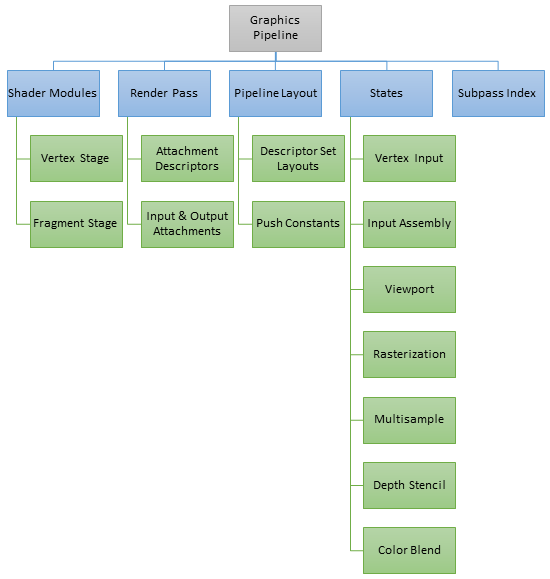
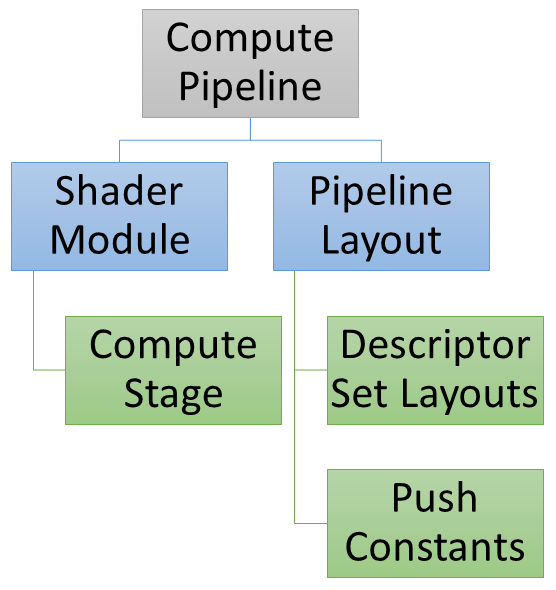
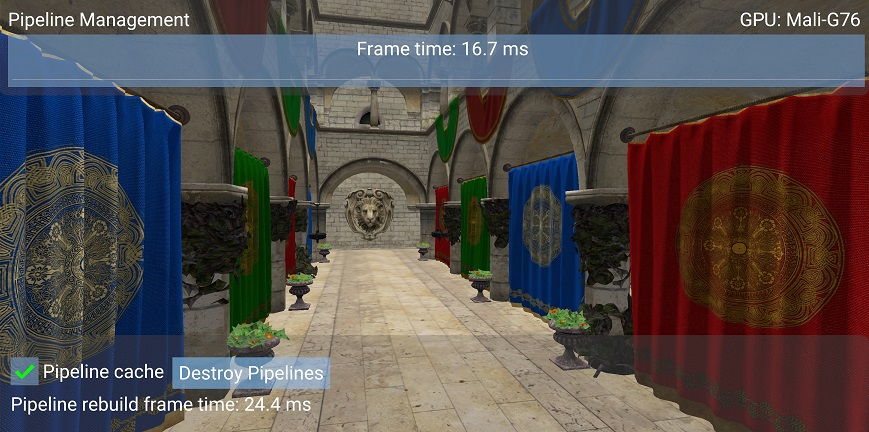

////
- Copyright (c) 2022, The Khronos Group
-
- SPDX-License-Identifier: Apache-2.0
-
- Licensed under the Apache License, Version 2.0 the "License";
- you may not use this file except in compliance with the License.
- You may obtain a copy of the License at
-
-     http://www.apache.org/licenses/LICENSE-2.0
-
- Unless required by applicable law or agreed to in writing, software
- distributed under the License is distributed on an "AS IS" BASIS,
- WITHOUT WARRANTIES OR CONDITIONS OF ANY KIND, either express or implied.
- See the License for the specific language governing permissions and
- limitations under the License.
-
////
= HPP Pipeline Management
:pp: {plus}{plus}

A transcoded version of the performance sample https://github.com/KhronosGroup/Vulkan-Samples/tree/master/samples/performance/pipeline_cache[Pipeline Cache] that illustrates the usage of the C{pp} bindings of vulkan provided by vulkan.hpp.

== Overview

Vulkan gives applications the ability to save internal representation of a pipeline (graphics or compute) to enable recreating the same pipeline later.
This sample will look in detail at the implementation and performance implications of the pipeline creation, caching and management.

== Vulkan Pipeline

To create a graphics pipeline in Vulkan, using Vulkan-Hpp, the following objects are required:

* vk::ShaderModule (Vertex and Fragment stages)
* vk::RenderPass
* Subpass Index
* vk::PipelineLayout
 ** Push Constants
 ** Descriptor Set Layouts
* Pipeline States
 ** Vertex Input
 ** Input Assembly
 ** Rasterizer
 ** Depth Stencil
 ** Color Blend

Alternatively for a compute pipeline in Vulkan, using Vulkan-Hpp, you need:

* vk::ShaderModule (Compute stage)
* vk::PipelineLayout
 ** Push Constants
 ** Descriptor Set Layouts

== Vulkan Pipeline Cache

Creating a Vulkan pipeline requires compiling `vk::ShaderModule` internally.
This will have a significant increase in frame time if performed at runtime.
To reduce this time, you can provide a previously initialised `vk::PipelineCache` object when calling the `vk::Device::createGraphicsPipeline[s]` or `vk::Device::createComputePipeline[s]` functions.
This object behaves like a cache container which stores the pipeline internal representation for reuse.
In order to benefit from using a `vk::PipelineCache` object, the data recorded during pipeline creation needs to be saved to disk and reused between application runs.

Vulkan allows an application to obtain the binary data of a `vk::PipelineCache` object and save it to a file on disk before terminating the application.
This operation can be achieved using two calls to the `vk::Device::getPipelineCacheData` function to obtain the size and `vk::PipelineCache` object's binary data.
In the next application run, the `vk::PipelineCache` can be initialised with the previous run's data.
This will allow the `vkDevice::createGraphicsPipeline[s]` or `vkDevice::createComputePipeline[s]` functions to reuse the baked state and avoid repeating costly operations such as shader compilation.

== Resource Cache Warmup

A graphics pipeline needs information from the render pass, render state, mesh data and shaders.
This makes it harder for a game engine to prepare the Vulkan pipeline upfront because rendering is controlled by game logic.
Vulkan tutorials typically show pipelines being built upfront because their state is known.
This can also be achieved in a game engine by recording the pipelines created during a game run and then using the information to warmup the internal resource cache in subsequent runs of the game.

In order for this system to work, resource management must be done to track the state of all the Vulkan objects required for pipeline creation and cache them for later reuse.
This process is usually done by hashing the input data (`CreateInfo` structure members) used to create the Vulkan objects.
This enables a future similar request to return immediately with the cached object.
The mapping between input data and the Vulkan object can also alternatively be done by creating the hash using the bitfield hash of the structure members.

While the application is loading, the Vulkan resources can be prepared so that the rendering for the first frames will have minimal CPU impact as all the data necessary has been pre-computed.
For example, when the level changes or the game exits, the recorded Vulkan objects can be serialised and written to a file on disk.
In the next run the file can be read and deserialised to warmup the internal resource cache.

== The sample

The `hpp_pipeline_cache` sample demonstrates this behaviour, by allowing you to enable or disable the use of pipeline cache objects.
Destroying the existing pipelines will trigger re-caching, which is a process that will slow down the application.
In this case there are only 2 pipelines, and the effect is noticeable, therefore we can expect it to have a much greater impact in a real game.

____
On the first run of the sample on a device, the first frames will have a slightly bigger execution time because the pipelines are created for the first time - this is expected behaviour.
In the next runs of the sample, the `vk::PipelineCache` is created with the data saved from the previous run and the internal resource cache.
____

Below is a screenshot of the sample on a phone with Mali G76 GPU:

Pipeline cache is enabled and Sponza is rendered at 60 FPS when the existing pipelines are destroyed.
Pipeline re-creation takes 24.4 ms thanks to the pipeline cache.

If we disable the pipeline cache, re-creating the pipelines takes 50.4 ms, more than double the previous time.
Building pipelines dynamically without a pipeline cache can result in a sudden framerate drop.

== Best practices summary

*Do*

* Create known pipelines early in the application execution (use data between application runs).
* Use pipeline cache to reduce pipeline creation cost.

*Don't*

* Create pipelines at draw time without a pipeline cache (introduces performance stutters).

*Impact*

* Increased frame time execution if a pipeline baked state is not reused.
The driver then needs to rebuild the pipeline which includes shader compilation, an expensive operation.

*Debugging*

* A frame capture would show if there are any calls to `vk::Device::createGraphicsPipeline[s]` or `vk::Device::createComputePipeline[s]` with an empty `vk::PipelineCache` object.

____
Due to how `RenderDoc` captures and replays a frame, the field for `vk::PipelineCache` is always empty in the report for the 'create pipeline' functions.
____
