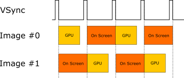
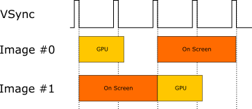
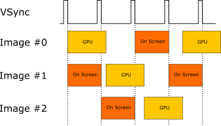
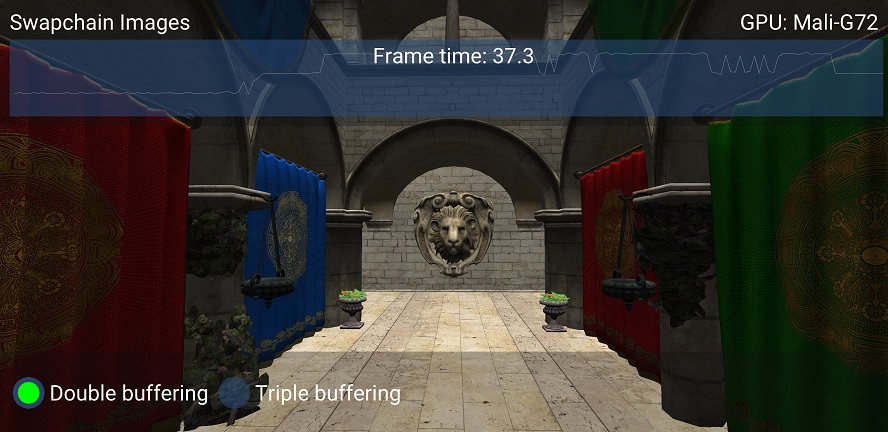
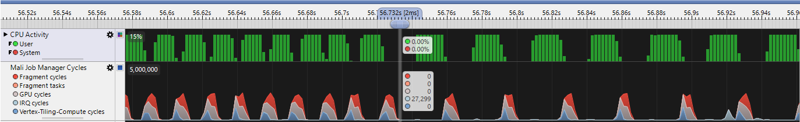

////
- Copyright (c) 2022-2023, The Khronos Group
-
- SPDX-License-Identifier: Apache-2.0
-
- Licensed under the Apache License, Version 2.0 the "License";
- you may not use this file except in compliance with the License.
- You may obtain a copy of the License at
-
-     http://www.apache.org/licenses/LICENSE-2.0
-
- Unless required by applicable law or agreed to in writing, software
- distributed under the License is distributed on an "AS IS" BASIS,
- WITHOUT WARRANTIES OR CONDITIONS OF ANY KIND, either express or implied.
- See the License for the specific language governing permissions and
- limitations under the License.
-
////
:doctype: book
:pp: {plus}{plus}

= Choosing the right number of swapchain images Vulkan-Hpp

ifdef::site-gen-antora[]
TIP: The source for this sample can be found in the https://github.com/KhronosGroup/Vulkan-Samples/tree/main/samples/performance/hpp_swapchain_images[Khronos Vulkan samples github repository].
endif::[]

NOTE: A transcoded version of the performance sample https://github.com/KhronosGroup/Vulkan-Samples/tree/master/samples/performance/swapchain_images[Swapchain Images] that illustrates the usage of the C{pp} bindings of vulkan provided by vulkan.hpp.

== Overview

This is the readme as written in https://github.com/KhronosGroup/Vulkan-Samples/tree/master/samples/performance/swapchain_images[Swapchain Images], with code transcoded to functions and classes from vulkan.hpp.

Vulkan gives the application some significant control over the number of swapchain images to be created.
This sample analyzes the available options and their performance implications.

== Choosing a number of images

The control over the number of swapchain images is shared between the application and the platform.
The application can ask for a minimum number of images by setting the `minImageCount` parameter in https://www.khronos.org/registry/vulkan/specs/1.1-extensions/man/html/vkCreateSwapchainKHR.html[vk::Device::createSwapchainKHR].
The exact number of images created can then be polled via https://www.khronos.org/registry/vulkan/specs/1.1-extensions/man/html/vkGetSwapchainImagesKHR.html[vk::Device::getSwapchainImagesKHR].

In order to properly set the `minImageCount` parameter, the application should get the surface capabilities of the physical device via https://www.khronos.org/registry/vulkan/specs/1.1-extensions/man/html/vkGetPhysicalDeviceSurfaceCapabilitiesKHR.html[vk::PhysicalDevice::getSurfaceCapabilitiesKHR].
The https://www.khronos.org/registry/vulkan/specs/1.1-extensions/man/html/VkSurfaceCapabilitiesKHR.html[vk::SurfaceCapabilitiesKHR] structure has the `minImageCount` and `maxImageCount` parameters, which set the boundaries for the image count that can be safely requested.

As a rule of thumb on mobile, `+pSurfaceCapabilities->minImageCount+` is usually 2, while `+pSurfaceCapabilities->maxImageCount+` is large enough to not pose any problem with common applications (though it is still good practice to check its value).

The most common values that an application may ask for are:

* `2` for double buffering
* `3` for triple buffering

The swapchain will then create a number of images based on both `minImageCount` and the requested present mode.
We will discuss present modes in the next section.

== Choosing a present mode

The available present modes can be queried via https://www.khronos.org/registry/vulkan/specs/1.1-extensions/man/html/vkGetPhysicalDeviceSurfacePresentModesKHR.html[vk::PhysicalDevice::getSurfacePresentModesKHR].

There are several presentation modes in Vulkan, but mobile GPUs do not support the ones in which the image is directly presented to the screen (immediate mode).
The only ones which satisfy Android's VSync requirement are `vk::PresentModeKHR::eFifo` and  `vk::PresentModeKHR::eMailbox`.

In `vk::PresentModeKHR::eFifo` mode the presentation requests are stored in a queue.
If the queue is full the application will have to wait until an image is ready to be acquired again.
This is a normal operating mode for mobile, which automatically locks the framerate to 60 FPS.

In `vk::PresentModeKHR::eMailbox` mode a single presentation request is stored by the presentation engine.
In case of a new request the previous image will be replaced and will be available for acquisition once again.

As a rule of thumb, if we ask for `vk::PresentModeKHR::eMailbox` we may get more images than `minImageCount`, typically 4.
The application can keep submitting new frames for presentation, without stalling.
This is useful in some cases, e.g.
for reducing input latency, but it is not optimal for mobile because it keeps the CPU and GPU active while not strictly necessary.

Unless the application really needs `vk::PresentModeKHR::eMailbox`, it is better to go for `vk::PresentModeKHR::eFifo` to reduce CPU and GPU load.
In `vk::PresentModeKHR::eFifo` mode the number of swapchain images created typically corresponds to `minImageCount`.
We will now discuss how many images the application should ask for, which is a critical point performance-wise.

== Double buffering or triple buffering?

Android has a VSync signal running at 60 FPS (i.e.
every 16 ms), which is the only chance for an image to be presented.

Double buffering works well if frames can be processed within 16 ms, so at each VSync signal the processed image is presented on screen and the previously presented one becomes available to the application again.
This behavior is demonstrated in the figure below:

This behavior breaks when frames take more than 16 ms to be processed.
Let us suppose that a frame is ready after 20 ms.
The following figure illustrates what happens in this case:

The orange dashed line highlights a point in which the whole system is idle.
FB1 was not yet ready for presentation for the previous VSync signal, so the presentation engine keeps presenting FB0, which in turn cannot be used to start processing the next frame.

This idling behavior caps framerate at 30 fps, while the application could achieve ~50 fps.
With triple buffering there will always be an image already processed and ready for presentation, so the GPU can start processing a new image without stalling.

== The sample

The `hpp_swapchain_images` Vulkan sample highlights this behavior, by allowing to switch between double buffering and triple buffering.

This is a screenshot of the sample on a phone with a Mali G72 GPU:

image::../swapchain_images/images/sponza_triple_buffering.jpg[Sponza with triple buffering]

Triple buffering is enabled and Sponza is comfortably rendered at 60 FPS.
When we switch to double buffering the framerate drops to 30 FPS:

In this case the actual CPU and GPU frame time is close to 16 ms, so it is possible that the framerate remains at 60 FPS for a few seconds even after switching to double buffering.
Thermal effects or other running processes may cause a small increase in frame time, resulting in the app missing VSync.

As previously discussed, with double buffering a missed VSync causes a sudden drop in framerate.
In order for an application to achieve its potential framerate without being VSync-bound, triple buffering is the preferred option.

We can confirm this behavior using https://developer.arm.com/products/software-development-tools/arm-development-studio/components/streamline-performance-analyzer[Streamline Performance Analyzer].

The first part of the trace until the marker is with triple buffering.
As we can see the CPU and GPU show a good utilization, with not much idling between frames.
After the marker we switch to double buffering and we confirm what we predicted earlier: there are longer periods of time in which both the CPU and GPU are idle because the presentation system needs to wait for VSync before providing a new image.

== Best practice summary

*Do*

* Ensure that the value of `minImageCount` is within the valid range from https://www.khronos.org/registry/vulkan/specs/1.1-extensions/man/html/vkGetPhysicalDeviceSurfaceCapabilitiesKHR.html[vk::PhysicalDevice::getSurfaceCapabilitiesKHR] (between `minImageCount` and `maxImageCount`).
* Use `vk::PresentModeKHR::eFifo` to avoid unnecessary CPU and GPU load.
* Use triple buffering to maximize performance.

*Don't*

* Use `vk::PresentModeKHR::eMailbox` unless you specifically need that behavior, e.g.
for lower input latency.
* Use double buffering, unless you are happy with the drop in framerate.
If you want to cap framerate to 30 FPS to save power, this can be achieved on the CPU side while still using triple buffering.

*Impact*

* Double buffering will limit framerate if VSync is missed, as the system will need to stall until the next VSync signal.

*Debugging*

* It is possible to check how many images are created via https://www.khronos.org/registry/vulkan/specs/1.1-extensions/man/html/vkGetSwapchainImagesKHR.html[vk::Device::getSwapchainImagesKHR].
If only 2 images are being created, `minImageCount` should be increased to 3, if the physical device allows for it (it normally does).
