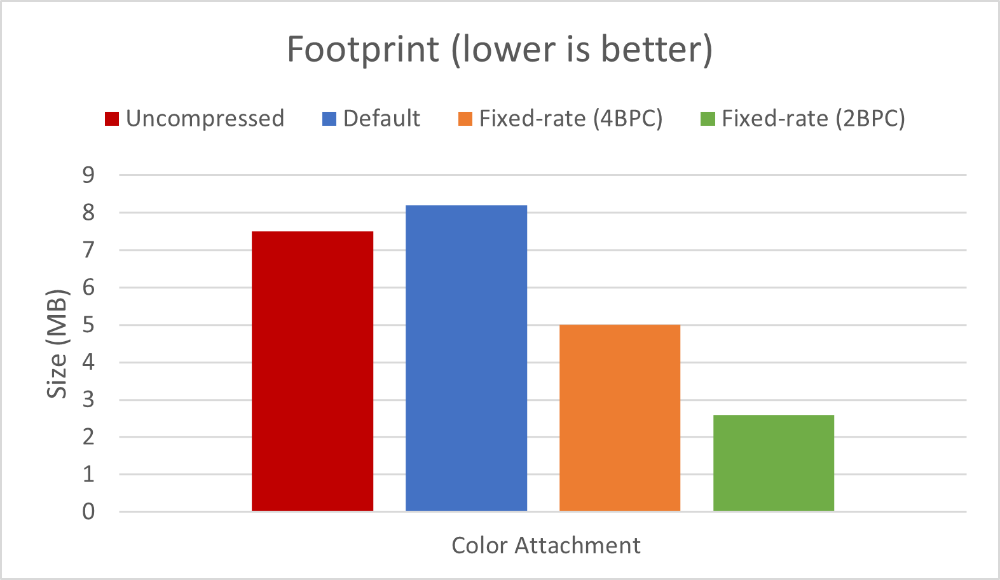
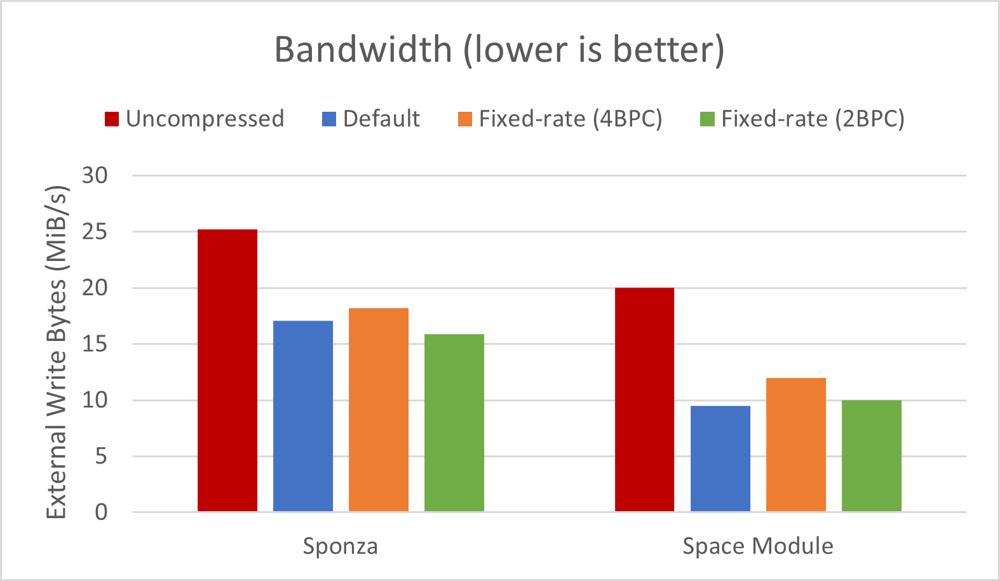
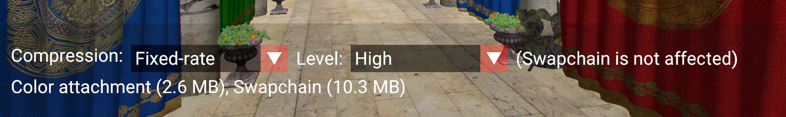

////
- Copyright (c) 2024, The Khronos Group
- Copyright (c) 2024, Arm Limited and Contributors
-
- SPDX-License-Identifier: Apache-2.0
-
- Licensed under the Apache License, Version 2.0 the "License";
- you may not use this file except in compliance with the License.
- You may obtain a copy of the License at
-
-     http://www.apache.org/licenses/LICENSE-2.0
-
- Unless required by applicable law or agreed to in writing, software
- distributed under the License is distributed on an "AS IS" BASIS,
- WITHOUT WARRANTIES OR CONDITIONS OF ANY KIND, either express or implied.
- See the License for the specific language governing permissions and
- limitations under the License.
-
////

= Image Compression Control

////
The following block adds linkage to this repo in the Vulkan docs site project. It's only visible if the file is viewed via the Antora framework.
////

ifdef::site-gen-antora[]
TIP: The source for this sample can be found in the https://github.com/KhronosGroup/Vulkan-Samples/tree/main/samples/performance/image_compression_control[Khronos Vulkan samples github repository].
endif::[]

== Overview

This sample shows how to allow a Vulkan application to control the compression of https://registry.khronos.org/vulkan/specs/1.3-extensions/man/html/VkImage.html[`VkImage`] elements, in particular a framebuffer attachment and the swapchain.
This requires enabling and using the extensions https://docs.vulkan.org/spec/latest/appendices/extensions.html#VK_EXT_image_compression_control[`VK_EXT_image_compression_control`] and https://docs.vulkan.org/spec/latest/appendices/extensions.html#VK_EXT_image_compression_control_swapchain[`VK_EXT_image_compression_control_swapchain`] respectively.
Applications that use compression generally perform better thanks to the reduced memory footprint and bandwidth.

In this sample the use-case is a simple post-processing effect (https://en.wikipedia.org/wiki/Chromatic_aberration[chromatic aberration]) applied to the output color of the forward-rendering pass.
Since the color output needs to be saved to main memory and read again by the post-processing pass, this an opportunity to improve performance by using image compression.

The sample allows toggling between:

* "Default": lossless compression (e.g. xref:/samples/performance/afbc/README.adoc[AFBC]). 

* "Fixed-rate": visually lossless compression (e.g. https://learn.arm.com/learning-paths/smartphones-and-mobile/afrc/[AFRC]).
A low/high level of compression can be specified in this case.

* "None": disable all compression, which is usually not recommended except for debugging purposes.

The compression settings will be applied to both the color attachment and the swapchain, if the extensions are supported.
The on-screen hardware counters show the impact each option has on bandwidth and on the memory footprint.

image::./images/image_compression_control.png[Image Compression Control sample, 900, align="center"]

[.text-center]
__Sponza scene with default (lossless) compression__

=== Default compression [[default_compression]]

This is lossless compression that devices can enable transparently to save performance where possible.
Vulkan applications do not need to explicitly enable this sort of compression.

Devices with Arm GPUs implement Arm Frame Buffer Compression (AFBC), which uses variable bitrate encoding: the image is compressed in blocks (e.g. 4x4 pixels) and, depending on their composition, a different bitrate will be used.
This means that the bandwidth savings depend on the image being compressed, and the compression ratio applied to each block.
On average, high compression ratios are often obtained, as shown in the xref:/samples/performance/afbc/README.adoc[AFBC sample].

=== Fixed-rate compression [[fixed_rate_compression]]

On the other hand, a compression scheme may use a constant bitrate for all blocks, and in this case the compression is defined as fixed-rate.
This means that in some cases a block will lose some information, and thus the compression is lossy.
Therefore the device may not enable it automatically, and the developer must opt-in using the Vulkan image compression control extensions.

Recent devices with Arm GPUs support Arm Fixed Rate Compression (AFRC), which achieve high quality results even with the highest compression ratios.
For instance, see below for images saved from a Pixel 8 device:

[.center, cols="a,a,a"]
|===
| Default compression
| 2BPC Fixed-rate compression
| Pixel difference
| image::./images/default.png[Default compression, 400]
| image::./images/fixed_rate_2BPC.png[Fixed-rate compression, 400]
| image::./images/compare.png[Pixel difference, 400]
|===
[.text-center]
__Space Module scene compression comparison__

Since the difference is not noticeable with the naked eye, this is sometimes referred to as "visually lossless" compression.
Software like https://imagemagick.org/script/compare.php[imagemagick allows to compare] the images and obtain a https://en.wikipedia.org/wiki/Peak_signal-to-noise_ratio[PSNR] quality estimation, in this case with the high value of 49.8dB:

[,shell]
----
$ magick compare -metric PSNR default.png fixed_rate_2BPC.png compare.png
49.8487 (0.498487)
----

There are some performance benefits associated with fixed-rate compression, as described below.

=== Memory footprint savings

Images compressed with a fixed-rate will always consume less memory.
In this case, an image compressed with a 2BPC bitrate results in a 65% reduction compared to uncompressed. 

In this case, the slightly larger size of images compressed with AFBC is expected, as variable bitrates require enough space for the worse case (uncompressed) as well as some extra storage for compression-related metadata.

=== Bandwidth savings

The sample allows to observe an estimate of bytes being written out to main memory.
On this device the write bandwidth difference between uncompressed and fixed-rate compression is approximately 38%: 

Bandwidth savings coming from image compression depend on the pixels being compressed.
Moving the camera and showing different distribution of colors in the frame changes the results.
Be sure to profile your application and verify which compression scheme is optimal in each case.
For instance, images with a high proportion of solid color (e.g. normals or material properties) may be more optimally compressed with variable bitrates than with fixed-rate.
This is the case for the Space Module scene shown above.

== VK_EXT_image_compression_control

This sample enables the https://registry.khronos.org/vulkan/specs/1.3-extensions/man/html/VK_EXT_image_compression_control.html[`VK_EXT_image_compression_control`] extension and requests the relevant device feature, https://registry.khronos.org/vulkan/specs/1.3-extensions/man/html/VkPhysicalDeviceImageCompressionControlFeaturesEXT.html[`imageCompressionControl`]
This extension abstracts how applications choose a fixed compression rate, in terms of "minimum number of bits per component (BPC)".

=== Query for image compression support

To query if a particular image supports fixed-rate compression, add a https://registry.khronos.org/vulkan/specs/1.3-extensions/man/html/VkImageCompressionPropertiesEXT.html[`VkImageCompressionPropertiesEXT`] to the `pNext` chain of https://registry.khronos.org/vulkan/specs/1.3-extensions/man/html/VkImageFormatProperties2KHR.html[`VkImageFormatProperties2`], and call https://registry.khronos.org/vulkan/specs/1.3-extensions/man/html/vkGetPhysicalDeviceImageFormatProperties2KHR.html[`vkGetPhysicalDeviceImageFormatProperties2KHR`]:

[,cpp]
----
VkImageCompressionPropertiesEXT supported_compression_properties{VK_STRUCTURE_TYPE_IMAGE_COMPRESSION_PROPERTIES_EXT};

VkImageCompressionControlEXT compression_control{VK_STRUCTURE_TYPE_IMAGE_COMPRESSION_CONTROL_EXT};
compression_control.flags = VK_IMAGE_COMPRESSION_FIXED_RATE_EXPLICIT_EXT;

VkPhysicalDeviceImageFormatInfo2 image_format_info{VK_STRUCTURE_TYPE_PHYSICAL_DEVICE_IMAGE_FORMAT_INFO_2};
image_format_info.format = VK_FORMAT_R8G8B8_UNORM;
image_format_info.type   = VK_IMAGE_TYPE_2D;
image_format_info.tiling = VK_IMAGE_TILING_OPTIMAL;
image_format_info.usage  = VK_IMAGE_USAGE_COLOR_ATTACHMENT_BIT | VK_IMAGE_USAGE_SAMPLED_BIT;
image_format_info.pNext  = &compression_control;

VkImageFormatProperties2 image_format_properties{VK_STRUCTURE_TYPE_IMAGE_FORMAT_PROPERTIES_2};
image_format_properties.pNext = &supported_compression_properties;

vkGetPhysicalDeviceImageFormatProperties2KHR(device.get_gpu().get_handle(), &image_format_info, &image_format_properties);
----

In the Vulkan Samples framework, this happens in the https://github.com/KhronosGroup/Vulkan-Samples/blob/main/framework/common/vk_common.cpp[`vkb::query_supported_fixed_rate_compression`] function.

Then inspect the values written to the `imageCompressionFixedRateFlags` component of https://registry.khronos.org/vulkan/specs/1.3-extensions/man/html/VkImageCompressionPropertiesEXT.html[`VkImageCompressionPropertiesEXT`].
If fixed-rate compression is supported, the flags will indicate which levels may be selected for this image, for instance https://registry.khronos.org/vulkan/specs/1.3-extensions/man/html/VkImageCompressionFixedRateFlagBitsEXT.html[`VK_IMAGE_COMPRESSION_FIXED_RATE_2BPC_BIT_EXT`] or https://registry.khronos.org/vulkan/specs/1.3-extensions/man/html/VkImageCompressionFixedRateFlagBitsEXT.html[`VK_IMAGE_COMPRESSION_FIXED_RATE_5BPC_BIT_EXT`].
The sample will use the minimum BPC available for its high compression setting, and the maximum BPC available for its low compression setting.

[.text-center]
__Fixed-rate options__

=== Request image compression

To request fixed-rate compression, provide a https://registry.khronos.org/vulkan/specs/1.3-extensions/man/html/VkImageCompressionControlEXT.html[`VkImageCompressionControlEXT`] to the `pNext` chain of https://registry.khronos.org/vulkan/specs/1.3-extensions/man/html/VkImageCreateInfo.html[`VkImageCreateInfo`]:  

[,cpp]
----
VkImageCompressionFixedRateFlagsEXT fixed_rate_flags_array[1] = {VK_IMAGE_COMPRESSION_FIXED_RATE_2BPC_BIT_EXT};

VkImageCompressionControlEXT compression_control{VK_STRUCTURE_TYPE_IMAGE_COMPRESSION_CONTROL_EXT};
compression_control.flags                        = VK_IMAGE_COMPRESSION_FIXED_RATE_EXPLICIT_EXT;
compression_control.compressionControlPlaneCount = 1;
compression_control.pFixedRateFlags              = &fixed_rate_flags_array[0];

VkImageCreateInfo image_info{VK_STRUCTURE_TYPE_IMAGE_CREATE_INFO};
image_info.format    = VK_FORMAT_R8G8B8_UNORM;
image_info.imageType = VK_IMAGE_TYPE_2D;
image_info.tiling    = VK_IMAGE_TILING_OPTIMAL;
image_info.usage     = VK_IMAGE_USAGE_COLOR_ATTACHMENT_BIT | VK_IMAGE_USAGE_SAMPLED_BIT;
image_info.pNext     = &compression_control;

vkCreateImage(device, &image_info, nullptr, &new_image);
----

Note that, instead of using https://registry.khronos.org/vulkan/specs/1.3-extensions/man/html/VkImageCompressionFlagBitsEXT.html[`VK_IMAGE_COMPRESSION_FIXED_RATE_EXPLICIT_EXT`], one may use https://registry.khronos.org/vulkan/specs/1.3-extensions/man/html/VkImageCompressionFlagBitsEXT.html[`VK_IMAGE_COMPRESSION_FIXED_RATE_DEFAULT_EXT`], and in that case it would not be necessary to provide a specific set of `pFixedRateFlags`.

In the Vulkan Samples framework, this happens in the https://github.com/KhronosGroup/Vulkan-Samples/blob/main/framework/core/image.cpp[`core::Image`] constructor.

=== Verify image compression [[verify_image_compression]]

To query which compression was applied, if any, once a https://registry.khronos.org/vulkan/specs/1.3-extensions/man/html/VkImage.html[`VkImage`] has been created, add a https://registry.khronos.org/vulkan/specs/1.3-extensions/man/html/VkImageCompressionPropertiesEXT.html[`VkImageCompressionPropertiesEXT`] to the `pNext` chain of https://registry.khronos.org/vulkan/specs/1.3-extensions/man/html/VkImageSubresource2EXT.html[`VkImageSubresource2EXT`], and call https://registry.khronos.org/vulkan/specs/1.3-extensions/man/html/vkGetImageSubresourceLayout2EXT.html[`vkGetImageSubresourceLayout2EXT`]:

[,cpp]
----
VkImageCompressionPropertiesEXT compression_properties{VK_STRUCTURE_TYPE_IMAGE_COMPRESSION_PROPERTIES_EXT};

VkSubresourceLayout2EXT subresource_layout{VK_STRUCTURE_TYPE_SUBRESOURCE_LAYOUT_2_KHR};
subresource_layout.pNext = &compression_properties;

VkImageSubresource2EXT image_subresource{VK_STRUCTURE_TYPE_IMAGE_SUBRESOURCE_2_KHR};
image_subresource.imageSubresource.aspectMask = VK_IMAGE_ASPECT_COLOR_BIT;
image_subresource.imageSubresource.mipLevel   = 0;
image_subresource.imageSubresource.arrayLayer = 0;

vkGetImageSubresourceLayout2EXT(device, image, &image_subresource, &subresource_layout);
----

Then inspect the values written to the `imageCompressionFlags` and  `imageCompressionFixedRateFlags` components of https://registry.khronos.org/vulkan/specs/1.3-extensions/man/html/VkImageCompressionPropertiesEXT.html[`VkImageCompressionPropertiesEXT`].
In the Vulkan Samples framework, this happens in the https://github.com/KhronosGroup/Vulkan-Samples/blob/main/framework/core/image.cpp[`core::Image::query_applied_compression`] function.

== VK_EXT_image_compression_control_swapchain

Compression control for swapchain images is similar, but it requires the https://registry.khronos.org/vulkan/specs/1.3-extensions/man/html/VK_EXT_image_compression_control_swapchain.html[`VK_EXT_image_compression_control_swapchain`] extension and the https://registry.khronos.org/vulkan/specs/1.3-extensions/man/html/VkPhysicalDeviceImageCompressionControlSwapchainFeaturesEXT.html[`imageCompressionControlSwapchain`] device feature to be enabled.
These depend on the https://registry.khronos.org/vulkan/specs/1.3-extensions/man/html/VK_EXT_image_compression_control.html[`VK_EXT_image_compression_control`] being available and enabled too.

=== Query for surface compression support

To query if the surface supports fixed-rate compression, add a https://registry.khronos.org/vulkan/specs/1.3-extensions/man/html/VkImageCompressionPropertiesEXT.html[`VkImageCompressionPropertiesEXT`] to the `pNext` chain of https://registry.khronos.org/vulkan/specs/1.3-extensions/man/html/VkImageFormatProperties2KHR.html[`VkImageFormatProperties2`], and call https://registry.khronos.org/vulkan/specs/1.3-extensions/man/html/vkGetPhysicalDeviceImageFormatProperties2KHR.html[`vkGetPhysicalDeviceImageFormatProperties2KHR`]:

[,cpp]
----
VkPhysicalDeviceSurfaceInfo2KHR surface_info{VK_STRUCTURE_TYPE_PHYSICAL_DEVICE_SURFACE_INFO_2_KHR};
surface_info.surface = surface;

uint32_t surface_format_count{0U};

vkGetPhysicalDeviceSurfaceFormats2KHR(device, &surface_info, &surface_format_count, nullptr);

std::vector<VkSurfaceFormat2KHR> surface_formats;
surface_formats.resize(surface_format_count, {VK_STRUCTURE_TYPE_SURFACE_FORMAT_2_KHR});

std::vector<VkImageCompressionPropertiesEXT> compression_properties;
compression_properties.resize(surface_format_count, {VK_STRUCTURE_TYPE_IMAGE_COMPRESSION_PROPERTIES_EXT});

for (uint32_t i = 0; i < surface_format_count; i++)
{
	surface_formats[i].pNext = &compression_properties[i];
}

vkGetPhysicalDeviceSurfaceFormats2KHR(device, &surface_info, &surface_format_count, surface_formats.data());
----

Then inspect the values written to the `imageCompressionFixedRateFlags` component of https://registry.khronos.org/vulkan/specs/1.3-extensions/man/html/VkImageCompressionPropertiesEXT.html[`VkImageCompressionPropertiesEXT`], associated to a particular https://registry.khronos.org/vulkan/specs/1.3-extensions/man/html/VkSurfaceFormat2KHR.html[`VkSurfaceFormat2KHR`].
In the Vulkan Samples framework, this happens in the https://github.com/KhronosGroup/Vulkan-Samples/blob/main/framework/core/swapchain.cpp[`Swapchain::query_supported_fixed_rate_compression`] function.

=== Request surface compression

To request fixed-rate compression, provide a https://registry.khronos.org/vulkan/specs/1.3-extensions/man/html/VkImageCompressionControlEXT.html[`VkImageCompressionControlEXT`] to the `pNext` chain of https://registry.khronos.org/vulkan/specs/1.3-extensions/man/html/VkSwapchainCreateInfoKHR.html[`VkSwapchainCreateInfoKHR`]:  

[,cpp]
----
VkImageCompressionFixedRateFlagsEXT fixed_rate_flags_array[1] = {VK_IMAGE_COMPRESSION_FIXED_RATE_2BPC_BIT_EXT};

VkImageCompressionControlEXT compression_control{VK_STRUCTURE_TYPE_IMAGE_COMPRESSION_CONTROL_EXT};
compression_control.flags                        = VK_IMAGE_COMPRESSION_FIXED_RATE_EXPLICIT_EXT;
compression_control.compressionControlPlaneCount = 1;
compression_control.pFixedRateFlags              = &fixed_rate_flags_array[0];

VkSwapchainCreateInfoKHR create_info{VK_STRUCTURE_TYPE_SWAPCHAIN_CREATE_INFO_KHR};
create_info.surface = surface;
create_info.pNext   = &compression_control;

vkCreateSwapchainKHR(device, &create_info, nullptr, &new_swapchain);
----

Similarly to regular images, https://registry.khronos.org/vulkan/specs/1.3-extensions/man/html/VkImageCompressionFlagBitsEXT.html[`VK_IMAGE_COMPRESSION_FIXED_RATE_DEFAULT_EXT`] may be used instead.

In the Vulkan Samples framework, this happens in the https://github.com/KhronosGroup/Vulkan-Samples/blob/main/framework/core/swapchain.cpp[`Swapchain`] constructor.

=== Verify surface compression

To verify that compression was applied to the swapchain images, use the same method as described for a regular https://registry.khronos.org/vulkan/specs/1.3-extensions/man/html/VkImage.html[`VkImage`] in <<verify_image_compression>>.
No need to enable https://docs.vulkan.org/spec/latest/appendices/extensions.html#VK_EXT_image_compression_control_swapchain[`VK_EXT_image_compression_control_swapchain`] for this.

In the Vulkan Samples framework, this happens in the https://github.com/KhronosGroup/Vulkan-Samples/blob/main/framework/core/swapchain.cpp[`Swapchain::get_applied_compression`] function.

Note that even if the surface supports fixed-rate compression and the extensions are enabled, the surface might not be compressed.
The most likely reason is that, even though the GPU supports it, other IP components in the system (e.g. the Display) do not support it, and therefore images are not compressed.

== Disabling fixed-rate compression

As explained above, the `flags` in https://registry.khronos.org/vulkan/specs/1.3-extensions/man/html/VkImageCompressionControlEXT.html[`VkImageCompressionControlEXT`] control the compression scheme selection for images.
Take care not to accidentally disable <<default_compression>> when disabling <<fixed_rate_compression>>.
That is, ensure that https://registry.khronos.org/vulkan/specs/1.3-extensions/man/html/VkImageCompressionFlagBitsEXT.html[`VK_IMAGE_COMPRESSION_DEFAULT_EXT`] is used by default, rather than https://registry.khronos.org/vulkan/specs/1.3-extensions/man/html/VkImageCompressionFlagBitsEXT.html[`VK_IMAGE_COMPRESSION_DISABLED_EXT`], which disables all compression, negatively impacting performance.

== Conclusion

https://docs.vulkan.org/spec/latest/appendices/extensions.html#VK_EXT_image_compression_control[`VK_EXT_image_compression_control`] allows applications to check if default compression is enabled.
It also provides the mechanism to request lossy (fixed-rate) compression where appropriate (https://docs.vulkan.org/spec/latest/appendices/extensions.html#VK_EXT_image_compression_control_swapchain[`VK_EXT_image_compression_control_swapchain`] is required for swapchain images).

Fixed-rate compression guarantees the most efficient memory footprint and can result in substantially reduced memory bandwidth, without sacrificing image quality.
Bandwidth reductions can in turn result in performance improvements and power savings.
